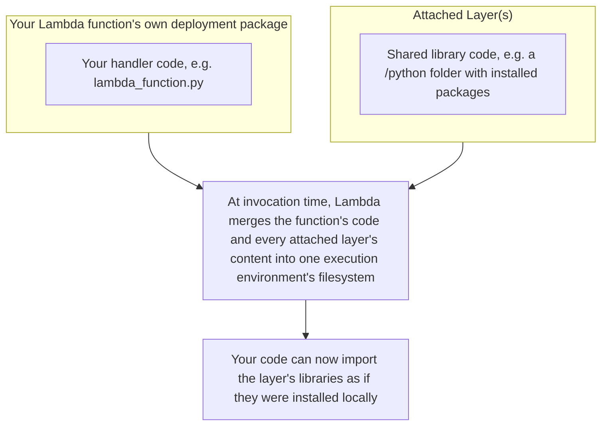
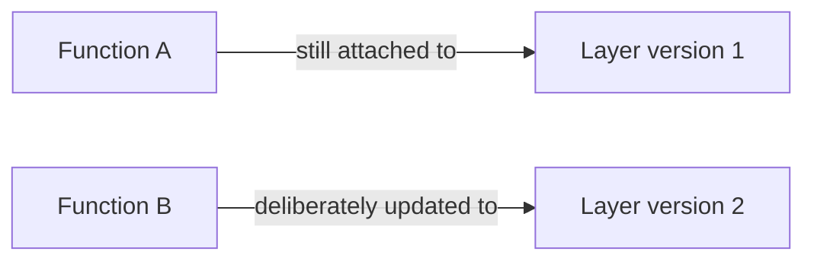

# 21 - Lambda Layers

> Goal: understand what a Lambda Layer is, why it exists, and its real limits — the concept note before the [Lambda Layers Lab](22-Lambda-Layers-Lab-HandsOn.md) note builds and attaches a real one.

---

## 1. The problem Layers solve

Imagine you have 10 different Lambda functions, and every single one of them needs the same third-party library (e.g. a specific JSON-parsing helper, or a shared set of internal utility functions your team wrote). Without Layers, you'd have to **copy that same code into all 10 functions' deployment packages** — meaning if you ever need to update that shared library, you have to go update and redeploy all 10 functions individually.

A **Layer** is a separate `.zip` package of code/libraries that can be **attached to multiple functions**, kept out of each function's own deployment package entirely. Update the layer once, and every function using it can pick up the change (by pointing at the new layer version — Section 4).

> 🧠 **Simple analogy**: think of your function's own code as **your personal notes**, and a Layer as a **shared textbook** several people reference. If the textbook publisher releases a corrected edition, everyone using it can switch to the new edition — nobody has to hand-copy the correction into their own personal notes.

---

## 2. Architecture & workflow — how a layer combines with a function at runtime

The important detail: this merge happens **at the filesystem level** inside the execution environment — from your code's point of view, the layer's library is just... there, importable, no different from something installed directly in your own package.

---

## 3. What typically goes in a Layer

- **Third-party library dependencies** — e.g. a Python package like `requests` or `pandas`, so your own function's code stays small and focused on actual logic.
- **A custom runtime** — a more advanced use case, adding support for a language Lambda doesn't natively support.
- **Shared internal utility code** — e.g. your organization's own common logging/formatting helpers, reused across many internal functions.

---

## 4. Real, hard limits worth memorizing

| Limit | Value |
|---|---|
| **Max layers per function** | **5** |
| **Combined size limit** | Your function's own code **+ all attached layers**, unzipped, must stay under **250 MB total** — layers don't get their own separate quota, they share the same 250MB ceiling as the function itself |
| **Layer versioning** | Every time you publish a new `.zip` for a layer, it gets a new, immutable **version number** — functions attach to a **specific layer version**, not a floating "latest" pointer |

That combined-250MB detail is the one most often missed: attaching a 200MB layer to a function whose own code is already 100MB will fail — layers **share** the same overall ceiling the [Lambda Container Images](07-Lambda-Container-Images.md) note's Section 1 introduced, they don't provide extra room beyond it.

---

## 5. Layer versioning — same immutability idea as function versions

This should feel familiar from the [Version Control In AWS Lambda](16-Lambda-Versions.md) note: just like a published function version is a frozen, numbered snapshot, **every layer version is permanently immutable** once published. Updating a layer's code means publishing a **new version number** (e.g. version 2) — the old version 1 still exists, unchanged, and any function still pointing at version 1 is completely unaffected until you deliberately update that function to point at version 2 instead.

---

## 6. Why not just use a container image instead?

Both Layers and container images (the [Lambda Container Images](07-Lambda-Container-Images.md) note) solve a similar-sounding problem — "my dependencies don't fit in a tiny zip" — but for genuinely different scales and workflows:

| | Layers | Container images |
|---|---|---|
| **Ceiling** | Shares the 250MB zip limit with the function | 10 GB |
| **Editing after creation** | Function's own code stays editable in the console; layer is separate | Nothing is console-editable — rebuild and push a new image |
| **Best for** | A moderate-sized shared library, reused across several functions | Very large dependencies (ML models, `ffmpeg`) or teams already using Docker |

> 🎯 **Exam tip:** "share common code/libraries across multiple Lambda functions without duplicating it in each deployment package" is the textbook **Layers** scenario. If the scenario instead emphasizes an extremely large dependency (multiple GB) or an existing Docker-based build pipeline, that's pointing toward **container images** instead.

---

## 7. Recap

- A **Layer** is a separate, reusable `.zip` package of code/libraries that can be attached to multiple functions, keeping shared code out of each function's own deployment package.
- A function can have up to **5 layers**, and function code + all layers combined must stay under **250MB unzipped** — layers don't add extra room beyond that ceiling.
- Every layer publish creates a new, **immutable version** — functions attach to a specific version, exactly like the version-freezing idea from the [Version Control In AWS Lambda](16-Lambda-Versions.md) note.
- Next: the [Lambda Layers Lab](22-Lambda-Layers-Lab-HandsOn.md) note — building and attaching a real one.

### Sources
- [Creating and sharing Lambda layers — AWS docs](https://docs.aws.amazon.com/lambda/latest/dg/creating-deleting-layers.html)
- [Adding layers to functions — AWS docs](https://docs.aws.amazon.com/lambda/latest/dg/adding-layers.html)
