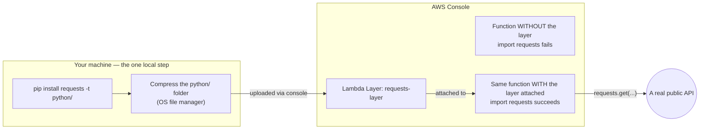

# 22 - Hands-On: Lambda Layers Lab

> Goal: build a Layer for the **actual, real-world reason Layers exist** — a genuine third-party Python package (`requests`) that **isn't part of the Lambda Python runtime**, not a small custom module you could just as easily have pasted directly into the function's own code. First prove the function genuinely can't `import requests` on its own, then fix that with a Layer, with no code change to the function itself. Every AWS-side action is via the **AWS Console**; the one unavoidable exception is running `pip install` locally to actually obtain the library's files — nothing in the AWS Console can do that for you — followed by zipping the result with your OS's native file-manager "Compress" feature (the same kind of minimal, clearly-flagged local step already used for the [Container Images hands-on demo](07.01-Container-Images_Demo.md)'s Docker build).

---

## 1. Why `requests`, not a custom module

The Lambda Python runtime ships with the Python standard library (`json`, `os`, `datetime`, etc.) and AWS's own `boto3`/`botocore` — but **nothing else**. `requests` — the single most common third-party HTTP library in the Python ecosystem — is a genuinely realistic example of exactly what a Layer is for: code your function needs that Lambda doesn't provide, and that's substantial/reusable enough to not want copy-pasted into every function that needs it.



---

## 2. Step 1 — Install the real package locally (the one local step)

Lambda requires the same **`python/`** top-level folder structure inside a Python layer's zip as before, but this time its contents come from `pip`, not a file you hand-wrote:

1. On your computer, create a folder: `lambda-requests-layer/python/`.
2. Open a terminal in `lambda-requests-layer/` and run:
   ```bash
   pip install requests -t python/
   ```
   This installs `requests` and its own small set of dependencies (`urllib3`, `certifi`, `charset_normalizer`, `idna`) directly into the `python/` folder — exactly where Lambda expects to find importable code inside a layer.
3. Confirm `python/` now contains a `requests/` folder (plus the dependency folders above) — this is genuinely the library's real source code, not something you could reasonably hand-write yourself.

> 🧠 `requests` and its dependencies happen to be **pure Python** — no compiled C extensions — so installing them on any OS produces files that work on Lambda's Amazon Linux runtime without any extra flags. This is *not* true of every package: something like `pandas` or `numpy` includes compiled binaries specific to an operating system and CPU architecture, and would need `pip install --platform manylinux2014_x86_64 --only-binary=:all:`-style flags to cross-compile correctly for Lambda from, say, a Windows or macOS machine. Worth remembering for the exam: a Layer works for **any** dependency, but binary/compiled ones need extra care that pure-Python ones like this ones don't.

```bash
deepakrk@dkrullzzz:/run/media/deepakrk/Local Drive/Study/AWS-SAA-C03/AWS_Imp_Concepts
➜ pip install requests -t python/
Collecting requests
  Using cached requests-2.34.2-py3-none-any.whl.metadata (4.8 kB)
Collecting charset_normalizer<4,>=2 (from requests)
  Using cached charset_normalizer-3.4.9-cp314-cp314-manylinux2014_x86_64.manylinux_2_17_x86_64.manylinux_2_28_x86_64.whl.metadata (41 kB)
Collecting idna<4,>=2.5 (from requests)
  Using cached idna-3.18-py3-none-any.whl.metadata (6.1 kB)
Collecting urllib3<3,>=1.26 (from requests)
  Using cached urllib3-2.7.0-py3-none-any.whl.metadata (6.9 kB)
Collecting certifi>=2023.5.7 (from requests)
  Using cached certifi-2026.7.22-py3-none-any.whl.metadata (2.5 kB)
Using cached requests-2.34.2-py3-none-any.whl (73 kB)
Using cached charset_normalizer-3.4.9-cp314-cp314-manylinux2014_x86_64.manylinux_2_17_x86_64.manylinux_2_28_x86_64.whl (223 kB)
Using cached idna-3.18-py3-none-any.whl (65 kB)
Using cached urllib3-2.7.0-py3-none-any.whl (131 kB)
Using cached certifi-2026.7.22-py3-none-any.whl (136 kB)
Installing collected packages: urllib3, idna, charset_normalizer, certifi, requests
Successfully installed certifi-2026.7.22 charset_normalizer-3.4.9 idna-3.18 requests-2.34.2 urllib3-2.7.0
deepakrk@dkrullzzz:/run/media/deepakrk/Local Drive/Study/AWS-SAA-C03/AWS_Imp_Concepts
➜ ls python/
ada92cb5d92a588d1b93__mypyc.cpython-314-x86_64-linux-gnu.so  certifi                      charset_normalizer                  idna                 requests                   urllib3
bin                                                          certifi-2026.7.22.dist-info  charset_normalizer-3.4.9.dist-info  idna-3.18.dist-info  requests-2.34.2.dist-info  urllib3-2.7.0.dist-info
```
---

## 3. Step 2 — Package it as a zip (OS file manager, not AWS)

### Create the Lambda Layer ZIP (Ubuntu)

1. Open a terminal and navigate to the `lambda-requests-layer` directory:

   ```bash
   cd lambda-requests-layer
   ```

2. Create the ZIP file:

   ```bash
   zip -r requests-layer.zip python
   ```

3. Verify the ZIP structure:

   ```bash
   unzip -l requests-layer.zip
   ```

4. Ensure the ZIP contains `python/` at the root, like this:

   ```text
   requests-layer.zip
   └── python/
       ├── requests/
       ├── urllib3/
       ├── certifi/
       ├── idna/
       └── charset_normalizer/
   ```

> **Note:** Do **not** zip the `lambda-requests-layer` folder itself. The `python/` directory must be at the root of the ZIP file, otherwise the Lambda Layer will not work.


---

## 4. Step 3 — Create a function WITHOUT the layer, and watch it fail

This is the step that makes the whole point of a Layer undeniable — see the real error before fixing it:

1. **Lambda console** → **Create function** → **Author from scratch**.
2. **Function name**: `layer-requests-demo`.
3. **Runtime**: newest Python 3.x available.
4. **Permissions**: leave at the default (the [Create Your First Lambda Function](05-Create-First-Lambda-Function-HandsOn.md) note's Section 2).
5. **Create function**.
6. Replace the code in `lambda_function.py` with:
   ```python
   import requests

   def lambda_handler(event, context):
       response = requests.get("https://official-joke-api.appspot.com/random_joke", timeout=5)
       joke = response.json()
       return {
           "statusCode": 200,
           "body": f"{joke['setup']} — {joke['punchline']}"
       }
   ```
7. **Deploy**.
8. **Test** → **Configure test event** → any name, JSON `{}` → **Save** → **Test**.
9. **Expected result: it fails.** The **Execution results** panel shows something like:
   ```
   {
     "errorMessage": "Unable to import module 'lambda_function': No module named 'requests'",
     "errorType": "Runtime.ImportModuleError"
   }
   ```
   This is the real, concrete proof of Section 1's claim — `requests` genuinely is not part of the Lambda Python runtime, and no amount of correct code fixes that on its own.

---

## 5. Step 4 — Create the Layer, and attach it

1. **Lambda console** → **Layers** (left nav) → **Create layer**.
2. **Name**: `requests-layer`.
3. **Description** (optional): `Third-party requests HTTP library`.
4. **Upload a .zip file** → select `requests-layer.zip` from Section 3.
5. **Compatible runtimes**: the **same** Python version used in Section 4, Step 3.
6. **Compatible architectures**: **x86_64**.
7. **Create**.
8. Back on `layer-requests-demo` → scroll to the **Layers** section (below the code editor) → **Add a layer**.
9. **Layer source**: **Custom layers** → select `requests-layer` → **Version**: `1` → **Add**. Notice the function's code is untouched — the fix was purely a Layer attachment, nothing in `lambda_function.py` changed.

---

## 6. Step 5 — Test again, and see it actually work

1. **Test** (same saved event as Section 4) → **Test**.
2. Expected result now: a real joke fetched live from a public API over the internet, e.g. `"Why don't scientists trust atoms? — Because they make up everything"` — proof the function is genuinely calling out over HTTPS using a library that exists **only** because the Layer put it there.
3. Run **Test** a couple more times — since it's a random-joke API, you should see different jokes on different invocations, confirming this is a real live call, not a cached/fake response.

---

## 7. Troubleshooting

| Symptom | Likely cause |
|---|---|
| `Unable to import module 'lambda_function': No module named 'requests'` **even after** attaching the layer | The zip's folder structure is wrong — check it contains `python/requests/...` at the zip's root, not nested inside `lambda-requests-layer/` (Section 3, Step 3) |
| Layer doesn't appear in the "Custom layers" list when adding it | The function's selected **runtime** doesn't match any of the layer's **Compatible runtimes** (Section 5, Step 5) |
| `requests.exceptions.ConnectTimeout` or similar | The public joke API is temporarily unreachable, or the function's timeout (default 3 seconds) is too short for a cold start plus an external HTTP call — **Configuration** → **General configuration** → **Timeout** → increase to 10 seconds |
| Import error mentions a completely different missing module, e.g. `charset_normalizer` | `pip install` didn't pull in `requests`'s own dependencies — rerun Section 2, Step 2 exactly as written (`pip` resolves and installs dependencies automatically; don't add `--no-deps`) |
| "Failed to create layer version: Unzipped size must be smaller than..." | Combined function code + all layers exceeds 250MB — not a real risk for `requests` alone, but worth remembering for larger real dependencies (the [Lambda Layers](21-Lambda-Layers.md) note's Section 4) |

---

## 8. Cleanup

1. **Lambda console** → delete the `layer-requests-demo` function.
2. **Layers** → `requests-layer` → delete version 1.

---

## 9. Recap

- A Layer's real, exam-relevant purpose is exactly what this lab proved directly: bundling a genuine **third-party dependency** (`requests`) that Lambda's runtime doesn't ship with — not just any reusable code, specifically code that wouldn't otherwise be importable at all.
- Seeing the `No module named 'requests'` failure **first**, with the exact same code that worked moments later after attaching the layer, is the clearest possible demonstration that a Layer changes what's importable, without touching the function's own code.
- Pure-Python packages (like `requests`) install cleanly for Lambda from any local OS; compiled/binary packages need platform-specific `pip install` flags to cross-compile correctly — a real, exam-worthy distinction (Section 2).
- A Python layer's zip must still contain a top-level **`python/`** folder — this is what makes its contents importable inside the execution environment, unchanged from the [Lambda Layers](21-Lambda-Layers.md) note's own explanation.
- Next: the [Lambda VPC Connectivity](23-Lambda-VPC-Connectivity-HandsOn.md) note, covering how to let a function reach private, VPC-only resources.

### Sources
- [Creating and sharing Lambda layers — AWS docs](https://docs.aws.amazon.com/lambda/latest/dg/creating-deleting-layers.html)
- [Including library dependencies in a layer — AWS docs](https://docs.aws.amazon.com/lambda/latest/dg/python-layers.html)
- [Requests: HTTP for Humans — official documentation](https://requests.readthedocs.io/)
