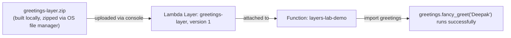

# 22 - Hands-On: Lambda Layers Lab

> Goal: build a genuinely reusable Layer from scratch, attach it to a function, and then publish a second layer version to see how a function must be **deliberately** updated to pick up a new version — nothing happens automatically. Every AWS-side action is via the **AWS Console**; the one unavoidable exception is packaging the layer's `.zip` file itself, done with your OS's native file-manager "Compress" feature (plain local file packaging — not AWS CLI, not automation).

---

## 1. What you're building

A tiny, dependency-free Python module — `greetings.py`, containing one function — packaged as a Lambda Layer, then imported and used from a separate Lambda function, exactly like a real shared internal utility library would be used across many functions.



---

## 2. Step 1 — Build the layer's folder structure locally

Lambda requires a **specific folder structure** inside a Python layer's zip: your code must sit inside a top-level folder literally named `python`, so it ends up on Python's import path automatically.

1. On your computer, create a folder: `lambda-layer-demo/python/`.
2. Inside `python/`, create a file named `greetings.py` with:
   ```python
   def fancy_greet(name):
       return f"✨ Hello, {name}! This greeting came from a Lambda Layer ✨"
   ```
3. Your folder structure should now look like:
   ```
   lambda-layer-demo/
     └── python/
           └── greetings.py
   ```

---

## 3. Step 2 — Package it as a zip (OS file manager, not AWS)

1. Open your file manager (Files/Finder/Explorer) and navigate into `lambda-layer-demo/`.
2. Right-click the **`python`** folder itself (not its parent, and not the individual `.py` file) → **Compress** (exact wording varies by OS: "Compress," "Send to → Compressed folder," "Create archive").
3. Confirm the resulting `.zip` file contains `python/greetings.py` when you peek inside it — **not** `lambda-layer-demo/python/greetings.py`. This distinction is the single most common mistake with Lambda layers (Section 8's troubleshooting table covers the exact symptom).
4. Rename the resulting file to `greetings-layer.zip` if it isn't already named clearly.

---

## 4. Step 3 — Create the Layer (Console)

1. **Lambda console** → **Layers** (left nav) → **Create layer**.
2. **Name**: `greetings-layer`.
3. **Description** (optional): `Shared greeting helper`.
4. **Upload a .zip file** → select `greetings-layer.zip` from Step 2.
5. **Compatible runtimes**: select the same Python version you'll use for the function in Section 5 (e.g. **Python 3.13**).
6. **Compatible architectures**: **x86_64**.
7. **Create**.

---

## 5. Step 4 — Create a function and attach the layer

1. **Lambda console** → **Create function** → **Author from scratch**.
2. **Function name**: `layers-lab-demo`.
3. **Runtime**: the **same** Python version selected in Section 4, Step 5 — a layer only attaches to functions using a compatible runtime.
4. **Permissions**: **Create a new role with basic Lambda permissions**.
5. **Create function**.
6. Scroll down to the **Layers** section (below the code editor) → **Add a layer**.
7. **Layer source**: **Custom layers** → select `greetings-layer` → **Version**: `1` → **Add**.
8. Replace the function's code with:
   ```python
   import greetings

   def lambda_handler(event, context):
       name = event.get("name", "World")
       return greetings.fancy_greet(name)
   ```
9. **Deploy**.

---

## 6. Step 5 — Test it

1. **Test** → **Configure test event** → JSON:
   ```json
   { "name": "Deepak" }
   ```
2. **Save** → **Test**.
3. Expected result: `"✨ Hello, Deepak! This greeting came from a Lambda Layer ✨"` — proof the function successfully imported code that lives entirely **outside** its own deployment package, purely via the attached layer.

---

## 7. Step 6 — Publish a new layer version, and see it does NOT auto-update

This is the most important lesson of the lab, directly following the [Lambda Layers](21-Lambda-Layers.md) note's Section 5:

1. Locally, edit `python/greetings.py` to change the message, e.g.:
   ```python
   def fancy_greet(name):
       return f"🎉 Hey {name}, this is an UPDATED greeting from Layer version 2! 🎉"
   ```
2. Re-compress the `python` folder into a new zip (Section 3's method again).
3. **Lambda console** → **Layers** → `greetings-layer` → **Create version**.
4. Upload the new zip → set the same **Compatible runtimes** as before → **Create**. This is now **Layer version 2** — version 1 still exists, completely unchanged.
5. Go back to the `layers-lab-demo` function → **Test** again (without changing anything else) → the result is **still the old message**. The function is still explicitly attached to **version 1** — publishing version 2 didn't touch it at all, exactly like a function's `$LATEST` isn't affected by anything happening to a different published version.
6. To actually pick up the update: scroll to the **Layers** section → select `greetings-layer` → **Edit** → change **Version** to `2` → **Save**.
7. **Test** again — now you get the updated message.

---

## 8. Troubleshooting

| Symptom | Likely cause |
|---|---|
| `Unable to import module 'lambda_function': No module named 'greetings'` | The zip's folder structure is wrong — it likely contains `lambda-layer-demo/python/greetings.py` instead of `python/greetings.py` at the zip's root (Section 3, Step 3) |
| Layer doesn't appear in the "Custom layers" list when adding it to a function | The function's selected **runtime** doesn't match any of the layer's **Compatible runtimes** |
| Function still shows the old greeting after publishing version 2 | Expected — Section 7, Step 6 wasn't done yet; layer versions never auto-update attached functions |
| "Failed to create layer version: Unzipped size must be smaller than..." | Combined function code + all layers exceeds 250MB — not a real risk for this tiny demo, but worth remembering for real layers (the [Lambda Layers](21-Lambda-Layers.md) note's Section 4) |

---

## 9. Cleanup

1. **Lambda console** → delete the `layers-lab-demo` function.
2. **Layers** → `greetings-layer` → delete **both** versions (1 and 2) individually — layer versions are deleted one at a time, not as a whole layer in one action.

---

## 10. Recap

- A Python layer's zip must contain a top-level **`python/`** folder — this is what makes its contents importable inside the execution environment.
- Packaging the zip is the one genuine exception to console-only in this whole folder — done via the OS's own file-manager compress feature, never AWS CLI.
- Attaching a layer, and picking **which version** it's pinned to, are both explicit, deliberate steps — nothing updates automatically when a new layer version is published, mirroring the [Version Control In AWS Lambda](16-Lambda-Versions.md) note's immutability idea.
- Next: the [Lambda VPC Connectivity](23-Lambda-VPC-Connectivity-HandsOn.md) note, covering how to let a function reach private, VPC-only resources.

### Sources
- [Creating and sharing Lambda layers — AWS docs](https://docs.aws.amazon.com/lambda/latest/dg/creating-deleting-layers.html)
- [Including library dependencies in a layer — AWS docs](https://docs.aws.amazon.com/lambda/latest/dg/python-layers.html)
