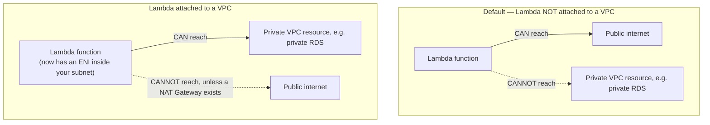

# 23 - Hands-On: Lambda VPC Connectivity

> Goal: understand why a Lambda function normally *can't* reach something inside your private VPC (like a private RDS database), how attaching it to a VPC fixes that — and the real, commonly-missed trade-off that comes with doing so. Entirely via the **AWS Console**, no CLI.

---

## 1. The default situation: Lambda runs OUTSIDE your VPC

Every Lambda function you've built so far in this folder runs in an **AWS-managed network**, completely separate from any VPC in your own account. This has a very specific consequence: by default, a Lambda function **can** reach the public internet (any public API, any public website) but **cannot** reach anything that only exists inside your private VPC — a private RDS database, a private EC2 instance with no public IP, an internal load balancer.

> 🧠 **Simple analogy**: think of your Lambda function as living in a **completely separate building** from your company's private office. It has its own front door straight onto the public street (internet access) — but it has no key to walk into your private office (your VPC) at all, unless you specifically give it one.

---

## 2. Attaching Lambda to a VPC — what actually changes

**Attaching a function to a VPC** gives it network interfaces (ENIs) directly inside your chosen subnets — now it genuinely lives inside your VPC's network and can reach private resources there (a private RDS instance, an internal service) using their private IPs, governed by your VPC's security groups exactly like any other resource inside that VPC.



---

## 3. ⚠️ The real gotcha: attaching to a VPC can BREAK internet access

This is the single most important, most commonly-missed fact about Lambda VPC connectivity: **a Lambda function's ENI inside a VPC never gets a public IP address — not even if you put it in a "public" subnet.** Because of that, it **cannot** use a subnet's Internet Gateway route at all (an Internet Gateway only works for resources that actually have a public IP to translate against). The function needs a **NAT Gateway** (or NAT instance) reachable via its subnet's route table to reach the internet at all, once it's inside a VPC.

This means attaching a function to a VPC is a genuine **trade-off**, not a strictly additive change: you gain access to private VPC resources, but you can simultaneously **lose** internet access, unless you've specifically set up a NAT Gateway too.

---

## 4. See this yourself (Console)

### Step 1 — Confirm internet access works, before attaching to any VPC
1. **Lambda console** → **Create function** → **Author from scratch**.
2. **Function name**: `vpc-demo-function`. **Runtime**: newest Python 3.x. **Permissions**: default basic role.
3. **Create function**, then replace the code with:
   ```python
   import urllib.request

   def lambda_handler(event, context):
       try:
           response = urllib.request.urlopen("https://checkip.amazonaws.com", timeout=5)
           ip = response.read().decode().strip()
           return {"statusCode": 200, "body": f"Reached the internet. My public IP was: {ip}"}
       except Exception as e:
           return {"statusCode": 500, "body": f"Could NOT reach the internet: {e}"}
   ```
4. **Deploy** → **Test** (any empty test event `{}` is fine).
5. Expected result: **success**, with a real public IP address returned — proving outbound internet access works by default.

### Step 2 — Attach the function to the default VPC, then re-test
1. **Configuration** tab → **VPC** → **Edit**.
2. **VPC**: select your account's **default VPC**.
3. **Subnets**: select at least one of the default subnets.
4. **Security groups**: select the **default** security group (its default rules allow all outbound traffic — inbound doesn't matter for this test).
5. **Save** — this takes a little while to apply, since AWS has to provision ENIs in your subnet.
6. **Test** the function again, using the exact same test event.
7. Expected result this time: the request to `checkip.amazonaws.com` **times out**, and you get the `"Could NOT reach the internet"` branch — even though you selected the default VPC's normal, "public" subnets. This is Section 3's gotcha, now directly observed: the function has no NAT Gateway configured anywhere in its subnet's route table, so it genuinely cannot reach the internet anymore, despite being in a subnet that an EC2 instance could use for internet access just fine.

---

## 5. The fix: a NAT Gateway (conceptual — not built in this lab)

To restore internet access for a VPC-attached function while keeping its access to private resources, the subnet's route table needs a route to a **NAT Gateway** sitting in a public subnet (with its own Elastic IP), which then forwards traffic out through an Internet Gateway on the function's behalf. This is the exact same pattern used for private EC2 instances that need outbound internet access without being directly publicly reachable — not something unique to Lambda. A NAT Gateway has an hourly cost plus data-processing charges, which is worth factoring in before attaching latency- or cost-sensitive functions to a VPC unnecessarily.

> ⚠️ **Don't attach a function to a VPC unless it actually needs to reach something private inside that VPC.** A common real-world mistake is attaching every function to a VPC "just in case," which can silently break functions that call external APIs (payment gateways, third-party services) and also, historically, added meaningful cold-start latency (the [AWS Lambda Execution Environment](15-Lambda-Execution-Environment.md) note's Section 5) — AWS has significantly improved VPC networking setup speed since Lambda's Hyperplane ENI improvements, but "only attach to a VPC when genuinely needed" remains the right default.

---

## 6. Cleanup

1. **Configuration** → **VPC** → **Edit** → remove the VPC/subnet/security group selections (set back to no VPC) if you don't want the function VPC-attached going forward.
2. Delete `vpc-demo-function` if you're done with it entirely.

---

## 7. Recap

- Lambda functions run **outside** any customer VPC by default — internet access works, private VPC resources don't.
- Attaching a function to a VPC gives it ENIs inside your subnets, enabling access to private resources like RDS.
- Critically, a VPC-attached Lambda ENI **never gets a public IP**, so it loses internet access entirely unless its subnet routes through a **NAT Gateway** — a genuine trade-off proven directly in Section 4's test.
- Only attach a function to a VPC when it genuinely needs to reach something private inside that VPC.
- Next: the [AWS Step Functions](24-AWS-Step-Functions-Intro.md) note, moving from a single function's networking into orchestrating multiple functions together.

### Sources
- [Configuring a Lambda function to access resources in a VPC — AWS docs](https://docs.aws.amazon.com/lambda/latest/dg/configuration-vpc.html)
- [VPC networking for Lambda — AWS docs](https://docs.aws.amazon.com/lambda/latest/dg/foundation-networking.html)
