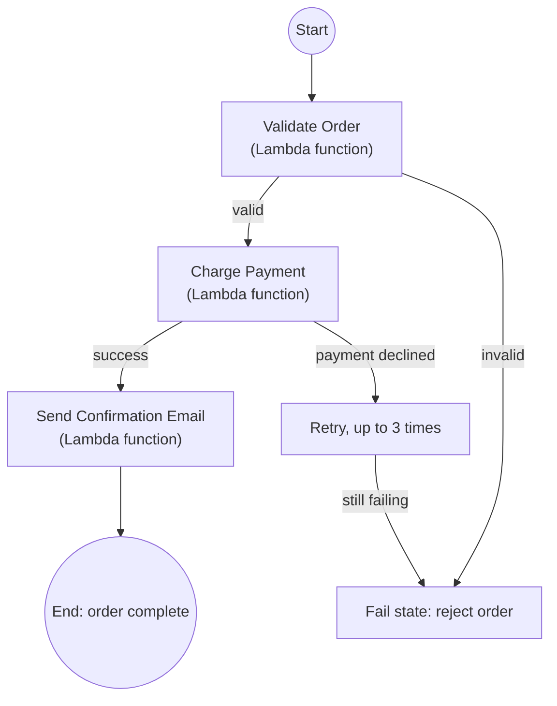

# 24 - AWS Step Functions

> Goal: understand why you'd want a dedicated orchestration service instead of just calling one Lambda function from inside another — the problem Step Functions solves, in plain terms, before the hands-on lab builds a real one.

---

## 1. The problem: chaining Lambda functions gets messy, fast

Imagine an order-processing task with three steps: **validate the order**, **charge the payment**, **send a confirmation email**. A tempting first approach is to have one Lambda function call the next one directly from inside its own code. This works for exactly two steps, but quickly runs into real problems:

- **No visibility**: if step 2 fails, you're digging through CloudWatch logs across multiple functions to figure out what happened and where.
- **Retry logic gets duplicated**: every function ends up needing its own hand-written retry/error-handling code.
- **No easy way to pause and wait**: what if a step needs to wait for a human approval, or wait 24 hours before continuing? That's awkward to build with plain function-calls-function code.
- **Long-running orchestration eats into Lambda's own limits**: the whole chain is still bound by whichever function's 15-minute execution ceiling is running it end-to-end, even though the *individual* steps might be fast.

**AWS Step Functions** solves this by moving the orchestration logic **out of your function code entirely**, into a visual, AWS-managed **state machine** that calls each Lambda function as a discrete step, handling retries, error branching, and waiting natively.

---

## 2. What a state machine actually is

A **state machine** is a definition of a workflow as a sequence (and possibly branching set) of **states** — each state does one thing (e.g. "invoke this Lambda function," "wait 5 seconds," "check a condition and branch," "run two things in parallel") before moving to the next state.

> 🧠 **Simple analogy**: think of a state machine as a **flowchart that AWS actually runs for you** — not just a diagram you draw to *explain* a process, but the literal, executable definition of that process. Each box in the flowchart is a real step AWS executes; the arrows are real transitions AWS manages, including what happens if a box fails.

---

## 3. Architecture & workflow — the order-processing example, as a state machine

Each rectangular box here is a real **Task state**, individually invoking a Lambda function — and the retry/branching logic (the `RETRY` loop, the `FAIL` path) is configured declaratively in the state machine's definition, not hand-coded inside any one function.

---

## 4. What Step Functions gives you that hand-written chaining doesn't

| Capability | Why it matters |
|---|---|
| **Visual execution history** | See exactly which step ran, with what input/output, and where a failure happened — for every single execution, automatically |
| **Built-in retry and error handling** | Configure "retry this step up to 3 times with exponential backoff" declaratively, without writing that logic yourself in every function |
| **Wait states** | Genuinely pause a workflow (seconds, hours, or even until an external signal arrives) without a Lambda function needing to stay running the whole time — a wait state costs nothing while waiting |
| **Parallel and branching execution** | Run multiple steps at once, or take different paths based on a condition, all defined visually |
| **Not bound by Lambda's 15-minute limit** | The overall **workflow** can run far longer than any single Lambda invocation, since Step Functions itself is what's tracking progress between steps, not one long-running function |

---

## 5. How you build one: Workflow Studio

AWS Step Functions' console includes **Workflow Studio** — a drag-and-drop visual builder for constructing a state machine, instead of hand-writing its underlying JSON definition (**Amazon States Language**, or ASL) from scratch. The [Step Functions Lab](25-Step-Functions-Lab-HandsOn.md) note walks through building a real one this way.

> 🎯 **Exam tip:** "coordinate multiple Lambda functions with built-in retry logic, visibility into each step, and the ability to wait for long periods" is the textbook **Step Functions** scenario. If a scenario just describes one Lambda function calling another directly with no need for visibility/retries/waiting, that simpler direct-call pattern may still be perfectly fine — Step Functions solves a specific set of orchestration problems, it's not automatically required for any multi-step process.

---

## 6. Recap

- Chaining Lambda functions directly in code works for simple cases but loses visibility, duplicates retry logic, and struggles with long waits.
- A **state machine** is an executable, visual definition of a workflow — states like Task (invoke a function), Choice (branch), and Wait are AWS-managed, not hand-coded.
- Step Functions provides built-in retries, error handling, visual execution history, and long-running waits that don't consume Lambda execution time.
- **Workflow Studio** is the console's visual drag-and-drop builder for constructing a state machine.
- Next: the [Step Functions Lab](25-Step-Functions-Lab-HandsOn.md) note — building a real state machine chaining actual Lambda functions.

### Sources
- [What is AWS Step Functions? — AWS docs](https://docs.aws.amazon.com/step-functions/latest/dg/welcome.html)
- [Amazon States Language — AWS docs](https://docs.aws.amazon.com/step-functions/latest/dg/concepts-amazon-states-language.html)
