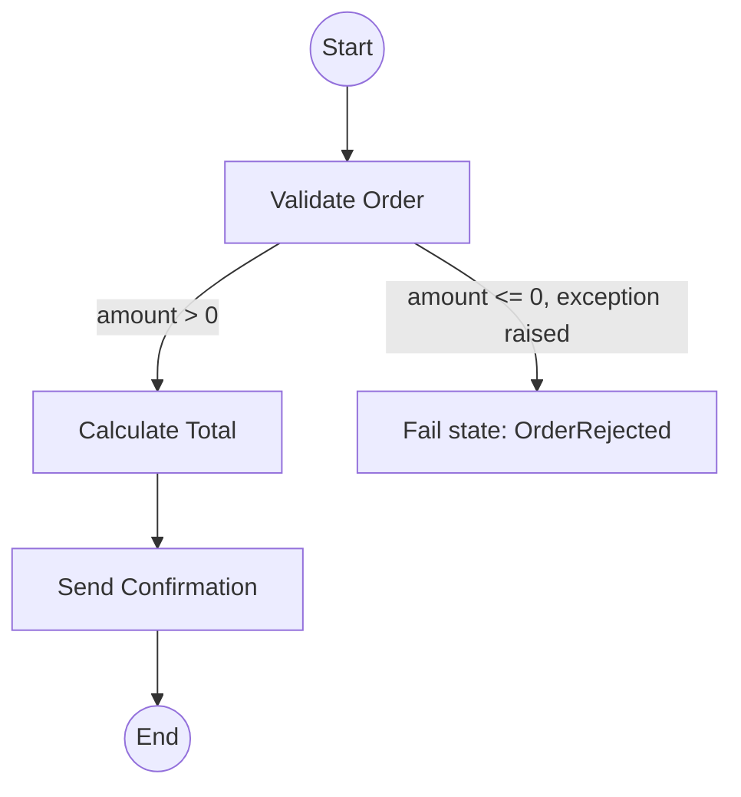

# 25 - Hands-On: Step Function Lab

> Goal: build a real state machine in **Workflow Studio** that chains three Lambda functions together — with a working error-handling branch — and actually watch an execution move through it step by step. Entirely via the **AWS Console**, no CLI.

---

## 1. What you're building

The order-processing example from the [AWS Step Functions](24-AWS-Step-Functions-Intro.md) note, simplified to three real Lambda functions:



---

## 2. Step 1 — Create the three Lambda functions

Repeat **Create function** → **Author from scratch** → newest Python 3.x runtime → default basic execution role → **Deploy**, three times:

### `sf-lab-validate-order`
```python
def lambda_handler(event, context):
    amount = event.get("amount", 0)
    if amount <= 0:
        raise ValueError(f"Invalid order amount: {amount}")
    return event
```

### `sf-lab-calculate-total`
```python
def lambda_handler(event, context):
    amount = event["amount"]
    total = round(amount * 1.08, 2)   # adds 8% tax
    event["total"] = total
    return event
```

### `sf-lab-send-confirmation`
```python
def lambda_handler(event, context):
    item = event.get("item", "your order")
    total = event.get("total")
    return {"message": f"Confirmed: {item} — total charged ${total}"}
```

> 🧠 Notice each function's output becomes the **next** function's input — `sf-lab-calculate-total` reads `event["amount"]`, the exact field `sf-lab-validate-order` passed straight through. This is the default way Step Functions moves data between states: a Task state's output automatically becomes the next state's input, with no extra wiring needed.

---

## 3. Step 2 — Build the state machine in Workflow Studio

1. **Step Functions console** → **State machines** → **Create state machine**.
2. **Choose a template**: **Blank**.
3. Leave **Design your workflow visually** selected (Workflow Studio opens) → **Type**: **Standard** (the [AWS Step Function Types](26-Step-Functions-Types.md) note covers what this choice means).
4. In the left **Actions** panel, search for `Lambda` → drag **Lambda Invoke** onto the canvas as the first state.
5. Click the new state → in the right-hand config panel: **Function name**: `sf-lab-validate-order`. Rename the state (top of the panel) to `Validate Order`.
6. Drag a second **Lambda Invoke** action, connecting it after the first → **Function name**: `sf-lab-calculate-total` → rename to `Calculate Total`.
7. Drag a third **Lambda Invoke** action, connecting after the second → **Function name**: `sf-lab-send-confirmation` → rename to `Send Confirmation` → this one connects to the workflow's end.

---

## 4. Step 3 — Add the error-handling branch

1. Click the **Validate Order** state → **Error handling** tab (in the same right-hand config panel) → **Add catch**.
2. **Error type**: `States.ALL` (catches any error the function raises — including the `ValueError` this function deliberately raises for invalid amounts).
3. **Next state**: create a new state → search the Actions panel for **Fail** → drag a **Fail** state onto the canvas → set its name to `OrderRejected`, and an optional **Cause**: `Order amount must be greater than zero`.
4. Connect the catch's output to this new `OrderRejected` Fail state (Workflow Studio draws this as a distinct, differently-colored path from the normal success flow).

---

## 5. Step 4 — Name it and create it

1. Above the canvas, click into the state machine's name field → `OrderProcessingDemo`.
2. **Config** tab → **Permissions** → leave at the default **Create new role** — Step Functions automatically generates an IAM role that includes `lambda:InvokeFunction` permission scoped to exactly the three functions you referenced above, without you writing any policy by hand.
3. **Create**.

---

## 6. Step 5 — Run a successful execution

1. On the state machine's page → **Start execution**.
2. **Input**:
   ```json
   {
     "item": "Laptop",
     "amount": 1000
   }
   ```
3. **Start execution**.
4. Watch the **Graph view** — each state highlights and turns green as it completes, in order: `Validate Order` → `Calculate Total` → `Send Confirmation`.
5. Click the final state (or the **Execution input and output** section) to see the actual result: `{"message": "Confirmed: Laptop — total charged $1080.0"}`.

---

## 7. Step 6 — Run a failing execution, and watch the Catch branch work

1. **Start execution** again, this time with:
   ```json
   {
     "item": "Laptop",
     "amount": -50
   }
   ```
2. **Start execution**.
3. In the **Graph view**, `Validate Order` shows as **failed** (the `ValueError` was raised) — but instead of the whole execution just crashing, the graph shows it was **caught** and redirected to `OrderRejected`.
4. Click the `Validate Order` state → **Exception** tab to see the actual `ValueError: Invalid order amount: -50` message that was caught.
5. The overall execution status shows as a Step Functions-level "failed" execution (since it ended at a `Fail` state) — but critically, this was a **controlled, visible, intentional** failure path, not an unhandled crash buried in some function's CloudWatch logs.

---

## 8. Why this is meaningfully better than chaining functions in code

Compare what you just saw to hand-written chaining: every single execution — successful or failed — has a **complete, visual record** of exactly which state ran, what data it received, what it returned, and (for the failed case) exactly what error occurred and where it was caught. None of that required writing any logging, retry, or error-propagation code yourself — it's a structural property of using Step Functions at all, exactly as the [AWS Step Functions](24-AWS-Step-Functions-Intro.md) note's Section 4 described.

---

## 9. Troubleshooting

| Symptom | Likely cause |
|---|---|
| `States.Runtime` error, function not found | The Lambda function name typed/selected in a state doesn't exactly match one of the three you created |
| Execution fails immediately with an IAM-related error | The state machine's auto-generated role wasn't actually created/attached — recheck Section 5, Step 2 |
| The failing-amount execution shows as an unhandled crash instead of reaching `OrderRejected` | The **Catch** wasn't actually attached to the `Validate Order` state, or its **Next state** doesn't point at the Fail state — recheck Section 4 |
| `Calculate Total` fails with a `KeyError` on `amount` | `Validate Order`'s output isn't being passed through correctly — confirm its code returns `event` unchanged, not a different shape |

---

## 10. Cleanup

1. **Step Functions console** → delete the `OrderProcessingDemo` state machine.
2. **Lambda console** → delete `sf-lab-validate-order`, `sf-lab-calculate-total`, and `sf-lab-send-confirmation`.
3. **IAM console** → delete the auto-generated Step Functions execution role if it wasn't already removed automatically.

---

## 11. Recap

- **Workflow Studio** builds a real state machine visually — dragging **Lambda Invoke** actions onto a canvas, no hand-written Amazon States Language JSON needed.
- A Task state's output automatically becomes the next state's input — no manual data-wiring required for a simple linear chain.
- A **Catch** on a Task state redirects a caught error to a different state (here, a **Fail** state) — turning an unhandled crash into a visible, intentional branch in the workflow.
- Every execution — success or failure — gets a complete visual record of what happened at each state, automatically.
- Next: the [AWS Step Function Types](26-Step-Functions-Types.md) note, covering the **Standard** vs. **Express** choice this lab's Section 3 made without fully explaining yet.

### Sources
- [Getting started with Step Functions Workflow Studio — AWS docs](https://docs.aws.amazon.com/step-functions/latest/dg/workflow-studio.html)
- [Handling error conditions using a Step Functions state machine — AWS docs](https://docs.aws.amazon.com/step-functions/latest/dg/concepts-error-handling.html)
