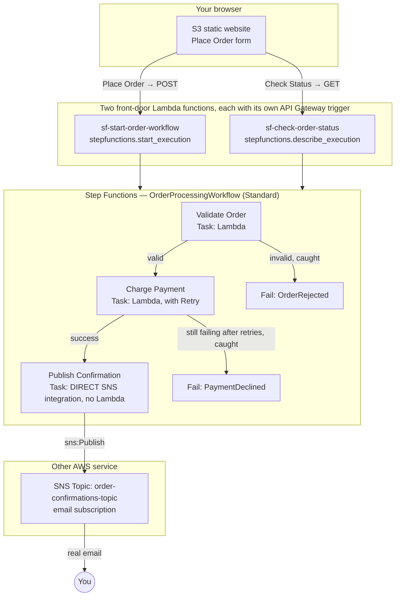

# 25 - Hands-On: Step Function Lab

> Goal: build a genuinely production-shaped **order processing** workflow — two Lambda functions as workflow steps, a **direct AWS service integration** (Step Functions calling Amazon SNS itself, no Lambda in between), a **Retry** on a step that can transiently fail, a **Catch** that turns a rejected order into a controlled failure, and a real HTTP front door (two more Lambda functions, each with its own API Gateway trigger — the same pattern the [EC2 Start/Stop Automation demo](09-10.01-EC2-Start-Stop-Automation_Demo.md) established) so a real web page can start an execution and check on it. Entirely via the **AWS Console**, no CLI.

---

## 1. What you're building



This is deliberately closer to a real production shape than a pure "chain 3 Lambdas" demo: **not every step needs to be a Lambda function** — `Publish Confirmation` calls SNS directly from the state machine's own definition, which is both simpler and cheaper than wrapping every AWS API call in a Lambda function just to invoke it.

---

## 2. Step 1 — Create the SNS topic and confirm a real subscription

1. **SNS console** → **Topics** → **Create topic**.
2. **Type**: **Standard**.
3. **Name**: `order-confirmations-topic`.
4. Leave the rest at their defaults → **Create topic**.
5. On the topic's page → **Create subscription**.
6. **Protocol**: **Email**.
7. **Endpoint**: your own real email address.
8. **Create subscription**.
9. Check your inbox for an email titled **"AWS Notification - Subscription Confirmation"** → click **Confirm subscription**. Until you do this, SNS will accept publishes to the topic but you'll never actually receive one — a genuinely common first-time gotcha worth getting right before Section 5's test.
10. Copy the topic's **ARN** from the console (e.g. `arn:aws:sns:ap-south-1:123456789012:order-confirmations-topic`) — you'll select it by name in Section 4, but it's useful to have on hand.

---

## 3. Step 2 — Create the two workflow-step Lambda functions

Repeat **Create function** → **Author from scratch** → newest Python 3.x runtime → default basic execution role → **Deploy**, twice:

### `sf-validate-order`
```python
def lambda_handler(event, context):
    amount = event.get("amount", 0)
    email = event.get("email", "")
    if amount <= 0 or not email:
        raise ValueError(f"Invalid order: amount={amount}, email={email}")
    return event
```

### `sf-charge-payment`
```python
import random

def lambda_handler(event, context):
    # Simulates a real payment gateway — declines roughly 1 in 4 charges
    if random.random() < 0.75:
        event["paymentStatus"] = "SUCCESS"
        return event
    raise Exception("Payment gateway declined the charge")
```

> 🧠 Both functions **raise** on failure rather than returning an error flag in their response — this is deliberate. A raised exception is what Step Functions' **Retry** and **Catch** mechanisms actually key off of (Section 4); a function that just returns `{"success": false}` wouldn't trigger either one automatically.

---

## 4. Step 3 — Build the state machine in Workflow Studio

1. **Step Functions console** → **State machines** → **Create state machine**.
2. **Choose a template**: **Blank**.
3. Leave **Design your workflow visually** selected (Workflow Studio opens) → **Type**: **Standard** (the [AWS Step Function Types](26-Step-Functions-Types.md) note covers what this choice means).
4. In the left **Actions** panel, search `Lambda` → drag **Lambda Invoke** onto the canvas as the first state.
5. Click the new state → **Function name**: `sf-validate-order` → rename the state (top of the panel) to `Validate Order`.
6. Drag a second **Lambda Invoke** action, connecting after the first → **Function name**: `sf-charge-payment` → rename to `Charge Payment`.
7. In the left **Actions** panel, search `SNS` → drag **SNS Publish** onto the canvas, connecting after `Charge Payment` → rename to `Publish Confirmation`. In its config panel:
   - **Topic**: select `order-confirmations-topic` from the dropdown (Section 2).
   - **Message**: `Your order has been validated and payment charged successfully via Step Functions.`
   - This state connects straight to the workflow's end (an implicit **Success**).

### Add a Retry to the payment step
8. Click **Charge Payment** → **Error handling** tab → **Add retry**.
9. **Error type**: `States.ALL`. **Max attempts**: `2`. **Interval**: `2` seconds. **Backoff rate**: `2`. This means: on a raised exception, wait 2 seconds and try `Charge Payment` again, then (if it fails a second time) wait 4 seconds and try once more, before finally giving up — genuinely useful for a payment gateway that might fail due to a transient network blip, not just a truly declined card.

### Add Catches for both failure paths
10. Drag two **Fail** states onto the canvas (search `Fail` in the Actions panel): rename one `OrderRejected` (**Cause**: `Order amount must be positive and email is required`), rename the other `PaymentDeclined` (**Cause**: `Payment failed after retries were exhausted`).
11. Click **Validate Order** → **Error handling** tab → **Add catch** → **Error type**: `States.ALL` → **Next state**: `OrderRejected`.
12. Click **Charge Payment** → **Error handling** tab → **Add catch** → **Error type**: `States.ALL` → **Next state**: `PaymentDeclined`. This catch only fires **after** the retry from Step 9 has already been exhausted — Retry and Catch stack on the same state without conflicting.

### Name it and create it
13. Above the canvas, click the name field → `OrderProcessingWorkflow`.
14. **Config** tab → **Permissions** → leave at **Create new role** — Step Functions automatically generates an IAM role covering exactly `lambda:InvokeFunction` on your two functions and `sns:Publish` scoped to `order-confirmations-topic`, based on what's actually in the workflow you just built.
15. **Create**.
16. On the state machine's own page, copy its **ARN** (e.g. `arn:aws:states:ap-south-1:123456789012:stateMachine:OrderProcessingWorkflow`) — you'll need the **exact** value in Section 6, and copying it beats hand-constructing it and risking a typo in the account ID or region.

---

## 5. Step 4 — Run it directly from the Step Functions console first

Before adding any HTTP layer, confirm the workflow itself actually works — this isolates workflow logic from front-door plumbing, same testing discipline as the [EC2 Start/Stop Automation demo](09-10.01-EC2-Start-Stop-Automation_Demo.md)'s Section 9.

### A successful order
1. **Start execution** → **Input**:
   ```json
   { "email": "you@example.com", "amount": 500 }
   ```
2. **Start execution**.
3. Watch the **Graph view**: `Validate Order` → `Charge Payment` → `Publish Confirmation`, all turning green. If `Charge Payment` happened to fail on its first attempt (roughly 1 in 4 runs), you'll actually see the **Retry** happen live in the graph before it eventually succeeds or exhausts its attempts.
4. Check your email — a real SNS notification should arrive within a few seconds of a successful execution.

### A rejected order (Catch path)
5. **Start execution** again with:
   ```json
   { "email": "", "amount": -10 }
   ```
6. `Validate Order` shows **failed**, caught, redirected to `OrderRejected` — the overall execution ends as a controlled **Fail**, not an unhandled crash.

### A repeatedly-declined payment (Retry, then Catch)
7. Run a normal, valid input a few more times — roughly 1 in 64 runs (a ~25% failure rate, three times in a row) will exhaust all of `Charge Payment`'s retries and land on `PaymentDeclined` instead. If you don't see it naturally within a few tries, temporarily change `sf-charge-payment`'s `0.75` to `0.0` and rerun once to force it, then change it back afterward.

---

## 6. Step 5 — Create the two front-door Lambda functions

### `sf-start-order-workflow`
1. **Create function** → **Author from scratch** → **Function name**: `sf-start-order-workflow` → default execution role → **Create function**.
2. Code:
   ```python
   import boto3
   import json

   sfn = boto3.client('stepfunctions')
   STATE_MACHINE_ARN = "arn:aws:states:ap-south-1:123456789012:stateMachine:OrderProcessingWorkflow"  # <-- replace with your real ARN from Section 4, Step 16

   def lambda_handler(event, context):
       body = json.loads(event.get("body") or "{}")
       response = sfn.start_execution(
           stateMachineArn=STATE_MACHINE_ARN,
           input=json.dumps(body)
       )
       return {
           "statusCode": 200,
           "body": json.dumps({"executionArn": response["executionArn"]})
       }
   ```
3. **Deploy**.
4. Grant it permission to start executions: **Configuration** → **Permissions** → **Role name** link → **Add permissions** → **Create inline policy** → **JSON**:
   ```json
   {
       "Version": "2012-10-17",
       "Statement": [
           {
               "Effect": "Allow",
               "Action": "states:StartExecution",
               "Resource": "arn:aws:states:ap-south-1:123456789012:stateMachine:OrderProcessingWorkflow"
           }
       ]
   }
   ```
   (Use your own real state machine ARN.) → **Next** → **Policy name**: `StartOrderExecutionPolicy` → **Create policy**.

### `sf-check-order-status`
5. **Create function** → **Author from scratch** → **Function name**: `sf-check-order-status` → default execution role → **Create function**.
6. Code:
   ```python
   import boto3
   import json

   sfn = boto3.client('stepfunctions')

   def lambda_handler(event, context):
       params = event.get("queryStringParameters") or {}
       execution_arn = params.get("executionArn")
       response = sfn.describe_execution(executionArn=execution_arn)
       return {
           "statusCode": 200,
           "body": json.dumps({
               "status": response["status"],
               "output": response.get("output")
           }, default=str)
       }
   ```
7. **Deploy**.
8. Grant it permission to read execution status: **Configuration** → **Permissions** → **Role name** link → **Add permissions** → **Create inline policy** → **JSON**:
   ```json
   {
       "Version": "2012-10-17",
       "Statement": [
           {
               "Effect": "Allow",
               "Action": "states:DescribeExecution",
               "Resource": "arn:aws:states:ap-south-1:123456789012:execution:OrderProcessingWorkflow:*"
           }
       ]
   }
   ```
   > 🧠 Notice the resource type is different from `sf-start-order-workflow`'s policy: `StartExecution` acts on the **state machine** itself (`stateMachine:OrderProcessingWorkflow`), while `DescribeExecution` acts on an **individual execution** of it (`execution:OrderProcessingWorkflow:*`) — a specific run, not the workflow definition. Two different Step Functions resource types, two different ARN shapes.
9. **Next** → **Policy name**: `CheckOrderStatusPolicy` → **Create policy**.

---

## 7. Step 6 — Add an API Gateway trigger to each front-door function

Exactly the same **+ Add trigger** flow the [EC2 Start/Stop Automation demo](09-10.01-EC2-Start-Stop-Automation_Demo.md)'s Sections 7-8 established — no need to open the API Gateway console separately:

1. Open `sf-start-order-workflow` → **Function overview** → **+ Add trigger** → **API Gateway** → **Create a new API** → **HTTP API** → **Security**: **Open**.
2. Expand **Additional settings** → leave **API name** at its auto-filled value → **Deployment stage**: `default` → check **Cross-origin resource sharing (CORS)** → **Add**.
3. **Configuration** → **Triggers** → copy the **API endpoint** as **START_URL** (looks like `https://<api-id>.execute-api.<region>.amazonaws.com/default/sf-start-order-workflow`).
4. Repeat the exact same steps on `sf-check-order-status` → copy its **API endpoint** as **CHECK_URL**.

Test both directly before touching the front end, the same isolation habit as before: paste `START_URL` won't work from a plain address-bar GET (it needs a POST body), but you can confirm `CHECK_URL` responds (even with a `"status": "..."` error about a missing `executionArn`, that at least confirms the Lambda/API Gateway chain itself is reachable).

---

## 8. Step 7 — Build the S3-hosted order form

### Create the bucket
1. **S3 console** → **Create bucket** → name it something globally unique, e.g. `sf-order-form-<your-name-or-date>` → uncheck **Block all public access** (acknowledge) → **Create bucket**.
2. **Properties** → **Static website hosting** → **Edit** → **Enable**, **Index document**: `index.html` → **Save changes**. Note the **Bucket website endpoint**.
3. **Permissions** → **Bucket policy** → paste (replacing `<BUCKET_NAME>`):
   ```json
   {
     "Version": "2012-10-17",
     "Statement": [
       {
         "Sid": "PublicReadForWebsite",
         "Effect": "Allow",
         "Principal": "*",
         "Action": "s3:GetObject",
         "Resource": "arn:aws:s3:::<BUCKET_NAME>/*"
       }
     ]
   }
   ```
   → **Save changes**.

### Upload the order form
This file already exists at [`demo-site/24/index.html`](demo-site/24/index.html), right next to this note. **Before uploading**, edit the `START_URL` and `CHECK_URL` constants near the bottom of the file to your own two invoke URLs from Section 7. Full content shown below for reference:

```html
<!DOCTYPE html>
<html lang="en">
<head>
<meta charset="UTF-8">
<meta name="viewport" content="width=device-width, initial-scale=1.0">
<title>DevopsWithDeepak - Order Processing Workflow</title>
<style>
  :root { --aws-orange:#FF9900; --aws-dark:#131A22; --aws-darker:#0F1111; --aws-text:#E9ECEF; --green:#2ECC71; --blue:#3498DB; }
  * { box-sizing:border-box; margin:0; padding:0; }
  body {
    background: radial-gradient(circle at top, #1B2430, var(--aws-darker));
    color: var(--aws-text);
    font-family: 'Segoe UI', Arial, sans-serif;
    min-height: 100vh;
    display: flex; align-items: center; justify-content: center;
    padding: 20px;
  }
  .card {
    background: var(--aws-dark);
    border: 1px solid #2b3542;
    border-top: 4px solid var(--aws-orange);
    border-radius: 12px;
    max-width: 560px; width: 100%;
    padding: 36px 40px;
    box-shadow: 0 20px 60px rgba(0,0,0,0.5);
  }
  .badge {
    display: inline-block;
    background: var(--aws-orange);
    color: #131A22;
    font-weight: 700; font-size: 12px; letter-spacing: 1px;
    padding: 6px 14px; border-radius: 999px;
    text-transform: uppercase;
    margin-bottom: 18px;
  }
  h1 { font-size: 26px; margin-bottom: 4px; }
  h1 span { color: var(--aws-orange); }
  .subtitle { color:#9AA5B1; margin-bottom:24px; font-size:14px; }
  label { display:block; font-size:12px; color:#9AA5B1; text-transform:uppercase; letter-spacing:1px; margin-bottom:6px; margin-top:16px; }
  input {
    width:100%; background:#0F1111; border:1px solid #2b3542; border-radius:8px;
    padding:12px 14px; color:#fff; font-size:14px;
  }
  button {
    border: none; border-radius: 8px; padding: 14px 0; width: 100%;
    font-size: 15px; font-weight: 700; letter-spacing: 1px;
    text-transform: uppercase; cursor: pointer; margin-top: 20px;
    color: #0F1111; transition: opacity 0.2s ease;
  }
  button:hover { opacity: 0.9; }
  button:disabled { opacity: 0.5; cursor: not-allowed; }
  #placeBtn { background: var(--green); }
  #checkBtn { background: var(--blue); color: #fff; }
  #result {
    background:#0F1111; border:1px solid #2b3542; border-radius:8px;
    padding:14px 16px; font-size:13px; font-family:Consolas,Monaco,monospace;
    min-height: 20px; color: #9AA5B1; margin-top: 20px; word-break: break-all;
  }
</style>
</head>
<body>
  <div class="card">
    <span class="badge">Step Functions Order Workflow</span>
    <h1>DevopsWith<span>Deepak</span> - Orders</h1>
    <div class="subtitle">Submits straight into a real Step Functions state machine — Validate, Charge (with retry), Confirm via SNS</div>

    <label>Customer Email</label>
    <input type="email" id="email" placeholder="you@example.com">

    <label>Order Amount ($)</label>
    <input type="number" id="amount" placeholder="500">

    <button id="placeBtn">Place Order</button>
    <button id="checkBtn" disabled>Check Status</button>

    <div id="result">Ready.</div>
  </div>

  <script>
    // Replace with your own two invoke URLs from Section 7, e.g.
    // "https://abc123.execute-api.ap-south-1.amazonaws.com/default/sf-start-order-workflow"
    const START_URL = "https://REPLACE_WITH_YOUR_START_INVOKE_URL";
    const CHECK_URL = "https://REPLACE_WITH_YOUR_CHECK_INVOKE_URL";

    let lastExecutionArn = null;
    const resultEl = document.getElementById('result');
    const placeBtn = document.getElementById('placeBtn');
    const checkBtn = document.getElementById('checkBtn');

    placeBtn.addEventListener('click', async () => {
      const email = document.getElementById('email').value;
      const amount = parseFloat(document.getElementById('amount').value);
      placeBtn.disabled = true;
      resultEl.textContent = 'Starting the workflow...';
      try {
        const response = await fetch(START_URL, {
          method: 'POST',
          body: JSON.stringify({ email, amount })
        });
        const data = await response.json();
        lastExecutionArn = data.executionArn;
        resultEl.textContent = `Started! executionArn: ${lastExecutionArn}`;
        checkBtn.disabled = false;
      } catch (err) {
        resultEl.textContent = `Failed to start: ${err.message}`;
      } finally {
        placeBtn.disabled = false;
      }
    });

    checkBtn.addEventListener('click', async () => {
      if (!lastExecutionArn) return;
      resultEl.textContent = 'Checking status...';
      try {
        const url = `${CHECK_URL}?executionArn=${encodeURIComponent(lastExecutionArn)}`;
        const response = await fetch(url, { method: 'GET' });
        const data = await response.json();
        resultEl.textContent = `Status: ${data.status}${data.output ? ' — Output: ' + data.output : ''}`;
      } catch (err) {
        resultEl.textContent = `Failed to check: ${err.message}`;
      }
    });
  </script>
</body>
</html>
```

4. **S3 console** → open your bucket → **Upload** → select the edited `index.html` → **Upload**.

---

## 9. Step 8 — Test end-to-end from the order form

1. Open the bucket's website endpoint URL in a browser.
2. Enter your email and an amount (e.g. `500`) → **Place Order**. The result box should show `Started! executionArn: arn:aws:states:...`.
3. Click **Check Status** a couple of times a few seconds apart — you should see it move from `RUNNING` to `SUCCEEDED` (or occasionally `FAILED`, if the simulated payment decline exhausted its retries).
4. Cross-check the same execution in the **Step Functions console** → `OrderProcessingWorkflow` → **Executions** — the exact run you just triggered from the browser is right there, with the same full graph view Section 5 used for direct console testing.
5. If it succeeded, check your email for the real SNS confirmation.

---

## 10. How this one lab covers the whole Step Functions topic

| Concept from the [AWS Step Functions](24-AWS-Step-Functions-Intro.md) note | Where this lab demonstrated it |
|---|---|
| Task states invoking Lambda | `Validate Order`, `Charge Payment` (Section 4) |
| Direct AWS service integration (no Lambda wrapper) | `Publish Confirmation` calling SNS directly (Section 4, Step 7) |
| Retry | `Charge Payment`'s Retry configuration (Section 4, Steps 8-9) |
| Catch / controlled failure | Both `OrderRejected` and `PaymentDeclined` Fail states (Section 4, Steps 10-12) |
| Visual execution history | The Graph view for every run, console-triggered or web-triggered (Section 5, Section 9) |
| Not bound by a single function's invocation | The whole multi-step, multi-service workflow runs as one tracked execution, independent of any one Lambda's own timeout |
| Standard vs. Express | This lab used **Standard** (Section 4, Step 3) — the [AWS Step Function Types](26-Step-Functions-Types.md) note explains what changes with **Express** |

---

## 11. Troubleshooting

| Symptom | Likely cause |
|---|---|
| Execution fails immediately with an IAM-related error inside `Publish Confirmation` | The state machine's auto-generated role (Section 4, Step 14) didn't pick up `sns:Publish` — recheck the SNS Publish action was actually configured with a **Topic** selected before creating the state machine |
| No confirmation email ever arrives, even on a successful execution | The email subscription was never confirmed (Section 2, Step 9) — SNS silently drops publishes to unconfirmed subscriptions |
| `sf-start-order-workflow` returns a `500`/access error | The inline `StartOrderExecutionPolicy` (Section 6, Step 4) has the wrong state machine ARN, or wasn't actually attached |
| `Check Status` always shows `"status": null` or an error | `executionArn` wasn't captured from the **Place Order** response, or `CHECK_URL` still has a typo — confirm `START_URL`'s response actually returned one first |
| Front-end button click does nothing visible | The CORS checkbox wasn't checked when adding one of the two triggers (Section 7, Step 2) — same failure mode as the [EC2 Start/Stop Automation demo](09-10.01-EC2-Start-Stop-Automation_Demo.md)'s troubleshooting table |
| `Charge Payment` never seems to fail/retry across many tries | Expected sometimes — it's a genuine 25% random failure rate, not guaranteed every run; rerun a few more times, or temporarily lower the success threshold in its code to force it (Section 5) |

---

## 12. Cleanup

1. **S3 console** → empty and delete the `sf-order-form-<...>` bucket.
2. **Lambda console** → delete `sf-start-order-workflow`, `sf-check-order-status`, `sf-validate-order`, `sf-charge-payment` (each offers to delete its own execution role and API Gateway trigger's underlying API — recheck the **API Gateway console** afterward, since deleting a function does not always delete the API it created).
3. **Step Functions console** → delete the `OrderProcessingWorkflow` state machine.
4. **SNS console** → delete the `order-confirmations-topic` topic (this also removes its subscription).

---

## 13. Recap

- Not every workflow step needs a Lambda function behind it — Step Functions can call other AWS services (here, **SNS**) **directly**, which is both simpler and avoids paying for a Lambda invocation just to make one API call.
- **Retry** and **Catch** are independent, stackable mechanisms on the same Task state — a Retry can exhaust its attempts and *then* fall through to a Catch, exactly as `Charge Payment` demonstrated.
- Testing a state machine directly from the **Step Functions console** (Section 5) before wiring up any HTTP front door isolates workflow-logic bugs from front-door/API Gateway/CORS bugs — the same layered-testing discipline used throughout this project.
- A thin "front-door" Lambda (`sf-start-order-workflow`) that calls `stepfunctions.start_execution()` is a genuinely common, production-realistic pattern — it lets you validate/shape a request before a workflow ever starts, something a direct API Gateway-to-Step-Functions integration can't do as easily.
- Next: the [AWS Step Function Types](26-Step-Functions-Types.md) note, covering the **Standard** vs. **Express** choice this lab's Section 4 made without fully explaining yet.

### Sources
- [Getting started with Step Functions Workflow Studio — AWS docs](https://docs.aws.amazon.com/step-functions/latest/dg/workflow-studio.html)
- [Handling error conditions using a Step Functions state machine — AWS docs](https://docs.aws.amazon.com/step-functions/latest/dg/concepts-error-handling.html)
- [Publish messages to an Amazon SNS topic with Step Functions — AWS docs](https://docs.aws.amazon.com/step-functions/latest/dg/connect-sns.html)
- [StartExecution / DescribeExecution — AWS Step Functions API Reference](https://docs.aws.amazon.com/step-functions/latest/apireference/API_StartExecution.html)
