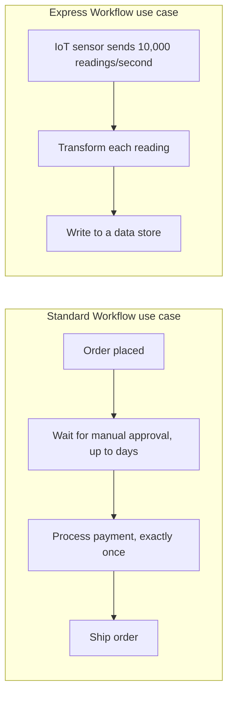

# 26 - AWS Step Function Type

> Goal: understand the **Standard** vs. **Express** workflow choice the [Step Functions Lab](25-Step-Functions-Lab-HandsOn.md) note made without fully explaining — and why picking correctly matters, since it can't be changed after creation.

---

## 1. The one fact to remember first

**You cannot change a state machine's type after creating it.** Choosing between Standard and Express happens once, at creation time (exactly where the [Step Functions Lab](25-Step-Functions-Lab-HandsOn.md) note's Section 3 picked **Standard**) — getting it wrong means deleting and recreating the state machine, not just flipping a setting.

---

## 2. Standard vs. Express — side by side

| | **Standard Workflows** | **Express Workflows** |
|---|---|---|
| **Max duration** | Up to **1 year** | Up to **5 minutes** |
| **Execution model** | **Exactly-once** — a task never runs more than once unless you configured a retry | **At-least-once** — a task *could* run more than once in rare failure scenarios |
| **Execution history** | Full, detailed visual history for every execution, kept for 90 days | Logged to CloudWatch Logs instead (optional, must be enabled) — not the same built-in visual history |
| **Pricing model** | Billed per **state transition** | Billed by **number of executions, duration, and memory used** |
| **Best for** | Long-running, auditable, must-be-precise workflows (order processing, approval chains) | High-volume, short-duration, high-throughput event processing (IoT data, streaming transformations) |

---

## 3. "Exactly-once" vs. "at-least-once" — why this matters more than it sounds

This is the single most important technical distinction, and it directly affects what kind of logic is safe to put in a workflow's steps:

> 🧠 **Simple analogy**: Standard's exactly-once guarantee is like a **certified mail receipt** — you get proof it was delivered exactly once, no duplicates. Express's at-least-once model is more like a **regular text message during a spotty connection** — it's very likely delivered exactly once, but in a rare failure/retry scenario, the same message could technically arrive twice.

**Practical consequence**: if a Task state in an Express workflow could theoretically run twice for the same execution, any step with a **side effect that isn't safe to repeat** (e.g. "charge a customer's credit card") needs to be written defensively (idempotently) to handle that possibility. A Standard workflow's exactly-once guarantee means you don't have to think about that risk at all.

---

## 4. Architecture & workflow — where each fits

The order-processing example from the [AWS Step Functions](24-AWS-Step-Functions-Intro.md) and [Step Functions Lab](25-Step-Functions-Lab-HandsOn.md) notes is a textbook **Standard** use case — it's the kind of workflow where "exactly once" genuinely matters (you don't want to charge a payment twice), and its full visual execution history is exactly what you'd want to be able to look back on for any specific past order.

---

## 5. A third option worth knowing: combining both

Real architectures sometimes use **both types together** — a Standard workflow can invoke an Express workflow as one of its steps, getting Express's speed/cost-efficiency for a high-volume sub-task while keeping the overall workflow's long-running, auditable Standard properties for everything else. This isn't something the [Step Functions Lab](25-Step-Functions-Lab-HandsOn.md) note's simple demo needed, but it's a real, testable pattern worth knowing exists.

> 🎯 **Exam tip:** "long-running (hours/days), needs exactly-once guarantees, needs a full audit trail of every execution" → **Standard**. "High-volume, short-duration (under 5 minutes), IoT/streaming-style event processing where slightly-more-than-once execution is acceptable" → **Express**. The word **"audit"** or **"exactly once"** almost always signals Standard; the word **"high-throughput"** or **"IoT"** almost always signals Express.

---

## 6. Recap

- Standard and Express are chosen **once, at creation** — this can't be changed afterward.
- **Standard**: up to 1 year duration, exactly-once execution, full built-in visual execution history — best for long-running, auditable, must-be-precise workflows.
- **Express**: up to 5 minutes duration, at-least-once execution (steps must tolerate possible duplicate runs), history via CloudWatch Logs instead — best for high-volume, short-lived event processing.
- The two types can even be combined, with a Standard workflow invoking an Express one as a sub-step.
- This closes the entire Lambda folder: the [Roadmap](01-AWS-Lambda-Roadmap.md), [Introduction to AWS Lambda](02-Introduction-to-AWS-Lambda.md), [Serverless With Lambda](03-Serverless-With-Lambda.md), and [Lambda vs EC2](04-Lambda-vs-EC2.md) notes covered the fundamentals; the [Create Your First Lambda Function](05-Create-First-Lambda-Function-HandsOn.md), [Lambda Blueprints](06-Lambda-Blueprints.md), and [Lambda Container Images](07-Lambda-Container-Images.md) notes covered getting code in; the [Lambda Execution Role](08-Lambda-Execution-Role.md), [Lambda EC2 Automation hands-on demo](09-Lambda-EC2-Automation-HandsOn.md), and [Lambda Triggers](10-Lambda-Triggers.md) notes covered permissions and invocation; the [Introduction to Amazon Q](11-Introduction-to-Amazon-Q.md), [Amazon Q Developer](12-Amazon-Q-Developer.md), [Amazon Q vs ChatGPT](13-Amazon-Q-vs-ChatGPT.md), and [Lambda + Amazon Q](14-Lambda-Plus-Amazon-Q.md) notes covered AI-assisted development; the [AWS Lambda Execution Environment](15-Lambda-Execution-Environment.md), [Version Control In AWS Lambda](16-Lambda-Versions.md), [Aliases In AWS Lambda](17-Lambda-Aliases.md), [Understanding AWS Lambda Concurrency](18-Lambda-Concurrency.md), [Understanding Reserved Concurrency](19-Lambda-Reserved-Concurrency.md), and [Configure Provisioned Concurrency in Lambda](20-Lambda-Provisioned-Concurrency-HandsOn.md) notes covered how Lambda actually runs and scales; the [Lambda Layers](21-Lambda-Layers.md), [Lambda Layers Lab](22-Lambda-Layers-Lab-HandsOn.md), and [Lambda VPC Connectivity](23-Lambda-VPC-Connectivity-HandsOn.md) notes covered code sharing and private networking; and the [AWS Step Functions](24-AWS-Step-Functions-Intro.md), [Step Functions Lab](25-Step-Functions-Lab-HandsOn.md) notes and this note covered orchestrating multiple functions together.

### Sources
- [Choosing workflow type in Step Functions — AWS docs](https://docs.aws.amazon.com/step-functions/latest/dg/choosing-workflow-type.html)
- [Standard vs. Express Workflows — AWS docs](https://docs.aws.amazon.com/step-functions/latest/dg/concepts-standard-vs-express.html)
