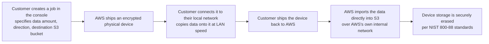

# 01 - AWS Snowball

> Goal: understand the problem Snowball existed to solve — moving genuinely large amounts of data faster than a network connection can — and be upfront about where this specific service actually stands today, since it's mid-retirement as of this writing. The underlying *concept* (physical data transfer beats network transfer past a certain data size) is still very much SAA-C03-testable; the specific product is not something you can actually spin up as a new customer anymore.

---

## 1. The problem: some data is too big to move over the internet, practically speaking

Imagine a company with **100 TB** of archival data sitting on-premises that needs to move into S3. Even on a fast, dedicated **1 Gbps** connection, transferring 100 TB takes **over 9 days** of continuous, uninterrupted transfer — and that's the *optimistic* case, assuming zero network issues, zero contention with other traffic, and a connection that stays saturated the entire time. Real-world transfers are usually far slower than the theoretical maximum.

**AWS Snowball** solved this with a genuinely simple idea: **ship a physical, rugged, encrypted storage device to the customer**, let them load it with data locally (at local network speeds, not internet speeds), ship it back to AWS, and AWS copies the data into S3 directly from the device over their own internal network.

> 🧠 **Simple analogy**: this is the "sneakernet" idea taken seriously — sometimes it's genuinely faster to physically drive a hard drive across town than to upload it, and at a big enough scale, the same logic applies to shipping a device across a country instead of pushing bytes through an internet connection.

---

## 2. Architecture & workflow — how a Snowball job worked

The device itself was also **tamper-evident and encrypted with a customer-managed KMS key** the whole time — the [Key Management Service](../Security-Services/02-AWS-Key-Management-Service-KMS.md) note's Section 2 envelope-encryption idea applied physically here too: even a lost or stolen device in transit wouldn't expose readable data.

---

## 3. The device lineup, and the exam-relevant "when does this make sense" math

| Device | Approx. capacity | Typical use case |
|---|---|---|
| **Snowcone** | ~8 TB | Small, portable, edge locations with limited space/power |
| **Snowball Edge Storage Optimized** | ~210 TB | Large-scale bulk data migration — the workhorse of the family |
| **Snowball Edge Compute Optimized** | Similar storage, plus real onboard compute | Edge computing/data preprocessing *before* shipping — running actual EC2-like workloads at a remote site with no reliable connectivity |
| **Snowmobile** | Up to 100 **petabytes**, an actual shipping container on a truck | Truly massive, one-time, data-center-scale migrations |

> 🎯 **Exam tip**: the core testable idea is a **break-even calculation** — "given our available network bandwidth and the amount of data, would physical transfer via Snowball finish sooner than a network transfer?" AWS's own online **Snowball data transfer time calculator** answers exactly this. As a rule of thumb: the more data and the slower/less reliable the network, the more physical transfer wins — a small amount of data on a fast, reliable link almost always favors staying online.

---

## 4. ⚠️ Where this service actually stands today — verified, not assumed

This is genuinely important to know accurately, not just historically:

- **AWS Snowmobile** was retired in **March 2024** and is no longer offered at all.
- **AWS Snowcone** was discontinued for new orders on **November 12, 2024**, with support for existing customers ending **November 12, 2025**.
- **AWS closed the entire Snow Family to new customers on November 7, 2025** — as of today, if you don't already have an existing Snowball relationship with AWS, **you cannot order a device**, full stop.
- AWS has announced it will **discontinue Snowball support entirely in all commercial Regions on December 31, 2026** — after that date, the Snow console and all Snowball resources become inaccessible, even for existing customers.

AWS's own stated replacement path for the two things Snowball used to do:
- **Online data transfer at scale** → **AWS DataSync** (this note's hands-on demo pivots here — it's the real, currently-usable tool).
- **Physical transfer for cases that still need it** → **AWS Data Transfer Terminal**, a newer physical drop-off-location model, rather than a device shipped to your own site.

> 🧠 This is exactly the kind of real-world drift worth calling out plainly rather than glossing over: the underlying **exam concept** ("physical transfer can beat network transfer at large enough scale") remains completely valid and testable — but if you're setting this up in a real, current AWS account today, Snowball itself is not an option available to you, and the practical skill worth actually building is DataSync instead.

---

## 5. Recap

- Snowball's core value was simple: past a certain data size, physically shipping a device is faster and more reliable than pushing the same data over a network connection.
- The device lineup spanned from **Snowcone** (small/portable) through **Snowball Edge** (the ~210 TB workhorse, in both storage- and compute-optimized variants) up to the now-retired **Snowmobile** (100 PB, truck-scale).
- As of today, **Snowball is closed to new customers** (since November 7, 2025) and scheduled for **full discontinuation on December 31, 2026** — Snowmobile and Snowcone are already gone entirely.
- The exam concept survives the product's retirement: know **when** physical beats network transfer, even though the specific device you'd reach for has changed.
- Next: the [AWS DataSync hands-on demo](01.01-AWS-DataSync-Demo.md) — the real, currently-usable tool for large-scale data transfer, built and tested end to end.

### Sources
- [What is AWS Snowball? — AWS docs](https://docs.aws.amazon.com/snowball/latest/developer-guide/whatissnowball.html)
- [AWS Snowball pricing and device options — AWS](https://aws.amazon.com/snowball/)
- [What is AWS DataSync? — AWS docs](https://docs.aws.amazon.com/datasync/latest/userguide/what-is-datasync.html)
- [AWS Data Transfer Terminal — AWS](https://aws.amazon.com/data-transfer-terminal/)
