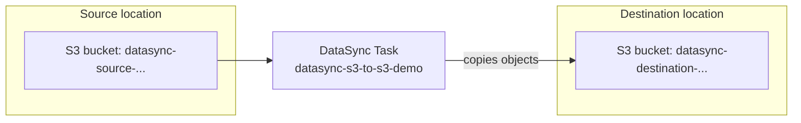

# 01.01 - Hands-On Demo: Syncing Data Between S3 Buckets with AWS DataSync

> Goal: build a real, working AWS DataSync task — the actual, currently-available tool AWS points to now that [Snowball](01-AWS-Snowball.md) is closed to new customers — and watch it genuinely copy files from one S3 bucket to another. Entirely via the **AWS Console**, no CLI, and no physical hardware required.

---

## 1. What you're building

DataSync doesn't require a physical device or an installed agent for this specific case — **S3-to-S3 transfers use DataSync's managed service directly**, no agent needed at all (agents are only required when one side of the transfer is an on-premises/self-managed storage system DataSync can't reach natively, like an on-prem NFS share).

---

## 2. Step 1 — Create the two buckets

1. **S3 console** → **Create bucket** → name it `datasync-source-<your-name-or-date>` → leave defaults → **Create bucket**.
2. Upload a couple of small test files into it (anything — a few `.txt` files are fine).
3. **Create bucket** again → name it `datasync-destination-<your-name-or-date>` → leave defaults → **Create bucket**. Leave it empty — this is what proves the sync actually happened.

---

## 3. Step 2 — Create the source location

1. **DataSync console** → left nav → **Data transfer** → **Locations** → **Create location**.
2. **Location type**: **Amazon S3** → **General purpose bucket**.
3. **S3 URI**: choose `datasync-source-<...>` (leave the prefix blank to sync the whole bucket).
4. **S3 storage class when used as a destination**: leave at the default (irrelevant here since this bucket is only ever the source).
5. **IAM role**: **Autogenerate** — DataSync creates a scoped role with exactly the permissions needed to read this bucket, no manual IAM policy writing required.
6. **Create location**.

---

## 4. Step 3 — Create the destination location

1. **Create location** again.
2. **Location type**: **Amazon S3** → **General purpose bucket**.
3. **S3 URI**: choose `datasync-destination-<...>`.
4. **S3 storage class when used as a destination**: **S3 Standard**.
5. **IAM role**: **Autogenerate** again — a separate role, scoped to write permissions on this second bucket.
6. **Create location**.

---

## 5. Step 4 — Create and run the task

1. **Data transfer** → **Tasks** → **Create task**.
2. **Source location**: select the source location from Section 3.
3. **Destination location**: select the destination location from Section 4.
4. **Next** → leave the default transfer settings (verification mode, schedule: **Run on demand**) → **Next**.
5. **Task name**: `datasync-s3-to-s3-demo` → **Next** → review → **Create task**.
6. Open the new task → **Start** → **Start with defaults**.
7. Watch the task's status move from **Launching** → **Preparing** → **Transferring** → **Verifying** → **Success**.

---

## 6. Step 5 — Confirm it actually worked

1. **S3 console** → open `datasync-destination-<...>`.
2. Confirm the same files from the source bucket now exist here — real, verifiable, transferred data, not a status message you're just trusting.
3. Back on the DataSync task's **History** tab, check the run's summary: **Files transferred**, **Data transferred**, and duration — the same kind of concrete metrics a real large-scale migration job would report.

---

## 7. Step 6 — Connect this back to the Snowball break-even idea

Re-open the [Snowball](01-AWS-Snowball.md) note's Section 3 exam tip mentally: this demo used DataSync over a normal network path because the data involved was tiny. At genuinely large scale (many TB, unreliable/limited bandwidth), the same underlying transfer problem is what used to justify shipping a Snowball device — today, AWS's guidance for that scale is either a faster/dedicated network path (e.g. **AWS Direct Connect** feeding into DataSync) or **AWS Data Transfer Terminal** for physical transfer, rather than a device shipped to your own premises.

---

## 8. Troubleshooting

| Symptom | Likely cause |
|---|---|
| Location creation fails with an S3 access error | The **Autogenerate** IAM role step didn't complete, or the bucket has a restrictive bucket policy blocking the new DataSync role — the [Key Management Service](../Security-Services/02-AWS-Key-Management-Service-KMS.md) note's Section 4 same "check the specific resource's own permissions" instinct applies here too |
| Task stays in **Launching** for a long time | Normal for the very first run — DataSync provisions transfer capacity behind the scenes; subsequent runs are typically faster to start |
| Destination bucket shows files, but the task reports errors | Check the task's **History** tab for the specific object(s) that failed — often a prefix-naming issue (the [Configuring AWS DataSync transfers with Amazon S3](https://docs.aws.amazon.com/datasync/latest/userguide/create-s3-location.html) doc flags that prefixes can't start with `/` or contain `//`) |

---

## 9. Cleanup

1. **DataSync console** → delete the `datasync-s3-to-s3-demo` task, then both locations.
2. **IAM console** → delete the two auto-generated DataSync roles (named something like `AWSDataSyncS3...`).
3. **S3 console** → empty and delete both `datasync-source-<...>` and `datasync-destination-<...>` buckets.

---

## 10. Recap

- **S3-to-S3 DataSync transfers need no installed agent at all** — agents are only required for storage systems DataSync can't reach as a native AWS service (on-premises NFS/SMB, for example).
- **Autogenerate** on each location lets DataSync create its own correctly-scoped IAM role per bucket, rather than you hand-writing S3 permission policies.
- A **Task** is the reusable pairing of a source and destination location plus transfer settings — run on demand here, but schedulable for recurring syncs in a real production use case.
- This is the practical, currently-available skill that replaces what [Snowball](01-AWS-Snowball.md) used to cover for network-based transfers, now that Snowball itself is closed to new customers.
- Next: the [AWS Server Migration Service (SMS)](02-AWS-Server-Migration-Service-SMS.md) note — another migration-focused service with its own, even more complete, retirement story.

### Sources
- [What is AWS DataSync? — AWS docs](https://docs.aws.amazon.com/datasync/latest/userguide/what-is-datasync.html)
- [Getting started with AWS DataSync — AWS docs](https://docs.aws.amazon.com/datasync/latest/userguide/getting-started.html)
- [Configuring AWS DataSync transfers with Amazon S3 — AWS docs](https://docs.aws.amazon.com/datasync/latest/userguide/create-s3-location.html)
