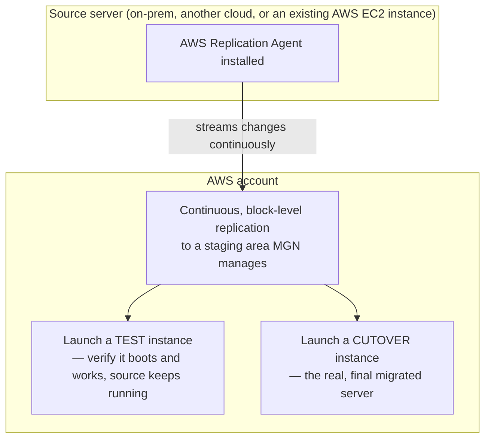

# 02 - AWS Server Migration Service (SMS)

> Goal: understand the "lift-and-shift" server migration problem SMS was built to solve, then pivot immediately to the tool that actually replaced it — **AWS Application Migration Service (MGN)** — since SMS itself has been fully retired for several years now. This note stays useful for the underlying exam concept (agent-based, replicated, cutover-based server migration) while being explicit about which specific product name is actually current.

---

## 1. The problem: moving a running server to AWS without a long outage

Imagine an on-premises (or another cloud's) virtual machine running a production application. The naive way to "migrate" it — take a snapshot, copy it to AWS, launch it there — means the source server has to **stop changing** at some point, and everything that happened between that snapshot and the actual cutover is lost unless you very carefully coordinate a maintenance window. For anything business-critical, a long, risky cutover window is a real problem.

**Server migration tools** solve this with **continuous replication**: install a small agent on the source server, have it continuously stream changes to AWS in the background while the source server keeps running normally, and only require a short **cutover window** — often just minutes — at the very end, once AWS already has an (almost) fully up-to-date copy.

---

## 2. ⚠️ Where AWS Server Migration Service actually stands — verified, not assumed

This needs to be said plainly, the same way the [Snowball](01-AWS-Snowball.md) note flagged its own retirement: **AWS discontinued AWS Server Migration Service (SMS) on March 31, 2022.** AWS stopped feature development on it well before that and has, for years now, directed everyone toward its replacement instead.

If you see "SMS" referenced in older study material, treat it as **historical/legacy context** for understanding *why* the newer tool exists and what problem it inherited — not as a current, usable AWS console feature. **Every hands-on step in this project from here on targets the actual replacement.**

---

## 3. What replaced it: AWS Application Migration Service (MGN)

**AWS Application Migration Service (MGN)** is AWS's current, actively developed "lift-and-shift" migration tool — and as of AWS's most recent branding, it's offered under the broader **AWS Transform** umbrella as **"AWS Transform MGN"** in the console, though the underlying mechanics (and its more common name on the exam and in most documentation) are still simply **MGN**.

The key technical improvement over the old SMS approach: **SMS used periodic incremental snapshots** (meaning some data lag between snapshots, and longer cutover windows to catch up), while **MGN uses continuous, block-level replication** — closer to real-time, with cutover windows typically measured in **minutes**, not hours.

---

## 4. The core MGN workflow

| Stage | What happens |
|---|---|
| **1. Install the Replication Agent** | A small agent runs on the source server, identifies its disks, and starts streaming block-level changes to AWS |
| **2. Continuous replication** | The source server keeps running completely normally the entire time — nothing about it changes or slows down meaningfully |
| **3. Launch a Test instance** | MGN launches a real EC2 instance from the current replicated state, **without** stopping replication or touching the source — verify the migrated server actually boots and works correctly |
| **4. Cutover** | When ready, launch the final Cutover instance from the most up-to-date replicated data — this is the actual, short-window moment the source server's role ends and the new AWS-hosted server takes over |
| **5. Archive the source server** | Once cutover is confirmed successful, the source server entry can be archived in MGN's dashboard |

> 🎯 **Exam tip**: "minimize downtime during a lift-and-shift migration" or "test a migrated server without affecting the still-running source" → **MGN's Test instance capability** is exactly this. If a scenario instead emphasizes **refactoring/replatforming** an application rather than just moving it as-is, that's a different conversation (AWS's broader modernization tooling), not a straight lift-and-shift.

---

## 5. Recap

- **AWS SMS was discontinued on March 31, 2022** — it's historical/legacy context now, not a current console feature.
- **AWS Application Migration Service (MGN)** — now surfaced in the console as **AWS Transform MGN** — is the current, actively developed replacement, using continuous block-level replication instead of SMS's older periodic-snapshot approach.
- The core workflow is: install the **Replication Agent** on a source server → continuous replication → launch a **Test** instance to verify → **Cutover** to the real migrated server, with a short final window.
- Next: the [MGN hands-on demo](02.01-AWS-MGN-Migration-Demo.md) — actually installing the replication agent on a real EC2 instance (used here to stand in for an external source server) and launching a test instance from it.

### Sources
- [What is AWS Application Migration Service? — AWS docs](https://docs.aws.amazon.com/mgn/latest/ug/what-is-application-migration-service.html)
- [AWS Server Migration Service (GovCloud legacy reference) — AWS docs](https://docs.aws.amazon.com/govcloud-us/latest/UserGuide/govcloud-sms.html)
- [Installing the AWS Replication Agent — AWS docs](https://docs.aws.amazon.com/mgn/latest/ug/agent-installation.html)
