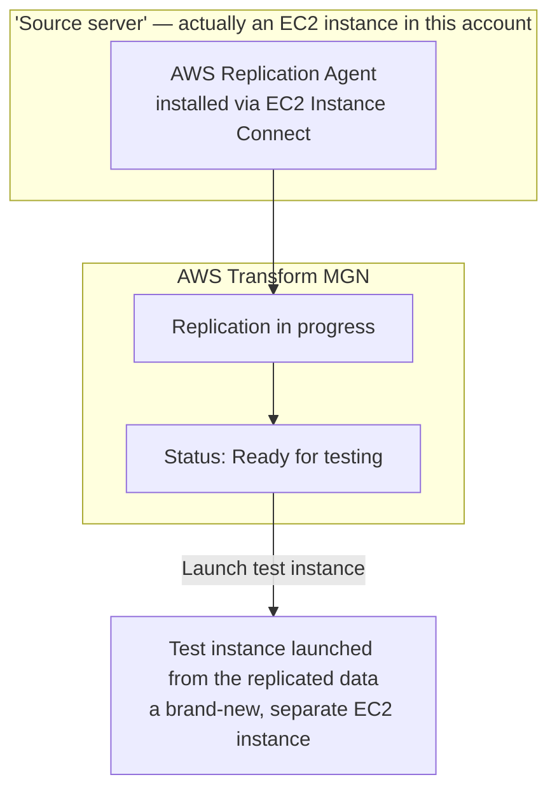

# 02.01 - Hands-On Demo: Replicating and Test-Launching a Server with AWS MGN

> Goal: install the real AWS Replication Agent on a real server and watch AWS Application Migration Service (MGN) replicate it, then launch a genuine **Test instance** from that replicated data — proving the source server never had to stop running for any of this. Since this project has no real external on-premises server available, an **EC2 instance in this same account stands in as the "source server"** — a legitimate, AWS-documented way to learn MGN's mechanics without needing outside infrastructure. Every AWS-side action is via the **AWS Console**; the one non-console step is running the agent installer's shell command on the source server itself, via the console's own **EC2 Instance Connect** browser terminal — not a locally installed CLI.

---

## 1. What you're building



---

## 2. Step 1 — Launch a throwaway "source server" EC2 instance

1. **EC2 console** → **Launch instances**.
2. **Name**: `mgn-demo-source-server`.
3. **Application and OS Images**: **Amazon Linux 2023 AMI**.
4. **Instance type**: `t2.micro`.
5. **Key pair**: **Proceed without a key pair** — this demo connects via **EC2 Instance Connect** (browser-based), no downloaded key needed.
6. **Network settings**: leave defaults, just ensure **Auto-assign public IP** is **Enabled** (needed for EC2 Instance Connect).
7. **Launch instance**.

---

## 3. Step 2 — Grant it the IAM role MGN needs

Since the "source" is an EC2 instance in the **same account**, MGN can use an **instance profile** instead of manually generated access keys — genuinely simpler than the credential-copying flow MGN otherwise requires for real external servers:

1. **IAM console** → **Roles** → **Create role** → **Trusted entity type**: **AWS service** → **Use case**: **EC2** → **Next**.
2. **Add permissions** → search for and attach **`AWSApplicationMigrationServiceEc2InstancePolicy`** (an AWS managed policy specifically for this exact scenario).
3. **Role name**: `mgn-demo-source-instance-role` → **Create role**.
4. **EC2 console** → select `mgn-demo-source-server` → **Actions** → **Security** → **Modify IAM role**.
5. **IAM role**: select `mgn-demo-source-instance-role` → **Update IAM role**.

---

## 4. Step 3 — Initialize MGN in this Region (first-time setup)

1. **AWS Transform MGN console** (search "Application Migration Service" or "MGN" in the console search bar) → if this is the first time using MGN in this Region, you'll be prompted to initialize the service, or find **Service settings** → **Replication settings** → **Reinitialize service permissions**.
2. Confirm — this creates the default service-linked IAM roles MGN needs to operate in this account/Region. You only need to do this once per Region.

---

## 5. Step 4 — Connect to the source instance and install the Replication Agent

1. **EC2 console** → select `mgn-demo-source-server` → **Connect** → **EC2 Instance Connect** tab → **Connect**. This opens a real terminal session to the instance, directly in your browser — no SSH key, no local terminal.
2. In that browser terminal, download the installer (replace `ap-south-1` with your own Region if different):
   ```bash
   wget -O ./aws-replication-installer-init https://aws-application-migration-service-ap-south-1.s3.ap-south-1.amazonaws.com/latest/linux/aws-replication-installer-init
   ```
3. Run it — because the instance already has the IAM role from Section 3 attached, **no access keys need to be entered**; the installer detects and uses the instance profile automatically:
   ```bash
   sudo chmod +x aws-replication-installer-init
   sudo ./aws-replication-installer-init --region ap-south-1 --no-prompt
   ```
4. The installer identifies the instance's root disk, downloads the actual replication agent, and registers the server with MGN. Note the **source server ID** it prints at the end.

---

## 6. Step 5 — Watch replication happen

1. **AWS Transform MGN console** → **Source servers**. Your instance should appear, showing a status like **Initial sync in progress**.
2. Wait for the status to reach **Ready for testing** — for a tiny `t2.micro` root volume, this is typically fast (minutes, not hours), since there's very little actual data to replicate.
3. Click into the source server to see replication progress details — lag time, data replicated, and the point-in-time snapshots MGN is maintaining, all without the source instance's own performance being noticeably affected.

---

## 7. Step 6 — Launch a Test instance

1. Select the source server → **Test and Cutover** → **Launch test instances**.
2. Confirm. MGN launches a **brand-new EC2 instance** built from the replicated data — this is a completely separate instance from `mgn-demo-source-server`, which keeps running the entire time, untouched.
3. Once launched, the source server's status updates to reflect a test is in progress.
4. **EC2 console** → find the new test instance (named something like `mgn-demo-source-server` with an MGN-managed suffix) → confirm it's **Running** and passes status checks — direct, concrete proof the replicated copy is a genuinely bootable, working server, not just a data blob.
5. Back in MGN → **Test and Cutover** → **Finalize test** — marks the test as complete and returns the source server to a normal replicating state, ready for an eventual real cutover.

> 🧠 This **Test** capability is the single most exam-relevant MGN feature: verifying a migrated server actually works, **without** any impact to the still-running original — directly answering the [Server Migration Service](02-AWS-Server-Migration-Service-SMS.md) note's Section 4 table.

---

## 8. Step 7 — Cutover (conceptual — not executed in this demo)

A real migration's final step, **Cutover**, works identically to launching a Test instance, except it's treated as the **permanent** replacement — the moment you'd actually redirect real traffic/DNS to the new instance and decommission the original. This demo deliberately stops at **Test**, since there's no real production traffic to cut over for a throwaway lab instance, and Test alone is what demonstrates MGN's core value.

---

## 9. Troubleshooting

| Symptom | Likely cause |
|---|---|
| Installer prompts for AWS Access Key / Secret Access Key instead of using the instance role automatically | The IAM role from Section 3 wasn't actually attached before running the installer, or it's missing the `AWSApplicationMigrationServiceEc2InstancePolicy` policy — recheck Section 3, Steps 4-5 |
| `wget` fails / installer download times out | Wrong Region in the URL (Section 5, Step 2) — the installer URL is Region-specific, must match the Region you're replicating **into** |
| Source server stuck on **Initial sync in progress** for a long time | Expected briefly for the first sync; if it stalls for a very long time, check the instance's security group allows outbound HTTPS (443) — the agent needs to reach MGN's endpoints |
| Test instance launch fails | MGN service initialization (Section 4) wasn't completed for this Region, or replication hadn't actually reached **Ready for testing** yet |

---

## 10. Cleanup

1. **AWS Transform MGN console** → source server → **Test and Cutover** → terminate any remaining test instances if one is still running.
2. Select the source server → **Disconnect from AWS Transform MGN** (stops replication and removes it from the dashboard).
3. **EC2 console** → terminate `mgn-demo-source-server` and any leftover MGN-launched test instance.
4. **IAM console** → delete the `mgn-demo-source-instance-role` role.

---

## 11. Recap

- An EC2 instance in the **same account** can stand in as an MGN "source server" for learning purposes — and genuinely simplifies credential handling, since an **instance profile** replaces the manual access-key flow real external servers require.
- The **Replication Agent**, once installed, streams continuous block-level changes in the background — the source server's normal operation is unaffected.
- **Launching a Test instance** is the core, safe, repeatable way to verify a migration will actually work — a completely separate EC2 instance, with zero impact on the still-running source, directly answering why MGN's continuous-replication model beats older periodic-snapshot approaches like the original SMS.
- **Cutover** uses the identical mechanism as Test, just treated as the final, real switch-over — this demo stopped short of it deliberately, since Test alone demonstrates the concept fully.

### Sources
- [What is AWS Application Migration Service? — AWS docs](https://docs.aws.amazon.com/mgn/latest/ug/what-is-application-migration-service.html)
- [Installing the AWS Replication Agent on Linux servers — AWS docs](https://docs.aws.amazon.com/mgn/latest/ug/linux-agent.html)
- [Generating the required AWS credentials — AWS docs](https://docs.aws.amazon.com/mgn/latest/ug/credentials.html)
- [Testing and cutting over source servers — AWS docs](https://docs.aws.amazon.com/mgn/latest/ug/Test-and-Cutover.html)
