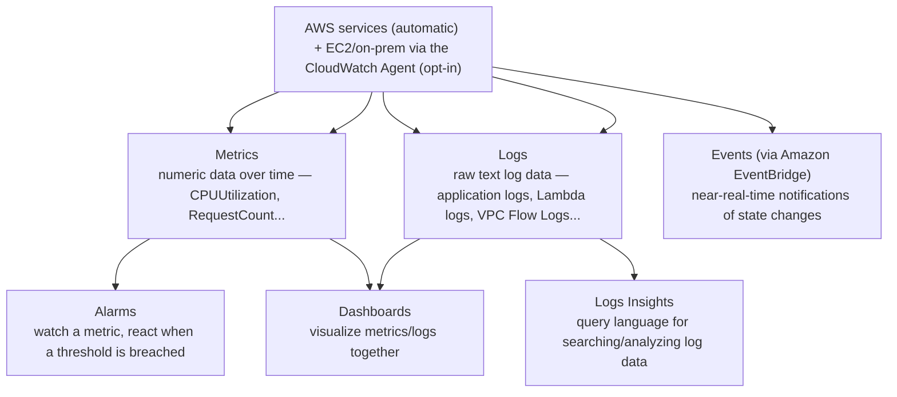

# 01 - Amazon CloudWatch Introduction

> Goal: understand CloudWatch as AWS's central **observability** service — the one place metrics, logs, alarms, and events from nearly every other AWS service end up — before diving into any of its individual pieces (Agent, Alarms, Logs, Insights, Investigations) in later notes.

---

## 1. The problem: how do you know what your infrastructure is actually doing?

Once resources are running in AWS — EC2 instances, databases, load balancers, Lambda functions — a genuinely important question follows immediately: **is it healthy, and how would you know if it wasn't?** Without a monitoring layer, you'd be guessing, or worse, finding out from a user complaint. **Amazon CloudWatch** is AWS's answer: it continuously collects operational data — numeric **metrics**, textual **logs**, and service **events** — from almost every AWS service automatically, stores it, lets you visualize it, and lets you react to it.

> 🧠 **Simple analogy**: think of CloudWatch as the dashboard and black-box recorder for your entire AWS account — the dashboard gauges are **metrics**, the black-box transcript is **logs**, and the warning lights that turn on when a gauge crosses a red line are **alarms**.

---

## 2. Architecture & workflow — the four pillars

---

## 3. The four core building blocks

| Building block | What it is |
|---|---|
| **Metrics** | Time-ordered numeric data points — e.g. an EC2 instance's `CPUUtilization`, an ALB's `RequestCount`. Most AWS services publish their own metrics automatically, at no extra setup cost, typically every 5 minutes (1 minute if **detailed monitoring** is enabled). |
| **Logs** | Raw, timestamped text — application output, Lambda function output, VPC Flow Logs, and more, organized into **log groups** and **log streams**. Covered in full in the [CloudWatch Logs](04-CloudWatch-Logs.md) note. |
| **Alarms** | Watch one metric (or a math expression across metrics) and change state — `OK`, `ALARM`, `INSUFFICIENT_DATA` — when a defined threshold is breached, optionally triggering a notification or automated action. Covered in the [CloudWatch Alarms](03-CloudWatch-Alarms.md) note. |
| **Dashboards** | Customizable visual pages combining multiple metrics/logs widgets into one view — the thing you'd actually leave open on a monitor during an incident. |

---

## 4. What's collected automatically vs. what needs the Agent

| | Collected automatically, no setup | Needs the [CloudWatch Agent](02-CloudWatch-Agent.md) |
|---|---|---|
| **Examples** | EC2 `CPUUtilization`, `NetworkIn/Out`, `DiskReadOps`; RDS `DatabaseConnections`; ALB `RequestCount` | EC2 **memory usage**, **disk space usage** (the OS, not the hypervisor, actually knows these), and any **application log files** or **custom application metrics** |
| **Why the difference** | These come from the **hypervisor level** — AWS can see them without touching the instance's operating system | Memory/disk usage require software running **inside** the instance's OS to actually read and report them — AWS has no visibility into what's happening inside a guest OS by default |

> 🎯 **Exam tip**: "EC2 memory utilization isn't showing up in CloudWatch" is one of the most common exam scenarios in this whole topic — the fix is always **install the CloudWatch Agent**, never "wait longer" or "enable detailed monitoring" (detailed monitoring only changes metric *frequency*, not *which* metrics exist).

---

## 5. Recap

- CloudWatch is AWS's central observability service: **metrics** (numeric), **logs** (text), **alarms** (react to metrics), and **dashboards** (visualize both) are its four core pieces.
- Most AWS service metrics are collected **automatically** at the hypervisor level; anything that requires visibility **inside** an instance's OS (memory, disk usage, application logs) needs the **CloudWatch Agent** installed.
- Every other note in this folder is really just a deep dive into one of the four building blocks introduced here.
- Next: the [CloudWatch monitoring hands-on demo](01.01-CloudWatch-Monitoring-Demo.md) — exploring real, automatically-collected EC2 metrics and building a first dashboard.

### Sources
- [What is Amazon CloudWatch? — AWS docs](https://docs.aws.amazon.com/AmazonCloudWatch/latest/monitoring/WhatIsCloudWatch.html)
- [Amazon CloudWatch concepts — AWS docs](https://docs.aws.amazon.com/AmazonCloudWatch/latest/monitoring/cloudwatch_concepts.html)
- [Amazon EC2 metric dimensions — AWS docs](https://docs.aws.amazon.com/AWSEC2/latest/UserGuide/viewing_metrics_with_cloudwatch.html)
