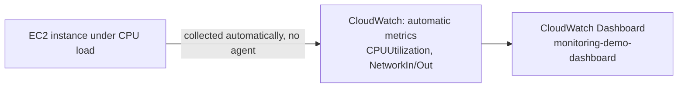

# 01.01 - Hands-On Demo: Exploring Real EC2 Metrics and Building a Dashboard

> Goal: put a real EC2 instance under load, watch its automatically-collected metrics move in near-real-time, and build a small CloudWatch dashboard from them — all before anything about the Agent or Alarms is needed. Entirely via the **AWS Console**.

---

## 1. What you're building



---

## 2. Step 1 — Launch a small EC2 instance

1. **EC2 console** → **Launch instances**.
2. **Name**: `cloudwatch-demo-instance`.
3. **AMI**: **Amazon Linux 2023**.
4. **Instance type**: `t2.micro`.
5. **Key pair**: **Proceed without a key pair** — you'll connect via **EC2 Instance Connect**.
6. Leave networking defaults (ensure **Auto-assign public IP** is enabled).
7. **Launch instance**, and wait for **Running**.

---

## 3. Step 2 — Generate real CPU load

1. **EC2 console** → select `cloudwatch-demo-instance` → **Connect** → **EC2 Instance Connect** → **Connect**.
2. In the browser terminal, install and run a small CPU-burning tool for a few minutes:
   ```bash
   sudo dnf install -y stress
   stress --cpu 1 --timeout 300
   ```
   This pins one vCPU near 100% for 5 minutes — enough to see a real, visible spike in the metric shortly.

---

## 4. Step 3 — Watch the metric move

1. **CloudWatch console** → **Metrics** → **All metrics** → **EC2** → **Per-Instance Metrics**.
2. Find `cloudwatch-demo-instance`'s **CPUUtilization** → check its box to graph it.
3. Set the graph's time range to **1h**, and the period to **1 Minute** (**Statistics: Average**) → watch the line climb toward 100% while `stress` is running, and fall back down after it finishes.
4. Also graph **NetworkIn** and **NetworkOut** for the same instance — even idle, these aren't flat zero, since the OS and any background updates still generate a small baseline.

> 🧠 No agent, no configuration, no waiting for software to be installed — this data existed the moment the instance launched, because AWS collects these specific metrics from the **hypervisor**, not from inside the instance's OS.

---

## 5. Step 4 — Build a dashboard from what you just saw

1. **CloudWatch console** → **Dashboards** → **Create dashboard** → **Dashboard name**: `monitoring-demo-dashboard` → **Create dashboard**.
2. Choose **Line** widget → **Next**.
3. Select the same **CPUUtilization**, **NetworkIn**, **NetworkOut** metrics for `cloudwatch-demo-instance` → **Create widget**.
4. **Save dashboard**. This page is now a real, reusable "at a glance" view — the same kind of page a team would leave open during an incident.

---

## 6. Troubleshooting

| Symptom | Likely cause |
|---|---|
| `CPUUtilization` graph looks flat even during the `stress` run | Wrong time range/period selected on the graph, or too much time already passed — CloudWatch's standard resolution is one data point per **5 minutes** unless detailed monitoring is enabled, so a very short load spike can be smoothed out |
| Instance doesn't appear under **Per-Instance Metrics** at all | The instance was launched very recently — allow a few minutes for the first metric data point to be published |

---

## 7. Cleanup

1. **CloudWatch console** → **Dashboards** → delete `monitoring-demo-dashboard`.
2. **EC2 console** → terminate `cloudwatch-demo-instance`.

---

## 8. Recap

- EC2's core metrics (`CPUUtilization`, `NetworkIn/Out`, disk I/O ops) are visible in CloudWatch **immediately**, with zero configuration, because AWS collects them at the hypervisor level.
- A **Dashboard** is just a saved, reusable collection of metric widgets — genuinely simple to build once you already know which metrics matter.
- Next: the [CloudWatch Agent](02-CloudWatch-Agent.md) note — for the metrics this demo *couldn't* show, like actual memory and disk usage from inside the instance's OS.

### Sources
- [Viewing available metrics — AWS docs](https://docs.aws.amazon.com/AmazonCloudWatch/latest/monitoring/viewing_metrics_with_cloudwatch.html)
- [Using Amazon CloudWatch dashboards — AWS docs](https://docs.aws.amazon.com/AmazonCloudWatch/latest/monitoring/CloudWatch_Dashboards.html)
