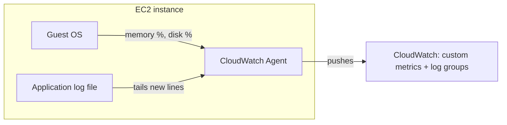

# 02 - CloudWatch Agent

> Goal: understand exactly what the CloudWatch Agent is for — the metrics and logs AWS genuinely cannot see without something running inside your instance's operating system — and how its installation story has gotten meaningfully simpler in the current console than it used to be.

---

## 1. The problem: some data only exists inside the guest OS

As the [CloudWatch Introduction](01-Amazon-CloudWatch-Introduction.md) note established, AWS collects core metrics like `CPUUtilization` from the **hypervisor**, with zero setup. But **memory usage** and **disk space usage** are numbers only the guest operating system itself actually knows — the hypervisor has no visibility into what's happening inside the OS it's running. The same is true for **application log files**: nothing outside the instance can read a log file sitting on that instance's disk. The **CloudWatch Agent** is a small piece of software you run *inside* the instance (or an on-premises server) specifically to collect and forward this otherwise-invisible data.

---

## 2. Architecture & workflow

---

## 3. What the Agent can collect that default monitoring can't

| Category | Examples |
|---|---|
| **System metrics from inside the OS** | Memory utilization, disk space utilization, swap usage — none of these exist in CloudWatch without the Agent |
| **Log files** | Any application's log output on disk — web server logs, custom application logs, anything the Agent is pointed at |
| **StatsD / collectd metrics** | Custom application-emitted metrics, if your application already speaks those protocols |

---

## 4. Getting the Agent onto an instance — two generations of the same idea

| | The classic path | The current, simpler console path |
|---|---|---|
| **Where you work** | SSM Parameter Store (hand-editing a JSON config), then an SSM Run Command / `AWS-ConfigureAWSPackage` document | The **CloudWatch console's own "Getting started with CloudWatch agent" page** |
| **Configuration** | Manually author a JSON agent config (or use the old `amazon-cloudwatch-agent-config-wizard`) | A **visual configuration editor** with **automatic workload detection** — it recognizes common workloads (NGINX, JVM, Kafka, Tomcat, GPU workloads) and suggests the right metrics/logs to collect |
| **Deployment** | Install/configure as separate manual steps | One flow: select instance(s) → install → configure → deploy, including **tag-based deployment** to automatically cover a whole fleet, present and future |

> 🧠 Both paths still rely on the same underlying mechanism — **AWS Systems Manager (SSM)** actually pushes the agent and its config onto the instance. What's changed is that the current console experience hides almost all of that machinery behind a guided UI instead of requiring you to hand-write JSON.

---

## 5. What the instance needs before any of this works

Regardless of which path you use, an EC2 instance needs to be an **SSM-managed instance** for the Agent to be installed/configured through the console at all:

1. The **SSM Agent** itself must be running — pre-installed by default on most current AWS-supplied AMIs (Amazon Linux, Ubuntu, Windows).
2. The instance needs **permission for SSM to manage it** — normally via an **IAM instance profile** carrying the `AmazonSSMManagedInstanceCore` managed policy.

> 🎯 **Exam tip**: "CloudWatch Agent won't install / instance doesn't show up as a target" is almost always a **missing IAM instance profile** — a completely different root cause from "the metric isn't showing up in CloudWatch" (which just means the Agent isn't installed at all). Both point back to the same underlying idea: **the Agent needs both an OS-level presence and IAM permission to talk to CloudWatch.**

---

## 6. Recap

- The Agent exists to collect what the hypervisor genuinely can't see: **memory**, **disk usage**, and **application log files** from inside an instance's OS.
- Installing it now happens primarily through the **CloudWatch console's own guided experience**, with automatic workload detection replacing most manual JSON configuration.
- Under the hood, it's still delivered via **Systems Manager** — which means the target instance must already be **SSM-managed**, with the `AmazonSSMManagedInstanceCore` IAM policy attached.
- Next: the [CloudWatch Agent hands-on demo](02.01-CloudWatch-Agent-Demo.md) — installing the real agent, collecting real memory metrics, and confirming they show up where default monitoring never could.

### Sources
- [Install and Configure CloudWatch Agent with Workload Detection — AWS docs](https://docs.aws.amazon.com/AmazonCloudWatch/latest/monitoring/install-cloudwatch-agent-workload-detection.html)
- [Amazon CloudWatch adds visual agent configuration to the EC2 console — AWS](https://aws.amazon.com/about-aws/whats-new/2026/04/amazon-cloudwatch-agent-ec2/)
- [Amazon CloudWatch Introduces In-Console Agent Management on EC2 — AWS](https://aws.amazon.com/about-aws/whats-new/2025/11/cloudwatch-in-console-agent-management-ec2/)
- [Collecting metrics and logs from Amazon EC2 instances — AWS docs](https://docs.aws.amazon.com/AmazonCloudWatch/latest/monitoring/Install-CloudWatch-Agent.html)
