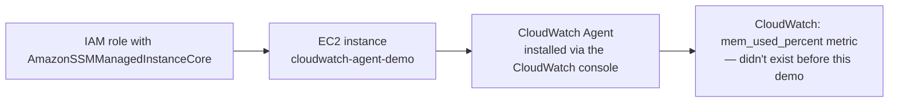

# 02.01 - Hands-On Demo: Installing the CloudWatch Agent and Collecting Real Memory Metrics

> Goal: install the real CloudWatch Agent on a real EC2 instance through the CloudWatch console's current guided flow, and watch **memory utilization** — a metric that flatly does not exist in CloudWatch without this — actually appear. Entirely via the **AWS Console**.

---

## 1. What you're building

---

## 2. Step 1 — Create the IAM role the instance needs

1. **IAM console** → **Roles** → **Create role** → **Trusted entity type**: **AWS service** → **Use case**: **EC2** → **Next**.
2. Attach the **`AmazonSSMManagedInstanceCore`** managed policy — this is what allows Systems Manager (and therefore the CloudWatch console's agent installer) to manage this instance at all.
3. **Role name**: `cloudwatch-agent-demo-role` → **Create role**.

---

## 3. Step 2 — Launch the EC2 instance with that role attached

1. **EC2 console** → **Launch instances** → **Name**: `cloudwatch-agent-demo`.
2. **AMI**: **Amazon Linux 2023** (ships with the SSM Agent pre-installed).
3. **Instance type**: `t2.micro`.
4. **Key pair**: **Proceed without a key pair**.
5. **Advanced details** → **IAM instance profile**: `cloudwatch-agent-demo-role`.
6. **Launch instance**, and wait for **Running**.

---

## 4. Step 3 — Confirm the instance is SSM-managed

1. **AWS Systems Manager console** → **Fleet Manager** (or **Node Management** → **Managed nodes** depending on current console layout).
2. Confirm `cloudwatch-agent-demo` appears with a **Ping status** of **Online** — this can take a minute or two after launch. If it never appears, the IAM role from Step 1 is the first thing to recheck.

---

## 5. Step 4 — Install and configure the agent from the CloudWatch console

1. **CloudWatch console** → left navigation → find **CloudWatch Agent** (the "Getting started with CloudWatch agent" page).
2. Choose **Manual instance deployment** → select `cloudwatch-agent-demo` from the instance list → **Next**.
3. **Install the agent** on the selected instance.
4. **Configure the agent**: if prompted about **workload detection**, let it scan the instance (a plain Amazon Linux instance with no extra software installed will show no specific workload, which is expected). Under the metrics configuration, explicitly add:
   - **Memory** → `mem_used_percent`.
   - **Disk** → `disk_used_percent`.
5. Review and **Deploy** the configuration to the instance.

---

## 6. Step 5 — Confirm memory metrics now exist

1. **CloudWatch console** → **Metrics** → **All metrics** → look for a new custom namespace (typically **`CWAgent`**).
2. Select `cloudwatch-agent-demo`'s **`mem_used_percent`** → graph it.
3. Compare this against Section 4 of the [CloudWatch monitoring demo](01.01-CloudWatch-Monitoring-Demo.md): `CPUUtilization` was visible from the moment the instance launched; `mem_used_percent` only exists now, **after** installing the Agent — the exact distinction [CloudWatch Agent](02-CloudWatch-Agent.md) Section 1 explained conceptually, now proven directly.

---

## 7. Troubleshooting

| Symptom | Likely cause |
|---|---|
| Instance never shows as a managed node in Systems Manager | The `AmazonSSMManagedInstanceCore` IAM role wasn't attached at launch — attach it via **EC2 console** → **Actions** → **Security** → **Modify IAM role**, then wait a few minutes |
| Agent installs but `mem_used_percent` never appears | The metrics configuration in Step 5 wasn't saved/deployed correctly — reopen the CloudWatch Agent page and confirm the deployment status for this instance shows **Success** |
| `CWAgent` namespace doesn't appear in Metrics | Allow a few minutes after deployment for the first data point to publish, same as any new CloudWatch metric |

---

## 8. Cleanup

1. **CloudWatch console** → CloudWatch Agent page → remove the configuration/deployment for `cloudwatch-agent-demo` (optional, since terminating the instance stops data collection anyway).
2. **EC2 console** → terminate `cloudwatch-agent-demo`.
3. **IAM console** → delete the `cloudwatch-agent-demo-role` role.

---

## 9. Recap

- An EC2 instance must be **SSM-managed** — SSM Agent running, plus an IAM role with `AmazonSSMManagedInstanceCore` — before the CloudWatch console can install anything on it.
- The current console flow (**CloudWatch console → CloudWatch Agent page → Manual instance deployment**) handles install + configure + deploy as one guided flow, no hand-written JSON required.
- `mem_used_percent` genuinely did not exist in CloudWatch before this demo installed the Agent — direct, hands-on proof of the automatic-vs-Agent distinction from [CloudWatch Agent](02-CloudWatch-Agent.md) Section 1.
- Next: the [CloudWatch Alarms](03-CloudWatch-Alarms.md) note — reacting automatically when a metric like this one crosses a threshold.

### Sources
- [Install and Configure CloudWatch Agent with Workload Detection — AWS docs](https://docs.aws.amazon.com/AmazonCloudWatch/latest/monitoring/install-cloudwatch-agent-workload-detection.html)
- [AmazonSSMManagedInstanceCore — AWS managed policy reference](https://docs.aws.amazon.com/aws-managed-policy/latest/reference/AmazonSSMManagedInstanceCore.html)
- [About SSM Agent — AWS Systems Manager docs](https://docs.aws.amazon.com/systems-manager/latest/userguide/prereqs-ssm-agent.html)
