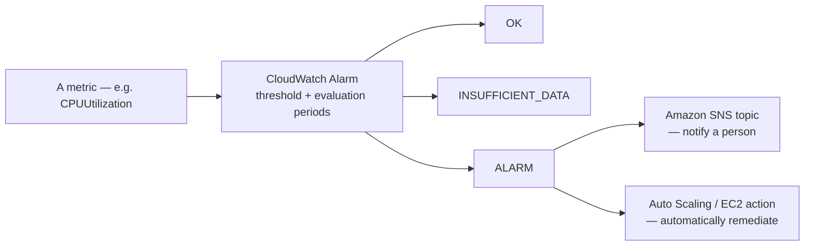

# 03 - CloudWatch Alarms

> Goal: understand how an Alarm turns a metric you're merely *watching* into something that *acts on your behalf* — notifying someone, or automatically remediating — the moment a threshold is crossed, including the less-obvious states and alarm types the exam actually probes.

---

## 1. The problem: nobody stares at a dashboard 24/7

A dashboard (from the [CloudWatch Introduction](01-Amazon-CloudWatch-Introduction.md) note) is only useful if a human is actively looking at it. **CloudWatch Alarms** solve the obvious next problem: define a threshold once, and let CloudWatch itself watch the metric continuously, reacting the instant that threshold is breached — no human required to notice.

---

## 2. Architecture & workflow

---

## 3. The three alarm states — genuinely three, not two

| State | Meaning |
|---|---|
| **OK** | The metric is within the defined threshold |
| **ALARM** | The metric has breached the threshold for the required number of evaluation periods |
| **INSUFFICIENT_DATA** | The alarm doesn't yet have enough data to determine OK or ALARM — e.g. right after creation, or if the metric has stopped reporting entirely |

> 🎯 **Exam tip**: `INSUFFICIENT_DATA` is a common trap answer's *correct* answer — a scenario describing "an alarm that should be in ALARM but isn't, and the resource seems to have stopped reporting metrics altogether" almost always points to this third state, not a misconfigured threshold.

---

## 4. What an alarm can actually do when triggered

- **Notify via Amazon SNS** — the most common action: email, SMS, or trigger a Lambda function/webhook downstream of the topic.
- **Auto Scaling actions** — add or remove instances from an Auto Scaling group directly.
- **EC2 actions** — **stop**, **terminate**, **reboot**, or **recover** an EC2 instance automatically (recover is particularly useful for underlying hardware failure scenarios, since it relaunches the instance on new hardware, preserving its instance ID).

---

## 5. Alarm types worth knowing beyond the basic single-metric alarm

| Type | What it adds |
|---|---|
| **Standard (single-metric) alarm** | The default case: one metric, one threshold, one comparison operator |
| **Metric math alarm** | The threshold is evaluated against a **calculated expression** across multiple metrics (e.g. an error *rate* computed from separate error-count and request-count metrics), not just one raw metric |
| **Composite alarm** | Combines the states of **multiple other alarms** using `AND`/`OR` logic — genuinely useful for reducing noisy, low-value single-metric alerts into one meaningful "the system is actually in trouble" signal |
| **Anomaly detection alarm** | Instead of a fixed number, the threshold is a **machine-learning-derived band** around the metric's normal historical pattern — alarms when the metric falls *outside* that expected band, accounting for normal daily/weekly cyclical patterns |

> 🧠 **Composite alarms** are the direct answer to "too many alerts, not enough signal" — e.g. only page someone if *both* high latency **and** high error rate are true simultaneously, instead of getting paged for either alone.

---

## 6. Recap

- An alarm has exactly **three** states — `OK`, `ALARM`, and the often-overlooked `INSUFFICIENT_DATA`.
- Triggered alarms can **notify** (via SNS) or **act** (Auto Scaling, EC2 stop/terminate/reboot/recover) — genuinely automated remediation, not just alerting.
- Beyond the basic single-metric alarm: **metric math** (calculated expressions), **composite alarms** (combine multiple alarms' states), and **anomaly detection** (ML-derived dynamic thresholds) each solve a different real limitation of a plain fixed threshold.
- Next: the [CloudWatch Alarm hands-on demo](03.01-CloudWatch-Alarm-Demo.md) — building a real alarm on a real metric and watching it actually fire.

### Sources
- [Using Amazon CloudWatch alarms — AWS docs](https://docs.aws.amazon.com/AmazonCloudWatch/latest/monitoring/AlarmThatSendsEmail.html)
- [Create a composite alarm — AWS docs](https://docs.aws.amazon.com/AmazonCloudWatch/latest/monitoring/Create_Composite_Alarm.html)
- [Using CloudWatch anomaly detection — AWS docs](https://docs.aws.amazon.com/AmazonCloudWatch/latest/monitoring/CloudWatch_Anomaly_Detection.html)
