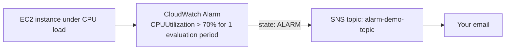

# 03.01 - Hands-On Demo: Building a Real CloudWatch Alarm That Actually Fires

> Goal: build a real alarm on a real EC2 instance's CPU metric, generate genuine load to trip it, and watch it move `INSUFFICIENT_DATA → OK → ALARM`, with a real SNS email notification firing along the way. Entirely via the **AWS Console**.

---

## 1. What you're building



---

## 2. Step 1 — Create the SNS topic and subscribe your email

1. **SNS console** → **Topics** → **Create topic** → **Type**: **Standard** → **Name**: `alarm-demo-topic` → **Create topic**.
2. **Create subscription** → **Protocol**: **Email** → **Endpoint**: your email address → **Create subscription**.
3. Check your inbox and **confirm the subscription** — an unconfirmed subscription silently receives nothing later.

---

## 3. Step 2 — Launch an EC2 instance to alarm on

1. **EC2 console** → **Launch instances** → **Name**: `cloudwatch-alarm-demo` → **Amazon Linux 2023** → `t2.micro` → **Proceed without a key pair** → **Launch instance**.

---

## 4. Step 3 — Create the alarm

1. **CloudWatch console** → **Alarms** → **All alarms** → **Create alarm**.
2. **Select metric** → **EC2** → **Per-Instance Metrics** → `cloudwatch-alarm-demo`'s **CPUUtilization** → **Select metric**.
3. **Statistic**: **Average**, **Period**: **1 minute**.
4. **Conditions**: **Threshold type**: **Static** → **Whenever CPUUtilization is... Greater than... 70**.
5. **Additional configuration**: **Datapoints to alarm**: **1 out of 1** — deliberately sensitive, so this fires quickly for the demo rather than waiting through several evaluation periods.
6. **Next** → **Notification**: **In alarm** → select the existing SNS topic `alarm-demo-topic` → **Next**.
7. **Alarm name**: `cloudwatch-demo-high-cpu` → **Next** → **Create alarm**.
8. Note the alarm's initial state: **INSUFFICIENT_DATA** — it hasn't received a data point yet, exactly matching [CloudWatch Alarms](03-CloudWatch-Alarms.md) Section 3.

---

## 5. Step 4 — Watch it settle to OK, then trip it into ALARM

1. Wait a few minutes — the alarm should move to **OK** once real (low) `CPUUtilization` data points start arriving.
2. **EC2 console** → connect to `cloudwatch-alarm-demo` via **EC2 Instance Connect** → generate load:
   ```bash
   sudo dnf install -y stress
   stress --cpu 1 --timeout 300
   ```
3. Back on the **CloudWatch console** → **Alarms**, watch the alarm's state change to **ALARM** within a minute or two of CPU crossing 70%.
4. Check your email — the SNS notification should have arrived, containing the alarm name, new state, and the metric value that triggered it.

---

## 6. Step 5 — Watch it recover

1. Once the `stress` command's 300-second timeout finishes (or you stop it), CPU drops back down.
2. The alarm returns to **OK** on its next evaluation — and, since **OK** notifications weren't configured in Step 4, no second email arrives for the recovery (a deliberate, common design choice — teams often only want to be paged going *into* trouble, not coming back out of it).

---

## 7. Troubleshooting

| Symptom | Likely cause |
|---|---|
| No email ever arrives, even though the console shows **ALARM** | The SNS subscription from Step 2 was never confirmed |
| Alarm stays on **INSUFFICIENT_DATA** for a long time | The instance may not be publishing metrics yet, or the wrong instance/metric was selected in Step 3 |
| Alarm never reaches **ALARM** despite `stress` running | Datapoints-to-alarm or the threshold value in Step 3 don't match what's actually happening — re-check via the metric graph directly |

---

## 8. Cleanup

1. **CloudWatch console** → **Alarms** → delete `cloudwatch-demo-high-cpu`.
2. **SNS console** → delete `alarm-demo-topic`.
3. **EC2 console** → terminate `cloudwatch-alarm-demo`.

---

## 9. Recap

- A real alarm genuinely does pass through **`INSUFFICIENT_DATA` → `OK` → `ALARM`**, not just conceptually — this demo watched all three.
- **Datapoints to alarm** controls sensitivity — `1 out of 1` (used here for a fast demo) is far more trigger-happy than a real production alarm would typically use.
- SNS notification only fires on the **state transition you configured** (`In alarm` here) — recovering to OK is silent unless you explicitly add an **OK** notification too.
- Next: the [CloudWatch Logs](04-CloudWatch-Logs.md) note — the other major CloudWatch data type, moving from numeric metrics to raw text log data.

### Sources
- [Create a CloudWatch alarm based on a static threshold — AWS docs](https://docs.aws.amazon.com/AmazonCloudWatch/latest/monitoring/ConsoleAlarms.html)
- [Amazon CloudWatch alarm states — AWS docs](https://docs.aws.amazon.com/AmazonCloudWatch/latest/monitoring/AlarmThatSendsEmail.html#alarm-states)
