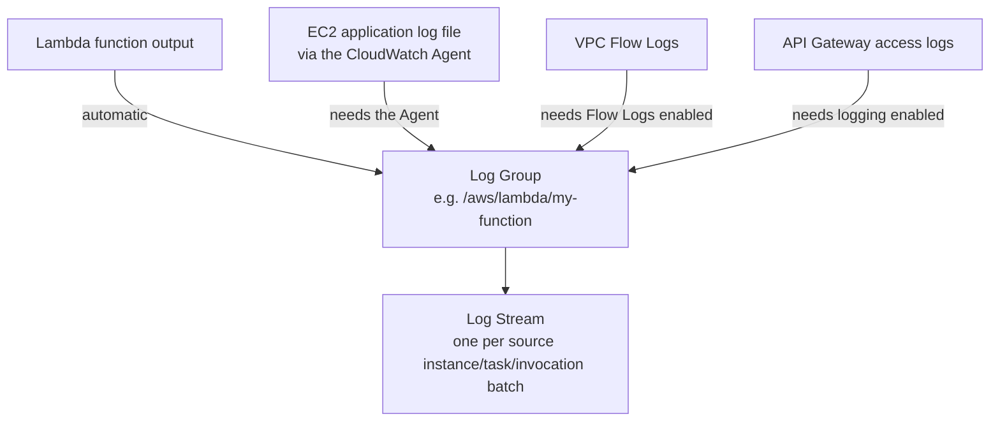

# 04 - CloudWatch Logs

> Goal: understand how CloudWatch organizes raw text log data — **Log Groups** and **Log Streams** — and the handful of ways logs actually get into CloudWatch in the first place, since "how do I get my logs into CloudWatch" is a genuinely different question depending on where those logs are generated.

---

## 1. The problem: logs live in a lot of different places by default

A Lambda function's output, an EC2-hosted application's log file, a VPC's network traffic record, an API Gateway's access log — none of these start out in one central place. **CloudWatch Logs** is where AWS consolidates them, so searching, retaining, and alerting on log data doesn't mean SSHing into a dozen different machines or services.

---

## 2. Architecture & workflow

---

## 3. Log Groups and Log Streams

| Concept | What it is |
|---|---|
| **Log Group** | The top-level container — typically one per application/service/source, e.g. `/aws/lambda/my-function` |
| **Log Stream** | A sequence of log events **from a single source** within that group — e.g. one stream per Lambda execution environment, or per EC2 instance |
| **Retention** | Set **per log group** — from as short as 1 day up to indefinite; by default, a **new log group retains logs forever** unless you explicitly set a retention period, which is a genuinely easy way to accumulate unnecessary storage cost |

---

## 4. How logs actually get in — it depends entirely on the source

| Source | How its logs reach CloudWatch |
|---|---|
| **Lambda** | Automatic — every function gets a log group for free, no setup, as long as its execution role has the standard logging permissions |
| **EC2 (application logs)** | Requires the [CloudWatch Agent](02-CloudWatch-Agent.md) — nothing outside the instance can read a file sitting on that instance's own disk |
| **VPC Flow Logs** | Requires explicitly enabling Flow Logs on a VPC/subnet/ENI, with a destination of CloudWatch Logs (or S3) |
| **API Gateway, ECS, RDS, and most other managed services** | Each has its own **opt-in logging setting** — enabled per-resource, not on by default |

> 🎯 **Exam tip**: this table is the entire exam skill here — "logs aren't showing up" always traces back to *which* of these paths the scenario's data source actually uses, and whether that path's specific enablement step was done.

---

## 5. Subscription filters — reacting to logs in near-real-time

A **subscription filter** on a log group streams matching log events, as they arrive, to a destination like **Lambda**, **Kinesis Data Streams**, or **OpenSearch** — the mechanism behind real-time log processing (e.g. triggering a Lambda function the moment a specific error string appears), distinct from querying historical logs after the fact (covered in the [CloudWatch Logs Insights](05-CloudWatch-Logs-Insights.md) note).

---

## 6. Recap

- **Log Groups** organize by source application/service; **Log Streams** are the individual sequences within a group; **retention defaults to forever** unless explicitly set.
- **Getting logs into CloudWatch is source-specific** — Lambda is automatic, EC2 needs the Agent, most other services need logging explicitly enabled per-resource.
- **Subscription filters** turn log ingestion into a real-time trigger mechanism, not just passive storage.
- Next: the [CloudWatch Logs hands-on demo](04.01-CloudWatch-Logs-Demo.md) — sending a real EC2 application's logs into CloudWatch and watching them appear, end to end.

### Sources
- [Working with log groups and log streams — AWS docs](https://docs.aws.amazon.com/AmazonCloudWatch/latest/logs/Working-with-log-groups-and-streams.html)
- [Change log data retention in CloudWatch Logs — AWS docs](https://docs.aws.amazon.com/AmazonCloudWatch/latest/logs/Working-with-log-groups-and-streams.html#SettingLogRetention)
- [Real-time processing of log data with subscriptions — AWS docs](https://docs.aws.amazon.com/AmazonCloudWatch/latest/logs/Subscriptions.html)
