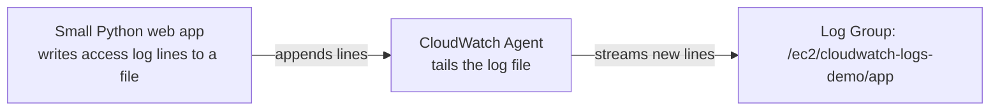

# 04.01 - Hands-On Demo: Sending a Real EC2 Application's Logs to CloudWatch

> Goal: run a genuine small application on EC2, configure the CloudWatch Agent to tail its log file, and watch real application log lines appear in a CloudWatch Log Group — end to end, proving the [CloudWatch Logs](04-CloudWatch-Logs.md) note's "EC2 needs the Agent" rule directly rather than taking it on faith. Entirely via the **AWS Console**, with two short shell commands run through **EC2 Instance Connect** to run the application and generate log traffic.


---

## 1. What you're building



---

## 2. Step 1 — Launch the instance with the SSM role

1. **IAM console** → **Roles** → **Create role** → **AWS service** → **EC2** → attach **`AmazonSSMManagedInstanceCore`** → name it `cloudwatch-logs-demo-role` → **Create role**. (Skip this if reusing the role from the [CloudWatch Agent demo](02.01-CloudWatch-Agent-Demo.md).)
2. **EC2 console** → **Launch instances** → **Name**: `cloudwatch-logs-demo`.
3. **AMI**: **Amazon Linux 2023** → **Instance type**: `t2.micro` → **Key pair**: **Proceed without a key pair**.
4. **Advanced details** → **IAM instance profile**: `cloudwatch-logs-demo-role`.
5. **Launch instance**.

---

## 3. Step 2 — Run a small application that writes a log file

1. **EC2 console** → select `cloudwatch-logs-demo` → **Connect** → **EC2 Instance Connect** → **Connect**.
2. In the browser terminal, create a tiny app that logs every request it receives:
   ```bash
   mkdir -p ~/app && cd ~/app
   cat << 'EOF' > app.py
   import http.server, logging, datetime

   logging.basicConfig(
       filename="/var/log/demo-app/app.log",
       level=logging.INFO,
       format="%(asctime)s [%(levelname)s] %(message)s"
   )

   class Handler(http.server.BaseHTTPRequestHandler):
       def do_GET(self):
           logging.info(f"GET {self.path} from {self.client_address[0]}")
           self.send_response(200)
           self.end_headers()
           self.wfile.write(b"DevopsWithDeepak CloudWatch Logs Demo\n")

   http.server.HTTPServer(("0.0.0.0", 8080), Handler).serve_forever()
   EOF
   sudo mkdir -p /var/log/demo-app && sudo chmod 777 /var/log/demo-app
   nohup python3 app.py > /dev/null 2>&1 &
   curl localhost:8080/hello
   curl localhost:8080/world
   ```
3. Confirm log lines were written: `cat /var/log/demo-app/app.log`.

---

## 4. Step 3 — Configure the CloudWatch Agent to collect this log file

1. **CloudWatch console** → **CloudWatch Agent** (Getting started page) → **Manual instance deployment** → select `cloudwatch-logs-demo` → **Next**.
2. **Install the agent**.
3. **Configure the agent** → under **Logs**, add a log file collection entry:
   - **File path**: `/var/log/demo-app/app.log`.
   - **Log group name**: `/ec2/cloudwatch-logs-demo/app`.
   - **Log stream name**: default (instance ID).
4. **Deploy** the configuration.

---

## 5. Step 4 — Generate more traffic and watch it arrive in CloudWatch

1. Back in the EC2 Instance Connect terminal:
   ```bash
   for i in $(seq 1 10); do curl -s localhost:8080/page-$i > /dev/null; done
   ```
2. **CloudWatch console** → **Logs** → **Log groups** → open `/ec2/cloudwatch-logs-demo/app`.
3. Open its single log stream (named after the instance ID) → confirm the `GET /page-1` through `/page-10` lines all appear, with real timestamps matching when `curl` ran.

---

## 6. Step 5 — Set a sane retention period

1. Still on the log group's page → **Actions** → **Edit retention setting**.
2. Choose **3 days** (rather than the default **Never expire**) — directly addressing [CloudWatch Logs](04-CloudWatch-Logs.md) Section 3's warning about indefinite retention accumulating unnecessary cost on a real account.

---

## 7. Troubleshooting

| Symptom | Likely cause |
|---|---|
| Log group never appears in CloudWatch | The agent deployment in Section 4 failed, or the file path doesn't exactly match `/var/log/demo-app/app.log` |
| `app.log` file itself is empty | The Python app didn't actually start — check with `curl localhost:8080/hello` locally on the instance first, and confirm the `/var/log/demo-app` directory permissions |
| Log stream appears but has no new lines after Section 5's traffic | The agent typically batches/flushes every few seconds — wait a short moment and refresh; if it's still empty after a few minutes, recheck the agent configuration's file path |

---

## 8. Cleanup

1. **CloudWatch console** → **Logs** → delete the `/ec2/cloudwatch-logs-demo/app` log group.
2. **EC2 console** → terminate `cloudwatch-logs-demo`.
3. **IAM console** → delete `cloudwatch-logs-demo-role` (if created fresh for this demo).

---

## 9. Recap

- Application log files on EC2 are **completely invisible to CloudWatch** until the Agent is explicitly configured to tail them — this demo proved that gap directly by writing real log lines and watching them appear only after Section 4's configuration step.
- A **Log Group** name and its **file path** are the two pieces of information that actually connect a file on disk to a place in CloudWatch — everything else is defaults.
- Setting **retention** explicitly (Section 6) is a genuinely easy habit that avoids the "forever" default silently accumulating storage cost.
- Next: the [CloudWatch Logs Insights](05-CloudWatch-Logs-Insights.md) note — actually querying the log data this demo just generated.

### Sources
- [Collecting logs with the CloudWatch agent — AWS docs](https://docs.aws.amazon.com/AmazonCloudWatch/latest/monitoring/CloudWatch-Agent-Configuration-File-Details.html)
- [Working with log groups and log streams — AWS docs](https://docs.aws.amazon.com/AmazonCloudWatch/latest/logs/Working-with-log-groups-and-streams.html)
