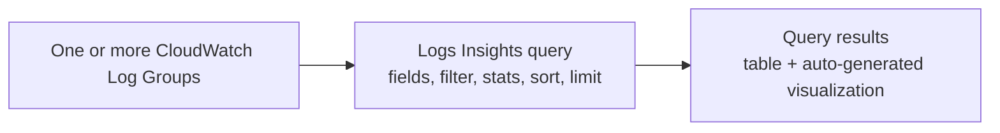

# 05 - CloudWatch Logs Insights

> Goal: understand Logs Insights as the answer to a genuinely different question than [CloudWatch Logs](04-CloudWatch-Logs.md) itself — not "where do my logs live," but **"how do I actually search and analyze potentially millions of log lines fast, without exporting them anywhere else."**

---

## 1. The problem: reading a log stream line by line doesn't scale

Section 4 of the [CloudWatch Logs](04-CloudWatch-Logs.md) note got a handful of log lines into a log group — trivial to just read directly. A real production log group might contain millions of lines across thousands of streams. **CloudWatch Logs Insights** is a **purpose-built query language** for exactly this: search, filter, aggregate, and visualize log data interactively, directly against the log groups already sitting in CloudWatch — no separate export, no standing up Elasticsearch/OpenSearch just to ask a question.

---

## 2. Architecture & workflow



---

## 3. The query language, in outline

| Command | What it does |
|---|---|
| `fields` | Select which fields to display (e.g. `@timestamp`, `@message`, or fields extracted from structured JSON logs) |
| `filter` | Narrow results to matching log events — supports comparisons, string matching, regex |
| `stats` | Aggregate — `count()`, `avg()`, `sum()`, `min()`, `max()`, often combined with `by` for grouping (e.g. count of errors **by** hour) |
| `sort` | Order results, typically by `@timestamp` |
| `limit` | Cap the number of results returned |
| `parse` | Extract structured fields out of unstructured log text using a pattern, when logs weren't written as JSON to begin with |

A typical query chains several of these with the pipe character, e.g.:
```
fields @timestamp, @message
| filter @message like /ERROR/
| stats count() by bin(5m)
```
— "show me a count of ERROR-containing log lines, bucketed into 5-minute windows."

---

## 4. Why this matters beyond convenience

- **No infrastructure to run** — no OpenSearch domain, no indexing pipeline to maintain; Logs Insights queries the log groups directly, on demand.
- **Cross-log-group queries** — a single query can span **multiple log groups** at once (e.g. every Lambda function behind one API), which plain log-stream browsing can't do at all.
- **Saved queries and dashboard widgets** — a useful query can be saved and reused, or added directly as a widget on a CloudWatch dashboard, turning ad-hoc analysis into a standing view.

> 🎯 **Exam tip**: "search across multiple log groups without standing up a separate search cluster" is the clearest Logs Insights signal on the exam — if the scenario specifically needs a full-text search engine with its own indexing/scaling concerns, that's OpenSearch Service instead, a different, heavier tool for a related but distinct problem.

---

## 5. Recap

- Logs Insights is a **query language for log data already in CloudWatch**, not a separate storage or export system.
- `fields` / `filter` / `stats` / `sort` / `limit` / `parse` cover the vast majority of real queries, chained together with `|`.
- It can query **multiple log groups in one go**, and its results can become **dashboard widgets** or **saved queries** for reuse.
- Next: the [CloudWatch Logs Insights hands-on demo](05.01-CloudWatch-Logs-Insights-Demo.md) — running real queries against the application logs generated in the [CloudWatch Logs demo](04.01-CloudWatch-Logs-Demo.md).

### Sources
- [Analyzing log data with CloudWatch Logs Insights — AWS docs](https://docs.aws.amazon.com/AmazonCloudWatch/latest/logs/AnalyzingLogData.html)
- [CloudWatch Logs Insights query syntax — AWS docs](https://docs.aws.amazon.com/AmazonCloudWatch/latest/logs/CWL_QuerySyntax.html)
