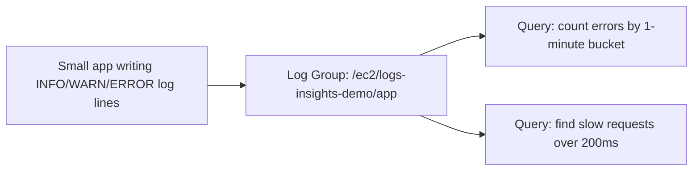

# 05.01 - Hands-On Demo: Querying Real Log Data with CloudWatch Logs Insights

> Goal: generate a realistic mix of INFO/WARN/ERROR log lines, then run real Logs Insights queries against them — filtering, counting, and grouping — to actually feel the difference between "browsing a log stream" and "querying log data." Entirely via the **AWS Console**, with the log-generating commands run through **EC2 Instance Connect**.

---

## 1. What you're building



---

## 2. Step 1 — Launch the instance and generate a realistic log mix

1. **IAM console** → create (or reuse) a role with **`AmazonSSMManagedInstanceCore`** attached, e.g. `logs-insights-demo-role`.
2. **EC2 console** → **Launch instances** → **Name**: `logs-insights-demo` → **Amazon Linux 2023** → `t2.micro` → **Proceed without a key pair** → **Advanced details** → **IAM instance profile**: `logs-insights-demo-role` → **Launch instance**.
3. **Connect** via **EC2 Instance Connect**, then generate a batch of realistic, varied log lines:
   ```bash
   sudo mkdir -p /var/log/demo-app && sudo chmod 777 /var/log/demo-app
   python3 << 'EOF'
   import random, datetime

   levels = ["INFO"] * 7 + ["WARN"] * 2 + ["ERROR"] * 1
   with open("/var/log/demo-app/app.log", "a") as f:
       for i in range(200):
           level = random.choice(levels)
           duration_ms = random.randint(20, 350)
           ts = datetime.datetime.utcnow().isoformat()
           f.write(f'{ts} [{level}] request_id=req-{i} path=/api/orders/{i} duration_ms={duration_ms}\n')
   EOF
   tail -5 /var/log/demo-app/app.log
   ```
   This writes 200 realistic log lines with a mix of levels and request durations — enough variety for genuinely interesting queries.

---

## 3. Step 2 — Get these logs into CloudWatch

1. **CloudWatch console** → **CloudWatch Agent** page → **Manual instance deployment** → select `logs-insights-demo` → **Install the agent**.
2. **Configure the agent** → **Logs** → add: **File path**: `/var/log/demo-app/app.log`, **Log group name**: `/ec2/logs-insights-demo/app` → **Deploy**.
3. **CloudWatch console** → **Logs** → **Log groups** → confirm `/ec2/logs-insights-demo/app` appears with the 200 lines inside its log stream.

---

## 4. Step 3 — Run real Logs Insights queries

**CloudWatch console** → **Logs** → **Logs Insights** → select log group `/ec2/logs-insights-demo/app`.

**Query 1 — how many ERROR lines are there, and when did they happen:**
```
fields @timestamp, @message
| filter @message like /ERROR/
| sort @timestamp desc
```
Run it → confirm only `ERROR`-level lines are returned, roughly 10% of the 200 written, matching Section 2's `levels` weighting.

**Query 2 — count log lines by level:**
```
parse @message "[*] request_id=*" as level, request_id
| stats count() by level
```
Run it → confirm the counts roughly match the 7:2:1 INFO:WARN:ERROR ratio from Section 2 — direct proof `parse` successfully extracted a structured field out of plain text.

**Query 3 — find the slowest requests:**
```
parse @message "duration_ms=*" as duration_ms
| filter duration_ms > 200
| sort duration_ms desc
| limit 10
```
Run it → confirm every returned row genuinely has a duration over 200ms.

---

## 5. Step 4 — Save one query and add it to a dashboard

1. On Query 2's results, choose **Save** → name it `log-level-breakdown`.
2. **Add to dashboard** → create a new dashboard `logs-insights-demo-dashboard` → confirm the log-level counts now appear as a widget, turning a one-off query into a standing view.

---

## 6. Troubleshooting

| Symptom | Likely cause |
|---|---|
| Query returns zero results | The log group in Section 4 doesn't match, or the agent deployment from Section 3 hasn't delivered data yet — check the log group directly first |
| `parse` query returns empty `level`/`duration_ms` fields | The parse pattern's `*` placeholders don't exactly match the log line's actual text — compare against a real line from Section 2's output |
| Query 1 returns **zero** ERROR lines | Possible with only 200 random lines at a ~10% weighting — rerun Section 2's generator script to add more lines, or lower the confidence expectation, this is genuine randomness, not a bug |

---

## 7. Cleanup

1. **CloudWatch console** → **Dashboards** → delete `logs-insights-demo-dashboard`.
2. **CloudWatch console** → **Logs** → delete the `/ec2/logs-insights-demo/app` log group, and the saved query `log-level-breakdown`.
3. **EC2 console** → terminate `logs-insights-demo`.
4. **IAM console** → delete `logs-insights-demo-role` if created fresh.

---

## 8. Recap

- `filter` narrows to matching lines, `parse` extracts structured fields from plain text, and `stats ... by` aggregates — the same three moves cover most real Logs Insights queries.
- A query that would take real effort to replicate by eye-scanning a log stream — "how many errors, grouped, out of 200 lines" — took one query here.
- A saved query becomes a **dashboard widget** in two clicks, turning ad-hoc investigation into a standing view.
- Next: the [CloudWatch Investigations](06-CloudWatch-Investigations.md) note — where this same telemetry (metrics, logs, and more) feeds into AWS's newer, AI-assisted root-cause analysis feature.

### Sources
- [CloudWatch Logs Insights query syntax — AWS docs](https://docs.aws.amazon.com/AmazonCloudWatch/latest/logs/CWL_QuerySyntax.html)
- [Sample queries — AWS docs](https://docs.aws.amazon.com/AmazonCloudWatch/latest/logs/CWL_AnalyzeLogData-discoverable-queries.html)
