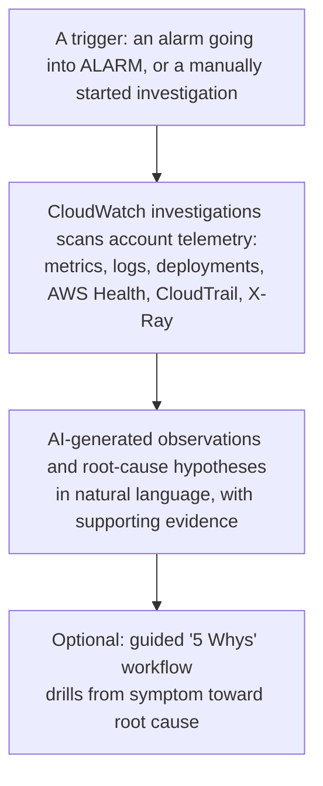

# 06 - CloudWatch Investigations

> Goal: understand what this feature actually is today — a genuinely newer, AI-assisted addition to CloudWatch that didn't exist in older course material's current form. Kept concept-focused with a light, real console walkthrough: it's explicitly designed to work with **no extra setup**, so there's no multi-step infrastructure to build, but a real production incident scenario is needed to see genuinely useful output — a contrived demo would show little of substance.

---

## 1. The problem: correlating metrics, logs, and events by hand is slow

During a real incident — "checkout is slow," "error rate spiked" — an engineer typically has to manually jump between metric graphs, log queries, recent deployment events, and CloudTrail change history, trying to piece together *why*. **CloudWatch investigations** is AWS's generative-AI-powered feature aimed directly at this: it scans your account's own telemetry — metrics, logs, deployment events, AWS Health events, CloudTrail change events, X-Ray traces — and surfaces AI-generated **hypotheses** about what's actually going wrong, with natural-language explanations rather than raw data dumps.

---

## 2. Architecture & workflow

---

## 3. How an investigation actually starts

| Trigger | What happens |
|---|---|
| **Ephemeral / ad-hoc investigation** | Started directly from **Operational troubleshooting** in the CloudWatch console, with **no prior configuration required** — point it at a resource or symptom and let it analyze existing telemetry |
| **From an alarm** | An alarm entering `ALARM` state can kick off an investigation automatically, immediately correlating the breach against everything else that changed around the same time |
| **Guided "5 Whys"** | A structured, AI-assisted workflow that repeatedly asks "why" — modeled on the same root-cause methodology AWS's own internal teams use — walking from a surface symptom down toward an actual root cause, rather than stopping at the first plausible explanation |

---

## 4. What it produces

- **Natural-language explanations** of what it found, not just a table of numbers.
- **Multi-resource hypotheses** with a visual representation of how the implicated resources relate to each other.
- **Evidence links** back to the actual metrics, log lines, or CloudTrail events the hypothesis is based on — the AI's reasoning is checkable, not a black box.

> 🧠 This is the same underlying idea as [CloudWatch Logs Insights](05-CloudWatch-Logs-Insights.md), one level up: Logs Insights makes *you* write the query; Investigations tries to figure out *which* queries and correlations matter, across metrics, logs, and change history simultaneously, and explain the result in plain language.

---

## 5. A light real walkthrough — starting an ephemeral investigation

1. **CloudWatch console** → **Operational troubleshooting** → **Investigations**.
2. **Start investigation** → describe the symptom in plain language (e.g. "high latency on my EC2 instance") or select a specific alarm/resource as the starting point.
3. Review the generated **observations** — each one links back to the specific metric graph or log query that produced it.
4. If a genuinely relevant AWS resource with real, varied telemetry exists in the account (e.g. the alarm and instance from the [CloudWatch Alarm demo](03.01-CloudWatch-Alarm-Demo.md)), this is a reasonable, low-effort resource to point an investigation at, since it already has a real CPU spike and a real alarm transition to reason about.

---

## 6. Recap

- **CloudWatch investigations** is a genuinely current (2025-2026) generative-AI feature — if older material doesn't mention it, that's simply because it postdates that material, not an error to reconcile.
- It works from **existing telemetry with no required setup** — metrics, logs, deployment events, AWS Health, CloudTrail, and X-Ray traces feed it directly.
- The **5 Whys** guided workflow is its structured mode for drilling from symptom to root cause, rather than stopping at the first plausible hypothesis.
- Next: the [AWS CloudTrail Introduction](07-AWS-CloudTrail-Introduction.md) note — one of the actual telemetry sources (change/API history) this feature draws on.

### Sources
- [CloudWatch investigations — AWS docs](https://docs.aws.amazon.com/AmazonCloudWatch/latest/monitoring/Investigations.html)
- [Conduct a CloudWatch investigation without additional configuration — AWS docs](https://docs.aws.amazon.com/AmazonCloudWatch/latest/monitoring/Investigations-Ephemeral.html)
- [AI Operations with Amazon CloudWatch — AWS](https://aws.amazon.com/cloudwatch/features/aiops/)
