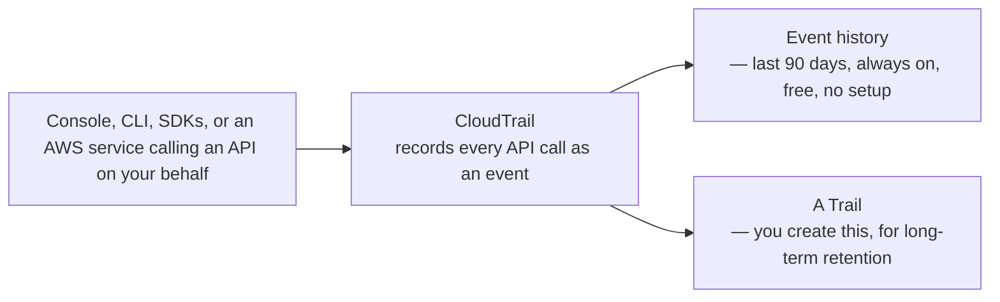

# 07 - AWS CloudTrail Introduction

> Goal: understand CloudTrail's actual job — answering **"who did what, when, from where"** across an AWS account — which is a fundamentally different question from anything CloudWatch answers, even though the two are frequently confused. The [CloudTrail vs. CloudWatch](12-CloudTrail-vs-CloudWatch.md) note is dedicated entirely to that distinction; this note focuses on CloudTrail itself.

---

## 1. The problem: AWS accounts need an audit trail, not just a performance dashboard

CloudWatch (covered in this folder's earlier notes) is about **operational health** — is CPU high, did a metric cross a threshold. It says nothing about **who made an API call**, or **what changed** in your account's configuration and why. **AWS CloudTrail** answers that different question: it records nearly every **API call** made in an account — through the console, CLI, SDKs, or by other AWS services on your behalf — as a structured, queryable event, automatically, from the moment an account is created.

> 🧠 **Simple analogy**: if CloudWatch is the dashboard telling you the car's current speed and engine temperature, CloudTrail is the black-box event recorder logging every single time someone turned the key, opened a door, or changed a setting — a security and accountability record, not a performance one.

---

## 2. Architecture & workflow

---

## 3. Two very different tiers, on by default vs. something you build

| | Event history | A Trail |
|---|---|---|
| **Enabled by default?** | **Yes** — every AWS account has this running from creation, no setup | **No** — you explicitly create one |
| **Retention** | **90 days**, fixed | Whatever you configure — typically indefinite, in an S3 bucket you own |
| **Cost** | Free | S3 storage costs (and optional CloudWatch Logs delivery costs) |
| **Where you view it** | Directly in the CloudTrail console | The S3 bucket (or CloudWatch Logs, if configured) you pointed the trail at |

This distinction is genuinely the entire point of the [CloudTrail Trails](09-CloudTrail-Trails.md) note later in this folder — the free, built-in 90-day history is nowhere near enough for real compliance/audit requirements, which is exactly the gap a Trail closes.

---

## 4. What actually gets recorded

Every recorded event captures, at minimum:
- **Who** made the call — the IAM user/role, or the AWS service, that made it.
- **What** API action was called (e.g. `RunInstances`, `DeleteBucket`, `ConsoleLogin`).
- **When** it happened.
- **Where from** — source IP address, and whether it came through the console, CLI, or an SDK.
- **What the response was** — success or a specific error (e.g. an `AccessDenied`).

> 🎯 **Exam tip**: "who deleted this S3 bucket / terminated this instance / changed this security group" is the single clearest CloudTrail signal on the exam — any scenario asking to attribute a specific account **action** to a specific **identity** points here, not to CloudWatch or Config.

---

## 5. Recap

- CloudTrail answers **"who did what, when, from where"** — an audit/accountability record of API activity, not a performance metric system.
- **Event history** is free, automatic, and covers the last **90 days** — no setup required, but not durable long-term.
- A **Trail** is something you explicitly create for long-term, durable retention — covered in full in [CloudTrail Trails](09-CloudTrail-Trails.md).
- Next: the [CloudTrail hands-on demo](07.01-CloudTrail-Demo.md) — performing a real, traceable action and finding it in Event History.

### Sources
- [What is AWS CloudTrail? — AWS docs](https://docs.aws.amazon.com/awscloudtrail/latest/userguide/cloudtrail-user-guide.html)
- [Viewing events with CloudTrail Event history — AWS docs](https://docs.aws.amazon.com/awscloudtrail/latest/userguide/view-cloudtrail-events.html)
