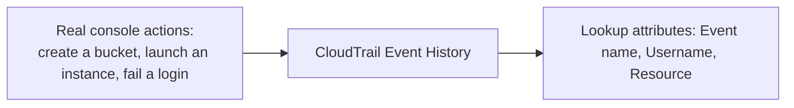

# 07.01 - Hands-On Demo: Finding Your Own Actions in CloudTrail Event History

> Goal: perform a handful of real, deliberately traceable console actions, then find every one of them in CloudTrail's free Event History — proving the "who did what, when, from where" record directly rather than just describing it. Entirely via the **AWS Console**.

---

## 1. What you're building

---

## 2. Step 1 — Generate a few deliberately traceable events

1. **S3 console** → **Create bucket** → `cloudtrail-demo-bucket-<your-name-or-date>` → **Create bucket**.
2. **EC2 console** → **Launch instances** → **Name**: `cloudtrail-demo-instance` → **Amazon Linux 2023** → `t2.micro` → **Proceed without a key pair** → **Launch instance**.
3. **IAM console** → **Users** → note your own IAM username (or, if using the root/account identity, note that instead) — this is the identity you'll search for.

---

## 3. Step 2 — Find the bucket creation event

1. **CloudTrail console** → **Event history**.
2. **Lookup attributes**: **Event name** → enter `CreateBucket` → search.
3. Open the matching event → confirm it shows:
   - **User name**: the identity from Section 2, Step 3.
   - **Event time**: matching when you actually clicked Create bucket.
   - **Source IP address**: your own IP.
   - The full **request parameters**, including the exact bucket name `cloudtrail-demo-bucket-<...>`.

---

## 4. Step 3 — Find the EC2 launch event

1. **Lookup attributes**: **Event name** → `RunInstances` → search.
2. Open the matching event → confirm the **response elements** include the actual **instance ID** of `cloudtrail-demo-instance` — a direct, concrete link between a CloudTrail event and a real resource you can go check right now in the EC2 console.

---

## 5. Step 4 — Find a *failed* action (a genuinely useful security signal)

1. Deliberately try something you don't have permission for, or that will fail — e.g. attempt to **Launch instances** with an intentionally invalid AMI ID, or open the **IAM console** and try to delete your own currently-signed-in user.
2. **CloudTrail console** → **Event history** → **Lookup attributes**: **Event name** → the relevant failed action.
3. Open it → note the **Error code** field (e.g. `AccessDenied` or `ValidationException`) — CloudTrail records **attempts**, not just successes, which is exactly why it's a real security tool, not just an activity log.

---

## 6. Step 5 — Search by identity instead of by action

1. **Lookup attributes**: **Username** → your own identity from Section 2 → search.
2. Confirm **every** event from this demo (bucket creation, instance launch, the failed attempt) shows up together — this is the "what did this specific person do" view, the inverse of Section 3-5's "who did this specific thing" view.

---

## 7. Troubleshooting

| Symptom | Likely cause |
|---|---|
| An action from a minute ago doesn't appear yet | CloudTrail Event History typically has a short delivery delay (usually under 15 minutes) — wait and refresh |
| Searching by **Username** returns nothing | Confirm you're searching for the exact IAM identity that was actually signed in — root account actions show differently than an IAM user's |
| `RunInstances` event exists but has no matching instance in EC2 | The launch may have failed after the API call was accepted — check the event's **Error code** field, same idea as Section 5 |

---

## 8. Cleanup

1. **EC2 console** → terminate `cloudtrail-demo-instance`.
2. **S3 console** → empty and delete `cloudtrail-demo-bucket-<...>`.
3. Nothing to clean up in CloudTrail itself — Event History is a passive, automatic record with no resources you created.

---

## 9. Recap

- Every real action in this demo — a bucket creation, an instance launch, even a **failed** attempt — was independently findable in CloudTrail, searchable either by **what happened** (Event name) or **who did it** (Username).
- CloudTrail recording **failed/denied** attempts, not just successes, is what makes it a genuine security tool rather than just an activity feed.
- This demo only used the free, automatic **90-day Event History** — nothing was configured. The [CloudTrail Trails](09-CloudTrail-Trails.md) note covers what changes once you need retention beyond that window.
- Next: the [CloudTrail Event Types](08-CloudTrail-Event-Types.md) note — the different *categories* of event CloudTrail records, beyond the management-API actions this demo exercised.

### Sources
- [Viewing events with CloudTrail Event history — AWS docs](https://docs.aws.amazon.com/awscloudtrail/latest/userguide/view-cloudtrail-events.html)
- [CloudTrail record contents — AWS docs](https://docs.aws.amazon.com/awscloudtrail/latest/userguide/cloudtrail-event-reference-record-contents.html)
