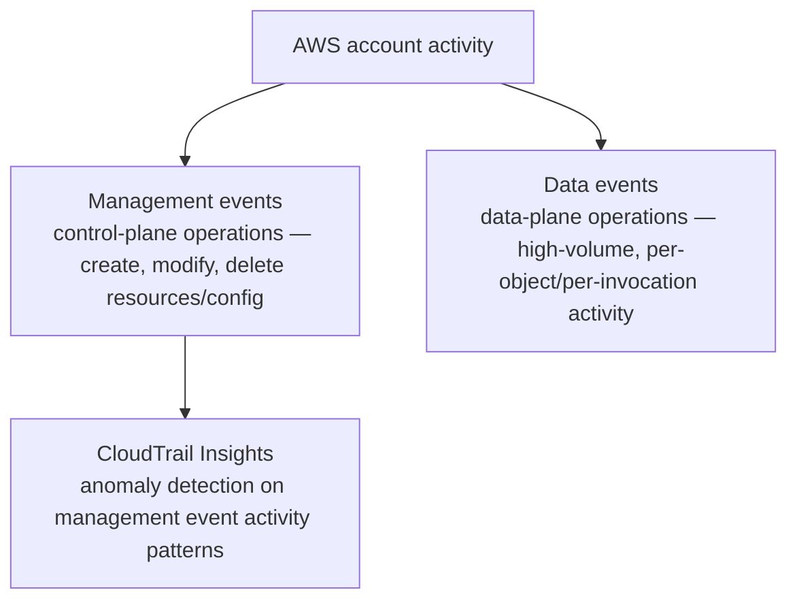

# 08 - CloudTrail Event Types

> Goal: understand that CloudTrail doesn't record just one kind of event — it has genuinely distinct **event types**, each covering a different slice of activity, with real cost and volume implications that matter once you move past the free Event History from the [CloudTrail hands-on demo](07.01-CloudTrail-Demo.md).

---

## 1. The three event types

| Event type | What it covers | Logged by default? |
|---|---|---|
| **Management events** | Control-plane operations on AWS resources — creating an EC2 instance, deleting an S3 bucket, modifying an IAM policy, configuring a security group | **Yes** — included in the free 90-day Event History automatically |
| **Data events** | Data-plane, per-object/per-invocation operations — an individual **S3 `GetObject`/`PutObject`** call, a **Lambda `Invoke`** call | **No** — high-volume by nature (potentially every single object read), so they're opt-in and billed separately when enabled on a Trail |
| **CloudTrail Insights** | Not a record of individual events at all — it's **anomaly detection** applied to your account's management event activity, flagging unusual patterns (e.g. a sudden burst of IAM policy changes) | **No** — opt-in, and specifically analyzes patterns rather than logging new raw events |

---

## 2. Why the management/data distinction matters in practice

- **Management events** answer "who changed the *configuration* of my environment" — this is what most compliance/audit requirements actually care about, and it's why it's on by default.
- **Data events** answer "who *touched the data itself*" — reading a specific S3 object, invoking a specific Lambda function. This can be an enormous volume of events (millions per day on an active S3 bucket), which is exactly why AWS doesn't turn it on by default or include it free — it would be both noisy and expensive at that default-on volume.

> 🎯 **Exam tip**: "we need to know who read a specific sensitive object in this S3 bucket" is a **data event** scenario, not management events — a very common exam trap, since it sounds like ordinary "who did what" CloudTrail territory, but management events alone genuinely won't show individual object reads.

---

## 3. Recap

- **Management events** (control-plane, on by default) and **data events** (data-plane, opt-in, higher volume) are fundamentally different categories, not two names for the same thing.
- **CloudTrail Insights** isn't event logging at all — it's anomaly detection layered on top of management event patterns.
- "Who read/wrote this specific S3 object or invoked this specific Lambda function" needs **data events** explicitly enabled — it's never covered by the default, free Event History.
- Next: the [CloudTrail Trails](09-CloudTrail-Trails.md) note — the mechanism that actually lets you retain, and choose which of these event types to capture, long-term.

### Sources
- [Logging management events for trails — AWS docs](https://docs.aws.amazon.com/awscloudtrail/latest/userguide/logging-management-events-with-cloudtrail.html)
- [Logging data events for trails — AWS docs](https://docs.aws.amazon.com/awscloudtrail/latest/userguide/logging-data-events-with-cloudtrail.html)
- [Identify unusual activity with CloudTrail Insights — AWS docs](https://docs.aws.amazon.com/awscloudtrail/latest/userguide/cloudtrail-insights.html)
