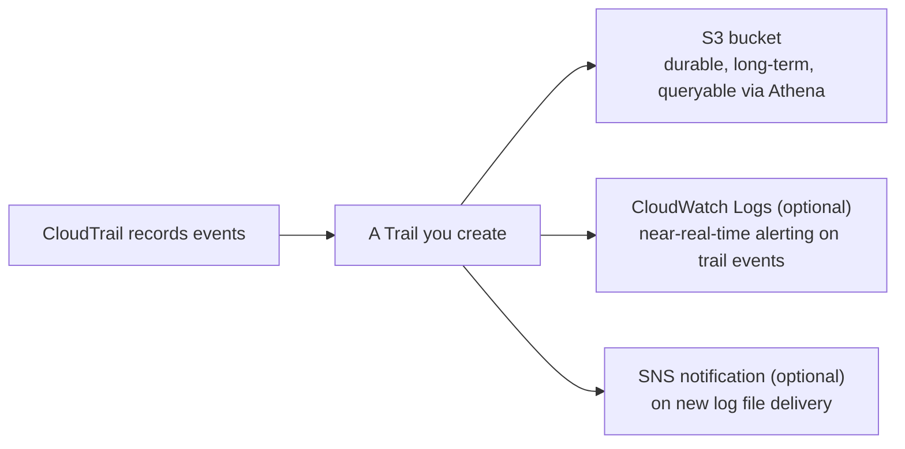

# 09 - CloudTrail Trails: Long-Term Log Collection

> Goal: understand what a **Trail** actually adds on top of the free Event History from the [CloudTrail Introduction](07-AWS-CloudTrail-Introduction.md) note — durable, long-term, queryable-at-scale log storage — and the handful of design choices (multi-Region, organization trail, log file integrity validation) that turn on real compliance-grade guarantees.

---

## 1. The problem: 90 days and "read it in the console" isn't enough for real compliance

Event History is genuinely useful for quick "who did this yesterday" lookups, but it has two hard limits: it only covers **90 days**, and it can only be browsed through the CloudTrail console/API — it isn't sitting anywhere you could run your own long-term analysis, feed into a SIEM, or satisfy a multi-year retention/audit requirement. A **Trail** removes both limits: it continuously delivers CloudTrail events to an **S3 bucket** you own (and optionally **CloudWatch Logs**), for as long as you choose to keep them.

---

## 2. Architecture & workflow

---

## 3. The choices that matter when creating a trail

| Setting | What it controls |
|---|---|
| **Apply trail to all Regions** | A **multi-Region trail** captures events from every AWS Region, including any activity in Regions you don't normally use — the recommended default, since an attacker (or a mistaken script) working in an unused Region would otherwise go completely unlogged by a single-Region trail |
| **Organization trail** | If created from AWS Organizations' management account, applies to **every member account** automatically — the standard way to guarantee no account in a multi-account setup can quietly have its own trail disabled |
| **Management events / Data events / Insights events** | Choose which of the [event types](08-CloudTrail-Event-Types.md) this specific trail actually delivers — data events in particular are opt-in here for cost reasons |
| **Log file SSE-KMS encryption** | Encrypts delivered log files with a KMS key, on top of S3's own default encryption |
| **Log file integrity validation** | Generates a cryptographic digest file alongside each delivered log file — lets you **prove** a log file hasn't been tampered with or deleted after the fact, a genuinely important guarantee for real forensic/compliance use |
| **SNS notification** | Optionally notify a topic every time a new log file is delivered — useful for triggering downstream automated processing |

> 🎯 **Exam tip**: "prove that CloudTrail logs haven't been altered since delivery" → **log file integrity validation**, specifically. "Make sure no Region can be used to bypass logging" → a **multi-Region trail**. These are two different, commonly-confused checkboxes on the same setup screen.

---

## 4. Recap

- A **Trail** is what turns CloudTrail from a 90-day console lookup tool into a durable, S3-backed, long-term audit log — nothing beyond Event History exists until you create one.
- **Multi-Region** and **organization trails** close the specific gap of activity happening somewhere you weren't watching.
- **Log file integrity validation** is the mechanism that proves logs weren't tampered with after delivery — a distinct feature from encryption.
- Next: the [CloudTrail Trail hands-on demo](09.01-CloudTrail-Trail-Demo.md) — creating a real trail, generating an event, and finding it durably stored in S3 well past the point Event History alone would show it.

### Sources
- [Creating a trail for your AWS account — AWS docs](https://docs.aws.amazon.com/awscloudtrail/latest/userguide/cloudtrail-create-and-update-a-trail.html)
- [CloudTrail log file integrity validation — AWS docs](https://docs.aws.amazon.com/awscloudtrail/latest/userguide/cloudtrail-log-file-validation-intro.html)
- [Creating a trail for an organization — AWS docs](https://docs.aws.amazon.com/awscloudtrail/latest/userguide/creating-trail-organization.html)
