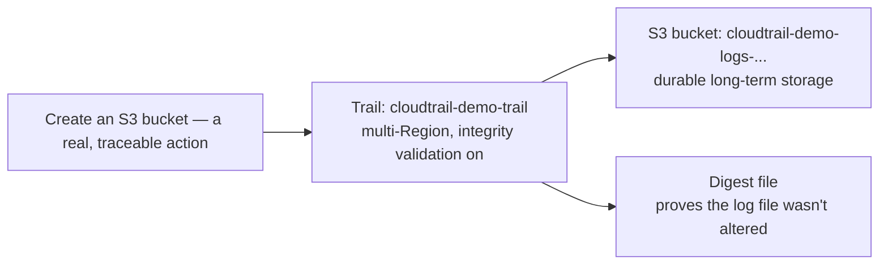

# 09.01 - Hands-On Demo: Creating a Real CloudTrail Trail with Integrity Validation

> Goal: create a real, multi-Region trail with log file integrity validation enabled, generate a traceable event, and find its log file durably sitting in S3 — the concrete proof that a Trail is genuinely a different, more durable mechanism than the free Event History used in the [CloudTrail demo](07.01-CloudTrail-Demo.md). Entirely via the **AWS Console**.

---

## 1. What you're building

---

## 2. Step 1 — Create the trail

1. **CloudTrail console** → **Trails** → **Create trail**.
2. **Trail name**: `cloudtrail-demo-trail`.
3. **Enable for all accounts in my organization**: leave unchecked (single-account demo).
4. **Storage location**: **Create new S3 bucket** → note the auto-generated name, e.g. `cloudtrail-demo-trail-logs-<account-id>`.
5. **Log file SSE-KMS encryption**: leave off for simplicity (or enable if you want to also exercise KMS — not required for this demo).
6. **Enable log file validation**: **Enabled** — this is the setting [CloudTrail Trails](09-CloudTrail-Trails.md) Section 3 called out specifically.
7. **Next** → **Management events**: **Read** and **Write** both checked (default) → leave **Data events** off for this demo → **Next** → review → **Create trail**.
8. Confirm the trail shows **Logging: On**.

---

## 3. Step 2 — Generate a real, traceable event

1. **S3 console** → **Create bucket** → `cloudtrail-trail-demo-target-<your-name-or-date>` → **Create bucket**.
2. This `CreateBucket` call is now being captured by **both** the free Event History **and** the new trail simultaneously.

---

## 4. Step 3 — Find the log file (and its digest) in S3

1. **S3 console** → open `cloudtrail-demo-trail-logs-<account-id>`.
2. Navigate the folder structure: `AWSLogs/<account-id>/CloudTrail/<region>/<year>/<month>/<day>/` — CloudTrail organizes log files by account, Region, and date automatically.
3. Delivery typically takes about **5-15 minutes** after an event occurs — once a `.json.gz` log file appears, download and open it (most OSes can decompress `.gz` directly) → confirm it contains a record of the `CreateBucket` call from Section 3, in the same underlying event format Event History showed, just delivered to durable storage this time.
4. In the same account's log path, look for a parallel `CloudTrail-Digest` folder → open the matching digest file → confirm it references the exact log file from the previous step by name and hash — this is the file that lets you cryptographically prove that log file hasn't been altered since delivery.

---

## 5. Step 4 — Confirm the multi-Region behavior (conceptually verified)

1. Back on the trail's detail page, confirm **Multi-Region trail: Yes**.
2. If you have access to try an action in a different Region than your default (e.g. create a small test resource in `us-west-2` if you normally work in `us-east-1`), do so, and confirm its log file appears under **that** Region's folder path in the same S3 bucket — direct proof one trail genuinely covers every Region, not just the one you happened to create it in.

---

## 6. Troubleshooting

| Symptom | Likely cause |
|---|---|
| No log files appear in S3 after 20+ minutes | Confirm the trail actually shows **Logging: On** — a trail can be created but left stopped |
| Bucket creation via the console failed with an access error | The trail's auto-created bucket policy grants CloudTrail write access automatically during trail creation — if you switched to a manually-created bucket instead, its bucket policy needs the same CloudTrail service permissions added manually |
| Digest file doesn't reference the expected log file | Digest files are delivered on their own schedule (roughly hourly) — the matching digest may simply not have been generated yet |

---

## 7. Cleanup

1. **CloudTrail console** → **Trails** → delete `cloudtrail-demo-trail`.
2. **S3 console** → empty and delete `cloudtrail-demo-trail-logs-<account-id>` and `cloudtrail-trail-demo-target-<...>`.

---

## 8. Recap

- A trail's log files land in a real, durable **S3 bucket**, organized by account/Region/date — genuinely different from Event History's 90-day, console-only view.
- **Log file integrity validation** produces real digest files that cryptographically reference the exact log files they cover — not just a checkbox with no observable effect.
- A **multi-Region trail** delivers events from every Region into the **same** S3 bucket, just under different Region-named folders.
- Next: the [AWS Config](10-AWS-Config.md) note — a different kind of long-term account history, tracking resource *configuration state* over time rather than the *API calls* CloudTrail focuses on.

### Sources
- [Creating a trail for your AWS account — AWS docs](https://docs.aws.amazon.com/awscloudtrail/latest/userguide/cloudtrail-create-and-update-a-trail.html)
- [CloudTrail log file integrity validation — AWS docs](https://docs.aws.amazon.com/awscloudtrail/latest/userguide/cloudtrail-log-file-validation-intro.html)
- [CloudTrail log file examples — AWS docs](https://docs.aws.amazon.com/awscloudtrail/latest/userguide/cloudtrail-log-file-examples.html)
