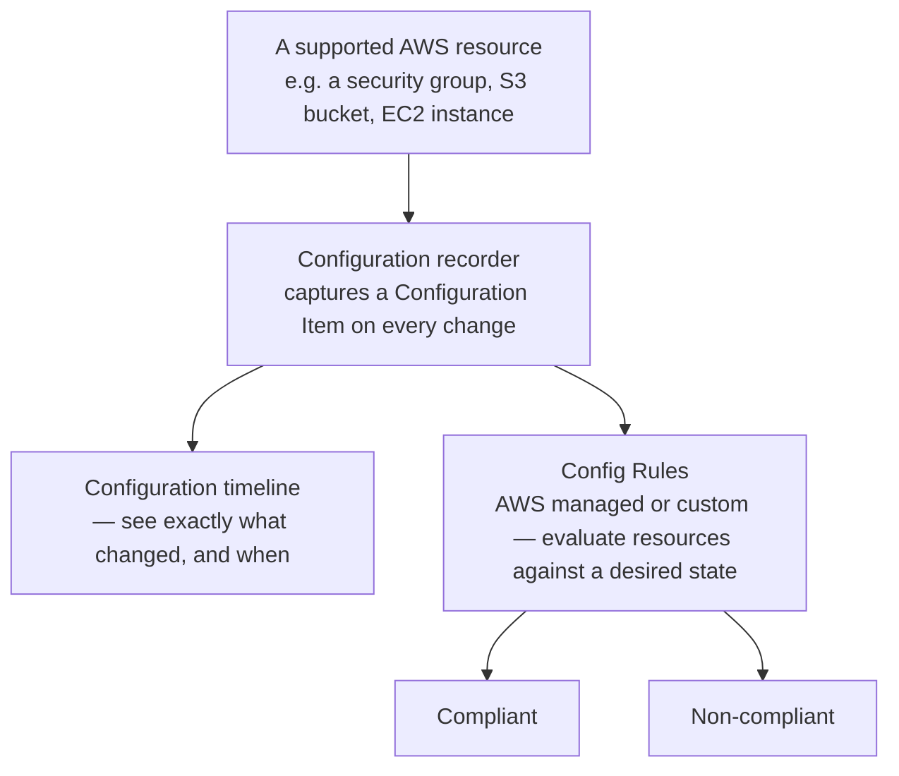

# 10 - AWS Config

> Goal: understand Config's actual job — tracking the **configuration state** of your AWS resources over time, and continuously checking that state against rules you define — which is a third, distinct question from both CloudWatch's "is it healthy" and CloudTrail's "who called what API." The [Config vs. CloudTrail](11-Config-vs-CloudTrail.md) note deals with the most common mix-up directly.

---

## 1. The problem: CloudTrail tells you an API was called, not what actually changed

CloudTrail (from the earlier notes in this folder) records that a `ModifySecurityGroupRules` call happened, by whom, and when. It does **not** give you an easy, structured answer to "what did this security group's rules actually look like *before* and *after* that change" — you'd have to reconstruct that from raw event parameters. **AWS Config** solves this differently: it maintains a continuous, point-in-time **configuration history** for supported resources, and can automatically evaluate whether that configuration is **compliant** with rules you define — "no security group should allow unrestricted SSH," for example — flagging violations without anyone having to go looking.

---

## 2. Architecture & workflow

---

## 3. The two halves of Config

| Half | What it does |
|---|---|
| **Configuration recorder** | Continuously records a **Configuration Item (CI)** — a full snapshot of a resource's configuration — every time a tracked resource changes, building a genuine timeline you can scroll back through |
| **Config Rules** | Automated compliance checks, run against that recorded configuration — **AWS managed rules** cover common best practices out of the box (e.g. `s3-bucket-public-read-prohibited`, `restricted-ssh`), and **custom rules** (backed by a Lambda function) can encode anything specific to your own organization's policy |

---

## 4. What makes Config genuinely useful beyond "just another dashboard"

- **Configuration timeline** — for any tracked resource, see its exact configuration at any past point in time, and exactly what changed between two points, not just "an API call happened."
- **Continuous compliance, not a one-time scan** — a rule keeps evaluating every time a relevant resource changes, so drift back into non-compliance (e.g. someone re-opens port 22 to `0.0.0.0/0` a month later) gets caught automatically.
- **Conformance packs** — a bundle of Config rules (plus remediation actions) deployable as one unit, often based on a specific compliance framework, rather than enabling dozens of rules by hand.
- **Automatic remediation** — a non-compliant finding can trigger an SSM Automation document to actually fix the problem, not just report it.

> 🎯 **Exam tip**: "continuously check that resources stay compliant with an organizational policy, and alert or auto-remediate when they drift" is the clearest Config signal — if the scenario is instead about **who performed an action**, that's CloudTrail; if it's about **resource health/performance**, that's CloudWatch.

---

## 5. Recap

- Config tracks **configuration state over time** and evaluates it against **rules** — a fundamentally different concern from CloudTrail's API-call audit trail.
- **Configuration Items** build a real timeline per resource; **Config Rules** (managed or custom) continuously check compliance, not just once.
- **Conformance packs** bundle rules for a whole framework at once; **automatic remediation** can fix drift, not just flag it.
- Next: the [AWS Config hands-on demo](10.01-AWS-Config-Demo.md) — enabling Config for real, attaching a managed rule, and watching a real resource get flagged non-compliant.

### Sources
- [What is AWS Config? — AWS docs](https://docs.aws.amazon.com/config/latest/developerguide/WhatIsConfig.html)
- [AWS Config Managed Rules — AWS docs](https://docs.aws.amazon.com/config/latest/developerguide/managed-rules-by-aws-config.html)
- [Conformance packs — AWS docs](https://docs.aws.amazon.com/config/latest/developerguide/conformance-packs.html)
