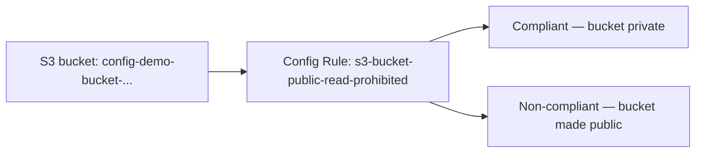

# 10.01 - Hands-On Demo: Catching a Real Public S3 Bucket with an AWS Config Rule

> Goal: enable Config for real, attach the `s3-bucket-public-read-prohibited` managed rule, and watch a real bucket flip from **Compliant** to **Non-compliant** the moment you actually make it public — direct proof of continuous, automatic compliance checking rather than a one-time scan. Entirely via the **AWS Console**.

---

## 1. What you're building

---

## 2. Step 1 — Enable AWS Config with 1-click setup

1. **AWS Config console** → (first time in this Region) → **1-click setup**.
2. Review the **Review** step's defaults: **Settings** (all resource types, continuous recording, 7-year retention, a new `config-bucket-<account-id>` S3 bucket), **Rules** (none pre-selected).
3. **Confirm**. AWS Config starts recording immediately — the **configuration recorder** from [AWS Config](10-AWS-Config.md) Section 3 is now live.

---

## 3. Step 2 — Create the bucket to test against

1. **S3 console** → **Create bucket** → `config-demo-bucket-<your-name-or-date>` → leave **Block all public access** checked (the default) → **Create bucket**.

---

## 4. Step 3 — Add the managed rule

1. **AWS Config console** → **Rules** → **Add rule**.
2. Search for **`s3-bucket-public-read-prohibited`** → select it (an **AWS managed rule** — no Lambda function to write).
3. Leave the default trigger type (**configuration changes**) → **Save**.
4. Wait a minute or two for the initial evaluation, then confirm `config-demo-bucket-<...>` shows **Compliant** — matching its current private state.

---

## 5. Step 4 — Make the bucket public and watch the rule catch it

1. **S3 console** → open `config-demo-bucket-<...>` → **Permissions** tab.
2. **Block public access** → **Edit** → uncheck **Block all public access** → confirm.
3. **Bucket policy** → **Edit** → add a policy granting `s3:GetObject` to `"Principal": "*"` for this bucket's objects → **Save changes**. (This is a deliberate, temporary demo action — reverted in Section 7.)
4. **AWS Config console** → **Rules** → open `s3-bucket-public-read-prohibited` → within a few minutes, `config-demo-bucket-<...>` should flip to **Non-compliant** — Config re-evaluated automatically the moment the bucket's configuration actually changed, with no manual re-scan triggered.

---

## 6. Step 5 — View the resource's configuration timeline

1. **AWS Config console** → **Resources** → search for `config-demo-bucket-<...>` → open it.
2. Open the **Configuration timeline** tab → confirm there are now **two distinct configuration snapshots** — the original private state, and the public-access change from Section 5 — each timestamped, each showing the specific attributes that differ.
3. This is the concrete difference [AWS Config](10-AWS-Config.md) Section 1 described: not just "a `PutBucketPolicy` API call happened" (which is what CloudTrail alone would show), but the bucket's **actual resulting configuration**, before and after.

---

## 7. Step 6 — Revert and confirm it flips back to Compliant

1. **S3 console** → `config-demo-bucket-<...>` → **Permissions** → remove the bucket policy added in Section 5, and re-enable **Block all public access**.
2. **AWS Config console** → **Rules** → `s3-bucket-public-read-prohibited` → confirm the bucket returns to **Compliant** after the next evaluation — proving this is genuinely **continuous**, not a one-time pass/fail check.

---

## 8. Troubleshooting

| Symptom | Likely cause |
|---|---|
| Rule stays on **Evaluating...** for a long time | Normal briefly after adding a new rule — Config needs to run its first evaluation pass across existing resources |
| Bucket doesn't flip to **Non-compliant** after Section 5 | Confirm the bucket policy actually saved (check for a JSON syntax error), and that **Block Public Access** was genuinely disabled, not just attempted |
| Configuration timeline shows only one entry | The bucket's public-access change may not have registered as a distinct recorded attribute yet — allow a few minutes and refresh |

---

## 9. Cleanup

1. **AWS Config console** → **Rules** → delete `s3-bucket-public-read-prohibited`.
2. **AWS Config console** → **Settings** → stop the configuration recorder (optional — leaving it on has ongoing evaluation costs but no security downside).
3. **S3 console** → empty and delete `config-demo-bucket-<...>`, and the auto-created `config-bucket-<account-id>` bucket if you don't plan to keep using Config.

---

## 10. Recap

- **1-click setup** gets Config recording every supported resource type with sane defaults in one confirmation — no manual bucket/IAM-role wiring needed.
- A **managed rule** needed no code — `s3-bucket-public-read-prohibited` is a ready-made check for exactly the scenario this demo built.
- The rule **re-evaluated automatically** the moment the bucket's actual configuration changed, both going non-compliant and coming back — genuinely continuous, not a one-time scan.
- The **configuration timeline** showed the bucket's real before/after state, a level of detail CloudTrail's API-call log alone doesn't give you directly.
- Next: the [Config vs. CloudTrail](11-Config-vs-CloudTrail.md) note — making that exact distinction explicit and exam-ready.

### Sources
- [1-click setup for AWS Config — AWS docs](https://docs.aws.amazon.com/config/latest/developerguide/1-click-setup.html)
- [s3-bucket-public-read-prohibited — AWS Config Managed Rules docs](https://docs.aws.amazon.com/config/latest/developerguide/s3-bucket-public-read-prohibited.html)
- [Viewing configuration details — AWS docs](https://docs.aws.amazon.com/config/latest/developerguide/viewing-configuration-details.html)
