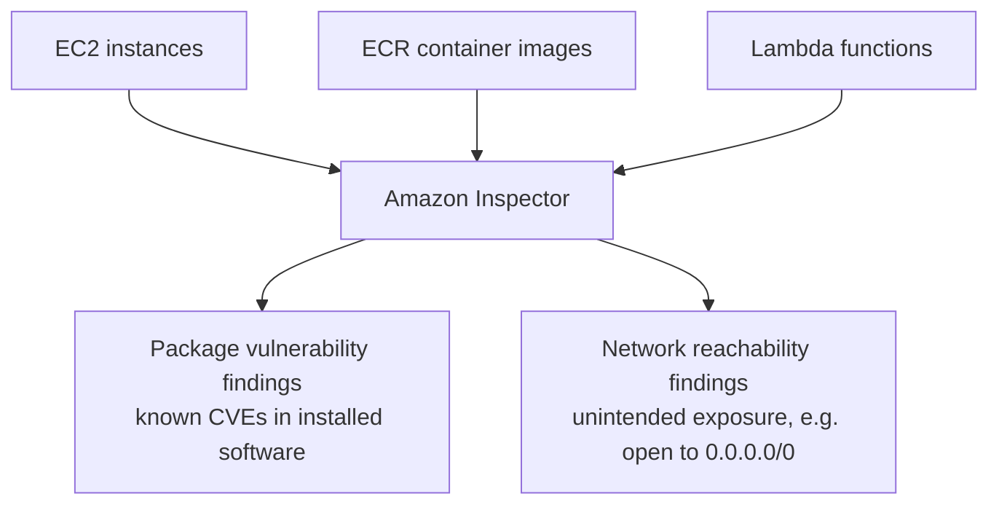

# 13 - Amazon Inspector

> Goal: understand Inspector's job — **automated vulnerability scanning**, finding known security flaws in software and network exposure *before* something exploits them — and how it actually collects the data it needs, since that mechanism (agent-based vs. agentless) has real implications for what an EC2 instance needs configured beforehand.

---

## 1. The problem: knowing a CVE exists is different from knowing you're exposed to it

New software vulnerabilities (CVEs) are published constantly. The hard part was never "does this CVE exist" — it's "**do any of my actual running resources have the vulnerable package version installed, and can that vulnerability actually be reached over the network**." **Amazon Inspector** automates exactly this: it continuously scans EC2 instances, container images (ECR), and Lambda functions for known package vulnerabilities, and separately checks EC2 network configuration for unintended reachability, producing prioritized **findings** instead of requiring anyone to manually track CVE feeds against an inventory.

---

## 2. Architecture & workflow

---

## 3. How EC2 scanning actually collects data — two methods, used together

| Method | How it works | What it needs |
|---|---|---|
| **Agent-based** | Uses the instance's own **SSM Agent** to collect installed-package inventory continuously, and can also scan **application-language packages** (deep inspection), not just OS packages | The instance must be an **SSM-managed instance** — same requirement as the [CloudWatch Agent](02-CloudWatch-Agent.md) note's Section 5 |
| **Agentless** | Takes a temporary **EBS snapshot** of the instance's volumes, reads it via EBS direct APIs, then deletes the snapshot — no agent, no SSM management needed at all | Just needs the instance to be EBS-backed with a supported filesystem — nothing installed or configured on the instance itself |

When you activate EC2 scanning for the first time, your account is automatically enrolled in **hybrid scanning** — Inspector uses agent-based scanning for any instance that's already SSM-managed, and **automatically falls back to agentless scanning** for any instance that isn't. This means **every eligible EC2 instance gets scanned either way**, without you having to guarantee SSM management everywhere first.

> 🧠 This directly mirrors this folder's recurring theme: the [CloudWatch Agent](02-CloudWatch-Agent.md) note showed data that's simply invisible without something running inside the OS. Inspector's agentless mode is the interesting exception — it gets *most* of the same value (OS package versions) without needing that inside-the-OS presence at all, by reading the disk from outside via a snapshot instead.

---

## 4. Activation — account-level and scan-type-specific

Inspector isn't a per-resource opt-in — it's activated **per scan type, per account, per Region**: EC2 scanning, ECR scanning, and Lambda scanning are each turned on independently from the **Account management** page. Once EC2 scanning is on, it applies automatically to all eligible instances in that account/Region — no per-instance setup beyond what Section 3 describes.

---

## 5. Findings and prioritization

Every finding gets a severity (informational through critical) and, for package vulnerabilities, an **Inspector score** that factors in real exploitability context, not just the CVE's raw severity — helping prioritize which of potentially hundreds of findings actually need attention first.

> 🎯 **Exam tip**: "automatically and continuously scan EC2/ECR/Lambda for known vulnerabilities, without a separate agent required on every instance" is the clearest Inspector signal — the **agentless fallback** specifically is what makes "without requiring an agent everywhere" a true statement, worth remembering as a specific, testable detail rather than a general impression.

---

## 6. Recap

- Inspector produces two distinct finding types: **package vulnerabilities** (known CVEs in installed software) and **network reachability** (unintended exposure).
- EC2 scanning uses **hybrid scanning** by default — agent-based (via SSM) where available, **agentless** (via a temporary EBS snapshot) everywhere else — so coverage doesn't depend on every instance being SSM-managed.
- Activation is **account/Region-level, per scan type** (EC2, ECR, Lambda) — not something enabled resource by resource.
- Next: the [Amazon Inspector hands-on demo](13.01-Amazon-Inspector-Demo.md) — activating scanning for real and reviewing genuine findings on a real EC2 instance.

### Sources
- [Amazon Inspector user guide — AWS docs](https://docs.aws.amazon.com/inspector/latest/user/what-is-inspector.html)
- [Scanning Amazon EC2 instances with Amazon Inspector — AWS docs](https://docs.aws.amazon.com/inspector/latest/user/scanning-ec2.html)
- [Activating a scan type — AWS docs](https://docs.aws.amazon.com/inspector/latest/user/activate-scans.html)
