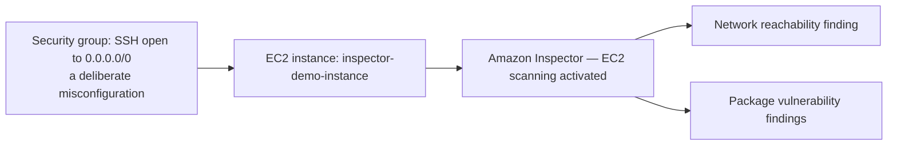

# 13.01 - Hands-On Demo: Activating Inspector and Reviewing Real Findings

> Goal: activate Amazon Inspector for real, deliberately create both a genuine **network reachability** finding and an environment for **package vulnerability** scanning, then watch agentless scanning cover the instance immediately — and confirm what changes once it becomes SSM-managed. Entirely via the **AWS Console**.

---

## 1. What you're building

---

## 2. Part 1 — Activate scanning and scan an unmanaged instance agentlessly

### Step 1 — Activate Amazon Inspector for EC2

1. **Amazon Inspector console** → **Account management**.
2. Select your account → **Activate** → **EC2**.
3. Confirm the account now shows EC2 scanning as **Enabled**.

### Step 2 — Launch a deliberately exposed instance, with no SSM role

1. **EC2 console** → **Launch instances** → **Name**: `inspector-demo-instance`.
2. **AMI**: **Amazon Linux 2023** → **Instance type**: `t2.micro` → **Key pair**: **Proceed without a key pair**.
3. **Network settings** → **Edit** → **Firewall (security groups)**: create a new one, and explicitly add an inbound rule: **Type**: SSH, **Source**: **Anywhere (0.0.0.0/0)** — a deliberate, real misconfiguration for this demo.
4. **Advanced details** → **IAM instance profile**: leave **blank** — deliberately keeping this instance **unmanaged** by SSM, so Section 2's agentless path is what actually covers it.
5. **Launch instance**.

### Step 3 — Wait for agentless scanning to pick it up

1. **Amazon Inspector console** → **Account management** → **Instances** tab → find `inspector-demo-instance`.
2. Since it has no SSM role, its scan method should show as **agentless** — Inspector detects newly eligible unmanaged instances roughly every hour, so allow up to that long for the first scan, though it's often faster.
3. Once scanned, **Findings** → filter by resource → confirm both a **network reachability** finding (referencing the open SSH port) and, depending on the AMI's exact package versions, some **package vulnerability** findings appear.

---

## 3. Part 2 — Upgrade it to agent-based scanning and compare

### Step 4 — Attach the IAM role that makes it SSM-managed

1. **IAM console** → **Roles** → **Create role** → **AWS service** → **EC2** → attach **`AmazonSSMManagedInstanceCore`** → name it `inspector-demo-ssm-role` → **Create role**.
2. **EC2 console** → select `inspector-demo-instance` → **Actions** → **Security** → **Modify IAM role** → select `inspector-demo-ssm-role` → **Update IAM role**.
3. Wait a few minutes, then confirm in **Systems Manager console** → **Fleet Manager** that the instance now shows as a managed node.

### Step 5 — Confirm Inspector switches scan methods

1. **Amazon Inspector console** → **Account management** → **Instances** tab → `inspector-demo-instance` should now show its scan method as **agent-based**, since it became SSM-managed after Section 3.
2. Findings continue to be tracked under the same instance — the underlying resource didn't change, only *how* Inspector collects its inventory did, directly matching [Amazon Inspector](13-Amazon-Inspector.md) Section 3's hybrid-scanning explanation.

### Step 6 — Review and understand a finding in depth

1. **Findings** → open any **package vulnerability** finding on this instance.
2. Note the **Inspector score**, the **CVE ID**, the specific **vulnerable package and installed version**, and the **fixed version** it recommends upgrading to — this is the concrete, actionable output the whole service exists to produce.
3. Open the **network reachability** finding from Section 2, Step 3 → confirm it explicitly names the offending security group rule (SSH from `0.0.0.0/0`) as the reachability path.

---

## 4. Troubleshooting

| Symptom | Likely cause |
|---|---|
| No findings appear at all after an hour | Confirm EC2 scanning genuinely shows **Enabled** on the Account management page — activation itself can silently fail to save if you navigate away too early |
| Instance never shows an **agent-based** scan method after Section 5 | Recheck the IAM role actually attached successfully (Section 4, Step 2) and that the instance shows as a managed node in Systems Manager first |
| Network reachability finding doesn't appear | These evaluate on a roughly 12-hour cadence — allow more time, or recheck the security group rule was saved with source `0.0.0.0/0` exactly |

---

## 5. Cleanup

1. **Amazon Inspector console** → **Account management** → **Deactivate** EC2 scanning (optional, if not continuing to use it).
2. **EC2 console** → terminate `inspector-demo-instance`, and delete its security group.
3. **IAM console** → delete `inspector-demo-ssm-role`.

---

## 6. Recap

- **Activation happens once, account/Region-wide** — after that, every eligible instance gets covered automatically, with **agentless** as the default fallback for anything not SSM-managed.
- This demo's own instance **changed scan methods live** — agentless at launch, agent-based after attaching the SSM role — without losing finding history, direct proof of the hybrid model.
- A deliberately open security group produced a real, specific **network reachability finding**, not just a generic warning — confirming Inspector checks actual exposure, not just installed software.
- Next: the [AWS Trusted Advisor](14-AWS-Trusted-Advisor.md) note — a broader, checklist-style advisor covering cost, performance, and fault tolerance in addition to security, and a natural point of comparison to Inspector.

### Sources
- [Activating a scan type — AWS docs](https://docs.aws.amazon.com/inspector/latest/user/activate-scans.html)
- [Scanning Amazon EC2 instances with Amazon Inspector — AWS docs](https://docs.aws.amazon.com/inspector/latest/user/scanning-ec2.html)
- [Amazon Inspector finding types — AWS docs](https://docs.aws.amazon.com/inspector/latest/user/findings-types.html)
