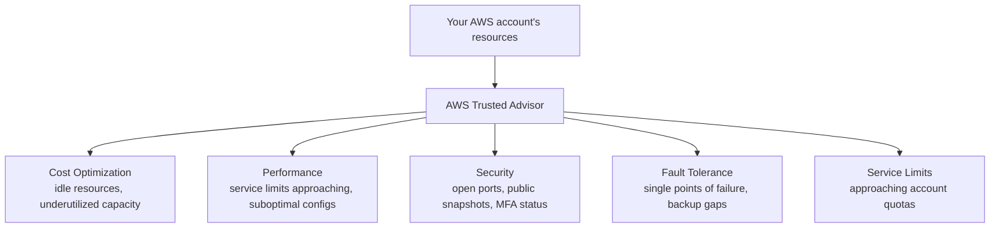

# 14 - AWS Trusted Advisor

> Goal: understand Trusted Advisor as an automated **best-practices checklist** across five categories — not just security — and the real, current (2026) support-plan requirement to unlock its full check library, since this is a specific detail that's genuinely changed recently.

---

## 1. The problem: best practices exist, but nobody checks every resource against all of them by hand

AWS has decades of accumulated operational wisdom about what tends to go wrong — unencrypted snapshots left public, idle load balancers quietly costing money, security groups with unrestricted access, single-AZ deployments with no failover. **AWS Trusted Advisor** automates checking your actual account against this accumulated wisdom, across five distinct categories, and reports the gaps directly — no manual audit checklist required.

---

## 2. Architecture & workflow

---

## 3. What's free vs. what needs a paid support tier

| Tier | What you get |
|---|---|
| **Basic (free, every account)** | A **core set of checks** — including all **Service Limits** checks, and a handful of critical security checks: publicly accessible S3 buckets, public EBS/RDS snapshots, unrestricted access on common high-risk ports, and whether MFA is enabled on the root account |
| **Full check library** | Requires **Business Support+** or higher — as of AWS's 2026 support-plan changes, this is the current name/tier for what used to simply be called "Business or Enterprise support" in older material. Full access unlocks the complete set (roughly 480+ checks) across all five categories, not just the free security subset |

> ⚠️ If you're studying from older material that just says "Business and Enterprise support plans unlock full Trusted Advisor" — that's directionally still true, but the specific plan name has changed: **Business Support+** is the current 2026 floor for full check access, replacing the older plain "Business Support" tier for this purpose. The underlying exam concept — *free tier gets a security-critical subset plus limits, paid tiers get everything* — hasn't changed; only the specific plan name has.

---

## 4. A light real walkthrough — reading the console

1. **AWS Support Center console** → **Trusted Advisor**.
2. **Recommendations** page shows every check available to your account's support tier, each flagged **red** (action recommended), **yellow** (investigation recommended), or **green** (no problem detected).
3. On the **Basic** support tier, most checks will show as **greyed out/unavailable** rather than evaluated — this is expected, not a bug, and matches Section 3's tier breakdown exactly.
4. Open any available check (e.g. **Security Groups - Specific Ports Unrestricted**) → it lists the actual specific resources involved, not just a category-level warning.

---

## 5. Recap

- Trusted Advisor covers **five categories** — Cost Optimization, Performance, Security, Fault Tolerance, and Service Limits — not security alone.
- The **free Basic tier** covers Service Limits checks plus a handful of critical security checks (public S3/snapshots, open high-risk ports, root MFA); the **full ~480+ check library** needs **Business Support+** (2026's current name for that requirement).
- Reading the console directly shows exactly why a Basic-tier account sees most checks greyed out — a real, visible consequence of Section 3's table, not just a stated fact.
- Next: the [Amazon Inspector vs. AWS Trusted Advisor](15-Inspector-vs-Trusted-Advisor.md) note — the final comparison in this folder, since both surface "problems with your account" but from very different angles.

### Sources
- [AWS Trusted Advisor check reference — AWS docs](https://docs.aws.amazon.com/awssupport/latest/user/trusted-advisor-check-reference.html)
- [AWS Trusted Advisor — AWS product page](https://aws.amazon.com/premiumsupport/technology/trusted-advisor/)
- [AWS Support plan comparison — AWS](https://aws.amazon.com/premiumsupport/plans/)
