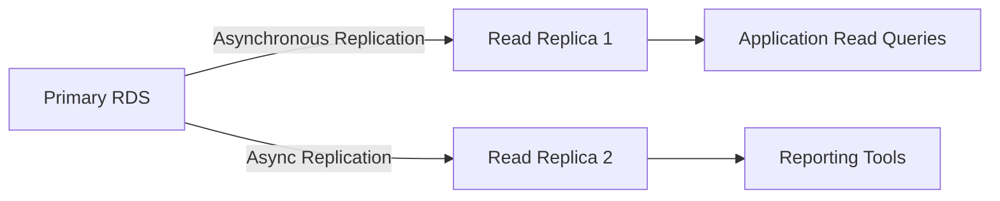
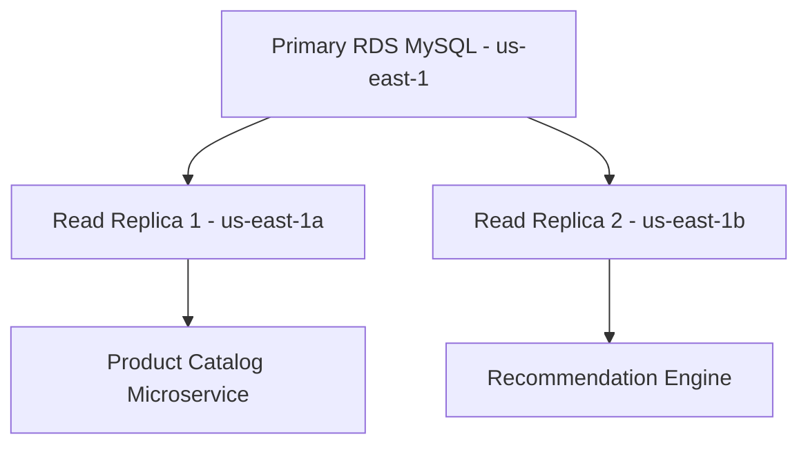
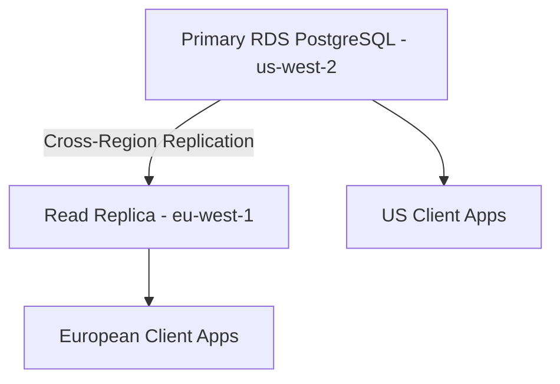
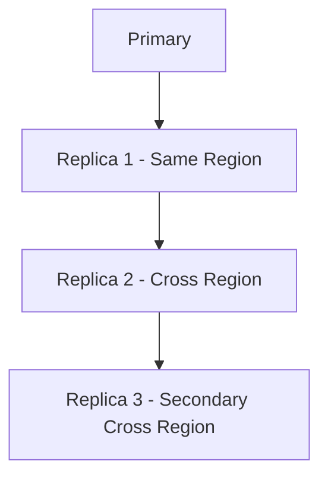
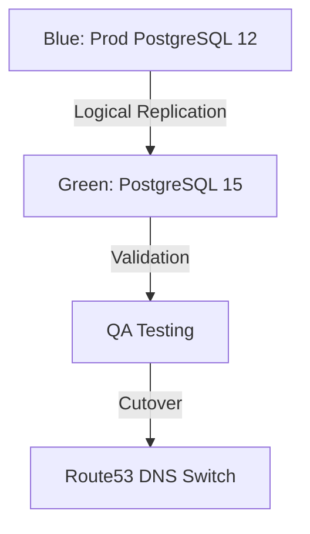

### 📘 **Relational Database Service (RDS) – Overview**

**AWS RDS (Relational Database Service)** is a **managed service** that makes it easier to **set up, operate, and scale** a relational database in the cloud.

It automates common administrative tasks such as:

* Provisioning hardware
* Database setup
* Patching
* Backups
* Recovery
* Monitoring

---

### ✅ **Key Features of RDS**

* **Multi-AZ Deployment** for high availability
* **Automated Backups & Snapshots**
* **Read Replicas** for scaling read traffic
* **Monitoring with Amazon CloudWatch**
* **VPC Integration** for network isolation
* **Encryption** using AWS KMS

---

### 🛠️ **Supported Database Engines in RDS**

RDS supports 6 popular relational database engines:

| Engine            | Description / Use Case                           |
| ----------------- | ------------------------------------------------ |
| **Amazon Aurora** | AWS-optimized, high-performance MySQL/PostgreSQL |
| **MySQL**         | Widely-used open-source database                 |
| **PostgreSQL**    | Advanced open-source relational DB (extensible)  |
| **MariaDB**       | MySQL-compatible, community-driven               |
| **Oracle**        | Enterprise-grade, licensed database              |
| **SQL Server**    | Microsoft’s commercial DB engine                 |

---

### 🌐 **Real-World Example**

You’re building a **banking application** with 3 tiers: frontend, backend (Java), and database.

* You use **RDS PostgreSQL** as the backend database.
* You enable **Multi-AZ** for high availability.
* You create **read replicas** to handle reporting traffic.
* Backups are scheduled automatically every night.

➡️ You don’t worry about patches, provisioning, or failovers — AWS RDS handles it.

---

### 🔄 **RDS vs. Other AWS Database Services**

| AWS Service            | When to Use It                                        |
| ---------------------- | ----------------------------------------------------- |
| **RDS**                | For traditional SQL workloads needing full control    |
| **Amazon Aurora**      | Need high performance + availability (5x MySQL speed) |
| **Amazon DynamoDB**    | For NoSQL, key-value workloads                        |
| **Amazon Redshift**    | For analytics/data warehousing (OLAP)                 |
| **Amazon ElastiCache** | For in-memory caching                                 |
| **Amazon Neptune**     | For graph databases (social network-type data)        |

---

### 🧠 Summary (for notes)

* **RDS is a fully managed SQL database service** by AWS.
* Supports 6 popular engines like MySQL, PostgreSQL, Oracle, and Aurora.
* **Automates backups, scaling, patching, and replication.**
* **Use RDS when you need traditional relational databases** without managing the infra.
* Aurora is a faster, cloud-native alternative to MySQL/PostgreSQL.
* Use **DynamoDB** for NoSQL, **Redshift** for analytics, and **ElastiCache** for caching layers.

---

---

### 📘 **Introduction to Databases & DBMS**

#### 🔹 What is a **Database**?

A **database** is an organized collection of data that can be easily accessed, managed, and updated.

> Think of it as a digital file cabinet where structured information is stored.

#### 🔹 What is a **DBMS (Database Management System)?**

A **DBMS** is software that interacts with users, applications, and the database itself to capture and analyze data.

It helps in:

* Data storage, retrieval, and update
* Security and access control
* Backup and recovery

---

### 🛠️ **Types of Databases (by structure)**

| Type                       | Description                                  | Example Use Case                        |
| -------------------------- | -------------------------------------------- | --------------------------------------- |
| **Relational (SQL)**       | Stores data in tables with rows and columns  | Banking system, ERP, CRM                |
| **NoSQL (Non-Relational)** | Schema-less, key-value, document, graph etc. | Social media, IoT, gaming               |
| **In-memory**              | Extremely fast, stores data in RAM           | Session store, real-time analytics      |
| **Time-series**            | Optimized for time-stamped data              | IoT sensors, monitoring logs            |
| **Ledger**                 | Immutable, cryptographically verifiable      | Financial transactions, audit logs      |
| **Graph**                  | Represents relationships using nodes/edges   | Social networks, recommendation engines |

---

### 🧰 **AWS Database Services & Types**

| Category             | AWS Service            | Engine/Description                                |
| -------------------- | ---------------------- | ------------------------------------------------- |
| **Relational (SQL)** | **Amazon RDS**         | MySQL, PostgreSQL, Oracle, MariaDB, SQL Server    |
|                      | **Amazon Aurora**      | Cloud-native MySQL/PostgreSQL-compatible          |
| **NoSQL**            | **Amazon DynamoDB**    | Key-value, document-based NoSQL DB                |
| **In-Memory**        | **Amazon ElastiCache** | Redis or Memcached                                |
| **Time-Series**      | **Amazon Timestream**  | Purpose-built for time-series data                |
| **Graph**            | **Amazon Neptune**     | Graph database supporting Gremlin/ SPARQL         |
| **Ledger**           | **Amazon QLDB**        | Immutable, cryptographically verifiable ledger DB |
| **Data Warehouse**   | **Amazon Redshift**    | For analytics, OLAP workloads                     |

---

### 📌 Example for Clarity:

Say you're building a **fitness tracking app**:

* Use **RDS MySQL** to store user profile and login info.
* Use **DynamoDB** to store unstructured workout records and logs.
* Use **Timestream** to store and analyze time-based heart rate or step data.
* Use **ElastiCache Redis** to cache user sessions.
* Use **Redshift** to generate business insights from user activity.

---

### 🧠 Summary (for notes)

* A **DBMS manages the database** and performs operations like querying, storing, and securing data.
* **Databases are categorized** based on data structure: SQL, NoSQL, time-series, graph, etc.
* AWS offers a **broad suite of database services** for each use case:

  * RDS/Aurora → SQL
  * DynamoDB → NoSQL
  * ElastiCache → In-memory
  * Neptune → Graph
  * Timestream → Time-series
  * Redshift → Analytics/Data Warehousing

---


---

## 📘 **What is a Relational Database (RDB) & Relational Database Service (RDS)?**

### 🔹 **Relational Database (RDB)**

A **Relational Database** organizes data into **tables** (rows and columns), where each table is related to others through **keys**.

> Example: In a banking app, you may have a `Users` table and a `Transactions` table linked by `user_id`.

---

### 🔹 **Relational Database Service (RDS)**

**Amazon RDS** is a **fully managed service** for relational databases in AWS. It takes care of:

* Hardware provisioning
* DB installation and setup
* Backups, patching, monitoring
* Replication and scaling

✅ It supports popular relational DB engines: **MySQL, PostgreSQL, MariaDB, Oracle, SQL Server**, and **Aurora**.

---

## ✅ **Common Use Cases for RDS**

| Use Case                             | Description                                     |
| ------------------------------------ | ----------------------------------------------- |
| **Web & Mobile Apps**                | Store user data, sessions, and profiles         |
| **eCommerce Platforms**              | Store products, orders, transactions            |
| **ERP/CRM Systems**                  | Manage employees, customers, inventory, finance |
| **Content Management Systems (CMS)** | Blogs, publishing, media platforms              |
| **Financial Applications**           | Store secure and consistent transactional data  |
| **Healthcare/HR Systems**            | Relational, structured, compliant data storage  |

---

## 🏷️ **Key RDS Terminologies with Explanation & Examples**

| Term                    | Description                                                       | Example                                        |
| ----------------------- | ----------------------------------------------------------------- | ---------------------------------------------- |
| **DB Instance**         | A single RDS database environment (like a virtual machine for DB) | `db.t3.medium` running MySQL 8.0               |
| **DB Engine**           | The type of database (MySQL, PostgreSQL, etc.)                    | Aurora PostgreSQL                              |
| **Multi-AZ Deployment** | High availability setup with standby in another AZ                | Automatic failover in case of outage           |
| **Read Replica**        | Read-only copy of DB for scaling read queries                     | Reporting or analytics queries                 |
| **Storage Type**        | The storage backend used (GP2, GP3, IO1)                          | General Purpose SSD (gp3)                      |
| **Parameter Group**     | Configuration settings for the DB engine                          | Turn on slow query logging                     |
| **Option Group**        | Additional features for engines like Oracle/SQL Server            | Enable Oracle TDE                              |
| **Subnet Group**        | Set of subnets in VPC where DB can be launched                    | Public vs Private subnet                       |
| **Security Group**      | Acts as a firewall to control inbound/outbound DB access          | Allow app server IP on port 3306               |
| **Snapshot**            | Backup of the entire DB instance at a point in time               | Daily backups at midnight                      |
| **Endpoint**            | Hostname used by app to connect to the database                   | `mydb.abcdefg123.ap-south-1.rds.amazonaws.com` |

---

## 🧠 Summary (For Your Notes)

* **RDS** is a **managed service** to run relational databases like MySQL, PostgreSQL, and Aurora.
* It’s used in **web apps, financial systems, CMS, ERP**, and more.
* Key concepts include: **DB Instance, Engine, Multi-AZ, Read Replica, Snapshots, Security Group, Parameter Group**.
* AWS **abstracts away infrastructure management** so you can focus on the application layer.

---

✅ **Real Example Scenario**

> You're deploying a CRM application for a company:
>
> * You choose **RDS PostgreSQL**.
> * Configure it as **Multi-AZ** for high availability.
> * Add a **Read Replica** for analytics.
> * Enable **automated backups** with a 7-day retention period.
> * Use **CloudWatch** for monitoring DB performance.

---


---

## 📘 **Core Terminologies in Relational Databases (RDBMS)**

These concepts apply whether you're using MySQL, PostgreSQL, Oracle, or any relational system — including RDS.

---

### 🧱 **1. Table**

* A **table** is a collection of related data in rows and columns.
* Each table represents a single entity (like customers, orders, etc.).

📌 *Example:*

```sql
CREATE TABLE Customers (
  id INT PRIMARY KEY,
  name VARCHAR(100),
  email VARCHAR(100)
);
```

---

### 🔑 **2. Primary Key**

* A **primary key** uniquely identifies each row in a table.
* It must be **unique** and **not null**.

📌 *Example:* `id` in the `Customers` table.

---

### 🔗 **3. Foreign Key**

* A **foreign key** links one table to another.
* It enforces **referential integrity** between related tables.

📌 *Example:* `customer_id` in `Orders` referencing `Customers(id)`

---

### 📚 **4. Schema**

* A **schema** is a logical container for database objects like tables, views, and procedures.
* Think of it as a **namespace** or folder.

📌 *Example:* `public.customers` in PostgreSQL

---

### 🧾 **5. Row (Record)**

* A **row** is a single entry in a table.
* It contains data for all columns defined.

📌 *Example:* One customer: `(1, 'Deepak', 'deepak@email.com')`

---

### 📐 **6. Column (Field)**

* A **column** defines a data type and name for an attribute.
* Columns make up the structure of the table.

📌 *Example:* `name VARCHAR(100)` in the Customers table.

---

### 📋 **7. SQL (Structured Query Language)**

* Language used to **interact with relational databases**.
* Includes commands like:

  * `SELECT` (read data)
  * `INSERT` (add data)
  * `UPDATE` (modify)
  * `DELETE` (remove)

📌 *Example:*

```sql
SELECT * FROM Customers WHERE id = 1;
```

---

### 🔄 **8. Normalization**

* Process of **organizing data** to reduce redundancy and improve integrity.
* Involves splitting data into multiple related tables.

📌 *Example:* Instead of storing customer info in every order row, use a separate `Customers` table.

---

### 🧠 **9. Index**

* An **index** speeds up search queries on one or more columns.
* Acts like a book index — you find data faster.

📌 *Example:* Index on `email` for fast user lookup.

---

### 🔍 **10. View**

* A **view** is a **virtual table** created by a query.
* It doesn't store data but presents data in a structured form.

📌 *Example:* A view showing active customers:

```sql
CREATE VIEW ActiveCustomers AS
SELECT * FROM Customers WHERE is_active = true;
```

---

### 🔒 **11. Transaction**

* A **transaction** is a group of SQL operations treated as a single unit.
* Follows **ACID** properties: Atomicity, Consistency, Isolation, Durability.

📌 *Example:* Transferring money between accounts (debit + credit)

---

### 🧾 **12. Constraint**

* Rules applied to columns or tables to enforce data integrity.
* Types: `NOT NULL`, `UNIQUE`, `CHECK`, `DEFAULT`, `PRIMARY KEY`, `FOREIGN KEY`

📌 *Example:* `email UNIQUE` ensures no duplicates.

---

## 🧠 Summary for Notes

| Term          | Description                             |
| ------------- | --------------------------------------- |
| Table         | Structure to store data in rows/columns |
| Row           | A record in a table                     |
| Column        | A field/attribute in the table          |
| Primary Key   | Unique identifier for rows              |
| Foreign Key   | Link between two related tables         |
| SQL           | Language to manage DB                   |
| Schema        | Logical group of DB objects             |
| Index         | Speed up data lookup                    |
| View          | Virtual table from a SELECT query       |
| Transaction   | Unit of work with ACID properties       |
| Constraint    | Rule for data integrity                 |
| Normalization | Process to reduce redundancy            |

---


---

## 🔍 **Why AWS RDS?**

**Amazon RDS** is used because it offers a **fully managed, scalable, secure, and cost-effective solution** for running relational databases in the cloud — without managing the underlying infrastructure.

---

### ✅ **Key Reasons to Use AWS RDS**

---

### 🔧 1. **Fully Managed Service**

AWS handles:

* OS-level updates & patching
* Database installation & upgrades
* Backups, snapshots, & maintenance
* Failover and recovery

📌 *Benefit:* Focus on application logic instead of DB management.

---

### ☁️ 2. **Easy to Deploy & Scale**

* Launch a production-grade database in **minutes** via console/CLI/CloudFormation/Terraform
* Scale **compute and storage** separately (Vertical and Storage Auto Scaling)

📌 *Use Case:* Auto-scale DB storage for an eCommerce site during sales season.

---

### 🛡️ 3. **Built-in High Availability**

* Use **Multi-AZ deployment** for automatic failover
* Data is replicated across AZs
* **99.95% SLA** for availability

📌 *Use Case:* Banking app with zero tolerance for downtime.

---

### 📈 4. **Read Scalability via Read Replicas**

* Create **Read Replicas** to distribute read traffic and improve performance
* Supports MySQL, PostgreSQL, MariaDB, Aurora

📌 *Use Case:* Reporting dashboard pulls data from read replica, not primary DB.

---

### 🔐 5. **Security & Compliance**

* **Encryption at rest** using AWS KMS
* **Encryption in transit** via SSL/TLS
* Integration with **IAM**, **VPC**, **Security Groups**
* HIPAA, PCI-DSS, SOC compliance

📌 *Use Case:* A healthcare app requiring encrypted patient data.

---

### 💸 6. **Cost Optimization**

* **Pay-as-you-go** pricing
* Reserved Instances for long-term savings (up to 69%)
* Stop/start instances to save costs in dev/test environments

---

### 📊 7. **Monitoring & Alerts**

* Integrated with **Amazon CloudWatch** for metrics and alarms
* View CPU, disk I/O, query latency, and more

📌 *Use Case:* Set up alarms for high CPU usage or low free storage.

---

### 🔁 8. **Automated Backups & Snapshots**

* Daily automatic backups with **point-in-time recovery**
* Manual DB snapshots retained as long as needed

📌 *Use Case:* Recover a DB to state 2 days ago after a faulty data import.

---

## 🧠 Summary for Notes

| Benefit               | Description                             |
| --------------------- | --------------------------------------- |
| Fully Managed         | No server management, patching, backups |
| Highly Available      | Multi-AZ failover support               |
| Scalable              | Easy to resize compute/storage          |
| Secure                | Encryption, VPC, IAM integration        |
| Cost-Effective        | Pay-per-use + reserved pricing options  |
| Performance-Optimized | Read replicas, Aurora auto-scaling      |
| Easy Monitoring       | Built-in metrics via CloudWatch         |
| Reliable Backups      | Auto backup + snapshots + PITR          |

---

✅ **In Short:**
**AWS RDS = “Run relational DBs without worrying about infrastructure, while meeting performance, availability, and security requirements.”**

---

---

## 🏗️ **1. Explanation of All 3 Deployment Models**

---

### 🖥️ **A. On-Premises Database**

* You **install and manage the DB** on your own physical servers (in your data center).
* You handle **everything**: power, network, hardware, OS, patches, backups, scaling.

📌 *Use Case:* Organizations with strict data control, compliance needs, or legacy systems.

---

### ☁️ **B. Database on Amazon EC2**

* You launch a **virtual machine (EC2)** and install the DB engine (like MySQL, PostgreSQL) yourself.
* You control the OS, DB engine, backups, scaling, patching, and failover.
* **More flexibility**, but **more management** too.

📌 *Use Case:* Custom DB configurations not supported by RDS or need OS-level control.

---

### 🛠️ **C. Database on Amazon RDS (Managed)**

* You **just choose the DB engine**, version, size, and backup settings — AWS handles the rest.
* No OS-level access, but you get built-in HA, backups, read replicas, monitoring, and security.

📌 *Use Case:* Modern, scalable, production-ready applications with minimal admin effort.

---

## 📊 **2. Comparison Table**

| Feature/Factor         | On-Premises                   | EC2 Hosted DB                    | Amazon RDS (Managed)                |
| ---------------------- | ----------------------------- | -------------------------------- | ----------------------------------- |
| **Setup Time**         | Weeks (hardware, software)    | Hours (launch EC2, install DB)   | Minutes (console/CLI setup)         |
| **Control**            | Full (hardware, OS, DB)       | High (OS + DB control)           | Limited (only DB settings)          |
| **Maintenance**        | Manual (patches, backups)     | Manual (you manage it all)       | Automated by AWS                    |
| **Scaling**            | Hardware upgrade (slow)       | Manual (resize EC2/volume)       | Easy (Auto storage scaling, Aurora) |
| **High Availability**  | Custom, complex setup         | DIY with scripts, Load Balancers | Built-in (Multi-AZ, Aurora HA)      |
| **Monitoring**         | Custom tools                  | Use CloudWatch manually          | Integrated with CloudWatch          |
| **Backup/Restore**     | Manual, script-based          | Manual snapshots/scripts         | Auto backups, point-in-time restore |
| **Cost**               | High CapEx (servers, cooling) | Pay for EC2, EBS, ops time       | Pay-as-you-go, cost-efficient       |
| **Compliance & Audit** | Custom controls               | Full control, but manual         | AWS compliance (PCI, HIPAA, etc.)   |
| **Use Case Fit**       | Legacy, strict control needed | Custom setup, migration/testing  | Modern apps, fast delivery, DevOps  |

---

## ✅ **3. Which Is Better for You?**

Since you’re working on:

* **DevOps**
* **CI/CD**
* **Kubernetes**
* **Cloud-native projects**
* Building **real-time apps like banking**

👉 **Amazon RDS is your best fit**, because:

* You don’t want to manage OS or patches.
* You need **auto backups**, **HA**, and **read replicas** fast.
* It integrates well with **Jenkins, EKS, Terraform, CloudWatch**.
* It follows DevOps principles: **automation, speed, scalability, low ops burden**.

However:

| Use Case                        | Best Option           |
| ------------------------------- | --------------------- |
| Learning & practicing DB tuning | EC2 (for control)     |
| Legacy systems, no internet     | On-Prem               |
| Modern production workloads     | **RDS (Best)**        |
| Custom engine/OS-level tuning   | EC2                   |
| Compliance with less admin load | RDS (HIPAA, PCI etc.) |

---

## 🧠 Summary for Notes

* **On-Prem** = Full control, full responsibility. Expensive, slow to scale.
* **EC2** = Cloud VM with full OS & DB control. Flexible but manual work.
* **RDS** = Managed, fast, reliable, scalable, and best for cloud-native work.

🎯 **RDS is best for modern apps, DevOps, CI/CD, and Kubernetes deployments.**

---

---

## 🧪 **RDS Lab: Launching a MySQL DB in AWS Console**

We’ll create a **MySQL DB instance** in **Amazon RDS** using the **free tier**.

---

### 🔧 **Pre-Requisites**

* AWS account (free tier eligible)
* A default **VPC** or create a new one
* Basic IAM access with **RDS, VPC, and EC2 permissions**

---

## ✅ **Step-by-Step Instructions**

---

### 🔹 **Step 1: Go to Amazon RDS Console**

* Navigate to: [https://console.aws.amazon.com/rds](https://console.aws.amazon.com/rds)
* Click **"Create database"**

---

### 🔹 **Step 2: Choose a Database Creation Method**

* Select: **Standard Create**


---

### 🔹 **Step 3: Select Engine**

* Engine type: ✅ **MySQL**
* Edition: MySQL 8.x
* Templates: ✅ **Free tier** (for lab)


---

### 🔹 **Step 4: Configure Settings**

* DB instance identifier: `deepak-rds-lab`
* Master username: `admin`
* Master password: `StrongPassword123!`
* Confirm password


---

### 🔹 **Step 5: DB Instance Size**

* DB instance class: `db.t3.micro` ✅ *(Free Tier)*
* Storage: General Purpose (gp2)
* Allocated storage: 20 GiB (default)


**Uncheck** “Enable storage autoscaling” (optional for lab)

---

### 🔹 **Step 6: Connectivity**

* Virtual Private Cloud (VPC): Choose **default** or your custom VPC
* Subnet group: default
* Public access: ✅ **Yes** (for lab/demo; not for production)
* VPC security group: Create new OR select existing

  * Allow port `3306` (MySQL) from your IP


---

### 🔹 **Step 7: Additional Configuration**

* DB name: `demodb`
* DB port: `3306`
* Leave default for rest (log exports, backups, monitoring, etc.)

---

### 🔹 **Step 8: Create Database**

* Click **"Create database"**
* Wait 5–10 mins until status becomes **"Available"**


---

## 🔍 **Step 9: Connect to RDS DB**

### Option A: Using MySQL Workbench

* Host: `<your-RDS-endpoint>` (from Console)
* Port: `3306`
* Username: `admin`
* Password: `StrongPassword123!`


### Option B: Using EC2 Instance (secure)

1. Launch a **t2.micro EC2 Linux** in same VPC
2. SSH into it and install MySQL client:

   ```bash
   sudo yum install mysql -y
   ```
3. Connect:

   ```bash
   mysql -h <RDS-endpoint> -u admin -p
   ```

---

## ✅ **Step 10: Test SQL Query**


---

## 🛠️ **1. Create a Database in MySQL**

```sql
CREATE DATABASE deepak_db;
```

> ✅ Use underscores (`_`) instead of hyphens (`-`) in DB names to avoid quoting issues.

---

## 📌 **2. Select the Database to Use**

Before creating tables or inserting data, select the DB:

```sql
USE deepak_db;
```

> ✅ This makes `deepak_db` the **active/default database** for the current session.

---

## 💡 **3. Do I Need to Mention the DB Name Every Time?**

### ❌ **No — If you've already run:**

```sql
USE deepak_db;
```

Then this is valid:

```sql
CREATE TABLE employee (
  id INT PRIMARY KEY,
  name VARCHAR(100)
);
```

### ✅ **Yes — If you didn’t use `USE`**

You must fully qualify the table name like this:

```sql
CREATE TABLE deepak_db.employee (
  id INT PRIMARY KEY,
  name VARCHAR(100)
);
```

---

## 🧪 Example: Full Setup

```sql
-- Create database
CREATE DATABASE deepak_db;

-- Use database
USE deepak_db;

-- Create table
CREATE TABLE employee (
  id INT PRIMARY KEY,
  name VARCHAR(100)
);

-- Insert data
INSERT INTO employee VALUES (1, 'Deepak');

-- Query data
SELECT * FROM employee;
```

---


---

## 🧹 **Optional: Clean-Up**

* Go to **RDS > Databases**
* Select your DB → **Actions > Delete**
* Choose option to delete final snapshot (for labs)


---

## 🧠 Summary for Notes

| Task          | Step                           |
| ------------- | ------------------------------ |
| Engine        | MySQL 8.0                      |
| Instance type | db.t3.micro (Free tier)        |
| VPC           | Default or custom              |
| Public access | Yes (for lab)                  |
| Connection    | Workbench / EC2 + MySQL Client |
| Cleanup       | RDS Console → Delete DB        |

---


## 🧪 **Lab: EC2 to RDS MySQL Connection – Full Steps via AWS Console**

---

### ✅ **Goal**

* Create a **MySQL RDS instance**
* Launch an **EC2 instance**
* **Connect to the RDS** from EC2 using MySQL client

---

## 🔧 **Step-by-Step Instructions**

---

### 🔹 **Step 1: Create RDS MySQL Instance**

1. Go to **Amazon RDS Console** → Click **Create database**
2. Choose:

   * Creation method: ✅ *Standard create*
   * Engine: ✅ *MySQL*
   * Version: Default or latest 8.x
   * Template: ✅ *Free tier*
3. Settings:

   * DB instance identifier: `deepak-rds-mysql`
   * Username: `admin`
   * Password: `StrongPassword123!`
4. DB instance size:

   * Instance class: `db.t3.micro`
   * Storage: General Purpose (20 GiB)
5. Connectivity:

   * VPC: Select default or custom
   * Public access: ❌ *No*
   * VPC Security Group: **Create new or choose existing**, allow **port 3306**
6. DB name: `deepak_db` (optional)
7. Click **Create database**
8. Wait for **status = available** and note the **endpoint** (e.g., `deepak-rds-mysql.abcxyz.rds.amazonaws.com`)

---

### 🔹 **Step 2: Create EC2 Instance (Linux)**

1. Go to **EC2 Console** → Launch Instance
2. Name: `deepak-ec2-mysql-client`
3. AMI: ✅ *Amazon Linux 2*
4. Instance type: `t2.micro`
5. Key pair: Select or create new
6. Network settings:

   * VPC: Same as RDS
   * Subnet: Choose one in same AZ (optional)
   * Security Group:

     * Allow SSH (port 22)
     * Allow **outbound access** to **RDS port 3306**
7. Launch instance
8. Connect to instance:

   ```bash
   ssh -i "your-key.pem" ec2-user@<EC2-Public-IP>
   ```

---

### 🔹 **Step 3: Install MySQL Client on EC2**

```bash
sudo yum update -y
sudo yum install mysql -y
# if not working we can install using mariadb as mariadb and mysql are almost same
sudo dnf install mariadb105
```

---

### 🔹 **Step 4: Modify RDS Security Group to Allow EC2 Access**

1. Go to **EC2 Console** → Instances → Note the **private IP** of your EC2
2. Go to **RDS Console** → Your DB → Find its **Security Group**
3. Edit **Inbound Rules**:

   * Type: MySQL/Aurora
   * Port: 3306
   * Source: ✅ *EC2's Security Group* OR *EC2’s Private IP/32*

✅ This allows EC2 to talk to the RDS.

---

### 🔹 **Step 5: Connect to RDS from EC2**

1. Run:

   ```bash
   mysql -h <RDS-ENDPOINT> -u admin -p
   ```

   * Enter password: `StrongPassword123!`

2. Once connected:

   ```sql
   SHOW DATABASES;

   CREATE DATABASE deepak_db;
   USE deepak_db;

   CREATE TABLE users (
     id INT PRIMARY KEY,
     name VARCHAR(100)
   );

   INSERT INTO users VALUES (1, 'Deepak');
   SELECT * FROM users;
   ```

✅ You’re now connected from EC2 to RDS securely using internal networking.


---

## 🧹 **Clean Up (Optional)**

* Terminate EC2 instance
* Delete RDS instance (disable final snapshot if not needed)

---

## 🧠 Summary for Notes

| Component          | Value                                            |
| ------------------ | ------------------------------------------------ |
| EC2 Role           | MySQL Client                                     |
| RDS Role           | MySQL Server                                     |
| Secure Access      | RDS Security Group allows EC2 IP/SG on port 3306 |
| Connection Command | `mysql -h <RDS-ENDPOINT> -u admin -p`            |

---

## 📘 **RDS Availability & Durability – Explained with Examples**

---

### 🔹 **1. Availability in RDS**

**Availability** = *The ability of the database to stay accessible and functional, even during failures (like hardware issues or AZ outages).*

AWS ensures high availability in RDS through:

---

#### ✅ **Multi-AZ Deployments**

* When enabled, RDS **automatically provisions a standby replica** in a **different Availability Zone (AZ)**.
* **Synchronous replication** keeps both instances in sync.
* During failover (e.g., AZ crash), RDS **automatically switches** to the standby within 60-120 seconds.

📌 **Example:**

> You enable Multi-AZ for `rds-mysql`. AWS creates:
>
> * **Primary instance** in `ap-south-1a`
> * **Standby replica** in `ap-south-1b`
>   If `1a` fails, traffic is redirected to the replica — no app-side changes needed.

---

#### 🧰 **RDS Availability Features Summary**

| Feature             | Benefit                              |
| ------------------- | ------------------------------------ |
| Multi-AZ            | Automatic failover across AZs        |
| Maintenance window  | Controlled patching without downtime |
| Auto-recovery       | Instance auto-restarts after crashes |
| Backups & snapshots | Quick restore without full rebuild   |
| Read Replicas       | Add read scale-out with isolation    |

---

### 🔹 **2. Durability in RDS**

**Durability** = *The guarantee that once data is written, it won’t be lost — even during failures or restarts.*

AWS ensures durability through:

---

#### ✅ **Automated Backups**

* RDS takes **daily backups** and allows **point-in-time recovery**.
* Retention: up to 35 days.
* Stored in S3 (durable: 99.999999999%).

---

#### ✅ **DB Snapshots**

* Manual backups saved as snapshots.
* Persist beyond the lifetime of the DB instance.

---

#### ✅ **Storage Replication**

* RDS uses **Amazon EBS** under the hood, which is **replicated within the same AZ** for data durability.
* With **Aurora**, the data is replicated across **3 AZs, 6 copies** by default.

---

📌 **Example:**

> You accidentally drop a table at 11:10 AM.
> You restore the DB to 11:09 AM using **point-in-time recovery**.

---

### ⚖️ **Availability vs Durability – Comparison Table**

| Feature           | Availability                         | Durability                               |
| ----------------- | ------------------------------------ | ---------------------------------------- |
| Goal              | Keep DB running                      | Prevent data loss                        |
| Example Feature   | Multi-AZ replication                 | Backups, Snapshots, EBS replication      |
| Failure Case      | AZ failure                           | Disk crash, human error                  |
| Recovery Type     | Automatic failover                   | Point-in-time restore, Snapshot recovery |
| Related AWS Tools | Route 53 (failover), ALB, CloudWatch | S3 backups, KMS, Snapshot restore        |

---

## 🧠 Summary (for notes)

* **Availability** = DB stays up (Multi-AZ, failover, health checks)
* **Durability** = Data stays safe (Backups, Snapshots, EBS replication)
* RDS offers:

  * ✅ **Multi-AZ deployments** for high availability
  * ✅ **Automated backups** + **Snapshots** for data durability
* Aurora enhances both with 6-way replication across 3 AZs

---

## 📘 **RDS Deployment Options:**

### 1️⃣ **Single-AZ DB Instance**

### 2️⃣ **Multi-AZ DB Instance (with standby)**

### 3️⃣ **Multi-AZ DB Cluster (with two writers or writer-reader)**

---

## ✅ 1. **Single-AZ DB Instance**

### 🔹 Description:

* Basic setup: **one DB instance in one Availability Zone**.
* No automatic failover.
* Backups are still supported.

### 📉 Limitations:

* If the **AZ goes down**, your database becomes unavailable.
* Needs **manual intervention** to restore or switch.

📌 **Use Case:**
✅ Dev/Test Environments
✅ Low-criticality apps

---

## ✅ 2. **Multi-AZ DB Instance (Classic High Availability)**

### 🔹 Description:

* Primary DB in one AZ, **standby replica** in another AZ.
* **Synchronous replication** between primary and standby.
* **No performance gain** (standby is passive).
* Automatic **failover** during:

  * AZ failures
  * DB crash
  * Manual reboot with failover
 
 


### ✅ Supported For:

* MySQL, PostgreSQL, MariaDB, Oracle, SQL Server

📌 **Use Case:**
✅ Production environments
✅ Compliance/regulatory workloads
✅ Zero-downtime failover needed

---

## ✅ 3. **Multi-AZ DB Cluster** *(Newer model – Aurora-like HA)*

### 🔹 Description:

* Uses a **cluster endpoint** (like Aurora).
* **Two or more DB instances across AZs**, with **one writer + readers** (or two writers in some engines).
* **Automatic failover to reader** in case of writer failure.
* Read scaling is possible via **reader endpoints**.

### ✅ Supported For:

* MySQL (8.0.28+)
* PostgreSQL (13.4+)

📌 **Use Case:**
✅ High-performance, high-availability apps
✅ Want both failover **and** read scaling
✅ Aurora-like benefits on standard engines


---

## 🔁 Comparison Table

| Feature             | Single-AZ         | Multi-AZ Instance      | Multi-AZ DB Cluster          |
| ------------------- | ----------------- | ---------------------- | ---------------------------- |
| Availability        | Low               | High                   | Very High                    |
| Failover Time       | Manual (minutes+) | Automatic (60–120 sec) | Automatic (fast <30 sec)     |
| Read Scaling        | ❌ No              | ❌ No                   | ✅ Yes (with reader endpoint) |
| Cost                | 💰 Lowest         | 💰💰 Moderate          | 💰💰💰 Higher                |
| Performance Benefit | ❌ No              | ❌ No                   | ✅ Yes (readers can serve)    |
| Architecture        | 1 node            | 1 writer + 1 passive   | 1 writer + 1+ active readers |
| Failover Target     | Manual            | Standby replica        | Cluster reader               |

---

## 🧠 Summary for Notes

| Option                  | When to Use                                |
| ----------------------- | ------------------------------------------ |
| **Single-AZ**           | Dev/test, non-critical apps                |
| **Multi-AZ Instance**   | Standard HA in production (like banking)   |
| **Multi-AZ DB Cluster** | Need HA **and** read scaling (modern apps) |


---

## 📘 **How to Choose RDS Availability Deployment Options using RTO & RPO**

---

### 🔹 Step 1: Understand Key Terms

| Term                               | Meaning                                                   |
| ---------------------------------- | --------------------------------------------------------- |
| **RTO (Recovery Time Objective)**  | How quickly must the database recover (downtime allowed)? |
| **RPO (Recovery Point Objective)** | How much data loss is acceptable (in minutes/seconds)?    |

> ✅ Shorter RTO = faster recovery


> ✅ Shorter RPO = minimal or no data loss


---

### 🔹 Step 2: Map Use Case to RTO/RPO

| Workload Type                  | Example                              | RTO      | RPO     |
| ------------------------------ | ------------------------------------ | -------- | ------- |
| **Critical (banking, health)** | Financial transactions, patient data | < 1 min  | \~0 sec |
| **Moderate (eCommerce)**       | Orders, inventory                    | \~5 min  | < 5 min |
| **Non-critical (dev/test)**    | Test environments, staging           | Flexible | Hours   |

---

## 🧠 **Step 3: Choose RDS Deployment Based on RTO/RPO Needs**

---

### 1️⃣ **Single-AZ DB Instance**

| Feature             | Value                       |
| ------------------- | --------------------------- |
| **RTO**             | High (\~hours if failed)    |
| **RPO**             | Medium (since daily backup) |
| **Recommended for** | Dev/Test only               |
| **Failover**        | Manual restore              |
| **Cost**            | 💰 Lowest                   |

📌 Use when downtime and some data loss is acceptable

---

### 2️⃣ **Multi-AZ DB Instance**

| Feature             | Value                     |
| ------------------- | ------------------------- |
| **RTO**             | Medium (\~60–120 seconds) |
| **RPO**             | Low (real-time sync)      |
| **Recommended for** | Most production workloads |
| **Failover**        | Automatic to standby      |
| **Cost**            | 💰💰 Medium               |

📌 Use when **high availability** is needed but read scaling isn't critical.

---

### 3️⃣ **Multi-AZ DB Cluster**

| Feature             | Value                                  |
| ------------------- | -------------------------------------- |
| **RTO**             | Very Low (<30 seconds)                 |
| **RPO**             | Near zero                              |
| **Recommended for** | Critical apps needing HA + performance |
| **Failover**        | Fast failover to reader                |
| **Cost**            | 💰💰💰 High                            |

📌 Use when both **fast failover and horizontal scaling** are needed.

---

## ✅ Decision Flow Summary

| If You Need...                      | Use This Option      |
| ----------------------------------- | -------------------- |
| 💡 Lowest cost, no HA needed        | Single-AZ Instance   |
| ⚙️ High availability (Prod-safe)    | Multi-AZ DB Instance |
| ⚡ Ultra-low downtime + read scaling | Multi-AZ DB Cluster  |

---

## 📌 Use Case Mapping

| Application Type     | RTO     | RPO     | Recommended Option            |
| -------------------- | ------- | ------- | ----------------------------- |
| Banking App          | < 1 min | \~0 sec | Multi-AZ DB Cluster           |
| Inventory System     | \~5 min | < 5 min | Multi-AZ DB Instance          |
| Dev/Test Environment | >1 hour | 1 day   | Single-AZ DB Instance         |
| Real-Time Analytics  | < 30s   | \~0 sec | Multi-AZ DB Cluster + Readers |

---
When creating an Amazon RDS (Relational Database Service) instance, you'll encounter various settings and options that you need to configure for the database. These options are essential to determine the type, performance, and security of the RDS instance.

Here’s a breakdown of the main settings available while creating an RDS DB instance:

### 1. **Engine Options**

* **RDS Engine**: This defines the database engine that you want to use. AWS RDS supports several popular database engines:

  * **Amazon Aurora** (MySQL & PostgreSQL compatible)
  * **MySQL**
  * **MariaDB**
  * **PostgreSQL**
  * **Oracle**
  * **SQL Server**
* **Example**: If you need a scalable MySQL-compatible database, you might choose **MySQL** or **Amazon Aurora MySQL** for better performance and high availability.

### 2. **DB Instance Class**

* **Instance Type**: Defines the hardware characteristics for the DB instance, such as CPU, RAM, and I/O performance. This choice depends on the size and resource requirements of your database.
* **Example**:

  * `db.t3.micro`: A low-cost instance type for development or low-traffic applications.
  * `db.m5.large`: Suitable for moderate to high-performance production workloads.
* **Note**: Choose a DB instance class according to the workload to avoid performance bottlenecks.

### 3. **Storage Type**

* **General Purpose (SSD)**: This is the default storage type and is a good option for most workloads.
* **Provisioned IOPS (SSD)**: Ideal for applications requiring fast, low-latency storage. This provides faster data transfer rates.
* **Magnetic**: Older type, rarely used now, for low-throughput workloads.
* **Example**: If you're running an application with high transaction volume, using **Provisioned IOPS** would provide consistent low-latency performance.

### 4. **Allocated Storage**

* The amount of disk space allocated to your RDS instance.
* **Example**: If you're running a small application, you might allocate 20 GB, but for a larger database, you might allocate hundreds of GB or more.

### 5. **Multi-AZ Deployment**

* **Multi-AZ**: When enabled, this provides high availability by automatically replicating the database in a different availability zone. This ensures automatic failover in case of an outage.
* **Example**: If your application requires high availability, enable Multi-AZ for automatic backup and failover, reducing downtime.

### 6. **DB Instance Identifier**

* A unique name for your database instance. This is used to identify the instance.
* **Example**: `my-database-instance`

### 7. **Master Username and Password**

* Set the master username and password for accessing the database.
* **Example**:

  * **Master Username**: `admin`
  * **Password**: `strongpassword123`

### 8. **VPC & Subnet Group**

* **VPC (Virtual Private Cloud)**: Defines the network in which the RDS instance will run. You need to choose an existing VPC or create a new one.
* **Subnet Group**: Defines the subnets across multiple Availability Zones where the DB instances will reside.
* **Example**: In a multi-region setup, you can choose a **VPC** with private subnets to ensure better security for your DB instance.

### 9. **Public Accessibility**

* **Publicly Accessible**: If set to **Yes**, your database will be accessible from the public internet. If set to **No**, the database can only be accessed from within the VPC.
* **Example**: For security, you might want to set this to **No** for production databases to restrict public access.

### 10. **Backup and Retention Settings**

* **Backup Retention Period**: The number of days AWS RDS retains backups of your DB instance. You can configure this to 1-35 days.
* **Automatic Backups**: This enables automated daily backups, transaction logs, and database snapshots.
* **Example**: Set a 7-day backup retention period for disaster recovery, or more depending on the compliance needs of your application.

### 11. **Monitoring**

* **Enhanced Monitoring**: Provides real-time metrics for CPU, memory, disk I/O, and DB connections, among other metrics. It is available for Amazon RDS instances with enabled performance insights.
* **CloudWatch Logs**: Allows you to store logs for easy access and monitoring.
* **Example**: If you need detailed real-time performance metrics, enable **Enhanced Monitoring** and **CloudWatch Logs** for better visibility into the DB instance's health.

### 12. **IAM Roles**

* **IAM Role**: You can associate an IAM role with your RDS instance to grant permissions for various AWS services (like S3 or Lambda) to interact with the database.
* **Example**: If your application needs to interact with Amazon S3 to store backups, create an IAM role that grants access to S3 and attach it to your DB instance.

### 13. **Maintenance & Updates**

* **Auto Minor Version Upgrade**: Allows automatic upgrading of minor database engine versions when AWS releases them.
* **Preferred Maintenance Window**: A 30-minute window during which AWS may perform maintenance on your database.
* **Example**: You might want to schedule maintenance during off-peak hours to minimize downtime for your application.

### 14. **Encryption**

* **Enable Encryption**: You can enable encryption at rest for your RDS instance using the AWS Key Management Service (KMS). This ensures your data is encrypted while stored.
* **Example**: Enabling encryption is recommended for sensitive data, such as PII (Personally Identifiable Information).

### AWS Database Services Involved:

* **Amazon RDS**: The primary service for relational databases, providing fully managed database engines.
* **Amazon Aurora**: A MySQL- and PostgreSQL-compatible relational database built for the cloud, offering high performance and availability.
* **Amazon RDS for MySQL, PostgreSQL, SQL Server, Oracle**: Other database engines available through RDS.

### Summary

These options allow you to fine-tune the configuration of your Amazon RDS instance based on your performance, security, and availability needs. It's crucial to choose the right combination of settings for your workload to achieve optimal performance and cost-efficiency.

### **Username and Password for AWS RDS:**

When creating an RDS instance, one of the most important configurations is setting the **master username** and **password**. These credentials are used to access the RDS database instance and perform administrative tasks like creating databases, managing users, and configuring permissions.

#### **Constraints for Master Username and Password:**

1. **Master Username Constraints:**

   * Must be between **1 and 16 characters**.
   * Can only include **letters**, **numbers**, and the following special characters: `-`, `_`.
   * **Cannot be** a reserved word, such as "root", "admin", "sys", or other default user names.
   * For **MySQL** and **MariaDB**, the username is case-insensitive.

2. **Master Password Constraints:**

   * Must be between **8 and 41 characters**.
   * Must contain at least **one uppercase letter**, **one lowercase letter**, and **one number** (optional, depending on the engine type).
   * Can include special characters such as `!`, `@`, `#`, `$`, `%`, etc.
   * **Cannot be** the same as the master username.

**Example:**

* Master Username: `adminUser`
* Master Password: `StrongPassword123!`

#### **Self-Created Password:**

AWS allows you to create a custom password for your RDS instance. However, it's important to ensure your password meets the required complexity to maximize security. Use a strong password policy:

* Use **long passwords**.
* Include **uppercase** and **lowercase** letters.
* Include **numbers** and **special characters**.
* **Avoid common words** (e.g., "password", "123456").

**Example**: `Complex$Password2025!`

**Important**: Always **keep your master password secure**. If lost, you may need to reset the password.

---

### **Using AWS Secrets Manager for Password Management:**

To securely manage and store sensitive credentials like the RDS master password, you can use **AWS Secrets Manager**. Secrets Manager is a service that helps you securely store, retrieve, and manage secrets, such as database passwords, API keys, and more.


#### **Why Use AWS Secrets Manager?**

* **Security**: Secrets Manager encrypts your secrets and stores them securely.
* **Automatic Rotation**: Automatically rotate your credentials according to a set schedule (e.g., every 30 days).
* **Centralized Management**: Manage credentials for various services from a single location.
* **Integration**: Easily integrate with applications and services using the AWS SDKs or API calls.

---

### **Step-by-Step: How to Use AWS Secrets Manager for RDS Password Management**

Here’s how you can create a secret for your RDS instance and integrate it with your application:

#### **Step 1: Create a Secret in AWS Secrets Manager**

1. **Sign in to the AWS Management Console** and navigate to the **Secrets Manager** service.

2. **Click on "Store a new secret"**:

   * Select **Other type of secret** (for database credentials).
   * In **Key/Value pairs**, enter the following:

     * **Key**: `username`
     * **Value**: Enter the **master username** for your RDS instance.
     * **Key**: `password`
     * **Value**: Enter the **master password** for your RDS instance.

   Example:

   ```
   username: adminUser
   password: Complex$Password2025!
   ```

3. **Click "Next"** to continue.

#### **Step 2: Configure Secret Details**

1. **Secret Name**: Choose a name for your secret (e.g., `my-rds-db-secret`).
2. **Description**: Optionally, provide a description for the secret (e.g., "Master credentials for RDS MySQL database").
3. **Encryption Key**: AWS will use the default KMS key, or you can choose a custom key for encryption.

#### **Step 3: Configure Automatic Secret Rotation (Optional)**

1. **Enable Automatic Rotation** if you want Secrets Manager to rotate your credentials periodically (e.g., every 30 days). This is highly recommended for production environments.
2. **Create a Lambda Function** for rotating the password. You can choose the AWS-provided function or create your own.
3. **Specify Rotation Schedule**: You can set the rotation frequency (e.g., every 30 days).

#### **Step 4: Review and Create the Secret**

1. **Review** all your choices.
2. **Click "Store"** to create the secret.

Your RDS credentials are now securely stored in AWS Secrets Manager, and you can reference them whenever needed.

---

### **Step-by-Step: Retrieve Secrets from AWS Secrets Manager**

To use the secret in your application or when accessing the RDS instance, you can retrieve the secret programmatically using the AWS SDKs or via the AWS CLI.

#### **Using AWS SDK (Python Example with Boto3)**

Here’s an example of how to retrieve the credentials using Python and **Boto3** (AWS SDK for Python):

1. **Install Boto3**:

   ```
   pip install boto3
   ```

2. **Python Code**:

   ```python
   import boto3
   from botocore.exceptions import NoCredentialsError, PartialCredentialsError

   # Initialize a session using Amazon Secrets Manager
   client = boto3.client('secretsmanager')

   # Retrieve the secret
   secret_name = "my-rds-db-secret"

   try:
       get_secret_value_response = client.get_secret_value(SecretId=secret_name)
       secret = get_secret_value_response['SecretString']
       print(secret)
   except (NoCredentialsError, PartialCredentialsError) as e:
       print(f"Error: {e}")
   ```

This code retrieves the secret stored in Secrets Manager, which you can use to connect to the RDS instance.

#### **Using AWS CLI**:

1. Run the following command to retrieve your secret from AWS Secrets Manager:

   ```bash
   aws secretsmanager get-secret-value --secret-id my-rds-db-secret
   ```

This will return the secret stored in **JSON** format, including the master username and password.

---

### **Integrating Secrets into RDS Connections**

Once the credentials are retrieved, you can use them in your application to connect to the RDS instance. For example, in Python (with `pymysql` for MySQL):

```python
import pymysql

# Assuming you have retrieved the credentials
username = "adminUser"  # retrieved from Secrets Manager
password = "Complex$Password2025!"  # retrieved from Secrets Manager

# Establishing a connection to the RDS instance
connection = pymysql.connect(
    host='your-rds-instance-endpoint',
    user=username,
    password=password,
    database='your-database-name'
)
```

---


### **Summary**

* **Master Username and Password**: Used to access and manage your RDS instance. Ensure they follow AWS constraints for security.
* **Self-Created Password**: Custom passwords can be created for RDS instances, ensuring they meet complexity requirements.
* **AWS Secrets Manager**: A secure, centralized service for managing secrets such as database credentials. It supports automatic rotation and encryption for improved security.

By using **AWS Secrets Manager**, you ensure that your sensitive data is protected while making it easier to manage and rotate passwords securely.

### **AWS RDS Instance Configuration: Explanation with Example**

When creating an **Amazon RDS** instance, there are several configurations you need to define based on your workload’s needs, such as the database engine, instance class, storage type, and network settings. Below is a detailed explanation of the key configurations available when creating an RDS instance, along with examples.

---

### **1. Database Engine**

* **Description**: Choose the database engine that your application will use. AWS supports several relational database engines, including:

  * **Amazon Aurora** (MySQL and PostgreSQL-compatible)
  * **MySQL**
  * **MariaDB**
  * **PostgreSQL**
  * **Oracle**
  * **SQL Server**

* **Example**: If you need a highly scalable and MySQL-compatible database, you might select **Amazon Aurora MySQL** or **MySQL** for a typical application.

  * **Amazon Aurora** is ideal for applications needing high performance and scalability.
  * **MySQL** could be chosen for small to medium-sized applications that need a relational database without the heavy overhead of Aurora.

* **Relevant AWS Database Service**: Amazon RDS (for all supported engines) and Amazon Aurora (for highly scalable MySQL and PostgreSQL).

---

### **2. DB Instance Class**

* **Description**: This defines the compute capacity (CPU, RAM) of the DB instance. The instance type impacts the performance of your database.
* **Example**:

  * `db.t3.micro`: A low-cost, general-purpose instance type. Suitable for testing or low-traffic apps.
  * `db.m5.large`: A more powerful instance type with 2 vCPUs and 8 GB RAM, suitable for moderate to high-performance production workloads.
* **AWS Instance Class Examples**:

  * **Standard instance types**: `db.t3`, `db.m5`, `db.r5` for more memory-intensive applications.
  * **Memory-optimized instance types**: `db.x1e` for workloads needing large memory.

---

### **3. Storage Type**

* **Description**: Choose the storage type for the database. This impacts performance and durability.

* **Options**:

  * **General Purpose (SSD)**: Balanced I/O performance. Good for most workloads.
  * **Provisioned IOPS (SSD)**: High-performance storage for I/O-intensive applications that require low-latency and high-throughput.
  * **Magnetic**: Older storage type with lower performance, typically used for infrequent access or legacy systems.

* **Example**:

  * If you are running an e-commerce website with a moderate number of transactions, you might choose **General Purpose SSD**.
  * For an application requiring extremely low-latency storage, such as a financial trading app, you would choose **Provisioned IOPS SSD**.

* **AWS Database Service**: Amazon RDS supports all these storage types. **Amazon Aurora** also offers storage that automatically scales as needed, providing high availability and durability.

---

### **4. Allocated Storage**

* **Description**: The amount of storage you allocate for your RDS instance. It determines the amount of disk space available for the database, including data and backups.

* **Example**:

  * For a small database, you might allocate **20 GB** of storage.
  * For a larger application with growing data, you might allocate **200 GB**.

* **AWS Database Service**: Amazon RDS allows you to allocate storage dynamically. With **Amazon Aurora**, storage grows automatically as your database grows.

---

### **5. Multi-AZ Deployment (High Availability)**

* **Description**: When enabled, Multi-AZ provides high availability by synchronously replicating data to a standby instance in a different Availability Zone (AZ). This provides automatic failover in case the primary instance fails.
* **Example**:

  * For mission-critical applications, such as financial systems, enabling **Multi-AZ** ensures your application remains available during an outage.
* **AWS Database Service**: Supported by **Amazon RDS** (all engines) and **Amazon Aurora**. Aurora provides additional high availability features, such as automatic failover to read replicas.

---

### **6. VPC and Subnet Group**

* **Description**: A **VPC (Virtual Private Cloud)** defines the network in which your RDS instance runs. A **DB Subnet Group** specifies the subnets across multiple Availability Zones where the DB instances reside.
* **Example**:

  * Choose a **VPC** with **private subnets** for better security, ensuring that the database is not directly accessible from the internet.
  * Define a **DB Subnet Group** that spans at least two Availability Zones to improve availability and fault tolerance.
* **AWS Database Service**: Amazon RDS instances and **Amazon Aurora** instances run inside a VPC to provide network isolation.

---

### **7. Public Accessibility**

* **Description**: Whether the RDS instance can be accessed from the internet. If set to "Yes", the instance will have a public IP address.

* **Example**:

  * If you are creating a database for a **public-facing application**, set this to "Yes" so the application can access the database from the internet.
  * For most production environments, you should set this to "No" to keep your database private and restrict internet access.

* **AWS Database Service**: Both **Amazon RDS** and **Amazon Aurora** allow you to control public accessibility.

---

### **8. Backup and Retention Settings**

* **Description**: AWS RDS automatically backs up your database instance and retains backup snapshots for a specified period.
* **Options**:

  * **Backup Retention Period**: Choose a retention period from 1 to 35 days.
  * **Automated Backups**: Enable daily backups of your database with transaction logs, allowing point-in-time recovery.
* **Example**:

  * For a production environment, set a **7-day** backup retention period to allow for recovery from failures.
  * Set **Backup Retention** to **0** if you don’t need automatic backups (not recommended for production).
* **AWS Database Service**: Amazon RDS provides automated backups. **Amazon Aurora** also supports continuous backups to Amazon S3 and point-in-time recovery.

---

### **9. Maintenance and Updates**

* **Description**: AWS allows you to schedule a **Maintenance Window** when updates and patches are applied to your database instance.
* **Example**:

  * Set the maintenance window to occur during off-peak hours (e.g., **Sunday at 2 AM**) to minimize disruptions to your application.
* **AWS Database Service**: Amazon RDS and **Amazon Aurora** both allow you to configure maintenance windows for updates and patch management.

---

### **10. Monitoring and Performance Insights**

* **Description**: Enable **Enhanced Monitoring** and **Performance Insights** for real-time metrics such as CPU usage, memory, and I/O operations. These tools help you track performance bottlenecks and resource usage.
* **Example**:

  * Enable **Enhanced Monitoring** to gather additional operational metrics, such as memory usage and disk I/O.
  * Enable **Performance Insights** to identify and analyze database bottlenecks.
* **AWS Database Service**: Amazon RDS and **Amazon Aurora** provide monitoring and performance insights for all supported engines.

---

### **11. IAM Roles and Permissions**

* **Description**: Assign **IAM roles** to grant permissions to the RDS instance for interacting with other AWS services like Amazon S3, Lambda, etc.
* **Example**:

  * If your RDS instance needs to access **Amazon S3** to store backups or logs, create an IAM role with the necessary permissions and attach it to the RDS instance.
* **AWS Database Service**: Amazon RDS and **Amazon Aurora** integrate with AWS IAM for fine-grained access control.

---

### **Example Configuration:**

Let’s assume you want to create a MySQL database for an e-commerce website with high availability.

1. **Engine**: MySQL
2. **DB Instance Class**: `db.m5.large` (2 vCPUs, 8GB RAM)
3. **Storage Type**: General Purpose SSD
4. **Allocated Storage**: 100 GB
5. **Multi-AZ Deployment**: Yes (for high availability)
6. **VPC and Subnet Group**: Choose a private VPC with subnets across multiple Availability Zones
7. **Public Accessibility**: No (private database)
8. **Backup Retention**: 7 days
9. **Maintenance Window**: Sundays at 2 AM
10. **Monitoring**: Enable Enhanced Monitoring and Performance Insights
11. **IAM Role**: Create an IAM role for accessing S3 (if backups or logs need to be stored there)

---

### **Summary**

When configuring an Amazon RDS instance, you need to define various options to tailor the database to your application’s performance, security, and high availability requirements. The configuration settings, such as database engine, instance class, storage type, multi-AZ deployment, and backup settings, play a critical role in optimizing the database.

**AWS Services Involved:**

* **Amazon RDS** for relational databases.
* **Amazon Aurora** for high-performance MySQL and PostgreSQL-compatible databases.
* **Amazon VPC** for network isolation.
* **AWS IAM** for access control.
* **AWS CloudWatch** and **Performance Insights** for monitoring.
### **DB Instance Class in Amazon RDS: Detailed Explanation**

The **DB Instance Class** in Amazon RDS refers to the type of instance that defines the computational resources (CPU, memory, and network performance) of your database. Choosing the right DB instance class is crucial for ensuring that your database performs well under the expected workload, provides scalability, and is cost-efficient.

In this section, we'll dive deeper into the concept of **DB Instance Classes**, their types, and how to select the best one for your needs.

---

### **What is DB Instance Class?**

The DB Instance Class determines:

* **CPU capacity** (number of virtual CPUs)
* **Memory** (RAM)
* **Network performance** (I/O capacity)

In essence, the DB Instance Class determines the overall power and capability of your RDS instance. It directly impacts the performance of the database, especially during high traffic periods, data processing tasks, or complex queries.

---

### **Types of DB Instance Classes**

Amazon RDS offers different types of DB instance classes that are optimized for various use cases, and each family is designed for specific performance needs:

---

### **1. Standard Instance Types (General Purpose)**

These instance types are suitable for most workloads that require a balance of compute, memory, and networking resources.

* **`db.t3` Series (Burstable Performance Instances)**:

  * **Use Case**: Ideal for workloads with low to moderate CPU usage that need to burst at times. Applications that experience unpredictable workloads (e.g., small-to-medium-sized databases, testing environments, low-traffic websites).
  * **Example**: A blog platform or e-commerce site with moderate traffic.
  * **Specs**: Offers baseline CPU performance with the ability to burst during high-traffic periods.
  * **Example Instance**: `db.t3.micro`, `db.t3.small`, `db.t3.medium`, `db.t3.large`.

* **`db.m5` Series (General Purpose Instances)**:

  * **Use Case**: Ideal for general-purpose database workloads. This is the most commonly used instance type and balances compute, memory, and network performance.
  * **Example**: A customer relationship management (CRM) application or a business analytics platform.
  * **Specs**: Offers a good balance of compute, memory, and networking, supporting a wide range of workloads.
  * **Example Instance**: `db.m5.large`, `db.m5.xlarge`, `db.m5.2xlarge`.

---

### **2. Memory-Optimized Instances**

These instance types are optimized for memory-intensive applications that need more RAM for faster performance. These instances are often used in workloads that require high memory for data processing or handling large amounts of data in memory.

* **`db.r5` Series (Memory Optimized)**:

  * **Use Case**: Ideal for in-memory databases, high-performance data analytics, and high-performance applications like ERP systems or large data warehouses.
  * **Example**: A data warehouse system like Amazon Redshift or a business intelligence platform.
  * **Specs**: High memory-to-CPU ratio, perfect for applications that require a lot of RAM for caching and processing large datasets in memory.
  * **Example Instance**: `db.r5.large`, `db.r5.xlarge`, `db.r5.2xlarge`.

* **`db.x1e` Series (High Memory)**:

  * **Use Case**: Used for extremely memory-intensive applications such as in-memory databases, large-scale data processing, and high-performance scientific computing.
  * **Example**: Large-scale data processing or in-memory databases.
  * **Specs**: Offers the highest memory-to-CPU ratio, suitable for applications requiring large amounts of memory for high-speed data processing.
  * **Example Instance**: `db.x1e.xlarge`, `db.x1e.2xlarge`.

---

### **3. Compute-Optimized Instances**

These instances are optimized for workloads that require high-performance computing but don’t necessarily require a lot of memory.

* **`db.c5` Series (Compute Optimized)**:

  * **Use Case**: Ideal for compute-bound applications that require high CPU performance for tasks like batch processing, web serving, and scientific modeling.
  * **Example**: Applications with high CPU usage, such as video transcoding, scientific simulations, or high-performance gaming databases.
  * **Specs**: High CPU-to-memory ratio, good for CPU-intensive workloads.
  * **Example Instance**: `db.c5.large`, `db.c5.xlarge`, `db.c5.2xlarge`.

---

### **4. Storage-Optimized Instances**

These instances are designed for I/O-intensive applications that require high throughput and low latency for storage operations.

* **`db.i3` Series (Storage Optimized)**:

  * **Use Case**: Ideal for NoSQL databases, data warehousing, and transactional workloads requiring low-latency, high-throughput storage.
  * **Example**: High-performance storage applications, including caching layers or heavy transactional systems that require fast disk I/O.
  * **Specs**: High IOPS (Input/Output Operations Per Second) with local NVMe storage for low-latency access.
  * **Example Instance**: `db.i3.large`, `db.i3.xlarge`.

---

### **5. Specialized Instance Types**

* **`db.u-6tb1.metal` (Bare Metal)**:

  * **Use Case**: Ideal for extremely large workloads requiring direct access to physical resources. These are not virtualized instances, and they are best suited for specific applications that need to take full advantage of the underlying hardware.
  * **Example**: Specialized workloads like large-scale in-memory databases or high-performance computing tasks.
  * **Specs**: 6 TB of memory, designed for very large enterprise applications.
  * **Example Instance**: `db.u-6tb1.metal`.

---

### **Choosing the Right DB Instance Class:**

When selecting an appropriate DB Instance Class, you need to consider the following factors:

#### **1. Workload Type**

* **Low Traffic**: For websites or applications with low traffic, **db.t3** (burstable instances) may suffice.
* **Heavy Traffic or Large Databases**: If you're handling large datasets or require high availability, consider **db.m5**, **db.r5**, or **db.c5**.

#### **2. Memory Needs**

* If your application is **memory-intensive** (e.g., large-scale analytics), select **memory-optimized** instances like **db.r5** or **db.x1e**.
* For applications with **high computational demand** (e.g., batch jobs), use **compute-optimized** instances like **db.c5**.

#### **3. Budget and Cost Efficiency**

* **Cost-efficient Instances**: The **db.t3** instances are cost-effective and perfect for low to medium workloads.
* **High-Performance Instances**: For enterprise-grade workloads or applications requiring sustained high performance, **db.m5**, **db.r5**, and **db.c5** instances provide better performance at a higher cost.

#### **4. Scalability Requirements**

* Instances like **Amazon Aurora** are automatically scalable and can adjust resources based on the workload, so if you need elasticity, consider **Amazon Aurora** instead of a standard RDS instance.

---

### **Example Use Case Scenarios:**

1. **E-commerce Website (Medium Traffic)**:

   * **Instance Class**: `db.m5.large` (General purpose with 2 vCPUs and 8 GB of memory).
   * **Reason**: The website needs moderate memory and CPU capacity for product browsing, orders, and small-to-medium traffic load.

2. **Business Intelligence or Data Warehousing Application**:

   * **Instance Class**: `db.r5.2xlarge` (Memory-optimized with 8 vCPUs and 64 GB of memory).
   * **Reason**: The system processes large volumes of data and requires higher memory for efficient data processing.

3. **High-performance Trading System**:

   * **Instance Class**: `db.c5.xlarge` (Compute-optimized with 4 vCPUs and 8 GB of memory).
   * **Reason**: The system is CPU-intensive and requires fast processing for real-time transactions and low-latency responses.

4. **Large-scale In-memory Database**:

   * **Instance Class**: `db.x1e.8xlarge` (High-memory optimized with 32 vCPUs and 512 GB of memory).
   * **Reason**: In-memory databases such as **Redis** or **Memcached** require large memory sizes for fast data retrieval and processing.

---

### **Conclusion:**

Choosing the correct **DB Instance Class** is essential to balance cost and performance in Amazon RDS. You should consider factors like workload type, traffic levels, memory requirements, and scalability when selecting the right instance class. **General purpose instances** like `db.m5` are great for most applications, while **memory-optimized** and **compute-optimized** classes are better for specialized, resource-heavy workloads.

By properly configuring your RDS instance class, you ensure that your database runs efficiently without overspending on unnecessary resources.

### **Amazon RDS Optimized Writes (Instance Configuration)**

**Amazon RDS Optimized Writes** is an option that improves write performance by using the **write-through caching** mechanism for certain database engines in RDS. It helps with reducing the time and resources required for database writes, particularly for high-write applications.

### **Key Features**:

* **Faster Write Performance**: Reduces the write latency, leading to faster database write operations.
* **Improved Throughput**: Maximizes the throughput for write-heavy workloads.
* **Enhanced Durability**: Ensures data consistency while improving write speed.

### **How It Works**:

When **Optimized Writes** is enabled, RDS leverages optimizations like **write-back caching** and **buffering** to handle high-frequency writes more efficiently. The feature is particularly useful for workloads that need consistent performance for write-heavy operations.

### **Where it's Applied**:

* The feature is available on **Aurora**, **MySQL**, **MariaDB**, **PostgreSQL**, and **SQL Server** RDS instances.
* It applies to workloads that involve high **transaction rates**, **database-intensive operations**, and **large-scale writes**.

### **Example**:

For example, a **high-traffic e-commerce website** with many simultaneous purchases or order updates could benefit from optimized writes. Enabling this feature reduces the delay caused by frequent database writes, ensuring a smoother user experience during peak load times.

### **When to Use**:

* **High Throughput Applications**: For use cases that involve frequent updates (e.g., real-time data analytics, e-commerce platforms).
* **High Transaction Rates**: Where the application experiences lots of insert/update operations.

### **How to Enable Optimized Writes**:

1. **During RDS Instance Creation**: You can enable **Optimized Writes** when creating a new RDS instance.
2. **In Existing Instance**: If you are updating an existing RDS instance, the optimized writes feature may be available as an advanced setting that you can toggle based on your instance class and storage configuration.

### **Example Configuration**:

When configuring an **RDS MySQL** instance for a transaction-heavy workload:

1. **Engine**: MySQL
2. **Instance Class**: `db.m5.large` (suitable for moderate traffic)
3. **Storage**: **Provisioned IOPS SSD** for high-performance write throughput.
4. **Optimized Writes**: Enabled to improve the speed of write operations during peak load.

### **Summary**:

**Optimized Writes** in Amazon RDS improves the efficiency of write operations, reducing latency and boosting throughput. It's especially useful for write-intensive applications like e-commerce sites, data processing platforms, and real-time analytics.

### **Storage in Amazon RDS: Overview**

Amazon RDS (Relational Database Service) provides different types of storage options for your database instances to suit various workload requirements. The storage you choose will impact the performance, cost, and scalability of your database instance. RDS storage is designed to be highly available, durable, and scalable.

---

### **Types of Storage in RDS**

#### **1. General Purpose (SSD) - gp2**

* **Use Case**: Ideal for most production databases, development, and testing environments.
* **Performance**: Provides a good balance of price and performance with baseline performance and the ability to burst IOPS (Input/Output Operations Per Second) when needed.
* **Capacity**: You can provision up to 16 TB of storage.
* **Throughput**: Delivers up to 16,000 IOPS with a maximum throughput of 250 MB/s.
* **Example**: Suitable for web applications, small-to-medium-sized databases, and development environments where cost-effective performance is needed.

#### **2. Provisioned IOPS (SSD) - io1**

* **Use Case**: For applications that require high performance and low-latency storage, such as high-transaction databases or real-time applications.
* **Performance**: Provides consistent and low-latency I/O performance, with the ability to provision up to 80,000 IOPS (depending on instance type).
* **Capacity**: Supports up to 16 TB of storage, similar to **General Purpose SSD**.
* **Throughput**: Delivers up to 1,000 MB/s of throughput, depending on the IOPS configuration.
* **Example**: Ideal for financial applications, large-scale transactional systems, or high-traffic websites where write performance is crucial.

#### **3. Magnetic (Standard)**

* **Use Case**: Legacy storage option, typically used for infrequent access or small databases with low performance needs.
* **Performance**: Lower performance compared to SSD-based storage. Magnetic storage does not offer burst capability or low-latency performance.
* **Capacity**: Supports up to 4 TB of storage.
* **Throughput**: Provides low throughput and is not suitable for high-performance use cases.
* **Example**: Use for backup systems or non-critical applications where low cost is the priority.

#### **4. Amazon Aurora Storage**

* **Use Case**: Aurora offers highly scalable and optimized storage with auto-scaling based on your needs. It is best suited for highly available applications.
* **Performance**: Aurora’s storage automatically scales in 10 GB increments and can grow up to 128 TB.
* **Capacity**: Scalable from 10 GB to 128 TB.
* **Throughput**: Aurora’s architecture is designed for high throughput with low-latency writes.
* **Example**: Ideal for applications requiring high availability, such as e-commerce platforms, mobile apps, and SaaS applications.

---

### **Choosing the Right Storage**

* **General Purpose SSD**: Use for most use cases, especially when cost-efficiency is a priority.

  * **Example**: Small-to-medium web apps or development environments.
* **Provisioned IOPS SSD**: Choose when you need high performance and low-latency for write-heavy or transaction-intensive workloads.

  * **Example**: Financial systems, real-time analytics, or high-traffic websites.
* **Magnetic Storage**: Only use for low-cost, low-performance needs in legacy or infrequent access applications.

  * **Example**: Backup systems or archives.

---

### **Storage Autoscaling**

**Amazon Aurora** offers **auto-scaling storage**. The storage grows automatically in 10 GB increments as your database grows, without manual intervention.

For standard RDS instances (MySQL, PostgreSQL, etc.), you must manually increase storage capacity if needed, but autoscaling is not available unless using **Amazon Aurora**.

---

### **Other Storage-Related Features**

1. **Backup Storage**:

   * **Automated Backups**: RDS allows you to automatically back up your databases, including snapshots and transaction logs, for point-in-time recovery.
   * **Backup Retention**: You can retain backups for up to 35 days.

2. **Encryption at Rest**:

   * RDS supports encryption of data at rest using the **AWS Key Management Service (KMS)**. This is available with **General Purpose SSD**, **Provisioned IOPS SSD**, and **Aurora** storage.

3. **Storage I/O Performance**:

   * The **I/O performance** is crucial for write-heavy and transactional workloads. For **Provisioned IOPS**, you can specify the amount of IOPS based on your application’s needs, ensuring that the database performs at the desired speed.

4. **Cost Considerations**:

   * The cost of storage is determined by the type of storage selected and the amount of data stored.
   * **Provisioned IOPS SSD** is more expensive than **General Purpose SSD**, so use it only for high-demand applications that require consistent, low-latency performance.

---

### **Example Configurations**

1. **Small Web Application**:

   * **Storage**: General Purpose SSD (gp2)
   * **Size**: 50 GB
   * **Use Case**: Cost-effective for a small to medium web app with moderate traffic.

2. **High-Performance E-commerce Site**:

   * **Storage**: Provisioned IOPS SSD (io1)
   * **Size**: 200 GB
   * **IOPS**: 10,000 IOPS
   * **Use Case**: Required for high transaction rates, ensuring fast and consistent write performance.

3. **Large-Scale Data Warehouse**:

   * **Storage**: Amazon Aurora
   * **Size**: 1 TB (auto-scaling storage)
   * **Use Case**: Suitable for applications requiring high availability and scalability, like a large data processing system.

---

### **Summary**

In **Amazon RDS**, choosing the right storage is crucial for performance and cost management:

* **General Purpose SSD** is ideal for most use cases.
* **Provisioned IOPS SSD** is suited for high-performance, low-latency workloads.
* **Magnetic Storage** is a low-cost option for legacy applications.
* **Amazon Aurora** offers auto-scaling storage with high availability.

By selecting the appropriate storage type, you can ensure that your application performs well while maintaining cost efficiency.


### **AWS RDS Connectivity Options & Access from Private Subnets**  
When your RDS instance is in a **private subnet** (recommended for production), web servers (typically in public or private subnets) need a secure way to connect. Here’s how it works:

---

## **1. RDS Connectivity Options**
### **a) Publicly Accessible RDS (Not Recommended for Production)**
- **What**: RDS has a public endpoint (e.g., `my-db.abc123.us-east-1.rds.amazonaws.com:3306`).  
- **Use Case**: Quick testing/dev (avoid for production due to security risks).  
- **How**: Set `Publicly Accessible = Yes` during RDS creation.  
- **Security Risk**: Exposed to the internet (must restrict via Security Groups).

### **b) Private Subnet Access (Recommended for Production)**
- **What**: RDS is placed in private subnets (no public IP).  
- **Access Methods**:  
  1. **Web Servers in Public Subnet**: Connect via NAT Gateway.  
  2. **Web Servers in Private Subnet**: Directly via VPC Peering/PrivateLink.  
  3. **Hybrid (On-Premises)**: AWS VPN or Direct Connect.  

---

## **2. Example: Web Servers Connecting to RDS in Private Subnet**
### **Scenario**  
- **VPC Layout**:  
  - **Public Subnet**: Hosts EC2 web servers (e.g., Apache/Nginx).  
  - **Private Subnet**: Hosts RDS MySQL instance.  
- **Goal**: Allow EC2 → RDS traffic securely.  

### **Step-by-Step Setup**
#### **1. Configure VPC & Subnets**
- Create a VPC with:  
  - **Public Subnet**: For EC2 instances (with Internet Gateway).  
  - **Private Subnet**: For RDS (no Internet Gateway).  
- Ensure both subnets are in the **same AZ** (or use Multi-AZ for HA).  

#### **2. Deploy RDS in Private Subnet**
- During RDS setup:  
  - Set `Publicly Accessible = No`.  
  - Assign to **private subnet group**.  

#### **3. Security Groups (Firewall Rules)**
- **EC2 Security Group (SG)**: Allow outbound to RDS port (e.g., MySQL port 3306).  
- **RDS Security Group**: Allow inbound from EC2’s SG on port 3306.  

#### **4. Connection Flow**  
1. EC2 (Web Server) sends request to RDS endpoint (e.g., `my-db.abc123.us-east-1.rds.amazonaws.com`).  
2. Route table directs traffic via **VPC’s internal network** (no internet exposure).  
3. RDS accepts the connection if the EC2’s IP/SG is allowed.  

#### **5. Testing the Connection**
```bash
# From EC2 (Web Server), test connectivity:
mysql -h my-db.abc123.us-east-1.rds.amazonaws.com -u admin -p
```

---

## **3. Advanced Connectivity Options**
### **a) AWS RDS Proxy (Recommended for Scalability)**  
- **What**: Managed proxy service to pool and manage DB connections.  
- **Use Case**: Serverless apps (Lambda) or high connection churn.  
- **Example**: Lambda functions → RDS Proxy → Private RDS.  

### **b) VPC Peering or PrivateLink**  
- **Use Case**: Cross-account or cross-VPC access (e.g., microservices).  

### **c) Bastion Host (Jump Server)**  
- **What**: EC2 in public subnet acting as a gateway to RDS.  
- **Use Case**: Developers needing SSH access to debug.  
- **Example**:  
  ```bash
  # Connect to RDS via Bastion:
  ssh -J ec2-user@<BASTION_IP> mysql -h <RDS_ENDPOINT> -u admin -p
  ```

---

## **4. Key Takeaways**
| **Method**               | **When to Use**                          | **Security**          |
|--------------------------|------------------------------------------|-----------------------|
| Public Endpoint          | Dev/Testing (avoid production)           | Least secure          |
| Private Subnet + SGs     | Production (EC2 → RDS internal traffic)  | Secure (VPC isolation)|
| RDS Proxy                | Serverless (Lambda) or high connections  | Scalable + Secure     |
| Bastion Host             | Debugging/Admin access                   | Requires SSH keys    |

---

### **5. Diagram: EC2 → RDS in Private Subnet**
```
[Internet]
   |
[EC2 (Web Server) - Public Subnet]
   | (via Security Group)
[RDS (MySQL) - Private Subnet]
```

**Next Steps**:  
- Try launching an RDS in a private subnet and connect from an EC2 instance.  
- Explore **RDS Proxy** if you’re using Lambda or high connection workloads.  

### **Using SSL/TLS Certificates with AWS RDS for Secure Web Server Connections**  
When you create an RDS instance, AWS automatically generates an **SSL/TLS certificate** to encrypt connections between your web servers and the database. Here’s how to use them (with and without certificates), including step-by-step guidance.

---

## **1. SSL Certificates in RDS**  
- **Purpose**: Encrypt data in transit between your app (web servers) and RDS.  
- **Automatically Generated**: AWS provides a certificate for your RDS endpoint (e.g., `rds-ca-2019`).  
- **Supported Engines**: MySQL, PostgreSQL, MariaDB, SQL Server, Oracle, Aurora.  

---

## **2. Steps to Use RDS SSL Certificates**  
### **Step 1: Download the AWS RDS Root Certificate**  
- AWS provides a **root certificate bundle** for all regions.  
- Download it from:  
  [AWS RDS SSL Certificate Bundle](https://docs.aws.amazon.com/AmazonRDS/latest/UserGuide/UsingWithRDS.SSL.html)  
  - For **MySQL/MariaDB**, use `rds-ca-2019-root.pem`.  
  - For **PostgreSQL**, use `rds-ca-2019-root.crt`.  

### **Step 2: Configure Your Web Server to Use SSL**  
#### **Option A: Enforcing SSL (Strict Encryption)**
1. **Modify the RDS Parameter Group**:  
   - For **MySQL/MariaDB**: Set `require_secure_transport = ON`.  
   - For **PostgreSQL**: Set `rds.force_ssl = 1`.  
   - Apply changes and reboot the RDS instance.  

2. **Update Your App’s Connection String** (Example for MySQL/PHP):  
   ```php
   $db = new mysqli(
       'my-rds-endpoint.rds.amazonaws.com',
       'admin',
       'password',
       'mydb',
       3306,
       MYSQLI_CLIENT_SSL // Enforce SSL
   );
   ```

3. **Verify SSL Connection**:  
   ```sql
   SHOW STATUS LIKE 'Ssl_cipher'; -- Should return a cipher (e.g., AES256-SHA)
   ```

#### **Option B: Optional SSL (Encryption if Available)**  
- If you don’t enforce SSL, connections fall back to unencrypted.  
- Example (Python with `pymysql`):  
  ```python
  import pymysql
  import ssl

  conn = pymysql.connect(
      host='my-rds-endpoint.rds.amazonaws.com',
      user='admin',
      password='password',
      db='mydb',
      ssl={'ca': '/path/to/rds-ca-2019-root.pem'}  # Optional SSL
  )
  ```

---

## **3. Connecting Without SSL (Not Recommended)**  
- **Risk**: Data transmitted in plaintext (vulnerable to MITM attacks).  
- **How**:  
  - Skip SSL parameters in the connection string.  
  - Example (MySQL CLI without SSL):  
    ```bash
    mysql -h my-rds-endpoint.rds.amazonaws.com -u admin -p
    ```
  - **Warning**: AWS may deprecate unencrypted connections in future.  

---

## **4. Best Practices**  
| **Scenario**               | **SSL Usage**          | **Security Level** |  
|----------------------------|------------------------|--------------------|  
| Production (HIPAA, PCI)    | Enforce SSL (`require_secure_transport=ON`) | Highest |  
| Dev/Testing                | Optional SSL           | Medium |  
| Legacy Apps (No SSL)       | Disabled (Not Recommended) | Low (Risky) |  

- **Rotate Certificates**: AWS updates root certs periodically—keep your app updated.  
- **Use IAM Authentication**: Combine SSL with IAM DB auth for extra security.  

---

## **5. Troubleshooting SSL Issues**  
- **Error**: `SSL connection error: Certificate unknown`  
  - **Fix**: Ensure the correct CA cert is used (download latest from AWS).  
- **Error**: `The server requested authentication method unknown to the client`  
  - **Fix**: Upgrade your database driver (e.g., `pymysql`, `mysql-connector`).  

---

### **6. Summary: With vs Without SSL**  
| **Feature**       | **With SSL**                          | **Without SSL**                |  
|-------------------|---------------------------------------|--------------------------------|  
| **Security**      | Encrypted (AES-256)                  | Unencrypted (Plaintext)        |  
| **Compliance**    | HIPAA, PCI, GDPR-ready               | Non-compliant                 |  
| **Performance**   | Slight overhead (~5-10% latency)     | Faster (but risky)             |  
| **Use Case**      | Production, sensitive data           | Dev/Testing (temporary)        |  

---

### **Next Steps**  
1. **Enforce SSL** in production RDS instances.  
2. **Test connectivity** with:  
   ```bash
   openssl s_client -connect my-rds-endpoint.rds.amazonaws.com:3306 -CAfile rds-ca-2019-root.pem
   ```
3. Explore **IAM Database Authentication** for passwordless security.  

Here’s a **concise, accurate guide** based on AWS’s official [RDS SSL/TLS documentation](https://docs.aws.amazon.com/AmazonRDS/latest/UserGuide/UsingWithRDS.SSL.html), with step-by-step actions and key takeaways:

---

### **1. SSL/TLS Certificates in RDS: Key Facts**
- **Automatically Generated**: AWS provisions certificates for all RDS instances.
- **Certificate Authority (CA)**: AWS signs certificates with the **Amazon Root CA**.
- **Regions**: Each region has its own CA (e.g., `us-east-1` uses `rds-ca-2019`).
- **Expiry**: Certificates are rotated periodically (AWS manages this).

---

### **2. How to Use SSL with RDS (Step-by-Step)**
#### **Step 1: Download the Correct Root Certificate**
- **Download Link**: [AWS RDS Root Certificates](https://docs.aws.amazon.com/AmazonRDS/latest/UserGuide/UsingWithRDS.SSL.html#UsingWithRDS.SSL.RegionCertificates).
- **File Format**:
  - MySQL/MariaDB: `.pem` (e.g., `rds-ca-2019-root.pem`).
  - PostgreSQL: `.crt` (e.g., `rds-ca-2019-root.crt`).
- **Store it**: Place the file on your web server (e.g., `/etc/ssl/certs/`).

#### **Step 2: Enforce SSL for RDS**
##### **Option A: Enforce at Database Level**
- **MySQL/MariaDB**:
  1. Modify the DB parameter group:
     ```ini
     require_secure_transport = ON
     ```
  2. Reboot the instance.
- **PostgreSQL**:
  1. Set the parameter group:
     ```ini
     rds.force_ssl = 1
     ```
  2. Reboot.

##### **Option B: Enforce in Application Code**
- **Example (Python with `psycopg2` for PostgreSQL)**:
  ```python
  import psycopg2
  conn = psycopg2.connect(
      host="my-rds-endpoint.rds.amazonaws.com",
      user="admin",
      password="mypassword",
      dbname="mydb",
      sslmode="verify-full",  # Enforce SSL + CA validation
      sslrootcert="/path/to/rds-ca-2019-root.crt"
  )
  ```

#### **Step 3: Verify SSL Connection**
- **MySQL CLI**:
  ```bash
  mysql -h my-rds-endpoint.rds.amazonaws.com -u admin -p \
    --ssl-ca=/path/to/rds-ca-2019-root.pem --ssl-mode=VERIFY_IDENTITY
  ```
- **PostgreSQL CLI**:
  ```bash
  psql "host=my-rds-endpoint.rds.amazonaws.com \
    user=admin dbname=mydb sslmode=verify-full \
    sslrootcert=/path/to/rds-ca-2019-root.crt"
  ```

---

### **3. Connecting Without SSL (Not Recommended)**
- **How**: Omit SSL parameters (insecure!):
  ```bash
  mysql -h my-rds-endpoint.rds.amazonaws.com -u admin -p
  ```
- **Risks**:
  - Data interception (MITM attacks).
  - Non-compliance (HIPAA, PCI DSS).

---

### **4. Certificate Rotation (AWS-Managed)**
- AWS rotates certificates **automatically** before expiry.
- **Action Required**:
  - Update your app’s CA bundle periodically (download latest from AWS).
  - Test connections after rotation (AWS provides advance notice).

---

### **5. Troubleshooting**
| **Issue**                          | **Solution**                                                                 |
|------------------------------------|-----------------------------------------------------------------------------|
| `SSL Error: Certificate unknown`   | Ensure the correct CA file is used (download from AWS docs).                |
| `Connection timeout`               | Check Security Groups (allow inbound 3306/5432 from web servers).           |
| `SSL handshake failed`             | Upgrade database drivers (e.g., `pymysql`, `psycopg2`).                    |

---

### **6. Best Practices**
1. **Always enforce SSL** in production (`sslmode=verify-full`).
2. **Store CA files securely** (e.g., AWS Secrets Manager).
3. **Monitor expiration**: AWS notifies before certificate rotation.

---

### **7. Official AWS References**
- [RDS SSL/TLS Docs](https://docs.aws.amazon.com/AmazonRDS/latest/UserGuide/UsingWithRDS.SSL.html)
- [Download Root Certificates](https://docs.aws.amazon.com/AmazonRDS/latest/UserGuide/UsingWithRDS.SSL.html#UsingWithRDS.SSL.RegionCertificates)
- [How to Get and Install the Certificate](https://docs.aws.amazon.com/AmazonRDS/latest/UserGuide/UsingWithRDS.SSL.html)

---

### **Need More?**
- **For IAM Database Authentication**: See [AWS IAM for RDS](https://docs.aws.amazon.com/AmazonRDS/latest/UserGuide/UsingWithRDS.IAMDBAuth.html).
- **For RDS Proxy + SSL**: Configure SSL in the proxy settings.  


### **AWS RDS Password Authentication Options**  
When creating an RDS instance, AWS offers **multiple authentication methods** for securing database access. Below is a breakdown of each option, when to use it, and practical examples.

---

## **1. Password-Based Authentication (Default)**
### **How It Works**  
- A **username and password** is set during RDS creation.  
- Passwords are stored in AWS Secrets Manager (if enabled) or managed manually.  

### **When to Use**  
- Simple applications or legacy systems.  
- Non-critical development environments.  

### **Example (MySQL/MariaDB)**
```sql
-- During RDS creation, set:
Master Username: "admin"
Master Password: "MySecurePassword123!"

-- Connect using:
mysql -h mydb.123456789012.us-east-1.rds.amazonaws.com -u admin -p
```

### **Security Considerations**  
- **Risk**: Passwords can be leaked if not managed properly.  
- **Best Practice**: Rotate passwords regularly using AWS Secrets Manager.  

---

## **2. IAM Database Authentication**  
### **How It Works**  
- Uses **AWS IAM roles/users** instead of passwords.  
- Temporary credentials (valid for **15 minutes**) are generated.  
- Supported for **MySQL, PostgreSQL, Aurora**.  

### **When to Use**  
- Serverless apps (Lambda, ECS).  
- Reducing password management overhead.  

### **Example (PostgreSQL with IAM Auth)**
#### **Step 1: Enable IAM Auth in RDS**
- During RDS creation or via **Modify DB Instance**, enable **IAM DB Authentication**.  

#### **Step 2: Grant IAM Permissions**
```json
{
  "Version": "2012-10-17",
  "Statement": [{
    "Effect": "Allow",
    "Action": "rds-db:connect",
    "Resource": "arn:aws:rds-db:us-east-1:123456789012:dbuser:cluster-ABCDEFGHIJK/mydbuser"
  }]
}
```

#### **Step 3: Generate a Temporary Token**
```bash
aws rds generate-db-auth-token \
  --hostname mydb.123456789012.us-east-1.rds.amazonaws.com \
  --port 5432 \
  --username mydbuser
```

#### **Step 4: Connect (PostgreSQL Example)**
```bash
psql "host=mydb.123456789012.us-east-1.rds.amazonaws.com \
  port=5432 \
  user=mydbuser \
  dbname=mydb \
  password='eyJ...<generated-token>'"
```

### **Security Considerations**  
- **No password storage needed** (reduced risk of leaks).  
- **Short-lived credentials** (15-minute expiry).  

---

## **3. Kerberos Authentication (Enterprise Use)**
### **How It Works**  
- Integrates with **Microsoft Active Directory (AD)**.  
- Uses **tickets** instead of passwords.  
- Supported for **SQL Server, Oracle, PostgreSQL**.  

### **When to Use**  
- Corporate environments with existing AD infrastructure.  
- Compliance requirements (e.g., HIPAA, FedRAMP).  

### **Example (SQL Server with Kerberos)**
#### **Step 1: Set Up AWS Directory Service (AD Connector)**  
- Link RDS to an **Active Directory domain**.  

#### **Step 2: Enable Kerberos Auth in RDS**
- In RDS console, select **Kerberos Authentication** and link to AD.  

#### **Step 3: Connect Using AD Credentials**
```powershell
# From a domain-joined Windows machine:
sqlcmd -S mydb.123456789012.us-east-1.rds.amazonaws.com -E
```

### **Security Considerations**  
- **Centralized identity management** (via AD).  
- **Complex setup** (requires AD infrastructure).  

---

## **4. AWS Secrets Manager Integration**  
### **How It Works**  
- Stores and auto-rotates RDS passwords.  
- Applications retrieve credentials via API.  

### **When to Use**  
- Automated password rotation (PCI DSS compliance).  
- CI/CD pipelines needing dynamic credentials.  

### **Example (Retrieving Secrets via AWS CLI)**
```bash
aws secretsmanager get-secret-value --secret-id MyRDSSecret
```
```json
{
  "SecretString": "{\"username\":\"admin\",\"password\":\"MySecurePassword123!\"}"
}
```

### **Security Considerations**  
- **Eliminates hardcoded passwords**.  
- **Supports automatic rotation** (every 30/60/90 days).  

---

## **5. Summary: Which to Use?**
| **Method**               | **Best For**                          | **Security Level** | **Complexity** |  
|--------------------------|---------------------------------------|--------------------|----------------|  
| **Password Auth**        | Dev/Testing, Legacy Apps             | Medium             | Low            |  
| **IAM Auth**             | Serverless (Lambda), AWS-native apps | High               | Medium         |  
| **Kerberos (AD)**        | Enterprise, Compliance-heavy setups  | Very High          | High           |  
| **Secrets Manager**      | Automated rotation, CI/CD            | High               | Medium         |  

---

## **6. Best Practices**  
1. **For Production**: Use **IAM Auth** or **Secrets Manager**.  
2. **For AD Environments**: Kerberos is ideal.  
3. **Never Hardcode Passwords**: Always use IAM roles or Secrets Manager.  

---

### **Next Steps**  
- Try **IAM Auth** with a Lambda function.  
- Explore **Secrets Manager** for auto-rotation.  
### **AWS RDS IAM Database Authentication: Step-by-Step Setup**  
IAM Database Authentication allows AWS IAM users/roles to authenticate to RDS **without passwords**, using short-lived credentials. Here’s how to set it up for **MySQL/PostgreSQL/Aurora**.

---

## **1. Prerequisites**  
- **RDS Instance**: Must run MySQL 5.7+, PostgreSQL 9.5+, or Aurora.  
- **IAM Permissions**: You need `rds-db:connect` access.  
- **No Public Access**: RDS should be in a **private subnet** (recommended).  

---

## **2. Step-by-Step Setup**  
### **Step 1: Enable IAM Auth on RDS**  
1. **During RDS Creation**:  
   - Under **Database authentication**, select **Password and IAM database authentication**.  
     

2. **For Existing RDS**:  
   - Modify the RDS instance → Enable **IAM database authentication** → Reboot.  

---

### **Step 2: Create an IAM Policy**  
Create a policy allowing `rds-db:connect` to the RDS instance:  
```json
{
  "Version": "2012-10-17",
  "Statement": [
    {
      "Effect": "Allow",
      "Action": "rds-db:connect",
      "Resource": "arn:aws:rds-db:<REGION>:<ACCOUNT_ID>:dbuser:<RDS_RESOURCE_ID>/<DB_USERNAME>"
    }
  ]
}
```
- **`RDS_RESOURCE_ID`**: Found in RDS console → Configuration → **Resource ID** (e.g., `db-ABCD1234`).  
- **`DB_USERNAME`**: The database username (e.g., `iam_user`).  

Attach this policy to an IAM user/role.  

---

### **Step 3: Create a Database User for IAM Auth**  
Connect to RDS and create a user with IAM privileges:  
#### **MySQL/MariaDB**  
```sql
CREATE USER 'iam_user' IDENTIFIED WITH AWSAuthenticationPlugin AS 'RDS';
GRANT ALL PRIVILEGES ON `mydb`.* TO 'iam_user'@'%';
```

#### **PostgreSQL**  
```sql
CREATE USER iam_user WITH LOGIN;
GRANT rds_iam TO iam_user;
GRANT ALL PRIVILEGES ON DATABASE mydb TO iam_user;
```

---

### **Step 4: Generate an Auth Token**  
Use AWS CLI to generate a **temporary password** (valid for **15 minutes**):  
```bash
aws rds generate-db-auth-token \
  --hostname your-rds-endpoint.rds.amazonaws.com \
  --port 3306 \
  --username iam_user \
  --region us-east-1
```
This outputs a token like:  
```
your-rds-endpoint.rds.amazonaws.com:3306/?Action=connect&DBUser=iam_user&X-Amz-Algorithm=AWS4-HMAC-SHA256&...
```

---

### **Step 5: Connect to RDS Using IAM Auth**  
#### **MySQL/MariaDB**  
```bash
mysql -h your-rds-endpoint.rds.amazonaws.com \
  -u iam_user \
  --enable-cleartext-plugin \
  --password='eyJ...<generated-token>'
```

#### **PostgreSQL**  
```bash
psql "host=your-rds-endpoint.rds.amazonaws.com \
  port=5432 \
  user=iam_user \
  dbname=mydb \
  password='eyJ...<generated-token>'"
```

#### **Programmatic (Python Example)**  
```python
import psycopg2
import boto3

client = boto3.client('rds', region_name='us-east-1')
token = client.generate_db_auth_token(
    DBHostname='your-rds-endpoint.rds.amazonaws.com',
    Port=5432,
    DBUsername='iam_user'
)

conn = psycopg2.connect(
    host='your-rds-endpoint.rds.amazonaws.com',
    user='iam_user',
    password=token,
    dbname='mydb'
)
```

---

## **3. Key Benefits of IAM Auth**  
✅ **No Password Management**: Eliminates hardcoded secrets.  
✅ **Short-Lived Credentials**: Tokens expire in 15 minutes.  
✅ **Fine-Grained Access Control**: IAM policies restrict who can connect.  
✅ **Works with AWS Services**: Ideal for **Lambda, ECS, EC2**.  

---

## **4. Troubleshooting**  
| **Issue**                          | **Solution**                                                                 |
|------------------------------------|-----------------------------------------------------------------------------|
| `Access Denied`                    | Verify IAM policy `rds-db:connect` and resource ARN.                       |
| `Plugin 'AWSAuthenticationPlugin' not found` | Upgrade MySQL client to 5.7+ or Aurora.                   |
| `Token Expired`                    | Regenerate token (valid for 15 minutes).                                   |

---

## **5. Best Practices**  
🔹 **Use with Private Subnets**: Avoid exposing RDS to the internet.  
🔹 **Combine with SSL**: Enforce TLS for encrypted connections.  
🔹 **Rotate IAM Credentials**: Revoke unused IAM roles/users.  

---

### **Next Steps**  
1. Try connecting from **AWS Lambda** using IAM Auth.  
2. Explore **Secrets Manager** for hybrid (IAM + password) scenarios.  

### **AWS Lambda Integration with RDS using IAM Authentication**  
**Goal**: Securely connect an AWS Lambda function to RDS using **IAM Database Authentication** (no passwords).  

---

## **1. Prerequisites**  
✅ **RDS Instance** with IAM Auth enabled ([previous guide](#)).  
✅ **Lambda Function** (Node.js/Python/Java).  
✅ **VPC Configuration**: Lambda must be in the **same VPC** as RDS (private subnets).  

---

## **2. Step-by-Step Setup**  
### **Step 1: Configure Lambda IAM Role**  
Attach a policy allowing `rds-db:connect` to the Lambda execution role:  
```json
{
  "Version": "2012-10-17",
  "Statement": [
    {
      "Effect": "Allow",
      "Action": "rds-db:connect",
      "Resource": "arn:aws:rds-db:<REGION>:<ACCOUNT_ID>:dbuser:<RDS_RESOURCE_ID>/<DB_USERNAME>"
    },
    {
      "Effect": "Allow",
      "Action": "rds:GenerateDBAuthToken",
      "Resource": "arn:aws:rds:<REGION>:<ACCOUNT_ID>:db:<RDS_INSTANCE_NAME>"
    }
  ]
}
```
- Replace `<RDS_RESOURCE_ID>` (e.g., `db-ABCD1234`) and `<DB_USERNAME>` (e.g., `lambda_user`).  

---

### **Step 2: Create a Database User for Lambda**  
Connect to RDS and create a user with IAM privileges:  
#### **MySQL/MariaDB**  
```sql
CREATE USER 'lambda_user' IDENTIFIED WITH AWSAuthenticationPlugin AS 'RDS';
GRANT SELECT, INSERT ON `mydb`.* TO 'lambda_user'@'%';
```

#### **PostgreSQL**  
```sql
CREATE USER lambda_user WITH LOGIN;
GRANT rds_iam TO lambda_user;
GRANT SELECT, INSERT ON ALL TABLES IN SCHEMA public TO lambda_user;
```

---

### **Step 3: Write the Lambda Function**  
#### **Python Example (PostgreSQL)**  
```python
import psycopg2
import boto3
import os

def lambda_handler(event, context):
    # Generate IAM Auth Token
    rds_client = boto3.client('rds', region_name='us-east-1')
    token = rds_client.generate_db_auth_token(
        DBHostname=os.environ['RDS_HOST'],
        Port=5432,
        DBUsername='lambda_user'
    )
    
    # Connect to RDS
    try:
        conn = psycopg2.connect(
            host=os.environ['RDS_HOST'],
            user='lambda_user',
            password=token,
            dbname=os.environ['DB_NAME'],
            connect_timeout=10
        )
        cursor = conn.cursor()
        cursor.execute("SELECT * FROM users LIMIT 1")
        result = cursor.fetchone()
        return {
            'statusCode': 200,
            'body': str(result)
        }
    except Exception as e:
        return {'error': str(e)}
```

#### **Node.js Example (MySQL)**  
```javascript
const mysql = require('mysql2/promise');
const AWS = require('aws-sdk');

exports.handler = async (event) => {
    const signer = new AWS.RDS.Signer({
        region: 'us-east-1',
        hostname: process.env.RDS_HOST,
        port: 3306,
        username: 'lambda_user'
    });
    const token = signer.getAuthToken();
    
    const connection = await mysql.createConnection({
        host: process.env.RDS_HOST,
        user: 'lambda_user',
        database: process.env.DB_NAME,
        password: token,
        ssl: 'Amazon RDS'
    });
    
    const [rows] = await connection.execute('SELECT * FROM users LIMIT 1');
    return rows;
};
```

---

### **Step 4: Deploy Lambda with VPC Configuration**  
1. **Lambda Console** → **Configuration** → **VPC**:  
   - Select the **same VPC/subnets** as RDS.  
   - Attach a **security group** allowing outbound to RDS (port 3306/5432).  
2. **Environment Variables**:  
   ```
   RDS_HOST = your-rds-endpoint.rds.amazonaws.com
   DB_NAME  = mydb
   ```

---

## **3. Key Benefits**  
🔹 **No Passwords**: Temporary tokens auto-expire after 15 minutes.  
🔹 **Least Privilege**: IAM policies restrict database access.  
🔹 **Scalable**: Lambda handles connection pooling automatically.  

---

## **4. Troubleshooting**  
| **Error**                          | **Solution**                                                                 |
|------------------------------------|-----------------------------------------------------------------------------|
| `Timeout (Lambda→RDS)`             | Ensure Lambda is in the **same VPC** as RDS.                               |
| `IAM Policy Not Authorized`        | Verify `rds-db:connect` ARN matches RDS Resource ID.                       |
| `Could not connect to RDS`         | Check security groups (allow Lambda SG → RDS SG on 3306/5432).             |

---

## **5. Best Practices**  
✅ **Use Connection Pooling**: For high traffic, use `RDS Proxy`.  
✅ **Enable VPC Flow Logs**: Monitor Lambda→RDS traffic.  
✅ **Least Privilege Grants**: Limit DB user permissions (e.g., `SELECT` only).  

---

### **Next Steps**  
1. **Test**: Invoke Lambda manually to verify RDS connectivity.  
2. **Optimize**: Add **RDS Proxy** if Lambda has high concurrency.  
3. **Secure**: Enforce SSL with `ssl={'ca': 'rds-ca-2019-root.pem'}`.  


# Comparing Microsoft Entra ID (Azure AD) with AWS Services

For user authentication and externalization similar to your Keycloak + Azure AD setup, AWS offers several comparable services:

## AWS Services Similar to Azure AD

1. **AWS IAM Identity Center (successor to AWS SSO)**
   - Provides centralized identity management and SSO
   - Supports SAML 2.0 integration (like Azure AD)
   - Can connect to external identity providers

2. **Amazon Cognito**
   - More directly comparable to your Keycloak + Azure AD setup
   - Provides user directories and authentication services
   - Supports social identity providers (Google, Facebook, etc.) and enterprise identity providers via SAML

## Implementing Keycloak-like Authentication with AWS

To achieve similar functionality to your current Keycloak + Azure AD setup, you have two main approaches:

### Option 1: AWS IAM Identity Center + External Identity Provider
- Use IAM Identity Center as your SSO service
- Connect it to your existing corporate directory or external identity provider
- Provides enterprise-grade authentication and authorization

### Option 2: Amazon Cognito (More Flexible for Applications)
1. **Set up Cognito User Pools**:
   - Create a user directory
   - Configure attributes and authentication flows

2. **Integrate with Identity Providers**:
   - Add SAML providers (for enterprise authentication)
   - Add social providers (if needed)
   - Supports OIDC and OAuth 2.0 flows

3. **Implement in your Application**:
   - Use Cognito's hosted UI or implement your own
   - Use Cognito SDKs for various platforms

# OAuth 2.0 Authentication with AWS (Alternative to Azure AD + Keycloak)

Since you're using OAuth 2.0 rather than SAML, Amazon Cognito is the most direct AWS equivalent to your Azure AD + Keycloak setup. Here's how to implement it:

## Recommended Solution: Amazon Cognito

### Key Features Matching Your Needs:
- Native OAuth 2.0/OpenID Connect provider
- User pool management (like Keycloak)
- Federation with external identity providers
- Token generation and validation

### Implementation Steps:

1. **Set up a Cognito User Pool**:
   ```bash
   aws cognito-idp create-user-pool --pool-name MyUserPool --auto-verified-attributes email
   ```

2. **Create an App Client** (for your application):
   ```bash
   aws cognito-idp create-user-pool-client \
     --user-pool-id <your-user-pool-id> \
     --client-name MyAppClient \
     --generate-secret \
     --allowed-o-auth-flows code \
     --allowed-o-auth-scopes email openid profile \
     --callback-urls https://your-app.com/callback \
     --logout-urls https://your-app.com/logout
   ```

3. **Configure OAuth 2.0 Settings**:
   - In AWS Console: Cognito → Your User Pool → App Client Settings
   - Set:
     - Enabled Identity Providers: Cognito User Pool
     - Callback URLs
     - OAuth 2.0 flows: Authorization code grant
     - Scopes: openid, profile, email

4. **Integrate with Your Application**:

For a web app (JavaScript example):
```javascript
import { CognitoAuth } from 'amazon-cognito-auth-js';

const auth = new CognitoAuth({
  UserPoolId: 'us-east-1_xxxxxxxxx',
  ClientId: 'xxxxxxxxxxxxxxxxxxxxxxxxxx',
  AppWebDomain: 'your-domain.auth.us-east-1.amazoncognito.com',
  TokenScopesArray: ['openid', 'email', 'profile'],
  RedirectUriSignIn: 'https://your-app.com/callback',
  RedirectUriSignOut: 'https://your-app.com/logout'
});

// Start login
auth.getSession();
```

## Alternative Option: AWS IAM Identity Center with OIDC

If you need enterprise features:
1. Set up IAM Identity Center
2. Configure OIDC application integration
3. Use the authorization code flow

## Key Differences from Azure AD + Keycloak:
- Cognito combines user directory and OAuth provider in one service
- No need for separate Keycloak instance
- Simpler scaling but potentially less customization


### Refer the below video for complete setup and details
- [Refer this link for complete setup and details](https://youtu.be/xgDppLDqAPE?si=-yjSRGSeelE-Ga2o)


### **AWS RDS Monitoring: Types, Examples & Real-World Use Cases**  
Monitoring RDS ensures performance, availability, and cost optimization. AWS provides **native tools** and **third-party integrations** for observability.

---

## **1. Types of RDS Monitoring**  
### **A. Performance Monitoring**  
**Purpose**: Track database workload and query performance.  
**Tools**:  
- **Amazon CloudWatch Metrics** (CPU, RAM, Disk I/O).  
- **Enhanced Monitoring** (OS-level metrics at 1-60 sec granularity).  
- **Performance Insights** (Query-level analysis).  

**Example**:  
```sql
-- Slow query detected via Performance Insights:
SELECT * FROM large_table WHERE status = 'pending' ORDER BY created_at;
-- Solution: Add an index on `status, created_at`.
```

**Real Use Case**:  
- An e-commerce site uses **Performance Insights** to identify and optimize slow product-search queries during Black Friday sales.  

---

### **B. Availability Monitoring**  
**Purpose**: Ensure uptime and failover readiness.  
**Tools**:  
- **RDS Events** (Notifications for failovers, patches, or storage full).  
- **Multi-AZ Failover Metrics** (Check `DBInstanceIdentifier-Failover` in CloudWatch).  

**Example**:  
- CloudWatch Alarm triggers if `DatabaseConnections` drops to 0 for 5 minutes (potential outage).  

**Real Use Case**:  
- A healthcare app uses **Multi-AZ + CloudWatch Alarms** to ensure HIPAA-compliant uptime for patient records.  

---

### **C. Security & Compliance Monitoring**  
**Purpose**: Detect unauthorized access or misconfigurations.  
**Tools**:  
- **AWS CloudTrail** (Logs API calls for audit trails).  
- **Amazon GuardDuty** (Detects brute-force attacks on RDS).  
- **RDS Security Groups** (Monitor ingress/egress rules).  

**Example**:  
```bash
# GuardDuty alert example:
"Anomaly: SQL injection attempt detected on RDS instance 'prod-db'."
```

**Real Use Case**:  
- A fintech company uses **GuardDuty** to block suspicious login attempts from foreign IPs.  

---

### **D. Storage & Cost Monitoring**  
**Purpose**: Optimize storage growth and costs.  
**Tools**:  
- **CloudWatch Metrics** (`FreeStorageSpace`, `VolumeBytesUsed`).  
- **AWS Cost Explorer** (Track RDS spending).  

**Example**:  
- Alarm triggers at `FreeStorageSpace < 10%` to prevent downtime.  

**Real Use Case**:  
- A media company monitors `VolumeBytesUsed` to auto-scale storage before running out of space for user-uploaded videos.  

---

## **2. Key AWS Tools for RDS Monitoring**  
| **Tool**                  | **What It Monitors**                     | **Example Use Case**                          |
|---------------------------|------------------------------------------|-----------------------------------------------|
| **CloudWatch Metrics**    | CPU, RAM, Connections, Disk I/O          | Scaling RDS before CPU hits 80%.              |
| **Performance Insights**  | Query latency, locks, top SQL queries    | Fixing slow ORDER BY queries.                 |
| **Enhanced Monitoring**   | OS-level metrics (RAM, disk, processes)  | Debugging memory leaks in custom DB engines.  |
| **RDS Events**            | Failovers, backups, maintenance events   | Alerting team during unplanned failovers.     |

---

## **3. Real-World Monitoring Scenarios**  
### **Case 1: Scaling Read Replicas Dynamically**  
- **Problem**: Sudden traffic spike during a product launch.  
- **Solution**:  
  - Monitor `ReadReplicaLag` in CloudWatch.  
  - Auto-add read replicas if lag exceeds 5 seconds.  

### **Case 2: Preventing Storage Overflow**  
- **Problem**: Database runs out of space due to unchecked logs.  
- **Solution**:  
  - Set CloudWatch alarm on `FreeStorageSpace < 20GB`.  
  - Trigger Lambda to auto-extend storage.  

### **Case 3: Detecting SQL Injection Attacks**  
- **Problem**: Hackers exploiting a web form to inject SQL.  
- **Solution**:  
  - Use **GuardDuty** + **CloudTrail** to block malicious IPs.  
  - Log all queries via **Performance Insights**.  

---

## **4. Best Practices**  
1. **Enable Enhanced Monitoring** (1-sec granularity for critical apps).  
2. **Set Alarms for Key Metrics**:  
   - `CPUUtilization > 80%`  
   - `FreeStorageSpace < 10%`  
   - `DatabaseConnections > 90% of max_connections`  
3. **Use Performance Insights** weekly to optimize slow queries.  
4. **Audit Security Groups** monthly to close unnecessary ports.  

---

### **Next Steps**  
1. Try creating a **CloudWatch Dashboard** for your RDS instance.  
2. Explore **AWS Lambda auto-remediation** (e.g., restart RDS on high CPU).  

### **Amazon RDS Performance Insights: Deep Dive**  
**Purpose**: Identify and troubleshoot database performance bottlenecks in real-time.  

---

## **1. Key Features**  
✅ **Visual Dashboard**: Shows database load and top SQL queries.  
✅ **Low Overhead**: Adds <2% CPU load to your RDS instance.  
✅ **Retention**: 7 days (free tier) or up to 24 months (paid).  
✅ **Supported Engines**: MySQL, PostgreSQL, MariaDB, Oracle, SQL Server, Aurora.  

---

## **2. How It Works**  
Performance Insights collects metrics like:  
- **Active sessions** (queries running now).  
- **Wait events** (what’s slowing queries: CPU, I/O, locks).  
- **Top SQL** (most resource-intensive queries).  

  

---

## **3. Step-by-Step Setup**  
### **A. Enable Performance Insights**  
1. **During RDS Creation**:  
   - Check **Enable Performance Insights** under "Additional configuration".  
   - Set retention (7 days free, or longer).  

2. **For Existing RDS**:  
   - Modify RDS instance → Enable Performance Insights → Apply immediately.  

### **B. Access the Dashboard**  
- **AWS Console** → RDS → Select DB → **Performance Insights** tab.  

---

## **4. Interpreting the Dashboard**  
### **A. Database Load Chart**  
- **Y-axis**: Active sessions (queries).  
- **X-axis**: Time.  
- **Red Line**: Max CPU capacity (e.g., if sessions exceed this, DB is overloaded).  

**Example**: Spikes during business hours indicate peak load.  

### **B. Top SQL Queries**  
Lists queries consuming the most resources:  
```sql
-- Example slow query:
SELECT * FROM orders WHERE user_id = ? AND status = 'pending' ORDER BY created_at;
```
**Action**: Optimize with an index:  
```sql
CREATE INDEX idx_orders_user_status ON orders(user_id, status, created_at);
```

### **C. Wait Events**  
Shows what queries are waiting for:  
| **Wait Event**       | **Meaning**                          | **Solution**                     |  
|-----------------------|--------------------------------------|-----------------------------------|  
| `CPU`                | High CPU usage                      | Scale CPU or optimize queries.    |  
| `IO:DataFileRead`    | Slow disk reads                     | Increase storage IOPS.            |  
| `Lock:RowContention` | Queries waiting for row locks       | Reduce transaction time.          |  

---

## **5. Real-World Use Cases**  
### **Case 1: E-Commerce Slow Checkout**  
- **Symptom**: High `Lock:RowContention` during sales.  
- **Root Cause**: Too many concurrent orders updating inventory.  
- **Fix**: Implement row-level locking or queue orders.  

### **Case 2: Analytics Query Overload**  
- **Symptom**: `CPU` wait events spike at 9 AM daily.  
- **Root Cause**: Heavy reporting queries run at start of day.  
- **Fix**: Offload to a read replica or cache results.  

### **Case 3: Aurora Writer Overload**  
- **Symptom**: Writer node hits 100% CPU.  
- **Root Cause**: Poorly indexed writes.  
- **Fix**: Add missing indexes or scale up the writer.  

---

## **6. Advanced Features**  
### **A. SQL Filtering**  
Isolate queries by:  
- User  
- Client IP  
- SQL text (e.g., `WHERE text LIKE '%orders%'`)  

### **B. Integration with CloudWatch**  
- Set alarms on Performance Insights metrics (e.g., `DBLoad > 10`).  

### **C. Performance Insights API**  
Automate analysis with:  
```bash
aws pi describe-dimension-keys \
  --service-type RDS \
  --identifier your-db-id \
  --start-time $(date -d "1 hour ago" +%s) \
  --end-time $(date +%s) \
  --metric DBLoad \
  --group-by User,SQL
```

---

## **7. Best Practices**  
1. **Enable for Production**: Always turn on for critical databases.  
2. **Review Weekly**: Check for slow queries and missing indexes.  
3. **Combine with Enhanced Monitoring**: For OS-level insights (RAM, disk).  

---
### **Amazon RDS Enhanced Monitoring: Deep Dive with Examples & Use Cases**  
**Purpose**: Get **OS-level metrics** (1-60 sec granularity) for deeper diagnostics beyond standard CloudWatch.  

---

## **1. Key Features**  
✅ **OS-Level Metrics**: CPU (per core), RAM, disk I/O, processes, swap.  
✅ **High Granularity**: 1 sec to 60 sec intervals (vs. 1 min in CloudWatch).  
✅ **No Extra Cost**: Free (but requires minimal compute overhead).  
✅ **Supported Engines**: All RDS engines (MySQL, PostgreSQL, Aurora, etc.).  

---

## **2. How It Works**  
- RDS collects metrics from the **underlying OS** (not just DB engine).  
- Data is pushed to **CloudWatch Logs** under `/aws/rds/instance/{db-id}/enhanced-monitoring`.  
- Metrics are visualized in the **RDS Console** or via CloudWatch.  

  

---

## **3. Step-by-Step Setup**  
### **A. Enable Enhanced Monitoring**  
1. **During RDS Creation**:  
   - Under "Monitoring", select **Enable Enhanced Monitoring**.  
   - Choose granularity (e.g., 15 seconds).  
   - Assign an IAM role (`rds-monitoring-role`).  

2. **For Existing RDS**:  
   - Modify DB instance → Enable Enhanced Monitoring → Choose interval → Apply.  

### **B. View Metrics**  
- **AWS Console** → RDS → Select DB → **Monitoring** tab → **Enhanced Monitoring**.  
- **CloudWatch Logs**: Query raw data in `/aws/rds/instance/{db-id}/enhanced-monitoring`.  

---

## **4. Key Metrics & Examples**  
| **Metric**          | **What It Tracks**                     | **Example Issue & Fix**                          |  
|----------------------|----------------------------------------|--------------------------------------------------|  
| **CPU (per core)**  | CPU usage per vCPU.                    | One core at 100% → Poorly parallelized query. Optimize with indexes. |  
| **Memory (RAM)**    | Used, cached, buffered, swap.          | High swap usage → Scale memory or reduce cache size. |  
| **Disk I/O**        | Read/write ops, latency.               | High `await` time → Upgrade to GP3 or provisioned IOPS. |  
| **Process List**    | Top processes by CPU/RAM.              | `mysqld` using 90% CPU → Tune slow queries. |  

---

## **5. Real-World Use Cases**  
### **Case 1: Sudden CPU Spikes**  
- **Symptoms**:  
  - Enhanced Monitoring shows `cpuUtilization` spiking to 90% on core 0.  
  - Process list reveals a single `pg_dump` process.  
- **Root Cause**: A backup job is hogging CPU.  
- **Fix**: Schedule backups during off-peak hours.  

### **Case 2: Memory Leak**  
- **Symptoms**:  
  - `freeMemory` drops steadily over days.  
  - `swapUsage` increases.  
- **Root Cause**: A buggy application connection pool.  
- **Fix**: Restart the app or RDS instance.  

### **Case 3: Disk Latency**  
- **Symptoms**:  
  - High `diskIO.await` (e.g., >20ms) during batch jobs.  
- **Root Cause**: Burst balance exhausted on GP2 storage.  
- **Fix**: Migrate to **GP3** or provisioned IOPS.  

---

## **6. Advanced Use Cases**  
### **A. Custom CloudWatch Alarms**  
Create alarms on OS metrics (e.g., high swap usage):  
```bash
aws cloudwatch put-metric-alarm \
  --alarm-name "High-Swap-RDS" \
  --metric-name "swapUsage" \
  --namespace "AWS/RDS" \
  --dimensions "Name=DBInstanceIdentifier,Value=my-db" \
  --statistic "Maximum" \
  --period 60 \
  --threshold 1024 \  # 1GB swap
  --comparison-operator "GreaterThanThreshold" \
  --alarm-actions "arn:aws:sns:us-east-1:123456789012:Alerts"
```

### **B. Cross-Account Monitoring**  
- Use **CloudWatch Logs Subscription** to stream metrics to a central account.  

---

## **7. Best Practices**  
1. **Use 15-30 sec Intervals**: Balances detail and cost.  
2. **Monitor `diskIO` for EBS-Optimized Instances**: Critical for I/O-heavy workloads.  
3. **Combine with Performance Insights**: Correlate OS metrics with SQL queries.  

---

### **Next Steps**  
1. Enable Enhanced Monitoring on your RDS instance.  
2. Identify one OS-level bottleneck (e.g., CPU, disk I/O).  
### **Amazon RDS Monitoring with CloudWatch: Options & Setup Guide**  
**Purpose**: Track RDS performance, set alarms, and automate responses using CloudWatch.  

---

## **1. Key CloudWatch Options for RDS**  
AWS provides **native metrics**, **alarms**, and **dashboards** for RDS monitoring.  

| **Feature**               | **Description**                                      | **Use Case**                                  |
|---------------------------|------------------------------------------------------|----------------------------------------------|
| **Standard Metrics**      | CPU, RAM, connections, storage, I/O (1-min granularity). | Basic health checks.                        |
| **Enhanced Monitoring**   | OS-level metrics (1-60 sec granularity).              | Debugging memory/CPU spikes.                |
| **Custom Metrics**        | Push application-specific DB metrics (e.g., query latency). | Custom alerting for app-tier issues.       |
| **Alarms**               | Notify/SNS when thresholds are breached.              | Alert on high CPU or low storage.           |
| **Dashboards**           | Visualize metrics in real-time.                       | Centralized ops view.                       |
| **Logs**                 | Export RDS logs (error, slow query, audit) to CloudWatch. | Debugging query failures.                  |

---

## **2. Key RDS CloudWatch Metrics**  
These metrics are available **by default** (no setup needed):  

| **Metric**               | **What It Measures**                     | **Critical Threshold**          |
|--------------------------|------------------------------------------|----------------------------------|
| `CPUUtilization`         | CPU usage (%)                            | >80% for 5+ mins → Scale up.    |
| `FreeStorageSpace`       | Available disk space (bytes)             | <10% of total → Add storage.    |
| `DatabaseConnections`    | Active connections                       | >90% of `max_connections` → Optimize. |
| `ReadLatency`/`WriteLatency` | I/O delay (ms)                     | >100ms → Check disk performance. |
| `ReplicaLag` (Aurora)   | Replica sync delay (seconds)             | >5 sec → Investigate replica health. |

---

## **3. Step-by-Step Setup**  
### **A. View Default Metrics**  
1. **AWS Console** → CloudWatch → **Metrics** → **RDS**.  
2. Filter by:  
   - **Per-DB Metrics**: `DBInstanceIdentifier`.  
   - **Engine-Specific Metrics**: E.g., `AuroraVolumeBytesUsed`.  

  

### **B. Create Alarms**  
**Example**: Alert when CPU > 80% for 5 minutes:  
1. **CloudWatch** → **Alarms** → **Create Alarm**.  
2. Select metric: `CPUUtilization` → Set threshold to `80`.  
3. Configure actions:  
   - **Notify via SNS**: Send email/SMS.  
   - **Auto-remediate**: Trigger Lambda to scale RDS.  

```bash
# CLI example to create an alarm:
aws cloudwatch put-metric-alarm \
  --alarm-name "RDS-High-CPU" \
  --metric-name "CPUUtilization" \
  --namespace "AWS/RDS" \
  --dimensions Name=DBInstanceIdentifier,Value=my-db \
  --statistic "Average" \
  --period 300 \
  --threshold 80 \
  --comparison-operator "GreaterThanThreshold" \
  --alarm-actions "arn:aws:sns:us-east-1:123456789012:Alerts"
```

### **C. Export RDS Logs to CloudWatch**  
1. **RDS Console** → Select DB → **Logs** → **Publish logs to CloudWatch**.  
2. Choose logs:  
   - **MySQL/Aurora**: `error`, `slowquery`, `audit`.  
   - **PostgreSQL**: `postgresql.log`.  

**Use Case**:  
- Set CloudWatch Logs Insights queries to detect slow queries:  
  ```sql
  filter @logStream like /slowquery/
  | stats count(*) by query
  | sort count(*) desc
  ```

---

## **4. Real-World Use Cases**  
### **Case 1: Scaling Read Replicas Dynamically**  
- **Trigger**: CloudWatch Alarm on `CPUUtilization > 70%`.  
- **Action**: Auto-add a read replica via Lambda.  

### **Case 2: Preventing Storage Overflow**  
- **Trigger**: Alarm on `FreeStorageSpace < 20GB`.  
- **Action**: Auto-extend storage using AWS Systems Manager.  

### **Case 3: Detecting Connection Leaks**  
- **Trigger**: Alarm on `DatabaseConnections > 90% of max_connections`.  
- **Action**: Notify DevOps to kill idle connections.  

---

## **5. Best Practices**  
1. **Critical Alarms**:  
   - `CPUUtilization > 80%`  
   - `FreeStorageSpace < 10%`  
   - `ReplicaLag > 5 sec` (Aurora)  
2. **Dashboards**: Create a **per-DB dashboard** with:  
   - CPU/RAM, connections, storage, replica lag.  
3. **Log Retention**: Set CloudWatch Logs retention to **30 days** (or longer for compliance).  

---
Here’s a **comparison table** of **RDS Performance Insights vs. Enhanced Monitoring vs. CloudWatch Metrics** based on key monitoring aspects:

| **Feature**               | **Performance Insights**                          | **Enhanced Monitoring**                     | **CloudWatch Metrics**                     |
|---------------------------|--------------------------------------------------|---------------------------------------------|--------------------------------------------|
| **Purpose**               | Identify SQL-level bottlenecks (queries, locks).  | OS-level metrics (CPU, RAM, disk I/O).      | Basic DB health (CPU, storage, connections).|
| **Granularity**           | 1 sec (high detail).                             | 1 sec to 60 sec (configurable).             | 1 minute (default).                        |
| **Data Source**           | Database engine (queries, sessions).              | Underlying OS (processes, memory, disk).    | AWS hypervisor (instance-level metrics).    |
| **Key Metrics**           | - Active sessions<br>- Top SQL queries<br>- Wait events (CPU, I/O, locks). | - CPU/RAM per core<br>- Disk I/O<br>- Process list. | - CPUUtilization<br>- FreeStorageSpace<br>- DatabaseConnections. |
| **Cost**                 | Free for 7-day retention; paid for longer.       | Free (minor compute overhead).              | Free (basic metrics); paid for custom metrics/alarms. |
| **Setup**                | Enable in RDS console/modify.                    | Enable in RDS console/modify + IAM role.    | Automatically available; no setup needed.  |
| **Use Cases**            | - Optimizing slow queries.<br>- Diagnosing deadlocks. | - Debugging memory leaks.<br>- Tuning disk I/O. | - Basic health checks.<br>- Auto-scaling triggers. |
| **Integration**          | Works with CloudWatch (alarms on DB load).        | Logs to CloudWatch Logs.                    | Native CloudWatch dashboards/alarms.       |
| **Best For**             | **Query tuning** and **developer diagnostics**.   | **System admins** troubleshooting OS issues.| **Ops teams** for **infra-level alerts**.  |

---

### **When to Use Each?**
1. **Performance Insights**:  
   - Use when you need to **optimize SQL queries** or diagnose locking issues.  
   - Example: A slow `ORDER BY` query hogging CPU.  

2. **Enhanced Monitoring**:  
   - Use for **OS-level debugging** (e.g., memory leaks, disk latency).  
   - Example: High `swapUsage` due to a memory-hungry process.  

3. **CloudWatch Metrics**:  
   - Use for **basic health checks** and **automated scaling/alerts**.  
   - Example: Trigger an alarm when `FreeStorageSpace < 10%`.  

---

### **Final Recommendation**
- **Combine all three** for full observability:  
  - **CloudWatch** for alerts.  
  - **Enhanced Monitoring** for OS issues.  
  - **Performance Insights** for query tuning.  


### **Amazon RDS Parameter Groups vs. Option Groups**  
**Purpose**: Control database engine behavior and enable additional features.  

---

## **1. DB Parameter Groups**  
**What They Do**:  
- Define **engine-specific settings** (e.g., memory allocation, query timeouts).  
- Applied at the **instance level**.  

### **Types**  
| **Type**               | **Description**                                      | **Example Use Case**                     |  
|------------------------|------------------------------------------------------|------------------------------------------|  
| **Default**           | AWS-managed; limited customization.                  | Quick-start deployments.                 |  
| **Custom**            | User-defined; override defaults.                     | Tuning MySQL `innodb_buffer_pool_size`.  |  

### **Key Parameters (Examples)**  
| **Parameter**               | **Engine**    | **Purpose**                              |  
|-----------------------------|--------------|------------------------------------------|  
| `max_connections`          | All          | Limits concurrent DB connections.        |  
| `innodb_buffer_pool_size`  | MySQL        | Allocates memory for caching data.       |  
| `shared_preload_libraries` | PostgreSQL   | Loads extensions (e.g., `pg_stat_statements`). |  

### **How to Modify**  
1. **Create a Custom Parameter Group**:  
   ```bash
   aws rds create-db-parameter-group \
     --db-parameter-group-name my-custom-params \
     --db-parameter-group-family mysql8.0 \
     --description "Custom MySQL 8.0 tuning"
   ```
2. **Override Parameters**:  
   ```bash
   aws rds modify-db-parameter-group \
     --db-parameter-group-name my-custom-params \
     --parameters "ParameterName=max_connections,ParameterValue=200,ApplyMethod=immediate"
   ```
3. **Assign to RDS Instance**:  
   ```bash
   aws rds modify-db-instance \
     --db-instance-identifier mydb \
     --db-parameter-group-name my-custom-params
   ```

---

## **2. DB Option Groups**  
**What They Do**:  
- Enable **additional features** (e.g., Oracle TDE, SQL Server TDE, PostgreSQL extensions).  
- Applied at the **instance level**.  

### **Common Options**  
| **Option**               | **Engine**    | **Purpose**                              |  
|--------------------------|--------------|------------------------------------------|  
| `OEM`                   | Oracle       | Oracle Enterprise Manager.               |  
| `TDE` (Transparent Data Encryption) | SQL Server/Oracle | Encrypts data at rest.          |  
| `pg_cron`               | PostgreSQL   | Schedule periodic jobs in the database.   |  
| `MEMCACHED`             | MySQL        | In-memory caching.                       |  

### **How to Enable**  
1. **Create a Custom Option Group**:  
   ```bash
   aws rds create-option-group \
     --option-group-name my-pg-cron \
     --engine-name postgres \
     --major-engine-version 13 \
     --description "Enables pg_cron for PostgreSQL 13"
   ```
2. **Add Options**:  
   ```bash
   aws rds add-option-to-option-group \
     --option-group-name my-pg-cron \
     --option-name pg_cron \
     --apply-immediately
   ```
3. **Assign to RDS Instance**:  
   ```bash
   aws rds modify-db-instance \
     --db-instance-identifier mydb \
     --option-group-name my-pg-cron
   ```

---

## **3. Comparison Table**  
| **Feature**               | **Parameter Groups**                          | **Option Groups**                          |  
|---------------------------|-----------------------------------------------|--------------------------------------------|  
| **Purpose**              | Tune database engine behavior.                | Enable add-on features/extensions.         |  
| **Scope**                | Instance-level.                               | Instance-level.                            |  
| **Customization**        | Override engine defaults (e.g., timeouts).    | Add plugins (e.g., `pg_cron`, Oracle TDE). |  
| **Engine Support**       | All engines (MySQL, PostgreSQL, etc.).        | Varies by engine (fewer options for Aurora). |  
| **Modification**         | Requires reboot (some parameters).            | Some options require reboot.               |  

---

## **4. Real-World Use Cases**  
### **Parameter Groups**  
- **MySQL**: Increase `innodb_buffer_pool_size` to 75% of RAM for better cache performance.  
- **PostgreSQL**: Enable `pg_stat_statements` to track slow queries.  

### **Option Groups**  
- **SQL Server**: Enable `TDE` for HIPAA compliance.  
- **PostgreSQL**: Use `pg_cron` to automate nightly vacuum jobs.  

---

## **5. Best Practices**  
1. **Test Changes**: Always test parameter changes in a **non-production environment**.  
2. **Document**: Track customizations (e.g., Terraform/CloudFormation templates).  
3. **Monitor**: Use CloudWatch to verify performance impact after changes.  

---

### **Next Steps**  
1. **Try It**: Create a custom parameter group to optimize `max_connections`.  
2. **Explore**: Enable `pg_cron` for PostgreSQL task automation.  

Here's a detailed comparison of **RDS DB Parameter Groups** and **Option Groups** in a structured table format, along with key use cases and examples:

### **Amazon RDS: Parameter Groups vs. Option Groups Comparison**

| **Feature**               | **DB Parameter Groups**                          | **DB Option Groups**                          |
|---------------------------|------------------------------------------------|-----------------------------------------------|
| **Purpose**              | Configure database engine settings (e.g., memory, timeouts). | Enable additional features/extensions (e.g., encryption, plugins). |
| **Scope**                | Instance-level.                                | Instance-level.                               |
| **Customization**        | Modify engine defaults (e.g., `max_connections`, `innodb_buffer_pool_size`). | Add plugins (e.g., `pg_cron`, Oracle TDE, SQL Server TDE). |
| **Engine Support**       | All engines (MySQL, PostgreSQL, Oracle, SQL Server, Aurora). | Varies by engine (e.g., PostgreSQL extensions, Oracle OEM). |
| **Modification**         | Some parameters require reboot (`static`); others are `dynamic`. | Some options require reboot (e.g., Oracle TDE). |
| **AWS-Managed Defaults** | Yes (default parameter groups).                | Yes (default option groups).                  |
| **Common Use Cases**     | - Tune query performance.<br>- Adjust memory allocation.<br>- Set timeout thresholds. | - Enable encryption (TDE).<br>- Add extensions (PostgreSQL `pg_cron`).<br>- Integrate with AWS services (S3, Lambda). |
| **Example Parameters/Options** | - `max_connections` (MySQL).<br>- `shared_preload_libraries` (PostgreSQL). | - `TDE` (SQL Server/Oracle).<br>- `pg_cron` (PostgreSQL).<br>- `MEMCACHED` (MySQL). |
| **CLI Example**          | ```aws rds modify-db-parameter-group```       | ```aws rds add-option-to-option-group```     |
| **When to Use**          | When you need to optimize database performance or behavior. | When you need extra functionality (e.g., encryption, scheduling). |

---

### **Key Differences Summary**
1. **Parameter Groups**:  
   - Focus on **engine tuning** (e.g., memory, connections).  
   - Required for basic database operations.  

2. **Option Groups**:  
   - Focus on **extending functionality** (e.g., encryption, plugins).  
   - Optional (used only for specific features).  

---

### **Real-World Scenarios**
#### **Parameter Group Use Case**  
**Problem**: MySQL RDS instance crashes under high traffic.  
**Solution**:  
- Create a custom parameter group.  
- Increase `max_connections` from default (varies by instance class) to a higher value (e.g., 1000).  
- Apply immediately (if dynamic) or schedule a reboot.  

#### **Option Group Use Case**  
**Problem**: Need to automate PostgreSQL maintenance tasks.  
**Solution**:  
- Create an option group with `pg_cron`.  
- Schedule nightly `VACUUM` jobs directly in the database.  

---

### **Best Practices**
1. **Parameter Groups**:  
   - Test changes in a non-production environment first.  
   - Monitor CloudWatch metrics (e.g., `CPUUtilization`) after modifications.  

2. **Option Groups**:  
   - Check engine compatibility (e.g., `pg_cron` only works on PostgreSQL 12+).  
   - Plan for downtime if options require a reboot.  

---

### **Next Steps**
1. **Try It**:  
   - Create a custom parameter group to optimize your RDS instance.  
   - Enable an option like `pg_cron` for PostgreSQL task automation.  

2. **Advanced**:  
   - Combine with **Performance Insights** to validate tuning changes.  

### **Amazon RDS: Specific Parameter Tuning Guide**  
**Purpose**: Optimize RDS performance by adjusting critical database engine parameters.  

---

## **1. Key Parameters to Tune (Engine-Specific)**  
### **A. MySQL/MariaDB**  
| **Parameter**               | **Recommended Value**       | **Impact**                                  |  
|-----------------------------|----------------------------|---------------------------------------------|  
| `innodb_buffer_pool_size`   | 70-80% of DB instance RAM  | Improves read performance by caching data.  |  
| `innodb_log_file_size`      | 1-2GB (for high-IOPs workloads) | Reduces disk I/O for transactions.       |  
| `max_connections`          | Based on instance size (e.g., 1000 for `db.m5.large`) | Prevents "Too many connections" errors. |  
| `query_cache_size`         | `0` (disable for MySQL 5.7+) | Avoids contention in modern workloads.   |  

**Example**:  
```sql
-- Set InnoDB buffer pool to 12GB on a 16GB RAM instance:
SET GLOBAL innodb_buffer_pool_size = 12884901888;  -- 12GB in bytes
```

---

### **B. PostgreSQL**  
| **Parameter**               | **Recommended Value**       | **Impact**                                  |  
|-----------------------------|----------------------------|---------------------------------------------|  
| `shared_buffers`           | 25% of instance RAM        | Cache for frequently accessed data.         |  
| `work_mem`                 | 4-32MB per connection      | Improves sort/join operations.              |  
| `maintenance_work_mem`     | 256MB-1GB                  | Speeds up VACUUM/INDEX operations.          |  
| `random_page_cost`         | `1.1` (for SSDs)           | Optimizes query planner for SSD storage.    |  

**Example**:  
```sql
-- Increase work_mem for complex queries:
ALTER SYSTEM SET work_mem = '32MB';
SELECT pg_reload_conf();  -- Apply changes
```

---

### **C. Oracle**  
| **Parameter**               | **Recommended Value**       | **Impact**                                  |  
|-----------------------------|----------------------------|---------------------------------------------|  
| `sga_target`               | 50-60% of instance RAM     | Sizes the System Global Area (SGA).         |  
| `pga_aggregate_target`     | 20-30% of instance RAM     | Controls memory for sorting/hashing.        |  
| `db_writer_processes`      | `4` (for high-IOPs)        | Improves write throughput.                  |  

**Example**:  
```sql
-- Adjust SGA and PGA:
ALTER SYSTEM SET sga_target=8G SCOPE=BOTH;
ALTER SYSTEM SET pga_aggregate_target=4G SCOPE=BOTH;
```

---

### **D. SQL Server**  
| **Parameter**               | **Recommended Value**       | **Impact**                                  |  
|-----------------------------|----------------------------|---------------------------------------------|  
| `max server memory (MB)`    | 80-90% of instance RAM     | Prevents memory pressure on the OS.         |  
| `cost threshold for parallelism` | `50`              | Controls when queries use parallel plans.   |  
| `optimize for ad hoc workloads` | `1` (enable)       | Reduces plan cache bloat.                   |  

**Example**:  
```sql
-- Limit SQL Server memory usage:
EXEC sp_configure 'max server memory', 12288;  -- 12GB
RECONFIGURE;
```

---

## **2. How to Apply Changes**  
### **A. Static vs. Dynamic Parameters**  
| **Type**      | **Requires Reboot?** | **Example Parameters**                     |  
|---------------|----------------------|--------------------------------------------|  
| **Dynamic**   | No                   | `max_connections`, `work_mem`              |  
| **Static**    | Yes                  | `innodb_buffer_pool_size`, `shared_buffers`|  

### **B. Steps to Modify**  
1. **Create a Custom Parameter Group**:  
   ```bash
   aws rds create-db-parameter-group \
     --db-parameter-group-name my-tuned-params \
     --db-parameter-group-family mysql8.0 \
     --description "Optimized for OLTP workloads"
   ```  
2. **Apply Changes**:  
   - **Console**: RDS → Parameter Groups → Modify parameters → Save.  
   - **CLI**:  
     ```bash
     aws rds modify-db-parameter-group \
       --db-parameter-group-name my-tuned-params \
       --parameters "ParameterName=innodb_buffer_pool_size,ParameterValue=12884901888,ApplyMethod=pending-reboot"
     ```  
3. **Assign to RDS Instance**:  
   ```bash
   aws rds modify-db-instance \
     --db-instance-identifier mydb \
     --db-parameter-group-name my-tuned-params \
     --apply-immediately  # For dynamic parameters
   ```  

---

## **3. Monitoring After Tuning**  
Use **CloudWatch** and **Performance Insights** to validate improvements:  
- **Key Metrics**:  
  - `CPUUtilization` (should decrease).  
  - `ReadLatency`/`WriteLatency` (should stabilize).  
  - `DatabaseConnections` (ensure no throttling).  

**Example**:  
```bash
aws cloudwatch get-metric-statistics \
  --namespace AWS/RDS \
  --metric-name CPUUtilization \
  --dimensions Name=DBInstanceIdentifier,Value=mydb \
  --start-time $(date -d "1 hour ago" +%s) \
  --end-time $(date +%s) \
  --period 300 \
  --statistics Average
```

---

## **4. Best Practices**  
1. **Test First**: Apply changes to a **non-production** instance.  
2. **Document**: Track changes (e.g., Terraform/CloudFormation).  
3. **Monitor**: Use **Enhanced Monitoring** for OS-level metrics.  

---

### **Next Steps**  
1. **Try It**: Tune `innodb_buffer_pool_size` (MySQL) or `shared_buffers` (PostgreSQL).  
2. **Optimize**: Use **Performance Insights** to identify the next bottleneck.  


### **AWS RDS Backups: Automated vs. Manual Snapshots**  

#### **1. Automated Backups**  
**What They Are**:  
- AWS automatically takes daily **full backups** + **transaction logs** (for point-in-time recovery).  
- Enabled by default with **1-35 days retention**.  

**Key Features**:  
✅ **Point-in-Time Recovery (PITR)**: Restore to any second within retention.  
✅ **Incremental Backups**: Only changes since last backup are stored (cost-efficient).  
✅ **No Performance Impact**: Runs during the maintenance window.  

**Example**:  
```bash
# Enable automated backups (default settings):
aws rds create-db-instance \
  --db-instance-identifier mydb \
  --engine mysql \
  --backup-retention-period 7 \  # 7-day retention
  --preferred-backup-window "02:00-03:00"  # UTC time
```

**Use Case**:  
- A developer accidentally deletes a table at 2:30 PM.  
- You restore the DB to **2:29 PM** using PITR.  

---

#### **2. Manual Snapshots**  
**What They Are**:  
- User-triggered **full backups** stored indefinitely until deleted.  
- Useful for long-term retention or cross-region copies.  

**Key Features**:  
✅ **No Retention Limit**: Keep forever (unlike automated backups).  
✅ **Cross-Region/Account Sharing**: Useful for compliance/disaster recovery.  
❌ **Manual Process**: No automation.  

**Example**:  
```bash
# Create a manual snapshot:
aws rds create-db-snapshot \
  --db-snapshot-identifier mydb-snapshot-2024 \
  --db-instance-identifier mydb

# Copy snapshot to another region:
aws rds copy-db-snapshot \
  --source-db-snapshot-identifier arn:aws:rds:us-east-1:123456789012:snapshot:mydb-snapshot-2024 \
  --target-db-snapshot-identifier mydb-snapshot-2024-copy \
  --region eu-west-1
```

**Use Case**:  
- Before a major database schema change, take a manual snapshot as a rollback point.  

---

### **Comparison Table**  
| **Feature**               | **Automated Backups**                          | **Manual Snapshots**                          |  
|---------------------------|-----------------------------------------------|-----------------------------------------------|  
| **Trigger**              | Automatic (daily).                            | Manual (on-demand).                          |  
| **Retention**            | 1-35 days.                                    | Indefinite (until deleted).                  |  
| **Storage Cost**         | Included in RDS pricing.                      | Standard S3 snapshot rates apply.            |  
| **Recovery Granularity** | Second-level (PITR).                          | Snapshot timestamp only.                     |  
| **Use Case**             | Short-term recovery (e.g., accidental deletes). | Long-term archiving, migration, DR.         |  

---

### **Restoring from Backups**  
#### **A. From Automated Backups**  
```bash
# Restore to a new instance from a specific time:
aws rds restore-db-instance-to-point-in-time \
  --source-db-instance-identifier mydb \
  --target-db-instance-identifier mydb-restored \
  --restore-time "2024-05-20T14:29:00Z"  # ISO 8601 format
```

#### **B. From Manual Snapshots**  
```bash
# Restore a snapshot to a new instance:
aws rds restore-db-instance-from-db-snapshot \
  --db-instance-identifier mydb-restored \
  --db-snapshot-identifier mydb-snapshot-2024
```

---

### **Best Practices**  
1. **Automated Backups**:  
   - Set retention to **7+ days** for production.  
   - Test PITR annually (e.g., simulate a ransomware attack).  
2. **Manual Snapshots**:  
   - Name snapshots clearly (e.g., `mydb-pre-migration-2024`).  
   - Copy critical snapshots to another region.  

---

### **Pricing Note**  
- **Automated Backups**: Free up to 100% of your DB storage.  
- **Manual Snapshots**: Billed at **$0.095/GB-month** (us-east-1).  

---
# **AWS RDS Encryption – Explained with Examples**  

## **What is RDS Encryption?**  
AWS RDS encryption protects data **at rest** (storage) and **in transit** (network traffic) using:  
- **AWS Key Management Service (KMS)** for encryption keys.  
- **SSL/TLS** for encrypting data in transit.  

### **When is Encryption Applied?**  
- **During RDS instance creation** (mandatory for some compliance requirements).  
- **Cannot enable encryption after creation** (must restore from a snapshot if needed).  

---

## **Encryption Options During RDS Creation**  
When creating an RDS instance, you’ll see these encryption settings under **"Additional Configuration"**:  

### **1. Enable Encryption (Checkbox)**  
✅ **"Enable encryption"** – Turns on encryption for:  
- Database storage (data at rest).  
- Automated backups, read replicas, and snapshots.  

### **2. AWS KMS Key Selection**  
🔑 **"AWS KMS key"** – Choose an encryption key:  
- **Default AWS-managed key**: `alias/aws/rds` (auto-generated by AWS).  
- **Custom KMS key**: If you need more control (e.g., for compliance).  

#### **Example: Using Default KMS Key**  
```plaintext
Account: 339712902352  
KMS key ID: alias/aws/rds  
```
- AWS automatically manages this key.  
- No extra cost (only KMS charges if using custom keys).  

#### **Example: Using Custom KMS Key**  
```plaintext
Account: 339712902352  
KMS key ID: alias/my-custom-rds-key  
```
- You must create this key in **AWS KMS** first.  
- Useful for **fine-grained access control** (IAM policies).  

---

## **How It Works (Behind the Scenes)**  
1. **Data at Rest Encryption**:  
   - All database storage (EBS volumes, snapshots, backups) is encrypted.  
   - Uses **AES-256 encryption**.  

2. **Data in Transit Encryption**:  
   - Enable **SSL/TLS** in the RDS instance settings.  
   - Applications must connect using SSL (e.g., MySQL with `--ssl-ca` flag).  

---

## **Important Notes**  
⚠️ **Encryption Cannot Be Disabled Later** – Must restore from an unencrypted snapshot if needed.  
⚠️ **Performance Impact** – Minimal (~3-5% overhead for encryption).  
⚠️ **Cross-Region Replicas** – Must use the same KMS key in both regions.  

---

## **AWS Database Services Using Encryption**  
| Service | Encryption Support | Notes |  
|---------|-------------------|-------|  
| **RDS** | ✅ (At rest & in transit) | Uses KMS |  
| **Aurora** | ✅ | Same as RDS |  
| **DynamoDB** | ✅ | Uses KMS for at-rest encryption |  
| **Redshift** | ✅ | Column-level encryption available |  
| **DocumentDB** | ✅ | Similar to RDS |  

---

### **Example: Creating an Encrypted RDS MySQL Instance**  
1. Go to **AWS RDS Console** → **Create Database**.  
2. Choose **MySQL** engine.  
3. Under **Additional Configuration**:  
   - ✅ **Enable encryption**  
   - Select **KMS key** (`alias/aws/rds` or custom key).  
4. Click **Create Database**.  

Now, **all data, backups, and snapshots** will be encrypted!  

---

### **Final Thoughts**  
🔐 **Best Practice**: Always enable encryption for compliance (GDPR, HIPAA).  
🔑 **Key Management**: Use custom KMS keys for stricter access control.  

---
# **AWS RDS Log Exports – Explained with Examples**  

## **What are RDS Log Exports?**  
AWS RDS allows exporting database logs to **Amazon CloudWatch Logs** for:  
- **Monitoring & Troubleshooting** (e.g., slow queries, errors).  
- **Compliance & Auditing** (e.g., tracking database access).  
- **Long-term Retention** (CloudWatch Logs can be stored indefinitely).  

### **Supported Log Types (Varies by Database Engine)**  
| Log Type | Description | Supported Engines |  
|----------|-------------|------------------|  
| **Audit log** | Tracks database authentication & user activity | MySQL, MariaDB, PostgreSQL |  
| **Error log** | Records database errors & warnings | All (MySQL, PostgreSQL, SQL Server, Oracle, MariaDB) |  
| **General log** | Logs all executed queries (high volume, use carefully) | MySQL, MariaDB |  
| **Slow query log** | Logs queries exceeding `long_query_time` threshold | MySQL, MariaDB, PostgreSQL (as `log_min_duration_statement`) |  
| **IAM DB Auth error log** | Records IAM authentication failures | MySQL, PostgreSQL |  

---

## **How to Enable Log Exports in RDS**  
### **During Database Creation**  
1. In the RDS Console → **Create Database**.  
2. Under **Additional Configuration** → **Log exports**:  
   - Select the log types to export (e.g., **Error log**, **Slow query log**).  

### **For an Existing RDS Instance**  
1. Go to **RDS Console** → **Databases** → Select your DB.  
2. Under **Logs & events** → **Log exports** → **Edit**.  
3. Choose logs to export → **Save changes**.  

---

## **Example: Exporting MySQL Slow Query Logs**  
### **Step 1: Enable Slow Query Log in MySQL**  
- Set `slow_query_log = 1` in **Parameter Group**.  
- Configure `long_query_time` (e.g., `2` seconds).  

### **Step 2: Export to CloudWatch**  
1. In **RDS Console** → **Log exports** → Select **Slow query log**.  
2. Wait ~5-10 mins for logs to appear in **CloudWatch**.  

### **Step 3: Analyze in CloudWatch**  
- Go to **CloudWatch Logs** → **Log groups** → `/aws/rds/instance/[db-name]/slowquery`.  
- Use **CloudWatch Insights** to query logs:  
  ```sql
  fields @timestamp, @message
  | filter @message like "SELECT"
  | sort @timestamp desc
  | limit 20
  ```

---

## **Key Use Cases & Best Practices**  
### **1. Troubleshooting Performance Issues**  
- **Slow Query Logs** → Identify & optimize long-running queries.  
- **Error Logs** → Debug connection or query failures.  

### **2. Security & Compliance**  
- **Audit Logs** → Track who accessed the database (for GDPR/HIPAA).  
- **IAM Auth Error Logs** → Detect unauthorized IAM login attempts.  

### **3. Retention & Archiving**  
- CloudWatch Logs can be:  
  - Archived to **S3** (for long-term storage).  
  - Streamed to **OpenSearch** for advanced analytics.  

### **⚠️ Important Notes**  
- **Log Storage Costs Money** (CloudWatch pricing applies).  
- **General Log = High Volume** → Only enable temporarily for debugging.  
- **Logs May Lag** → Takes a few minutes to appear in CloudWatch.  

---

## **AWS Database Services Supporting Log Exports**  
| Service | Log Export Support | Notes |  
|---------|-------------------|-------|  
| **RDS (MySQL, PostgreSQL, MariaDB)** | ✅ | Full log export options |  
| **RDS (SQL Server, Oracle)** | ✅ (Limited) | Mostly error logs |  
| **Aurora** | ✅ | Same as RDS |  
| **DocumentDB** | ✅ | Audit logs available |  

---

## **Final Thoughts**  
📊 **Pro Tip**: Set up **CloudWatch Alarms** on error logs for real-time alerts.  
🔍 **Debug Faster**: Use **RDS Performance Insights** alongside logs.  
# **AWS RDS Log Export Destination Paths in CloudWatch**

When you enable log exports in RDS, the logs are automatically sent to Amazon CloudWatch Logs with a specific path structure. Here's how the destination paths work:

## **Default CloudWatch Log Path Structure**
RDS logs are stored in CloudWatch under the following path format:
```
/aws/rds/instance/[your-db-identifier]/[log-type]
```

### **Examples of Log Export Paths**
1. **Error Log (MySQL/MariaDB)**
   ```
   /aws/rds/instance/mydb-instance/error
   ```

2. **Slow Query Log (MySQL/MariaDB)**
   ```
   /aws/rds/instance/mydb-instance/slowquery
   ```

3. **Audit Log (PostgreSQL/MySQL)**
   ```
   /aws/rds/instance/mydb-instance/audit
   ```

4. **General Log (MySQL/MariaDB - Caution: Verbose)**
   ```
   /aws/rds/instance/mydb-instance/general
   ```

5. **IAM Database Authentication Errors**
   ```
   /aws/rds/instance/mydb-instance/iam-db-auth-error
   ```

---

## **How to Access Exported Logs in CloudWatch**
1. **Go to CloudWatch Console** → **Logs** → **Log groups**.
2. **Search** for `/aws/rds/instance/[your-db-name]`.
3. **Select the log type** (e.g., `error`, `slowquery`).

### **Example: Querying Slow Query Logs**
```sql
fields @timestamp, @message
| filter @message like "SELECT"
| sort @timestamp desc
| limit 20
```

---

## **Key Notes on Log Export Destinations**
✔ **Automatic Creation**: The log group is created automatically when enabling log exports.  
✔ **Retention Settings**: By default, logs are kept **forever** (adjust in CloudWatch Logs).  
✔ **Cross-Account Logging**: Possible via **CloudWatch Logs Destination** (needs Kinesis/Firehose).  
✔ **Encryption**: CloudWatch Logs can be encrypted using **AWS KMS**.  

---

## **Changing Log Retention Period**
To avoid unlimited storage costs:
1. Go to **CloudWatch Logs** → **Log groups**.
2. Select your RDS log group (e.g., `/aws/rds/instance/mydb/error`).
3. Click **Actions** → **Edit retention policy** → Set (e.g., **30 days**).

---

## **AWS Services That Support Log Exports**
| Service | Log Export Support | Notes |
|---------|-------------------|-------|
| **RDS (MySQL, PostgreSQL, MariaDB)** | ✅ | Full log export options |
| **RDS (SQL Server, Oracle)** | ⚠️ Limited | Mostly error logs |
| **Aurora** | ✅ | Same as RDS |
| **DocumentDB** | ✅ | Audit logs available |

---
# **AWS RDS Maintenance Explained**

## **What is RDS Maintenance?**
AWS RDS maintenance refers to periodic updates that keep your database instances secure, stable, and performant. There are two main types:

1. **Operating System (OS) & Infrastructure Maintenance**
   - AWS updates the underlying EC2 host (security patches, hypervisor updates)
   - Typically occurs every few weeks

2. **Database Engine Maintenance**
   - Updates to the database engine (MySQL, PostgreSQL, etc.)
   - Includes minor version updates and security patches

## **Maintenance Window Configuration**
You control when maintenance occurs through the **maintenance window**:

```plaintext
Preferred Maintenance Window: 
Tue:09:00-Tue:10:00 (UTC)
```

### **Key Settings:**
- **30-minute window** (minimum)
- Can be set during creation or modified later
- AWS will only perform maintenance during this window
- If "auto-minor-version upgrade" is enabled, updates happen here

## **Maintenance Types**

### **1. Automatic Minor Version Upgrades**
- Enabled by checkbox during creation:
  ```plaintext
  [X] Enable auto minor version upgrade
  ```
- AWS automatically applies minor version patches (e.g., MySQL 8.0.32 → 8.0.33)
- No downtime required for most engines (Aurora, Multi-AZ)

### **2. Major Version Upgrades**
- Manual process (must be initiated by you)
- Requires downtime
- Example: PostgreSQL 13 → 14
- Must be tested first by creating a read replica

### **3. Required Maintenance**
- Critical security patches
- AWS will notify you via RDS events
- Can't be deferred indefinitely

## **Best Practices**
1. **Set maintenance windows during low-traffic periods**
2. **For production systems:**
   - Use Multi-AZ deployments (minimizes downtime)
   - Test major upgrades on clones first
3. **Monitor maintenance events:**
   - Via RDS events
   - CloudWatch Events
   - Amazon SNS notifications

## **Example Maintenance Scenario**
1. AWS releases a security patch for MySQL 8.0
2. Your instance has:
   - Auto minor version upgrade: Enabled
   - Maintenance window: Sat 02:00-03:00 UTC
3. AWS applies the patch automatically during the window
4. For Multi-AZ:
   - Standby instance is updated first
   - Failover occurs (30-60 seconds downtime)
   - Primary is then updated

## **Checking Maintenance Status**
1. In RDS Console:
   - Database → Maintenance tab
2. Via CLI:
   ```bash
   aws rds describe-pending-maintenance-actions
   ```
3. Via CloudWatch Events:
   - Monitor `RDS-EVENT-0154` (Maintenance started)
   - Monitor `RDS-EVENT-0155` (Maintenance completed)

## **AWS Database Services Comparison**
| Service | Maintenance Features |
|---------|----------------------|
| **RDS** | Full control over maintenance windows |
| **Aurora** | Less frequent maintenance (serverless nature) |
| **DynamoDB** | Fully managed (no maintenance windows) |
| **DocumentDB** | Similar to RDS maintenance model |

# **AWS RDS Maintenance Options Explained**

## **1. Auto Minor Version Upgrade**
### **What It Does**
- Automatically applies **minor version updates** to your database engine (e.g., MySQL 8.0.32 → 8.0.33)
- Includes security patches and bug fixes from AWS

### **Key Details**
✅ **Enabled by default** on new RDS instances  
✅ **No downtime required** for Multi-AZ deployments (brief failover)  
❌ **Does not apply to major versions** (e.g., MySQL 5.7 → 8.0)  

### **When to Enable/Disable**
✔ **Enable for**:  
   - Security compliance requirements  
   - Production environments where you want automatic patching  

✖ **Disable for**:  
   - Environments requiring strict version control  
   - When testing compatibility with specific minor versions  

### **Example Scenario**
- Your MySQL 8.0.32 instance has this enabled  
- AWS releases MySQL 8.0.33 with critical security fixes  
- RDS automatically upgrades during your next maintenance window  

---

## **2. Maintenance Window**
### **What It Controls**
- When AWS can apply:  
  - Minor version upgrades (if auto-upgrade enabled)  
  - OS/hypervisor patches  
  - Required maintenance  

### **Configuration Options**
1. **Choose a specific 30-minute window** (recommended for production):  
   ```
   Tue:09:00-Tue:09:30 (UTC)
   ```
2. **"No preference"** = AWS chooses a random window  

### **Best Practices**
- Set during **low-traffic periods**  
- For Multi-AZ: Maintenance causes **30-60 seconds failover**  
- Monitor via **RDS events** (`RDS-EVENT-0154` = maintenance started)  

### **Example Setup**
```plaintext
Preferred Maintenance Window: Sun 02:00-02:30 UTC  
Auto Minor Version Upgrade: Enabled  
```
→ All patches will be applied Sunday at 2 AM  

---

## **3. Deletion Protection**
### **What It Does**
- Prevents **accidental deletion** of your database  
- Must be **disabled first** before deleting the instance  

### **Key Behavior**
🔒 **Enabled**:  
   - Cannot delete via Console/CLI/API  
   - Must manually disable first  

🔓 **Disabled**:  
   - Database can be deleted immediately  

### **When to Use**
✔ **Always enable for production databases**  
✔ **Combine with backups/snapshots** for full protection  

### **Example Protection Setup**
1. Enable deletion protection  
2. Configure automated backups  
3. Set CloudWatch alarms for deletion attempts  

---

## **AWS Service Comparison**
| Feature | RDS | Aurora | DynamoDB |  
|---------|-----|--------|----------|  
| Auto Minor Upgrades | ✅ | ✅ | N/A (fully managed) |  
| Maintenance Window | ✅ | ✅ | ❌ |  
| Deletion Protection | ✅ | ✅ | ✅ |  

---

## **Recommended Setup for Production**
1. **Enable auto minor version upgrade** (security patches)  
2. **Set maintenance window** (e.g., Sunday 2 AM)  
3. **Enable deletion protection**  
4. **Use Multi-AZ** for zero-downtime patching


---
### Options avaialable after creation of Database


---
---
# **AWS RDS Read Replicas - Complete Guide with Examples**

## **What are RDS Read Replicas?**
Read replicas are **asynchronous copies** of your primary RDS database that:
- Serve **read-only** traffic (SELECT queries)
- Improve performance by **offloading read operations**
- Can be **promoted to standalone** databases if needed
- Support **cross-region replication** (for disaster recovery)

## **Supported Database Engines**
| Engine | Read Replicas | Max Replicas | Cross-Region |
|--------|--------------|-------------|-------------|
| MySQL | ✅ | 15 | ✅ |
| PostgreSQL | ✅ | 15 | ✅ |
| MariaDB | ✅ | 15 | ✅ |
| Oracle | ❌ | - | - |
| SQL Server | ❌ | - | - |

## **Key Benefits**
1. **Improved Read Scalability** - Distribute read traffic
2. **Reduced Primary DB Load** - Offload reporting/analytics queries
3. **Disaster Recovery** - Cross-region replicas for failover
4. **Migration Helper** - Minimize downtime during upgrades
5. **High Scalability**
6. **Realibility & Backups**

## **How Read Replicas Work**


## **Creating a Read Replica (Console Example)**
1. Go to **RDS Console** → **Databases**
2. Select primary DB → **Actions** → **Create read replica**
3. Configure:
   - **DB Instance Identifier**: `my-db-replica-1`
   - **Instance Class**: Same or smaller than primary
   - **Multi-AZ**: Optional for replica high availability
   - **Public Access**: Enable if needed
   - **Encryption**: Inherits from primary or customize
4. Click **Create read replica**

## **CLI Example**
```bash
aws rds create-db-instance-read-replica \
    --db-instance-identifier my-db-replica-1 \
    --source-db-instance-identifier my-primary-db \
    --db-instance-class db.t3.medium \
    --availability-zone us-east-1a
```

## **Important Considerations**
1. **Replication Lag**
   - Asynchronous = Possible delay (seconds to minutes)
   - Monitor with `ReplicaLag` metric in CloudWatch

2. **Not for Write Scaling**
   - All writes must go to primary DB

3. **Cost Implications**
   - You pay for replica instances
   - Cross-region incurs data transfer fees

4. **Maintenance**
   - Replicas inherit maintenance window from primary
   - Can be modified after creation

## **Connection Example (PHP)**
```php
// Primary DB (writes)
$primary = new mysqli(
    'my-primary-db.123456789012.us-east-1.rds.amazonaws.com',
    'admin',
    'password',
    'app_db'
);

// Read Replica (reads)
$replica = new mysqli(
    'my-db-replica-1.123456789012.us-east-1.rds.amazonaws.com',
    'admin',
    'password',
    'app_db'
);

// Route reads to replica
$user_data = $replica->query("SELECT * FROM users WHERE id = 123")->fetch_assoc();

// Writes go to primary
$primary->query("UPDATE users SET last_login = NOW() WHERE id = 123");
```

## **Monitoring & Management**
1. **CloudWatch Metrics**
   - `ReplicaLag`: Seconds behind primary
   - `CPUUtilization`: Replica workload

2. **Promoting to Independent DB**
   - Select replica → **Actions** → **Promote read replica**
   - Becomes standalone writable instance

3. **Scaling Replicas**
   - Can modify instance class
   - Can add/remove replicas as needed

## **Cross-Region Replica Example**
```bash
aws rds create-db-instance-read-replica \
    --db-instance-identifier my-db-replica-eu \
    --source-db-instance-identifier my-primary-db \
    --region eu-west-1 \
    --kms-key-id alias/aws/rds
```

## **Best Practices**
1. **Use for Right Workloads**
   - Reporting, analytics, dashboards
   - Not for real-time consistency requirements

2. **Monitor Replication Lag**
   - Set CloudWatch alarms for high lag

3. **Connection Pooling**
   - Use middleware like **Amazon RDS Proxy** to manage connections

4. **Test Promotions**
   - Regularly test promoting replicas for DR readiness

## **Cost Example**
- Primary: db.m5.large ($0.171/hr)
- 2 Replicas: db.m5.large each
- Total Cost: 3 × $0.171 = $0.513/hr
- Cross-region adds data transfer costs

---

# **AWS RDS Read Replicas: Same-Region vs Cross-Region with Real-World Use Cases**

## **1. Same-Region Read Replicas**

### **Use Case: E-Commerce Platform Scaling**
**Scenario:**  
An online store experiences heavy read traffic during flash sales (product listings, reviews, recommendations) but needs to keep checkout (writes) stable.

**Solution Architecture:**


**Implementation Steps:**
1. **Create replicas in same AZs as app servers:**
   ```bash
   aws rds create-db-instance-read-replica \
       --db-instance-identifier "ecom-replica-1" \
       --source-db-instance-identifier "ecom-primary" \
       --availability-zone us-east-1a
   ```

2. **Configure application routing:**
   ```python
   # Django database router example
   class ReadReplicaRouter:
       def db_for_read(self, model, **hints):
           return 'replica'
       
   DATABASE_ROUTERS = ['path.to.ReadReplicaRouter']
   ```

**Key Benefits:**
- Reduced primary DB load from 80% to 30% CPU during peaks
- 300ms → 50ms response time for product pages
- Zero code changes for write operations

## **2. Cross-Region Read Replicas**

### **Use Case: Global SaaS Application**
**Scenario:**  
A CRM platform with users in North America (primary) and Europe needs local read performance while maintaining a single write source.

**Solution Architecture:**


**Implementation Steps:**
1. **Create cross-region replica:**
   ```bash
   aws rds create-db-instance-read-replica \
       --region eu-west-1 \
       --db-instance-identifier "crm-eu-replica" \
       --source-db-instance-identifier "arn:aws:rds:us-west-2:123456789012:db:crm-primary"
   ```

2. **Configure latency-based routing:**
   ```terraform
   resource "aws_route53_record" "db" {
     zone_id = var.zone_id
     name    = "db.crm.example.com"
     type    = "CNAME"
     set_identifier = "region-${var.region}"
     
     latency_routing_policy {
       region = var.region
     }
     
     records = [var.is_primary ? module.primary.endpoint : module.replica.endpoint]
   }
   ```

**Key Benefits:**
- EU user queries reduced from 450ms → 120ms
- RTO of <5 minutes if US region fails
- Complies with GDPR data locality requirements

## **Critical Differences**

| Factor | Same-Region | Cross-Region |
|--------|-------------|--------------|
| **Replication Lag** | Typically <1s | 1-5 seconds |
| **Use Case** | Read scaling | DR + local reads |
| **Cost** | Standard instance pricing | +$0.02/GB data transfer |
| **Failover Time** | Minutes | Sub-hour |
| **Maintenance** | Shared window | Separate per-region |

## **Monitoring Setup for Both Types**

1. **CloudWatch Dashboard:**
   - `ReplicaLag` (Alarm if >5s for same-region, >30s cross-region)
   - `CPUUtilization` comparison primary vs replicas

2. **Sample Alarm (Terraform):**
   ```hcl
   resource "aws_cloudwatch_metric_alarm" "replica_lag" {
     alarm_name          = "replica-lag-alarm"
     comparison_operator = "GreaterThanThreshold"
     evaluation_periods  = 2
     metric_name         = "ReplicaLag"
     namespace          = "AWS/RDS"
     period             = 60
     statistic          = "Maximum"
     threshold          = var.is_cross_region ? 30 : 5
     alarm_description  = "Replica lag exceeded threshold"
     dimensions = {
       DBInstanceIdentifier = aws_db_instance.replica.identifier
     }
   }
   ```

## **When to Choose Which?**

**Same-Region Replicas When:**
- You need to scale read capacity quickly
- Your application can't tolerate >1s replication lag
- All users are geographically co-located

**Cross-Region Replicas When:**
- You have global users and need low-latency reads
- Regulatory requirements mandate in-region data
- You need disaster recovery preparedness

## **Advanced Pattern: Cascading Replicas**
For very large deployments:

**Example CLI:**
```bash
# Create second-level cross-region replica
aws rds create-db-instance-read-replica \
    --region ap-southeast-1 \
    --source-db-instance-identifier "arn:aws:rds:eu-west-1:123456789012:db:replica-eu" \
    --db-instance-identifier "replica-asia"
```
# **AWS RDS Blue/Green Deployments: Complete Guide with Real-World Examples**

## **What is Blue/Green Deployment for RDS?**
A zero-downtime deployment strategy where you:
1. Create an identical **staging environment** ("Green") alongside production ("Blue")
2. Test upgrades/changes on Green
3. Switch traffic with minimal disruption

## **Key Benefits**
- **Zero downtime** upgrades
- **Safe testing** of major changes
- **Instant rollback** by reverting to Blue
- Works for: **Engine upgrades**, **schema changes**, **parameter group modifications**

---

## **Supported Use Cases**

### **1. Major Version Upgrades**
**Scenario:**  
Upgrading PostgreSQL 12 → 15 for a healthcare SaaS application requiring 99.99% uptime.

**Implementation:**


### **2. Schema Migrations**
**Scenario:**  
An e-commerce platform needs to alter 50+ tables without disrupting Black Friday traffic.

**Solution:**
1. Create Green with new schema
2. Use **AWS DMS** for continuous sync
3. Test application compatibility
4. Cutover during low-traffic window

### **3. Parameter Group Changes**
**Scenario:**  
A financial institution must modify `max_connections` from 200 → 2000 with zero risk.

**Approach:**
1. Green environment with new parameter group
2. Load testing with cloned production traffic
3. Instant rollback capability

---

## **Step-by-Step Implementation**

### **Phase 1: Create Green Environment**
```bash
# Create Blue/Green deployment
aws rds create-blue-green-deployment \
    --blue-green-deployment-name "prod-upgrade-2023" \
    --source "arn:aws:rds:us-east-1:123456789012:db:prod-db" \
    --target-engine-version "15.3" \
    --target-db-parameter-group-name "pg15-optimized" \
    --switchover-timeout 3600
```

### **Phase 2: Validation Tests**
1. **Performance Testing:**
   ```bash
   pgbench -h green-endpoint -U admin -c 50 -j 2 -T 300 prod_db
   ```
2. **Application Smoke Tests:**
   ```python
   # Test script example
   import psycopg2
   conn = psycopg2.connect("host=green-endpoint dbname=prod_db")
   assert conn.execute("SELECT COUNT(*) FROM orders").fetchone()[0] > 0
   ```

### **Phase 3: Switchover**
```bash
# Initiate cutover
aws rds switchover-blue-green-deployment \
    --blue-green-deployment-identifier "bgd-abcdef123456"
```

**What Happens During Switchover:**
1. DNS changes (RDS CNAME updates)
2. Brief connection drop (<30 sec)
3. Automatic replication termination

---

## **Real-World Case Study: FinTech Platform Upgrade**

**Challenge:**  
Upgrade MySQL 5.7 → 8.0 for a payment processing system handling $2M transactions/hour.

**Solution:**
1. **Green Environment Setup:**
   - Created with 1:1 capacity
   - Enabled **binary log replication** from Blue
2. **Validation:**
   - Ran payment simulations with 10x load
   - Verified cryptographic functions compatibility
3. **Cutover:**
   - Scheduled during weekly maintenance window
   - Used **RDS Proxy** to minimize connection drops
4. **Result:**
   - Zero failed transactions
   - 3-minute total switch time
   - 30% performance improvement

---

## **Comparison to Traditional Methods**

| Method | Downtime | Rollback | Complexity |
|--------|----------|----------|------------|
| **Blue/Green** | Seconds | Instant | Medium |
| **In-Place Upgrade** | Hours | Difficult | Low |
| **DMS Migration** | Minutes | Complex | High |

---

## **Cost Considerations**
- **Green environment costs** (identical to production)
- **Data transfer fees** for replication
- **Example:**  
  - Production: db.m5.2xlarge ($0.856/hr)  
  - Green: db.m5.2xlarge ($0.856/hr)  
  - Total during deployment: $1.712/hr  

**Cost-Saving Tip:**  
Use smaller instance types for Green during testing, then scale before cutover.

---

## **Best Practices**
1. **Monitor Replication Lag**  
   ```bash
   aws cloudwatch get-metric-statistics \
       --namespace AWS/RDS \
       --metric-name "ReplicaLag" \
       --dimensions Name=DBInstanceIdentifier,Value=green-db
   ```

2. **Automate Validation**  
   ```python
   # Pytest example
   def test_green_environment():
       assert query(green_db, "SELECT version()") == "15.3"
       assert float(query(green_db, "SELECT 1/100")) == 0.01
   ```

3. **Prepare Rollback Plan**  
   - Document pre-switchover snapshot ID  
   - Test connection string reversion  

---

## **When Not to Use Blue/Green**
- For **minor version upgrades** (use auto-upgrade instead)  
- When **storage differences** exist between Blue/Green  
- For **extremely large databases** (>10TB) due to sync time  

---

## **Advanced Scenario: Multi-Region Blue/Green**
**Use Case:**  
Global application requiring geo-redundant upgrade testing.

**Implementation:**
1. Blue: us-east-1 (MySQL 5.7)  
2. Green: eu-west-1 (MySQL 8.0)  
3. Use **Global Database** for cross-region replication  
4. Cutover using **Route53 latency-based routing**

```terraform
resource "aws_rds_global_cluster" "example" {
  global_cluster_identifier = "global-mysql"
  engine                   = "aurora-mysql"
  engine_version           = "8.0.mysql_aurora.3.02.0"
}
```

