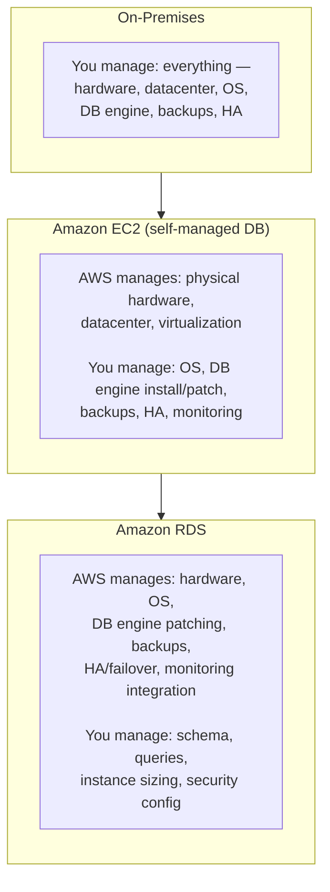

# 05 - On-Premises Vs Amazon EC2 Vs Amazon RDS

> Goal: place all three deployment models for a relational database side by side, using the classic "who manages what" responsibility ladder.

---

## 1. The responsibility ladder

Moving left to right, AWS takes over progressively more of the operational stack — but you also give up progressively more low-level control.

---

## 2. Side-by-side comparison

| Responsibility | On-Premises | EC2 (self-managed DB) | RDS |
|---|---|---|---|
| Physical hardware/datacenter | You | AWS | AWS |
| OS patching | You | You | AWS |
| DB engine install & patching | You | You | AWS (automated) |
| Backups | You build it | You build it | AWS (automated + snapshots) |
| High availability/failover | You build it | You build it | AWS (Multi-AZ) |
| Storage scaling | You (physical disks) | You (EBS resize) | AWS (auto scaling) |
| OS-level/root access | Full | Full | None |
| Time to provision | Weeks (hardware procurement) | Minutes | Minutes |

---

## 3. When each still makes sense

- **On-premises**: strict regulatory/data-residency requirements that mandate physical control, or existing sunk investment in hardware/licensing.
- **EC2 self-managed**: needing an unsupported engine/version, OS-level customization RDS doesn't allow, or highly specialized replication/clustering topologies RDS doesn't offer.
- **RDS**: the default recommendation for the overwhelming majority of relational database workloads on AWS — exactly the pains in Note 04 that RDS removes.

> 🎯 **Exam tip:** any scenario mentioning "minimize administrative overhead" or "reduce time spent on database management" for a relational workload points at **RDS**, not EC2 — EC2-hosted databases are the answer only when a specific stated requirement (custom engine, OS-level access, unsupported configuration) rules RDS out.

---

## 4. Recap

- Moving from on-premises → EC2 → RDS, AWS progressively absorbs more operational responsibility (patching, backups, HA), while you give up progressively more low-level control (root access, arbitrary engine versions).
- RDS is the default choice for standard relational workloads; EC2 self-managed and on-premises remain justified only by specific, stated constraints RDS can't meet.
- Next: Note 06 — AWS Relational Database Service (RDS) Lab, the first hands-on lab creating a real RDS instance.

### Sources
- [What is Amazon Relational Database Service (Amazon RDS)? — AWS docs](https://docs.aws.amazon.com/AmazonRDS/latest/UserGuide/Welcome.html)
- [AWS shared responsibility model](https://aws.amazon.com/compliance/shared-responsibility-model/)
