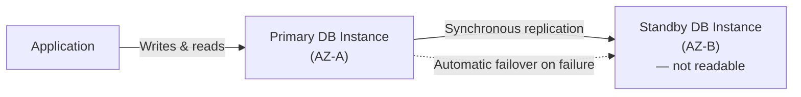

# 09 - RDS Availability & Durability Multi-AZ DB Instance

> Goal: understand the classic Multi-AZ deployment — one standby, synchronous replication, automatic failover — and its one specific limitation (the standby doesn't serve reads) that Note 10's newer Multi-AZ DB Cluster option addresses.

---

## 1. Architecture

- **One primary** DB instance (serves all reads and writes) and **one standby** in a **different AZ**.
- Replication between primary and standby is **synchronous** — a write isn't acknowledged as committed until it's confirmed on the standby too, guaranteeing **zero data loss** on failover.
- On a primary failure (instance issue, AZ outage, or even a manual "reboot with failover"), RDS **automatically fails over** to the standby, typically completing in **1-2 minutes** — RDS updates the DB instance's **endpoint** (a stable DNS CNAME) to point at the newly-promoted instance, so applications don't need any connection string changes.

---

## 2. The standby's one job: failover, not reads

The standby in this deployment type is **purely for failover** — it does **not** accept read traffic. This is the deployment's main limitation, and exactly what Note 10's **Multi-AZ DB Cluster** option was built to address (two standbys, both readable).

> 🧠 **Mental model:** think of this standby as a "hot spare" in the traditional sense — always ready, always in sync, but sitting idle until called upon, rather than doing useful work in parallel.

---

## 3. Enabling it

- A checkbox at DB-instance creation time (or modifiable afterward) — "Multi-AZ deployment."
- Enabling Multi-AZ on an existing Single-AZ instance triggers RDS to provision a standby and begin synchronous replication, with **no application-visible downtime** beyond a brief failover-like blip during the initial changeover.

> 🎯 **Exam tip:** "synchronous replication," "zero data loss on failover," "automatic failover in 1-2 minutes," and "the endpoint doesn't change" are the recurring exam phrases for classic Multi-AZ DB instance — as opposed to **Read Replicas** (Note 27), which use **asynchronous** replication and are for **read scaling**, not failover.

---

## 4. Recap

- Multi-AZ DB instance adds **one standby** in a different AZ, synchronously replicated, providing **automatic failover** with **zero data loss** — but the standby cannot serve read traffic.
- Failover updates the DB instance's stable **endpoint**, requiring no application connection-string changes.
- Next: Note 10 — RDS Availability & Durability Multi-AZ DB Cluster, the newer option with two *readable* standbys and faster failover.

### Sources
- [Multi-AZ DB instance deployments — AWS docs](https://docs.aws.amazon.com/AmazonRDS/latest/UserGuide/Concepts.MultiAZSingleStandby.html)
- [Configuring and managing a Multi-AZ deployment — AWS docs](https://docs.aws.amazon.com/AmazonRDS/latest/UserGuide/Concepts.MultiAZ.html)
