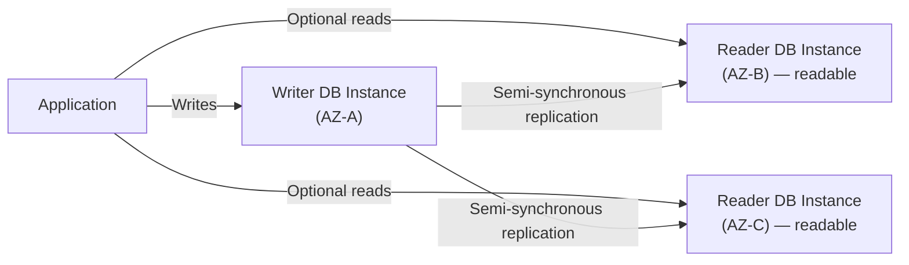

# 10 - RDS Availability & Durability Multi-AZ DB Cluster

> Goal: cover the newer Multi-AZ DB Cluster deployment — two *readable* standbys, faster failover, and where it's actually supported — verified against current AWS documentation since this is a comparatively recent, evolving option.

---

## 1. Architecture

- **Three instances total**: one **writer** and **two readable standbys**, spread across **three AZs**.
- Replication is **semi-synchronous**, using the DB engine's own native replication (not RDS's proprietary Multi-AZ instance mechanism) — a write is confirmed once **at least one** reader has acknowledged it.
- Both standbys **serve read traffic**, directly addressing Note 09's "idle standby" limitation — increasing read throughput without needing separate Read Replicas.
- **Failover is faster**: typically **under 35 seconds**, versus 1-2 minutes for the classic Multi-AZ DB instance — because one of the already-in-sync readers is promoted, rather than a full instance-level handoff.

---

## 2. Engine support — a real limitation

Multi-AZ DB Cluster is currently available only for **RDS for MySQL** and **RDS for PostgreSQL** — **not** for MariaDB, Oracle, SQL Server, or Db2. Any scenario needing this deployment type on another engine must fall back to the classic Multi-AZ DB instance (Note 09).

---

## 3. Cost

A Multi-AZ DB Cluster costs the same as a **Multi-AZ DB instance plus one Read Replica** — i.e., you're paying for three instances' worth of compute/storage either way; the DB Cluster option is a different *architecture* for that same cost, not a cheaper one.

---

## 4. Choosing between Note 09 and Note 10 (preview)

| | Multi-AZ DB Instance (Note 09) | Multi-AZ DB Cluster (Note 10) |
|---|---|---|
| Standby count | 1 (not readable) | 2 (both readable) |
| Replication | Synchronous | Semi-synchronous, engine-native |
| Failover time | ~1-2 minutes | Typically under 35 seconds |
| Engine support | All RDS engines | MySQL and PostgreSQL only |
| Read scaling | None (needs separate Read Replicas) | Built-in (both standbys readable) |

> 🎯 **Exam tip:** "readable standby," "faster failover than Multi-AZ," or "increase read throughput without Read Replicas" for **MySQL or PostgreSQL specifically** signals **Multi-AZ DB Cluster** — the same requirement for Oracle/SQL Server/MariaDB instead points back to a Multi-AZ DB instance plus separate Read Replicas.

---

## 5. Recap

- Multi-AZ DB Cluster adds **two readable standbys** across 3 AZs with faster (~35 second), engine-native replication-based failover — but is currently **MySQL/PostgreSQL-only**.
- It costs the same as a Multi-AZ instance + one Read Replica, just architected differently, with built-in read scaling as a bonus.
- Next: Note 11 — How To Choose Availability Option, consolidating Notes 08-10 into one decision framework.

### Sources
- [Choose the right Amazon RDS deployment option — AWS blog](https://aws.amazon.com/blogs/database/choose-the-right-amazon-rds-deployment-option-single-az-instance-multi-az-instance-or-multi-az-database-cluster/)
- [Multi-AZ DB cluster deployments — AWS docs](https://docs.aws.amazon.com/AmazonRDS/latest/UserGuide/multi-az-db-clusters-concepts.html)
