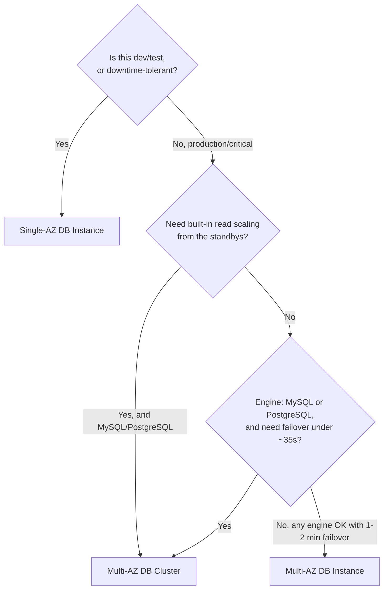

# 11 - How To Choose Availability Option?

> Goal: consolidate Notes 08-10 into a single decision framework for exam scenarios.

---

## 1. The decision flow

---

## 2. Quick reference

| Requirement in the scenario | Pick |
|---|---|
| Cost-optimized, dev/test, downtime acceptable | **Single-AZ** (Note 08) |
| Any RDS engine, automatic failover, no read scaling needed from standby | **Multi-AZ DB Instance** (Note 09) |
| MySQL/PostgreSQL, need **fastest** failover and/or extra read capacity from standbys | **Multi-AZ DB Cluster** (Note 10) |
| Need to scale reads **independently**, across Regions, or on a non-MySQL/PostgreSQL engine | **Read Replicas** (Note 27) — a different mechanism entirely, addressed later |

> ⚠️ Don't confuse "read scaling from the standby" (Multi-AZ DB Cluster's built-in readers) with **Read Replicas** (Note 27) — Read Replicas are a separate feature using **asynchronous** replication, available for **all** Multi-AZ deployment types, and are the answer when read scaling needs to go beyond what two in-Region standbys provide (e.g. many replicas, cross-Region replicas).

---

## 3. Recap

- Single-AZ for cost-sensitive, downtime-tolerant workloads; Multi-AZ DB Instance for standard HA on any engine; Multi-AZ DB Cluster for MySQL/PostgreSQL needing faster failover and/or built-in readable standbys.
- Read Replicas remain a separate, complementary tool for read scaling beyond what any Multi-AZ option alone provides.
- Next: Note 12 — AWS RDS Setting Option, starting the deep dive into actual instance configuration.

### Sources
- [Choose the right Amazon RDS deployment option — AWS blog](https://aws.amazon.com/blogs/database/choose-the-right-amazon-rds-deployment-option-single-az-instance-multi-az-instance-or-multi-az-database-cluster/)
- [High availability (Multi-AZ) for Amazon RDS — AWS docs](https://docs.aws.amazon.com/AmazonRDS/latest/UserGuide/Concepts.MultiAZ.html)
