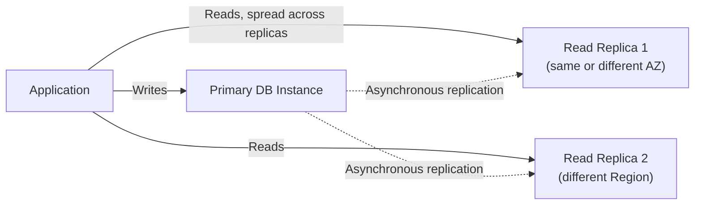

# 27 - AWS RDS Read Replica

> Goal: cover Read Replicas — asynchronous, read-scaling copies of an RDS instance — and how they differ fundamentally from every Multi-AZ option covered in Notes 09-10.

---

## 1. Architecture

- Up to **5 direct Read Replicas** per source instance (more via replica-of-a-replica chaining, engine-dependent).
- Replication is **asynchronous** — replicas can lag behind the primary by some amount (visible via the `ReplicaLag` CloudWatch metric, Note 20); this is the core trade-off versus Multi-AZ's synchronous replication.
- Can be created **within the same Region**, **cross-Region**, or (for some engines) even from a source that **isn't itself Multi-AZ**.
- Each Read Replica gets its **own endpoint** — applications must explicitly direct read traffic to replica endpoints (RDS does not auto-load-balance reads for you); this is typically done at the application layer or via a proxy/pooler (Note 30).

---

## 2. What Read Replicas are for (and aren't)

- **For**: scaling **read** throughput horizontally, offloading reporting/analytics queries from the primary, serving read traffic closer to users in another Region.
- **Not for**: high availability by itself — a Read Replica **can** be manually promoted to a standalone instance during a disaster, but this is a **manual, deliberate action**, not an automatic failover like Multi-AZ provides.

> ⚠️ A Read Replica **can** be promoted to become a new standalone primary (breaking replication permanently) — useful for disaster recovery or Region migration — but this is fundamentally different from Multi-AZ's automatic, transparent failover (Note 09).

> 🎯 **Exam tip:** "scale reads," "offload reporting queries," "serve reads closer to users in another Region" → **Read Replicas**. "Automatic failover, zero data loss, same endpoint after failure" → **Multi-AZ** (Notes 09-10). These are complementary, not substitutes — many production architectures use both together.

---

## 3. Recap

- Read Replicas provide **asynchronous**, horizontally-scaled **read** capacity — same-Region, cross-Region, or engine-dependent chained — with each replica requiring its own endpoint at the application layer.
- They are not an automatic-failover HA mechanism by themselves, though a replica can be manually promoted during a disaster.
- Next: Note 28 — AWS RDS Readable Standby Instance Vs Read Replica, directly contrasting this with Note 10's Multi-AZ DB Cluster readers.

### Sources
- [Working with DB instance read replicas — AWS docs](https://docs.aws.amazon.com/AmazonRDS/latest/UserGuide/USER_ReadRepl.html)
