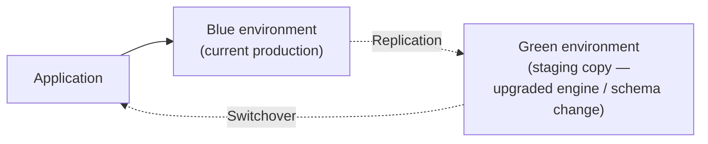

# 29 - AWS RDS Blue/Green Deployment

> Goal: cover Blue/Green Deployments — RDS's safe way to test and cut over major engine upgrades or schema changes with minimal downtime — verified against current AWS documentation given ongoing feature updates (RDS Proxy integration added in 2026).

---

## 1. Architecture

- RDS creates a **full staging copy ("Green")** of your production database ("Blue"), kept **continuously in sync** via replication.
- You apply and test your change (engine major-version upgrade, schema migration, parameter changes) **on Green only** — Blue keeps serving live production traffic, completely unaffected.
- Once validated, a **switchover** promotes Green to become the new production — RDS handles this with **sub-5-second** typical downtime (as of the most recent AWS improvements), redirecting connections without requiring application changes.

---

## 2. Why this beats an in-place upgrade

- An in-place major version upgrade (Note 26) applies directly to production, with **no safe rollback** if something goes wrong post-upgrade beyond restoring from backup.
- Blue/Green lets you **fully validate** the change against a real, continuously-synced copy first, and the switchover itself is measured in **seconds**, not the extended downtime a direct in-place major upgrade might require.

---

## 3. RDS Proxy integration (recent addition)

- **RDS Proxy** (Note 30) can now sit in front of a Blue/Green deployment: during switchover, the proxy actively monitors both environments and **redirects connections to Green** as soon as it becomes production — reducing switchover-visible downtime even further (sub-5-second via Proxy, versus ~2 seconds via a JDBC driver's own reconnect logic in some comparisons) **without requiring any application code changes**.
- **Prerequisite**: the Blue (source) cluster must already be **registered with the RDS Proxy** before creating the Blue/Green deployment.

---

## 4. A real limitation

Zero-ETL integrations with Redshift (Note 31) are **not supported** across a Blue/Green switchover — any existing zero-ETL integration must be **deleted before switchover** and **recreated afterward** against the new production (Green) environment.

> 🎯 **Exam tip:** "test a major version upgrade safely with minimal cutover downtime" is the core Blue/Green signal — contrast with a **Read Replica** promotion (Note 27), which breaks replication permanently and isn't designed around a clean, reversible switchover process.

---

## 5. Recap

- Blue/Green Deployments create a fully-synced staging copy for safely testing upgrades/schema changes, then perform a low-downtime (seconds-scale) switchover to promote it to production.
- RDS Proxy integration further reduces switchover downtime, but requires the Blue cluster to be pre-registered with the proxy; existing Zero-ETL integrations must be deleted and recreated around a switchover.
- Next: Note 30 — RDS Proxy, covering connection pooling in depth.

### Sources
- [Using Amazon RDS Blue/Green Deployments — AWS docs](https://docs.aws.amazon.com/AmazonRDS/latest/UserGuide/blue-green-deployments.html)
- [Amazon RDS Blue/Green Deployments now supports Amazon RDS Proxy — AWS](https://aws.amazon.com/about-aws/whats-new/2026/04/rds-proxy-blue-green/)
- [Limitations and considerations for Amazon RDS blue/green deployments — AWS docs](https://docs.aws.amazon.com/AmazonRDS/latest/UserGuide/blue-green-deployments-considerations.html)
