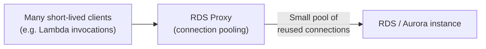

# 30 - RDS Proxy

> Goal: cover RDS Proxy — a fully-managed connection pooler sitting between application and database — and the specific problems it solves that Note 17's IAM authentication note already hinted at.

---

## 1. The problem: too many database connections

Applications with **many short-lived connections** (e.g. Lambda functions, each opening a fresh connection per invocation) can quickly exhaust a database's `max_connections` limit — each connection consumes real database memory/CPU regardless of whether it's doing useful work.

**RDS Proxy** sits between the application and the database, **pooling and multiplexing** a large number of application-side connections onto a much smaller number of actual database-side connections.

---

## 2. Other benefits beyond pooling

- **Faster failover**: during a Multi-AZ failover, RDS Proxy keeps application connections open and transparently redirects them to the new primary once available — reducing failover-visible downtime versus waiting for the application's own driver-level reconnect/retry logic.
- **IAM authentication enforcement**: can require all connections through the proxy to use **IAM database authentication** (Note 17), centralizing that policy in one place rather than per-application.
- **Improved credential handling**: integrates with **Secrets Manager** (Note 13) to manage the actual database credentials, so application code never needs to hold them directly.
- **Blue/Green switchover acceleration** (Note 29): sub-5-second reconnection during a switchover, when pre-registered with the Blue environment.

---

## 3. Where it fits

- Best suited for workloads with **many concurrent, short-lived connections** — serverless (Lambda) and microservices architectures are the textbook use case.
- Adds a small amount of **additional latency per query** (routing through the proxy layer) — not free, and not universally beneficial for workloads with already-few, long-lived, well-managed connections.

> 🎯 **Exam tip:** "Lambda functions overwhelming the database with connections," "reduce failover time transparently to the application," or "enforce IAM authentication centrally" are the recurring RDS Proxy signals.

---

## 4. Recap

- RDS Proxy pools and multiplexes many application-side connections onto fewer database-side ones, primarily solving the "too many short-lived connections" problem common in serverless/Lambda architectures.
- It also accelerates Multi-AZ failover and Blue/Green switchover transparency, and can centralize IAM-authentication enforcement.
- Next: Note 31 — RDS Zero-ETL Integration, covering near-real-time analytics without building a pipeline yourself.

### Sources
- [Amazon RDS Proxy — AWS docs](https://docs.aws.amazon.com/AmazonRDS/latest/UserGuide/rds-proxy.html)
- [Amazon RDS Blue/Green Deployments now supports Amazon RDS Proxy — AWS](https://aws.amazon.com/about-aws/whats-new/2026/04/rds-proxy-blue-green/)
