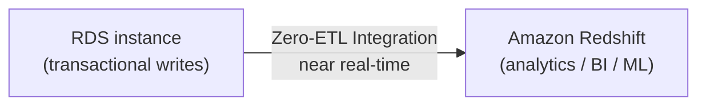

# 31 - RDS Zero-ETL Integration

> Goal: cover RDS Zero-ETL Integration with Amazon Redshift — near-real-time analytics on transactional data without building or maintaining a data pipeline yourself.

---

## 1. The problem it solves

Traditionally, getting transactional (OLTP) data from RDS into an analytics warehouse like **Redshift** for reporting/BI/ML meant building an **ETL (Extract, Transform, Load) pipeline** yourself — scheduled jobs, change-data-capture logic, transformation code, monitoring for pipeline failures.

**Zero-ETL Integration** removes this entirely: RDS data becomes available in Redshift **within seconds** of being written, with **no pipeline to build or operate**.

---

## 2. What it actually is

- A **fully-managed, near-real-time replication** of data from RDS into Redshift, purpose-built for analytics — not a general-purpose replica; you don't write to the Redshift side.
- Removes the traditional trade-off of running analytics queries directly against your production transactional database (which would compete for the same compute/IO resources as your actual application).

---

## 3. A real limitation (interacts with Note 29)

- Zero-ETL integrations are **not supported across a Blue/Green Deployment switchover** — you must **delete the integration before switchover** and **recreate it afterward** against the new production environment.

> 🎯 **Exam tip:** "near real-time analytics from RDS without building a pipeline" is the Zero-ETL signal — contrast with a manual **Read Replica** (Note 27) used purely for offloading reporting queries directly against RDS-shaped data, versus Zero-ETL's purpose-built move into a proper analytics warehouse (Redshift).

---

## 4. Recap

- Zero-ETL Integration replicates RDS data into Redshift within seconds, fully managed, with no pipeline to build — purpose-built for near-real-time analytics on transactional data.
- It must be deleted and recreated around any Blue/Green Deployment switchover.
- Next: Note 32 — ElastiCache Cluster For RDS, introducing caching as a complementary performance layer.

### Sources
- [Amazon RDS zero-ETL integrations — AWS docs](https://docs.aws.amazon.com/AmazonRDS/latest/UserGuide/zero-etl.html)
- [Limitations and considerations for Amazon RDS blue/green deployments — AWS docs](https://docs.aws.amazon.com/AmazonRDS/latest/UserGuide/blue-green-deployments-considerations.html)
