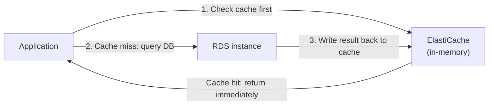

# 32 - ElastiCache Cluster For RDS

> Goal: introduce Amazon ElastiCache as a caching layer sitting in front of RDS, reducing database load for repeated, read-heavy access patterns.

---

## 1. The problem: repeated identical reads hit the database every time

Without a cache, every request for the same data (e.g. a product catalog page, a user profile) triggers a **fresh database query**, even if nothing has changed since the last time it was fetched — wasted database CPU/IO for data that's often re-read far more often than it changes.

**Amazon ElastiCache** is a fully-managed, **in-memory** key-value data store, sitting between the application and RDS, absorbing repeated reads that don't need to hit the database at all.

---

## 2. Why this matters for RDS specifically

- Read-heavy workloads (the same queries repeated by many users) benefit the most — a cache hit is served **entirely from memory**, orders of magnitude faster than a database round-trip, and consumes **zero** RDS compute/IO.
- This is a **complementary** optimization to Read Replicas (Note 27) — Read Replicas scale the database's own read capacity; ElastiCache **avoids hitting the database at all** for cacheable data.

> 🧠 **Mental model:** if Read Replicas are "add more checkout lanes," ElastiCache is "let regular customers skip the line entirely because you already know what they want" — a different lever entirely, and the two combine well in the same architecture.

---

## 3. Recap

- ElastiCache is a fully-managed, in-memory cache that absorbs repeated read traffic before it reaches RDS, reducing database load for cacheable, read-heavy access patterns.
- It complements (rather than replaces) Read Replicas — one avoids hitting the database, the other scales the database's own read capacity.
- Next: Note 33 — ElastiCache For RDS Cluster Type - Redis & Memcached, covering the two supported engines.

### Sources
- [What is Amazon ElastiCache? — AWS docs](https://docs.aws.amazon.com/AmazonElastiCache/latest/red-ug/WhatIs.html)
- [Amazon ElastiCache product page](https://aws.amazon.com/elasticache/)
