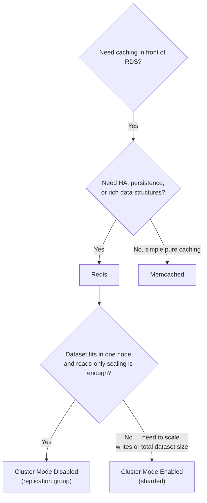

# 36 - AWS RDS ElastiCache Exam SAA-C03 Cheat Sheet

> Goal: consolidate Notes 32-35 into a one-page, exam-oriented quick reference.

---

## 1. The core decision tree

---

## 2. One-line facts to remember

- ElastiCache is a **fully-managed, in-memory** cache, absorbing repeated reads **before** they hit RDS — complementary to, not a replacement for, Read Replicas.
- **Redis**: persistence, replication, Multi-AZ automatic failover, rich data structures.
- **Memcached**: simple key-value only, no persistence, no replication, multi-threaded, purely independent nodes.
- **Cluster Mode Disabled**: full-dataset replicas, read-scaling only, single primary endpoint.
- **Cluster Mode Enabled**: sharded via 16,384 hash slots, scales both reads and writes and total dataset size.

> 🎯 **Exam tip:** the exam rarely asks "what is ElastiCache" in isolation — it asks **which engine/mode** fits a described requirement (HA? persistence? write scaling? simplicity?). Map the requirement to Notes 33-35's tables rather than memorizing standalone facts.

---

## 3. Recap

- This closes the ElastiCache-for-RDS mini-arc: caching rationale (Note 32) → engine choice (Note 33) → deployment/HA option (Note 34) → Cluster Mode sharding depth (Note 35) → this consolidated cheat sheet.
- Next: Note 37 — AWS RDS Restore From S3, returning to core RDS operational features.

### Sources
- [What is Amazon ElastiCache? — AWS docs](https://docs.aws.amazon.com/AmazonElastiCache/latest/red-ug/WhatIs.html)
- [Comparing Memcached and Redis OSS — AWS docs](https://docs.aws.amazon.com/AmazonElastiCache/latest/red-ug/SelectEngine.html)
