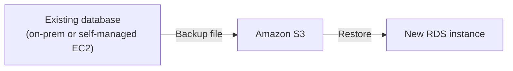

# 37 - AWS RDS Restore Form S3

> Goal: cover restoring/creating an RDS instance from a database backup file sitting in S3 — the migration path for bringing an existing, non-RDS database (e.g. self-managed MySQL on EC2, or on-premises) into RDS.

---

## 1. What this actually solves

If you already have a **MySQL or PostgreSQL backup file** (e.g. `mysqldump` output, or a native backup) sitting in **S3**, RDS can create a **brand-new DB instance directly from that file** — rather than requiring you to first stand up a source RDS instance and then migrate data into it via replication or application-level scripts.

---

## 2. Supported engines

Primarily **MySQL** (native backup file restore) and **PostgreSQL** — this is engine- and method-specific, not a universal RDS feature across every engine.

---

## 3. Where this fits versus other migration tools

- For **ongoing, minimal-downtime** migrations (source stays live and writable during migration), **AWS Database Migration Service (DMS)** is the more complete tool, handling continuous replication until cutover.
- **Restore from S3** is better suited to a **one-time, offline** migration — you already have a consistent backup file, and some downtime during the cutover is acceptable.

> 🎯 **Exam tip:** "migrate an existing on-premises/self-managed database into RDS using a backup file already in S3, no ongoing replication needed" points to **Restore from S3**; "minimize downtime with continuous replication until cutover" points to **AWS DMS** instead.

---

## 4. Recap

- Restoring from S3 lets RDS create a new instance directly from an existing MySQL/PostgreSQL backup file, well-suited to a one-time, offline migration into RDS.
- For continuous, minimal-downtime migrations, AWS DMS is the more appropriate tool instead.
- Next: Note 38 — Amazon Aurora, covering RDS's AWS-native, high-performance engine.

### Sources
- [Importing data into a MySQL DB instance by using backup files — AWS docs](https://docs.aws.amazon.com/AmazonRDS/latest/UserGuide/MySQL.Procedural.Importing.html)
- [Importing data into PostgreSQL on Amazon RDS — AWS docs](https://docs.aws.amazon.com/AmazonRDS/latest/UserGuide/PostgreSQL.Procedural.Importing.html)
