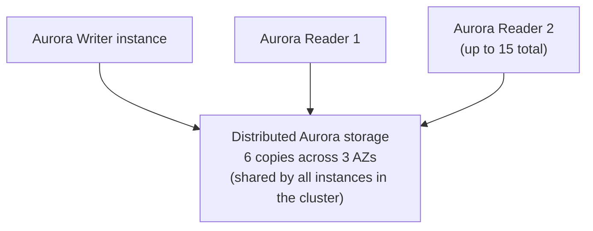

# 38 - Amazon Aurora

> Goal: cover Aurora's distinct storage architecture and the features it enables that standard (EBS-backed) RDS engines don't have — Aurora Replicas, Aurora Serverless, and Aurora Global Database.

---

## 1. Aurora is not "just faster RDS storage" — it's a different architecture

Every other RDS engine (Notes 08-31) stores data on **EBS volumes** attached to a single instance. **Aurora** instead uses a **purpose-built, distributed storage layer**, decoupled from compute:

- Data is automatically replicated **6 ways across 3 AZs** — Aurora tolerates losing **2 copies without impacting writes**, and **3 copies without impacting reads**, all without any of this being a separate "Multi-AZ" checkbox — it's simply how Aurora storage always works.
- Storage **auto-grows** in 10GB increments up to very large sizes (engine/Region-dependent), with no manual provisioning of a specific size upfront the way standard RDS storage requires.
- All instances in an Aurora **cluster** (one writer, up to **15 readers**) share this **same underlying storage** — a reader doesn't need its own full copy of the data the way a standard RDS Read Replica does, since replication lag for Aurora Replicas is typically **single-digit milliseconds**, far lower than standard asynchronous Read Replica lag.

> 🧠 **Mental model:** standard RDS Read Replicas (Note 27) each hold a **full independent copy** of the data, replicated asynchronously; Aurora Replicas all read from the **same shared storage volume**, making replication lag dramatically smaller and failover to a reader dramatically faster.

---

## 2. Aurora-specific features standard RDS engines don't have

| Feature | What it gives you |
|---|---|
| **Aurora Replicas** | Up to 15 low-lag readers sharing the same storage; any replica can be a failover target |
| **Aurora Auto Scaling** | Automatically adds/removes Aurora Replicas based on load |
| **Aurora Serverless (v2)** | Capacity scales automatically based on load, down to near-zero for intermittent workloads, billed per actual capacity used |
| **Aurora Global Database** | Replicates a cluster across Regions with **typically sub-second** replication lag, for global read scaling and fast disaster recovery (much faster cross-Region replication than a standard cross-Region Read Replica) |
| **Backtrack (MySQL-compatible Aurora)** | "Rewind" a cluster to an earlier point in time without restoring from a snapshot |

---

## 3. Compatibility, not a new query language

Aurora is **MySQL-compatible** or **PostgreSQL-compatible** — existing MySQL/PostgreSQL applications, drivers, and tools generally work unchanged; Aurora's innovation is entirely in the storage/replication layer underneath, not in a new SQL dialect.

> 🎯 **Exam tip:** "high performance, low-lag read replicas," "fast cross-Region disaster recovery," or "database load is highly variable/intermittent" are strong Aurora signals — specifically **Aurora Global Database** for the cross-Region case and **Aurora Serverless** for the variable-load case.

---

## 4. Recap

- Aurora replaces EBS-backed single-instance storage with a **distributed, 6-way, 3-AZ replicated storage layer** shared across an entire cluster, enabling low-lag Aurora Replicas, Aurora Serverless, and Aurora Global Database — capabilities standard RDS engines' EBS-backed architecture can't match.
- It remains MySQL/PostgreSQL **compatible**, not a new database language.
- Next: Note 39 — AWS Database Complete Overview, a closing summary across the entire database landscape.

### Sources
- [What is Amazon Aurora? — AWS docs](https://docs.aws.amazon.com/AmazonRDS/latest/AuroraUserGuide/CHAP_AuroraOverview.html)
- [Amazon Aurora features](https://aws.amazon.com/rds/aurora/features/)
- [Aurora Global Database — AWS docs](https://docs.aws.amazon.com/AmazonRDS/latest/AuroraUserGuide/aurora-global-database.html)
