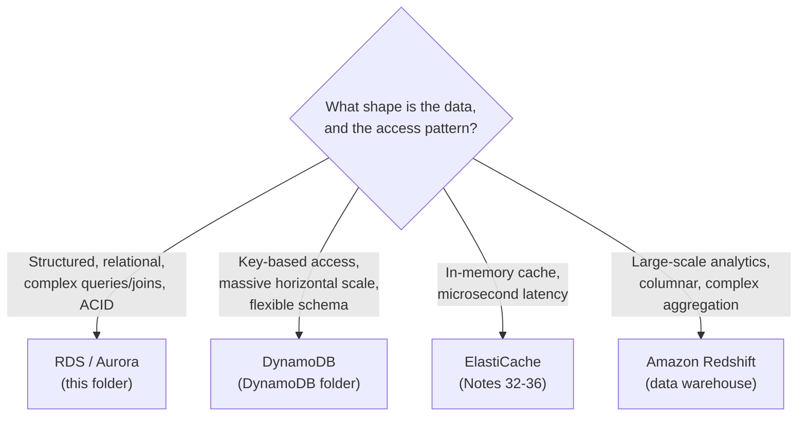

# 39 - AWS Database Complete Overview

> Goal: close out this folder by placing RDS/Aurora in the context of AWS's broader database portfolio — a map of "which AWS database service for which job," tying together this folder and the `DynamoDB` folder.

---

## 1. The landscape, by data model

---

## 2. Quick service map

| Service | Data model | Typical fit |
|---|---|---|
| **RDS** (Notes 01-37) | Relational (SQL) | Standard transactional apps, existing SQL-based tooling, moderate scale |
| **Aurora** (Note 38) | Relational (SQL), MySQL/PostgreSQL-compatible | Same as RDS, but needing higher performance, low-lag replicas, or fast cross-Region DR |
| **DynamoDB** (`DynamoDB` folder) | Key-value / document (NoSQL) | Massive scale, simple/known access patterns, single-digit-millisecond latency at any scale |
| **ElastiCache** (Notes 32-36) | In-memory key-value | Caching layer in front of any of the above, absorbing repeated reads |
| **Redshift** | Columnar data warehouse | Large-scale analytics, BI, complex aggregations across huge datasets |

---

## 3. The recurring exam framing

Almost every SAA-C03 database question is really asking: **"given this access pattern and scale requirement, which data model fits?"** — not "what does this specific service do." The fastest path to the right answer is usually:

1. Is it relational, with joins and ACID transactions needed? → **RDS/Aurora**.
2. Is it massive-scale, simple key-based access, flexible schema? → **DynamoDB**.
3. Is the bottleneck repeated reads of the same data? → Add **ElastiCache** in front of whichever of the above is the source of truth.
4. Is the need analytics/BI over large historical datasets? → **Redshift** (often fed by RDS Zero-ETL, Note 31, or a similar pipeline from DynamoDB).

---

## 4. Recap

- This folder (RDS, Aurora, ElastiCache) covers the **relational + caching** side of AWS's database portfolio; the `DynamoDB` folder covers the **non-relational, massive-scale** side.
- The exam consistently rewards mapping a scenario's **access pattern and scale** to the right data model first, then to the specific service.
- This closes the `RDS` folder — Notes 01-05 covered fundamentals, 06-07 hands-on labs, 08-11 availability options, 12-17 configuration, 18-26 monitoring/operations, 27-31 scaling/modern features, 32-36 ElastiCache caching, 37 migration via S3, and 38 Aurora.

### Sources
- [AWS databases overview](https://aws.amazon.com/products/databases/)
- [What is Amazon Relational Database Service (Amazon RDS)? — AWS docs](https://docs.aws.amazon.com/AmazonRDS/latest/UserGuide/Welcome.html)
- [What is Amazon DynamoDB? — AWS docs](https://docs.aws.amazon.com/amazondynamodb/latest/developerguide/Introduction.html)
