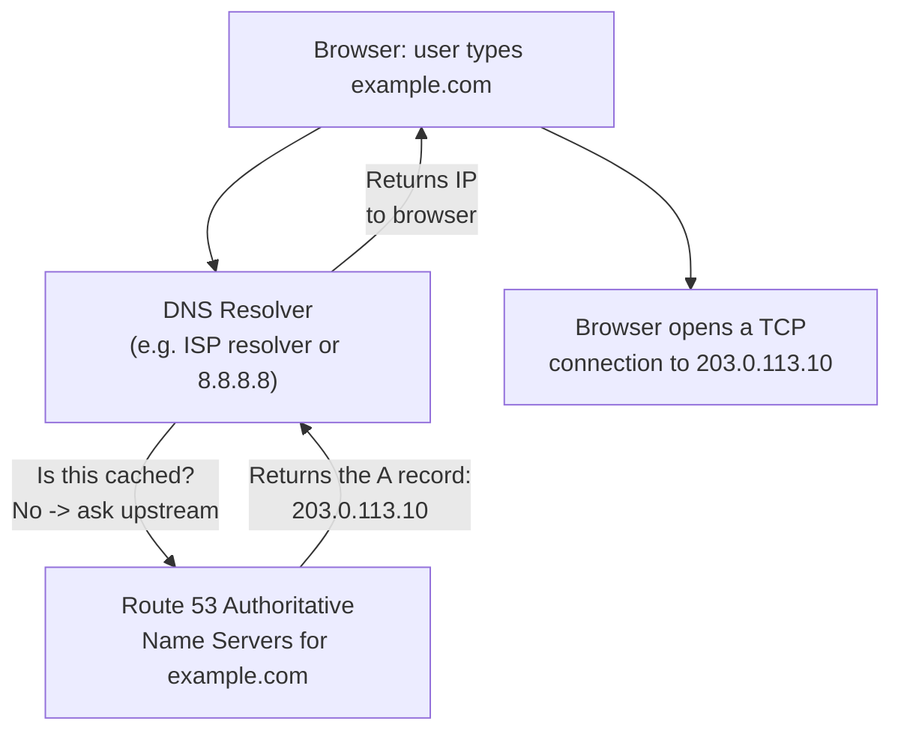

# 01 - Introduction to Route 53

> Goal of this note: understand **what Route 53 actually is** (it's three distinct products wearing one name), what DNS fundamentally does, and the one distinction beginners almost always get tangled on — **Registered Domains vs Hosted Zones**. No hands-on yet — Note 03 is where we start building.

---

## 1. What DNS does, in one paragraph

Every device on the internet is really addressed by a **number** — an IP address like `203.0.113.10` — but humans remember **names**, not numbers. **DNS (Domain Name System)** is the internet's phonebook: it's a distributed lookup system that translates a human-friendly domain name (`example.com`) into the IP address a computer actually needs to open a network connection. Without DNS, you'd have to memorize an IP address for every website you visit; with it, you type a name, your computer silently resolves it to an IP behind the scenes, and then connects.

---

## 2. What is Route 53, in one line?

**Amazon Route 53** is AWS's **highly available, scalable DNS web service** — but the name actually covers **three separate jobs** bundled into one product:

| Core job | One-line description |
|---|---|
| **Domain registration** | Buy/renew/transfer the domain name itself (e.g. `example.com`) — Route 53 acts as a **domain registrar**. |
| **DNS hosting** | Store and serve the actual DNS records (A, CNAME, MX, etc.) for a domain, via a **Hosted Zone** — this is "DNS as a service." |
| **Health checking** | Continuously monitor whether an endpoint is up, and use that result to steer DNS answers away from unhealthy targets. |

> 🧠 **Mental model:** think of Route 53 as three separate AWS products AWS chose to sell under one brand name — a **registrar** (like GoDaddy/Namecheap), a **DNS hosting service** (like BIND/Cloudflare DNS), and a **health-monitoring service** — because in practice most customers who buy DNS hosting from AWS also want to buy the domain and get health-aware routing from the same place, one bill, one console, one API.

### Why bundle three distinct jobs under one name?

Domain registration, DNS record hosting, and endpoint health monitoring are *technically* independent capabilities — you could buy a domain from one company, host its DNS records with a second, and health-check its endpoints with a third. AWS bundles all three under "Route 53" because they compose naturally: once Route 53 is hosting your DNS records, it's a small step for it to also know whether the IP a record points to is currently healthy (so it can stop answering with it), and it's convenient for the same console/API to also handle buying the domain name that started the whole chain. The name "Route 53" itself is a pun on port **53** — the standard network port DNS uses.

---

## 3. Registered Domains vs. Hosted Zones — the #1 beginner confusion

These are **two completely separate Route 53 features** that happen to live in the same console. Conflating them is one of the most common early mistakes.

| | **Registered Domains** | **Hosted Zones** |
|---|---|---|
| What it is | Ownership of the domain name itself (`example.com`) — a yearly-billed registration | A container that holds the actual DNS **records** for a domain (A, CNAME, MX, TXT, etc.) |
| What you're paying for | The right to hold that name (annual renewal fee, varies by TLD) | Existence of the zone (small monthly fee) + queries answered against it |
| Where it can be bought | Route 53, or any other registrar (GoDaddy, Namecheap, Google Domains successors, etc.) | Route 53 (or any other DNS host) — completely independent of where you bought the domain |
| Can you mix providers? | Yes — buy the domain at Registrar X and host its DNS at Route 53 | Yes — host DNS at Route 53 and buy the domain anywhere else |

**The key insight:** a domain you registered somewhere else (say, at GoDaddy) can still have its DNS **hosted** in a Route 53 Hosted Zone — you just update the domain's **name server (NS)** records at your registrar to point to the four name servers Route 53 assigns your hosted zone. Conversely, you can register a domain through Route 53 and choose to host its DNS records somewhere else entirely. They're independent knobs.

> ⚠️ Buying a "Registered Domain" in Route 53 does **not** automatically make anything resolve — you still need a **Hosted Zone** with actual records in it (which Route 53 does create automatically for a domain you register through it, but it's a separate resource, not the same feature).

---

## 4. Route 53 is a global service — why?

Unlike EC2, VPC, or RDS, the Route 53 console has **no Region selector**. This isn't an oversight — DNS itself is a globally-distributed system by design, and Route 53's own infrastructure mirrors that: it operates a network of **authoritative name server locations spread around the world**, all answering queries for the same hosted zones. Wherever in the world a resolver's query enters Route 53's network, it gets an authoritative answer from a nearby name server — there's no single "Region" a hosted zone lives in, so the console simply doesn't offer one to pick. (Individual features layered on top, like health checks, still run from a distributed fleet of global checker locations, covered in a later note.)

---

## 5. The lookup flow, end to end

The resolver caches the answer for the record's **TTL (Time To Live)** — covered in depth in the next note — so it doesn't have to repeat this whole round trip for every single request.

---

## 6. What's coming in this folder

This folder builds one consistent worked example — a hosted zone for `example.com` — progressively across every note:

- **DNS fundamentals** — the resolution hierarchy, hosted zones, SOA/NS records, TTL, public vs. private zones.
- **Record types** — A, AAAA, CNAME, MX, TXT, and Alias records, built hands-on.
- **Routing policies (all 8)** — Simple, Weighted, Latency, Failover, Geolocation, Geoproximity, Multivalue Answer, and IP-based — each gets its own hands-on build reconfiguring the same demo record.
- **Health checks** — monitoring endpoint health and using it to drive DNS failover.
- **Traffic Policies / Traffic Flow** — a separately-billed, visual way to combine routing policies into reusable, versioned configurations.

---

## 7. What registering a domain through Route 53 actually involves (briefly)

Since this is a genuinely separate feature from hosted zones, it's worth a quick look at the flow, even though the hands-on notes in this folder use `example.com` conceptually rather than actually registering it:

1. Route 53 console → **Registered domains** → **Register domains**.
2. Search for the domain name and check availability for the TLD you want (`.com`, `.io`, etc. — pricing varies by TLD).
3. Provide registrant/contact information (name, address, email — required by ICANN for most TLDs, though **privacy protection** is included free for most TLDs to hide these details from public WHOIS lookups).
4. Complete payment — this is an **annual** registration fee, separate from any hosted-zone or record-query charges.
5. Route 53 automatically creates a matching **public hosted zone** for the newly registered domain, so DNS hosting is ready immediately — but that hosted zone is still a distinct resource you could, in principle, later delete or replace independently of the registration itself.

### Common beginner problems

| Symptom | Cause / explanation |
|---|---|
| "I bought the domain in Route 53 but my website still doesn't show up" | Registration alone doesn't create any records beyond the automatic hosted zone + NS/SOA — you still need to add an **A/Alias record** pointing at your actual server. |
| "I host DNS in Route 53 but the domain still resolves to my old provider" | The domain's registrar (wherever it was originally bought) must have its **name server (NS)** settings updated to point at this hosted zone's 4 Route 53 name servers — until that delegation happens, the rest of the internet never asks Route 53 anything. |
| "Why is there no Region dropdown for my hosted zone?" | Expected — Route 53 is a **global service**; hosted zones and registered domains aren't tied to a Region the way an EC2 instance or RDS database is. |

---

## 8. Exam tips

🎯 **Exam tip:** if a question describes "buying/renewing a domain name," that's **Registered Domains**. If it describes "creating an A record" or "hosting DNS for a domain," that's a **Hosted Zone**. They are tested as separate concepts.

🎯 **Exam tip:** Route 53 is explicitly called out in exam material as a **global service** — remember it alongside IAM as one of the few AWS services with no per-Region console view.

🎯 **Exam tip:** registering a domain **anywhere** (Route 53 or a third-party registrar) never by itself hosts DNS records — that's always a separate Hosted Zone resource, wherever it happens to live.

---

## 9. Recap

- **DNS** translates human-readable names into IP addresses computers use to route traffic.
- **Route 53** = three bundled jobs: **domain registration**, **DNS hosting (hosted zones)**, and **health checking**.
- **Registered Domains** (owning the name) and **Hosted Zones** (hosting its DNS records) are separate features that can be mixed across providers.
- Route 53 is a **global service** — no Region selector — because its authoritative name server network is inherently distributed worldwide.
- Next: Note 02 — DNS Fundamentals and Route 53 Concepts.

---

### Sources
- [What is Amazon Route 53? — AWS docs](https://docs.aws.amazon.com/Route53/latest/DeveloperGuide/Welcome.html)
- [Amazon Route 53 Concepts — AWS docs](https://docs.aws.amazon.com/Route53/latest/DeveloperGuide/Welcome.html#route-53-concepts)
- [Amazon Route 53 Pricing — AWS](https://aws.amazon.com/route53/pricing/)
