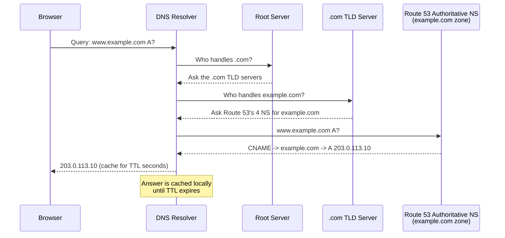

# 02 - DNS Fundamentals and Route 53 Concepts

> Goal of this note: understand the DNS mechanics that must click before touching the console — the resolution hierarchy, what a **Hosted Zone** actually contains, the **SOA** and **NS** records every zone gets automatically, **TTL** tradeoffs, and **Public vs. Private** hosted zones.

---

## 1. The DNS resolution hierarchy

DNS is not one big database — it's a **hierarchy of authorities**, each responsible for one segment of a domain name, read right-to-left:

```
www . example . com .
        ^        ^    ^
        |        |    +-- Root ("." — implicit)
        |        +------- TLD ("com")
        +---------------- Domain ("example.com")
```

1. **Root servers** — the top of the hierarchy (13 logical root server clusters worldwide). They don't know about `example.com` directly; they know which servers are authoritative for the `.com` **TLD (Top-Level Domain)** and point there.
2. **TLD servers** (e.g. the `.com` registry servers) — they don't know `example.com`'s actual records either; they know which **authoritative name servers** were assigned to `example.com` at registration time, and point there.
3. **Authoritative name servers for `example.com`** — in our case, Route 53's name servers for the `example.com` **Hosted Zone**. These are the servers that actually hold and return the real records (A, CNAME, MX, etc.).

A resolver walks this chain top-down (root → TLD → authoritative) the first time it needs an answer, then caches the result so it doesn't have to repeat the walk on every request.

---

## 2. What a Hosted Zone actually is

A **Hosted Zone** is a **container for all the DNS records belonging to one domain (or subdomain)** — think of it as the actual "zone file" for `example.com`, managed through Route 53. When you create a hosted zone for `example.com`, Route 53:

1. Creates the hosted zone itself (a container resource).
2. Automatically assigns it **4 unique Name Servers (NS)** — Route 53's own authoritative servers that will answer queries for this zone.
3. Automatically creates two records inside it: an **NS record** (listing those 4 name servers) and an **SOA record** (zone metadata) — both covered below.

For the zone to actually be "live" on the internet, you (or your registrar) must point the domain's registration at those 4 name servers — that's the step that makes the TLD servers, in step 2 of the hierarchy above, send queries to *this* hosted zone instead of somewhere else.

> 🧠 **Mental model:** a Hosted Zone is the **filing cabinet** for one domain's DNS records. The NS record on the cabinet's front tells the rest of the internet "if you want anything from this cabinet, these 4 addresses are where to ask." The SOA record is the **label card** on the cabinet describing who owns it and how stale data may get cached elsewhere.

---

## 3. The NS record — the 4 authoritative name servers

Every public hosted zone automatically gets an **NS (Name Server) record** with the same name as the zone (`example.com`), listing the **4 name servers** Route 53 assigned to it, e.g.:

```
ns-2048.awsdns-64.com.
ns-2049.awsdns-65.net.
ns-2050.awsdns-66.org.
ns-2051.awsdns-67.co.uk.
```

Route 53 deliberately spreads these 4 servers across **4 different TLDs** (`.com`, `.net`, `.org`, `.co.uk`) — so that even if one entire top-level domain infrastructure had a problem, your zone's name resolution wouldn't be fully knocked out. These are the exact 4 values you copy into your domain registrar's "name servers" field to delegate the domain to this hosted zone.

> ⚠️ Don't add, edit, or delete records inside the auto-created NS record set unless you have a very specific reason — doing so can break resolution for the entire zone.

---

## 4. The SOA (Start of Authority) record

Also auto-created, the **SOA record** holds the zone's core metadata — a single record, but packed with several fields:

| Field | Meaning |
|---|---|
| **Primary name server** | The Route 53 name server considered the "master" reference for this zone, e.g. `ns-2048.awsdns-64.net`. |
| **Admin email** | Contact email for the zone administrator, written with the `@` replaced by a dot, e.g. `hostmaster.example.com` (default is an unmonitored AWS placeholder). |
| **Serial number** | A version counter for the zone, meant to increment on changes — Route 53 does not auto-increment this; it mainly matters for secondary DNS/zone-transfer setups. |
| **Refresh** | How long (seconds) a secondary DNS server waits before re-checking the primary for changes. |
| **Retry** | How long a secondary server waits before retrying after a failed check. |
| **Expire** | How long a secondary server keeps answering with old data before giving up if it can't reach the primary. |
| **Minimum TTL** | How long resolvers should cache a **negative** answer (e.g. "this record doesn't exist") — separate from the TTL you set on your own records. |

For a hosted zone you manage entirely in Route 53 (no separate secondary DNS server), you'll rarely touch this record — it exists mostly because DNS as a protocol requires every zone to have one.

---

## 5. TTL (Time To Live) — the caching tradeoff

Every DNS record carries a **TTL**, measured in seconds, which tells any resolver that receives the answer: *"you may reuse this answer, without asking again, for this many seconds."*

| TTL choice | Pros | Cons |
|---|---|---|
| **Short TTL** (e.g. 60s) | Changes propagate to the internet fast — useful right before a planned cutover (e.g. switching an IP during a migration) | More DNS queries hit Route 53 (higher query volume/cost), and every resolver worldwide re-asks more often |
| **Long TTL** (e.g. 24h / 86400s) | Fewer repeat queries — cheaper, and slightly faster perceived resolution since answers are usually already cached nearby | If you need to change the record, resolvers that already cached the old answer can keep using it until their cached TTL expires — changes take longer to fully propagate |

> 🎯 **Exam tip:** a classic scenario is "we're about to migrate to a new IP, what should we do to the TTL beforehand?" — the answer is **lower the TTL well in advance of the change** (so that by the time you actually cut over, cached copies of the *old* TTL have already expired everywhere, and the new low TTL means the new value propagates fast too).

---

## 6. Public Hosted Zone vs. Private Hosted Zone

| | **Public Hosted Zone** | **Private Hosted Zone** |
|---|---|---|
| Resolves from | Anywhere on the public internet | Only inside one or more VPCs you explicitly associate with the zone |
| Typical use | Public-facing domains, e.g. `example.com` | Internal-only names, e.g. an internal service name that should never be resolvable outside your own network |
| Name servers | Route 53's public authoritative name servers | Not internet-reachable — queries only resolve via the VPC's internal DNS resolver, for associated VPCs |
| Domain requirement | Must correspond to a domain you actually control/registered (or a subdomain of one) | Any name you like, even one not registered anywhere, since it's never exposed publicly |
| Association | N/A (globally available by definition) | Explicitly associated with one or more VPCs; a VPC can also be associated with zones in other AWS accounts |

A **Private Hosted Zone** is how you build internal-only DNS — e.g. giving an internal database endpoint a friendly name that only resolves for resources inside your own private network, and returns nothing (or an error) if queried from the public internet.

---

## 7. Full recursive lookup, step by step



Once cached, every subsequent request for `www.example.com` from that resolver is answered instantly from cache — no repeat trip through root/TLD/authoritative — until the TTL expires and the whole walk happens again.

---

## 8. Recap

- DNS resolution walks a hierarchy: **root → TLD → authoritative name servers**.
- A **Hosted Zone** is the container for a domain's DNS records; it gets 4 auto-assigned **NS** servers and one **SOA** record automatically.
- **SOA** holds zone metadata: primary NS, admin email, serial number, refresh/retry/expire/minimum-TTL timers.
- **TTL** trades off propagation speed (short = fast updates, more query load) against efficiency (long = cheaper, slower to propagate).
- **Public Hosted Zones** resolve anywhere; **Private Hosted Zones** resolve only inside VPCs explicitly associated with them.
- Next: Note 03 — DNS Record Types Hands-On.

---

### Sources
- [NS and SOA records that Route 53 creates for a public hosted zone — AWS docs](https://docs.aws.amazon.com/Route53/latest/DeveloperGuide/SOA-NSrecords.html)
- [Working with hosted zones — AWS docs](https://docs.aws.amazon.com/Route53/latest/DeveloperGuide/AboutHZWorkingWith.html)
- [Working with private hosted zones — AWS docs](https://docs.aws.amazon.com/Route53/latest/DeveloperGuide/hosted-zone-private.html)
