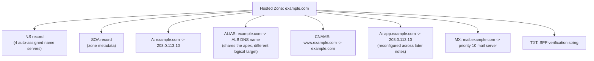

# 03 - DNS Record Types Hands-On

> Goal of this note: actually build the hosted zone we'll reuse for the rest of this folder — `example.com` — and populate it with the core record types: A, CNAME, MX, TXT, AAAA, and an Alias record. This is the one build every later routing-policy note in this folder reconfigures.

> ⚠️ `example.com` is a domain **reserved by IANA specifically for documentation examples** (per RFC 2606) — it cannot actually be registered by anyone. Everything below is followed **conceptually**: you can create a hosted zone named `example.com` in your own account to practice the console flow (Route 53 doesn't stop you from hosting DNS for a domain you don't own — it just won't be reachable from the public internet unless you also own the domain and point real name servers at it), but don't attempt to actually register it anywhere.

---

## 1. Step 1 — Create the hosted zone

1. Route 53 console → **Hosted zones** → **Create hosted zone**.
2. **Domain name**: `example.com`.
3. **Type**: **Public hosted zone**.
4. **Create hosted zone.**

Route 53 immediately creates the zone plus its automatic **NS** record (4 name servers) and **SOA** record, as covered in the previous note. Every record below is added inside this same zone.

---

## 2. The A record — `example.com` → `203.0.113.10`

An **A (Address) record** maps a name directly to an **IPv4 address**.

1. Inside the `example.com` hosted zone → **Create record**.
2. **Record name**: leave blank (this targets the zone apex, `example.com` itself).
3. **Record type**: **A**.
4. **Value**: `203.0.113.10` (our illustrative "US East (N. Virginia)" web server).
5. **TTL**: `300` seconds (5 minutes — short enough to iterate quickly while learning).
6. **Create records.**

This is the "main site" record — anyone querying `example.com` now gets `203.0.113.10` back.

---

## 3. The CNAME record — `www.example.com` → `example.com`

A **CNAME (Canonical Name) record** doesn't return an IP directly — it returns *another name*, and the resolver must then look **that** name up too.

1. **Create record** → **Record name**: `www`.
2. **Record type**: **CNAME**.
3. **Value**: `example.com`.
4. **TTL**: `300`.
5. **Create records.**

Now a query for `www.example.com` gets redirected to `example.com`, which then resolves to `203.0.113.10` — two lookups chained together. This is the standard pattern for making `www.example.com` mirror whatever `example.com` currently points to, without duplicating the IP in two places.

> ⚠️ **CNAME cannot be used at the zone apex** (`example.com` itself, with no subdomain prefix) — this is a rule from the DNS specification itself, not an AWS limitation. A zone apex must always have other record types (like SOA, NS, and typically A/AAAA) alongside it, and the DNS spec forbids a CNAME from coexisting there. This is exactly why Route 53's **Alias record** (Section 6 below) exists.

---

## 4. The A record for `app.example.com` — the routing-policy demo record

1. **Create record** → **Record name**: `app`.
2. **Record type**: **A**.
3. **Value**: `203.0.113.10`.
4. **TTL**: `300`.
5. **Create records.**

This `app.example.com` record is the one every later routing-policy note in this folder keeps coming back to and reconfiguring with a different routing policy — Simple, Weighted, Latency, Failover, Geolocation, Geoproximity, Multivalue Answer, and IP-based — so you see the exact same demo record behave differently under each policy, rather than building eight disconnected examples.

---

## 5. The MX record — `mail.example.com`

An **MX (Mail Exchange) record** tells the internet which mail server(s) handle email for a domain, each with a **priority number** — lower numbers are tried first.

1. **Create record** → **Record name**: `mail`.
2. **Record type**: **MX**.
3. **Value**: `10 mail.illustrative-mail-provider.example` (format is `priority hostname`).
4. **TTL**: `300`.
5. **Create records.**

If you added a second MX value like `20 backup-mail.illustrative-mail-provider.example`, sending mail servers would try priority `10` first and only fall back to `20` if the first is unreachable — lower priority number = higher preference.

---

## 6. The TXT record — domain verification / SPF

A **TXT record** holds arbitrary free-form text. It has no single fixed purpose — it's used as a generic "put some text here that another system will read" mechanism, most commonly for:

- **Domain ownership verification** (a third-party service asks you to add a specific random string as a TXT record to prove you control the domain).
- **SPF (Sender Policy Framework)** — declaring which mail servers are allowed to send email on behalf of your domain, to fight spoofing.
- **DKIM** — publishing a cryptographic public key used to verify signed outgoing mail.

Example (illustrative SPF-style string):

1. **Create record** → **Record name**: leave blank (zone apex) or a subdomain, depending on what's being verified.
2. **Record type**: **TXT**.
3. **Value**: `"v=spf1 include:illustrative-mail-provider.example ~all"`.
4. **TTL**: `300`.
5. **Create records.**

---

## 7. AAAA records — the IPv6 equivalent of A

An **AAAA record** is exactly like an A record, except it maps a name to an **IPv6 address** (128-bit) instead of an IPv4 address (32-bit). If `example.com` also had an IPv6-capable server, you'd add an AAAA record alongside the A record with the same name — most modern resolvers/clients prefer IPv6 (AAAA) when both are present and the client has IPv6 connectivity, falling back to IPv4 (A) otherwise.

---

## 8. Alias records — `example.com` → an Application Load Balancer

Earlier we noted CNAME can't be used at the zone apex. Route 53's answer is the **Alias record** — a Route-53-specific extension that behaves like a CNAME (points to another name) but is allowed at the apex.

1. **Create record** → leave **Record name** blank (zone apex).
2. **Record type**: **A** (Alias records reuse the A/AAAA type, with "Alias" as a toggle).
3. Toggle **Alias** → **On**.
4. **Route traffic to**: choose the target type (e.g. "Alias to Application and Classic Load Balancer") → select the illustrative load balancer, e.g. a DNS name like `my-load-balancer-1234567890.us-east-1.elb.amazonaws.com` (a purely illustrative placeholder standing in for any Application Load Balancer's own DNS name).
5. **Create records.**

### Alias vs. CNAME — the classic exam distinction

| | **Alias record** | **CNAME record** |
|---|---|---|
| Usable at the zone apex (`example.com`)? | **Yes** | **No** — forbidden by the DNS spec itself |
| Cost | **Free** — no charge for alias queries to AWS resources | Route 53 charges for CNAME queries (and if it points to another record in a hosted zone, the resolver's follow-up query is billed as a second query) |
| Target | Only selected AWS resources (ELB, CloudFront, S3 static website, API Gateway, another record in the same hosted zone, etc.) | Any DNS name anywhere, AWS or not |
| Health-awareness | Route 53 automatically tracks the underlying AWS resource and updates the returned IP(s) if it changes — genuinely "knows" about the target's health/identity | No special awareness — just a static pointer to another name |
| TTL | Not set by you — uses the target resource's own TTL | Set explicitly by you |

> 🧠 **Mental model:** a CNAME is a **sticky note** pointing to another name — dumb but flexible (anywhere, any target). An Alias is a **live, Route-53-managed mirror** of an AWS resource — restricted to AWS targets and the zone apex rule, but free and automatically kept in sync.

---

## 9. The hosted zone so far

---

## 10. Common beginner problems

| Symptom | Cause / explanation |
|---|---|
| "I changed the A record but still see the old IP" | The resolver you're querying (or your browser/OS cache) is still holding the **previously cached answer** for the length of the **old TTL** — it hasn't expired yet. Wait out the old TTL, or flush your local DNS cache to force a fresh lookup. |
| "I created a CNAME for `example.com` itself and it failed" | CNAME records are **not allowed at the zone apex** by the DNS spec — use an **Alias record** instead for the bare domain name. |
| "www.example.com doesn't resolve at all" | Check that the CNAME's target (`example.com`) actually has a valid A/Alias record — a CNAME chain only works if the name it points to eventually resolves. |
| "Mail isn't routing to the right server" | Check the **MX priority numbers** — lower number is tried first; a misconfigured priority can send mail to the wrong (or a non-existent) server first. |
| "My hosted zone changes aren't visible on the public internet at all" | If this were a real domain, verify the domain's registrar actually has the hosted zone's 4 **NS** values set — until delegation matches, the public DNS hierarchy never even reaches your Route 53 zone. |

---

## 11. Recap

- Built the `example.com` public hosted zone with: **A** (`example.com`, `app.example.com`), **CNAME** (`www.example.com`), **MX** (`mail.example.com`), **TXT** (SPF-style verification), and an **Alias** record at the apex pointing to an illustrative ALB.
- **CNAME** cannot be used at the zone apex (DNS spec rule); **Alias** can, is free, and is health/identity-aware of the AWS target it points to.
- **AAAA** is simply the IPv6 counterpart of **A**.
- "Changes not visible yet" is almost always **TTL caching**, not a broken record.
- `app.example.com` is now the demo record every later routing-policy note in this folder reconfigures.
- Next: Note 04 — Routing Policies Overview, Simple and Weighted Routing Hands-On.

---

### Sources
- [Supported DNS record types — AWS docs](https://docs.aws.amazon.com/Route53/latest/DeveloperGuide/ResourceRecordTypes.html)
- [Choosing between alias and non-alias records — AWS docs](https://docs.aws.amazon.com/Route53/latest/DeveloperGuide/resource-record-sets-choosing-alias-non-alias.html)
- [Creating records by using the Amazon Route 53 console — AWS docs](https://docs.aws.amazon.com/Route53/latest/DeveloperGuide/resource-record-sets-creating.html)
